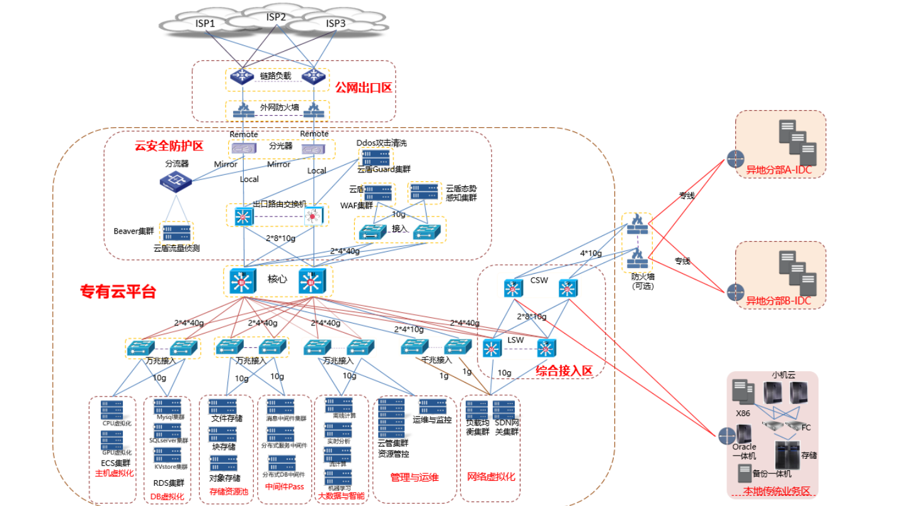
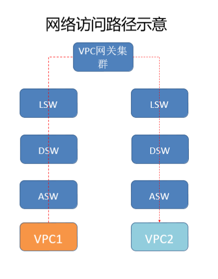

# network

[toc]

### 概述

#### 1.网络设备术语

|简写|全称|说明|
|-|-|-|
|ASW|access switch|
|DSW|distribution switch（分布层交换机 ）|数据交换核心交换机，用于连接各个ASW|
|ISW|Inter-Connection Switch （互联交换机）|互联ISP、客户外网、客户骨干网接入，或多AZ,多Region场景下
DCI互联网|
|LSW|LVS Switch（综合接入交换机）|云产品如SLB,XGW,DNS等接入设备|
|CSW|Customer Switch（客户接入交换机）| 接入用户内网核心，VPC专线接入|
|CE router|custome edge router|
|OASW|out of band access switch（带外接入层交换机）|
|OSW|Out-of-Band Switch（带外汇聚层交换机）|
|OMR| Out-of-Band Manger Switch（带外核心交换机）|

#### 2.阿里专有云网络架构

* CSW 负责接入 客户的IDC（没有上云的）和 其他内网/局域网环境，即混合云
* 网络虚拟化 主要就是SDN和SLB，用于配置网络的逻辑隔离，流量都需经过这里
  * 比如：不同VPC间通信
  
* 带外管理网络

