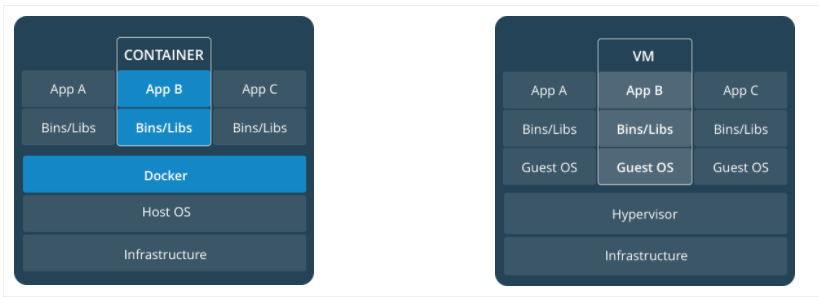

# overview

[toc]

### 基础概念



#### 1.利用linux kernel的特性


##### （1）namespaces特性
能够使进程间的资源相互隔离

* 6中namespace

|namespace|说明|
|-|-|
|uts|unix timesharing system，主机名和域名的隔离|
|user|用户的隔离|
|mnt|mount，文件系统的隔离|
|pid|进程的隔离|
|ipc|进程间通信的隔离|
|net|网络的隔离|

##### （2）cgroups（control groups）特性
对进程进行**分组**，然后可以 **监视**  和 **限制** **指定组** 对各种**资源的使用**


#### 2.docker组件


##### （1）dockerd
docker守护进程，有两个功能：
* 处理docker API请求
* 通过containerd 管理 容器的生命周期

##### （2）containerd
负责管理容器，包括：
* 镜像的push和pull
* 管理存储
* 管理容器（包括运行、删除等）
* 管理网络命名空间

##### （3）runc（containerd子组件）
根据OCI（OCI定义了容器运行时标准）标准创建和运行容器

##### （4）containerd-ctr（containerd子组件）
用于开发和调试目的，用于与容器直接通信

##### （5）containerd-shim（containerd子组件）
每启动一个容器都会起一个新的docker-shim的一个进程
是每一个容器的上帝进程，能够承受容器的崩溃

#### 3.使用docker的前提
* 需要关闭selinux

#### 4.有两种存储卷
（1）Dokcer-managed volume
由docker自动设置宿主机目录，目录为`/var/lib/docker/volumes/容器id/_data`
```shell
  -v 容器目录
```

（2）Bind-mount volume
```shell
  -v 宿主机目录:容器目录
```

#### 5.container的状态
* dead
表示该容器是一个**僵尸容器**（即该容器的init进程变成了僵尸进程）
想要停止和删除容器没有成功，因为资源正忙（比如容器内使用了nfs，但是此时nfs服务器无法连接，就会出现僵尸容器）

#### 6..docker的端口映射，需要开启主机的ip转发功能

#### 7.容器共享宿主机的时钟
因为容器共享宿主机的kernel，所以容器的时钟也是共享宿主机的

***

### 相关操作和概念

#### 1.容器相关
（1）查看容器与真机绑定的端口号
```shell
docker port xx        #xx为容器ip
```

（2）查看容器使用的存储卷
```shell
docker inspect -f {{.Mounts}} xx		
```

（3）在容器外执行命令
```shell
docker exec -it xx /bin/bash -c '命令'
```
（4）复制使用其它容器的卷
```shell
  --volumes-from
```

（5）对容器资源限制的相关参数（docker run时使用）

* 对内存资源限制
```shell
  -m 1g                       #表示最多使用1g内存
  --memory-swap xx            #使用的swap的限制，当此值和-m设置的一样，则不允许使用swap（默认使用2*M）
  --oom-kill-disable          #表示当宿主机内存满了，需要kill进程时，禁止kill该容器
```

* 对cpu资源限制
```shell
  --cpus xx                   #设置该容器最多只能使用宿主机的几核cpu，比如：1.5，只能使用1.5核
  --cpuset-cpus  xx           #设置只能运行在指定cpu上（从0开始编号），比如：0,2，只能跑在0号和2号cpu上
  --cpu-shares  xx            #设置一个数值，比如宿主机上只运行了两个容器一个设为1024，一个设为512，当两个都需要cpu时，则按2:1进行分配
```

（6）使用`-v`挂载存储卷时，不管宿主机还是容器，只要该目录不存在，会自动创建

（7）运行容器，赋予相关权限
```shell
  --privileged        #能够修改系统参数（即宿主机的，因为容器用的宿主机内核）
  --user=0            #以容器内uid为0的用户权限执行（即root权限）
```

#### 2.镜像相关
（1）批量打包镜像，简单且压缩体积的方法
```shell
tar -Pzcf docker.tar.gz /var/lib/docker/overlay2/*
```
（2）docker镜像加速

docker cn 或者 阿里云加速器 或者 中国科技大学
```shell
#vim /etc/docker/daemon.json
  {
      "registry-mirrors": ["http://registry.docker-cn.com"]
  }
```

#### 3.网络相关
（1）启动容器时利用`--net=xx`指定使用的网络模式

（2）修改docker进程监听的端口，可以连接远程的docker服务端
```shell
#vim /etc/dokcer/daemon.json
  {
    "hosts": ["tcp://0.0.0.0:2222","unix:///var/run/dokcer.sock"]         //默认只监听本机的docker.sock套接字
  }

  docker -H xx:2222 ps
```

（3）当容器以host网络模式启动，会复制宿主机的/etc/hosts文件

（4）如何恢复iptables rules：重启docker

#### 4.其他

（1)查看网卡是否处于混杂模式
```shell
cat /sys/class/net/xx/flags
#0x100 表示没有开启
#0x110 表示开启了
```
（2）docker-ce的配置文件
```shell
/etc/docker/daemon.json
```

***

### 注意事项
##### 1.在容器中跑任何程序都不能运行在后台，否则容器会认为程序终止了，容器也就会结束
