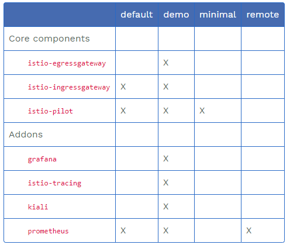

# deploy

[toc]

### 部署istio

#### 1.导入镜像（自动拉取太慢）
```shell
docker load -i istio_v1.5.0_images.tar.gz
```

#### 2.安装istio
```shell
istioctl install --set profile=demo -y
#demo配置安装了所有的组件
```
安装时的更多配置参考：
```shell
istioctl profile list
#demo
#default
# ...

istioctl profile dump demo
```
[更多配置](https://istio.io/latest/docs/reference/config/istio.operator.v1alpha1/)
比如：
```shell
#指定仓库地址
--set hub=harbor.test.com:30443/istio

#指定jarger地址
--set values.global.tracer.zipkin.address=<jaeger-collector-address>:9411
```


#### 3.给default命名空间打标

**用于之后部署应用，可以注入envoy代理**
```shell
kubectl label namespace default istio-injection=enabled
```
>给已经安装的应用注入envoy代理
>* 给该应用所在命名空间打上标签
>* 然后更新一下该应用的pods即可

#### 4.访问istio的dashboard（kiali）

>首先要kiali这个service设置成NodePort类型  
```shell
kubectl edit svc kiali -n istio-system
```
>访问即可  
>>http://3.1.5.15:20001/kiali/
账号密码为：admin/admin

#### 5.卸载istio
```shell
istioctl manifest generate --set profile=demo | kubectl delete -f -
```

***

### 部署demo

**部署在打标的命名空间中**

#### 1.创建应用
```shell
kubectl apply -f samples/bookinfo/platform/kube/bookinfo.yaml
```
#### 2.创建istio ingress GateWay
```shell
kubectl apply -f samples/bookinfo/networking/bookinfo-gateway.yaml
```
#### 3.访问该应用，获取对外暴露的端口号
```shell
kubectl get svc -n istio-system
#查看刚创建的ingress gateway将80端口映射到宿主机哪个端口上
#访问url:
# http://$IP:$PORT/productpage
```
