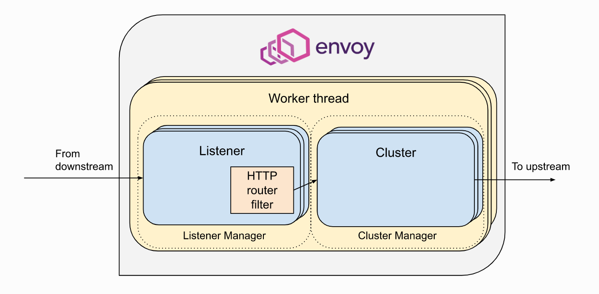

# overview

<!-- @import "[TOC]" {cmd="toc" depthFrom=1 depthTo=6 orderedList=false} -->
<!-- code_chunk_output -->

- [overview](#overview)
    - [概述](#概述)
      - [1.listener](#1listener)
        - [（1）listener](#1listener-1)
        - [（2）network filters](#2network-filters)
        - [（3）route类型: RDS（route discovery service）](#3route类型-rdsroute-discovery-service)
      - [2.cluster](#2cluster)
        - [（1）cluster](#1cluster)
        - [（2）常用service discovery类型（cluster类型）](#2常用service-discovery类型cluster类型)
      - [3. request的生命周期](#3-request的生命周期)
        - [（1）总体分为两部分](#1总体分为两部分)
        - [（2）概述的request flow](#2概述的request-flow)
        - [（3）具体的request flow](#3具体的request-flow)
    - [observability](#observability)
      - [1.access logging](#1access-logging)
      - [2.traffic](#2traffic)
        - [（1）layer-4 traffic](#1layer-4-traffic)
        - [（2）layer-7 traffic](#2layer-7-traffic)
      - [3.tracing（http、grpc等）](#3tracinghttp-grpc等)
        - [（1）前提](#1前提)
        - [（2）原理](#2原理)
    - [常用filter](#常用filter)
      - [1.network filters](#1network-filters)
        - [（1）tcp_proxy](#1tcp_proxy)
        - [（2）http_connection_manager](#2http_connection_manager)

<!-- /code_chunk_output -->

### 概述

#### 1.listener
[参考](https://www.envoyproxy.io/docs/envoy/latest/api-v3/listeners/listeners)

##### （1）listener
* 这个listener不代表实际监听的port，而是用来匹配数据包的目的地址
* 注意在istio中：
  * 启动envoy之前，都会先设置**iptables**
  * 将所有 **进入流量** 转到envoy的 **15006** 端口
    * 会利用 元数据（原始的目标地址、协议等信息），来匹配最佳的filter chain，进行处理
  * 将所有 **外出流量** 转到envoy的 **15001** 端口
    * 设置了`"use_original_dst": true`
      * 会根据原始的目标地址，将该流量转到与之匹配的listener上
        * 发往："1.1.1.1:9080"，
        * 如果存在"1.1.1.1:9080"这个listener，则会匹配这个listener，不存在的话继续，
        * 如果存在"0.0.0.0:9080"这个listener（0.0.0.0表示匹配所有），则会匹配这个listener
      * 如果没有匹配的，则将流量发送到15001这个listener指定的cluster上（即PassthroughCluster）

* 基本格式
```json
{
  "name": "...",
  "address": {},
  "listener_filters": [],     //增加一些额外的处理（比如检查tls、限制访问速率等）
  "filter_chains": [],
  "default_filter_chain": {},  //当流量在filter_chains中没有匹配的filter_chain，则使用default_filter_chain
  "traffic_direction": "<INBOUND | OUTBOUND>"   //流量的方向，是进入还是外出
}
```

* 一个filter chain的基本格式

```json
{
  "name": "...",

  //当流量匹配这个条件，则使用下面的filters该filter_chain进行处理
  "filter_chain_match": {
    "transportProtocol": "raw_buffer",
    "applicationProtocols": [
        "http/1.1",
        "h2c"
    ]
  },

  //network filters
  "filters": []
}
```

##### （2）network filters
* 基本格式
```json
{
  "name": "...",
  "typed_config": {
    "@type": "filter的类型"
  }
}
```

需要在某个filter中设置 **route规则（针对http协议）** 或者 **指定cluster（针对tcp协议）**，这样才能将流量转发给cluster
* 直接指定cluster: `<filter>.typedConfig.cluster`
* route类型（只针对http协议）
  * 静态
    * `<filter>.typedConfig.routeConfig`
  * RDS（route discovery service）
    * `<filter>.typedConfig.rds.routeConfigName`

##### （3）route类型: RDS（route discovery service）
* route基本格式
```json
{
    "name": "<route_name>",
    "virtualHosts": []
}
```

* 为什么需要VirtualHosts: 能够实现一个端口，提供多个http服务
* 有多个VirtualHosts的匹配规则：最长的匹配优先
* 一个virtualHosts的基本格式
```json
{
  "name": "<id | 一般用端口号>",

  //会匹配Host header，如果匹配成功，会进行routes的匹配
  "domains": [  
    "*"    
  ],

  //基于path的匹配进行路由
  "routes": [   
    {
      "match": {
          "prefix": "/stats/prometheus"
      },
      "route": {
          "cluster": "prometheus_stats"
      }
    }
  ]   
}
```

#### 2.cluster

##### （1）cluster
* 一个cluster就是一组upstream hosts
  * 通过service discovery发现这个cluster中的members（即upstream hosts，即endpoints），发现后会进行监控检查
  * 流量发送到该cluster，会根据 负载策略 发送到其members上

##### （2）常用service discovery类型（cluster类型）
  * static
    * 静态设置memeber的endpoint（`loadAssignment.endpoints`）
  * original destination
    * 直接路由到原始地址（通过redirect metadata确定，不做任何解析）
  * EDS（endpoint discovery service）
    * 用于发现cluster中的members
    * cluster通过`edsClusterConfig.serviceName`关联到指定的EDS条目

#### 3. request的生命周期

##### （1）总体分为两部分
通过filter连接起来（filter中含有路由规则）：
* Listener subsystem
  * 处理downstream请求
* Cluster subsystem
  * 将请求发往upstream endpoints



##### （2）概述的request flow
* listener负责监听（接受来自downstream的请求）
* 根据该listener配置的filters进行处理
  * listener filter
  * network filter chain
    * 根据 **路由规则**（针对http协议） 或 直接（针对tcp协议） 路由到指定的cluster
* cluster根据 负载策略 转发到upstream endpoints

##### （3）具体的request flow
[参考istio文档](https://istio.io/latest/docs/ops/diagnostic-tools/proxy-cmd/)
[参考envoy文档](https://www.envoyproxy.io/docs/envoy/latest/intro/life_of_a_request)

***

### observability

#### 1.access logging
通过filter（tcp_proxy或http_connection_manager）实现
[参考](https://www.envoyproxy.io/docs/envoy/v1.22.0/intro/arch_overview/observability/access_logging)

#### 2.traffic

与tracing的区别：这里的流量不能串起来，只能是具体的某个envoy上的统计信息，比如rps（requests-per-second）、response time等

##### （1）layer-4 traffic
通过tcp_proxy这个filter获取tcp流量

##### （2）layer-7 traffic
通过http_connection_manager这个filter获取http、grpc等流量

#### 3.tracing（http、grpc等）

##### （1）前提
* 应用需要支持传递 `x-b3-*`http header
  * 因为envoy不能将进入流量和外出流量进行关联，所以需要应用传递相应的http头

##### （2）原理
在一个调用链中，通过http头中添加trace context，然后传播trace context，从而能够串成一个链：
* 生成uuid，填充x-request-id这个头，根据使用的provider生成相应的trace context（e.g. zipkin的trace header格式：`x-b3-*`)

通过http_connection_manager这个filter中的tracing配置

***

### 常用filter

[参考](https://www.envoyproxy.io/docs/envoy/v1.22.0/api-v3/config/filter/filter)

#### 1.network filters

##### （1）tcp_proxy
```json
{
  "name": "",
  "typed_config": {
    "@type": "type.googleapis.com/envoy.extensions.filters.network.tcp_proxy.v3.TcpProxy",
    "metadata_match": {},
    "cluster": "...",
    "access_log": []
  }
}
```

##### （2）http_connection_manager
```json
{
    "name": "envoy.filters.network.http_connection_manager",
    "typedConfig": {
      "@type": "type.googleapis.com/envoy.extensions.filters.network.http_connection_manager.v3.HttpConnectionManager",
      "routeConfig": {},
      "httpFilters": {},
      //配置tracing
      "tracing": {
        "random_sampling": {},   //配置采样率
        "provider": {},          //配置tracing provider（采用什么tracing collector以及相关地址信息）（旧版本是在bootstrap中配置的）
        "custom_tags": {}        //给span添加自定义标签
      }
    }
}
```
