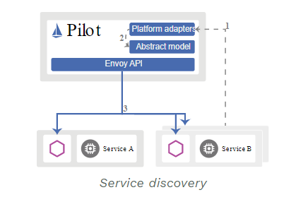

# overview

[toc]

### 预备知识

#### 1.sidecar模式
边车部署模式，一个单节点有两个容器组成，一个是应用容器，一个是配件容器，配件容器**共享**应用容器的**资源**和**生命周期**，即配件容器不能单独存活
>这里指的是把一个**微服务**和一个**proxy**部署在一起  

#### 2.通信架构
* data plane
所有用于**转发流量**的功能和过程

* control plane
所有用于**确定如何转发**（比如选择哪条路径等）的功能和过程

* management plane
所有用于**控制设备（即配置控制平面）和监控设备**(比如CLI，snmp等)的功能

***
### 基础概念
#### 1.核心功能
* traffic management
依赖以sidecar模式部署envoy，所有流量由envoy转发
无需对服务做任何更改
<br/>
* security
* observability

#### 2.整体架构


#### 3.组件

##### （1）envoy
处理数据平面的所有流量

##### （2）pilot

* service discovery
发现service，然后注入到envoy配置中


* traffic management
istio维护了一个内部的**服务注册表**
该表是**services**和**其endpoints**的集合
表中的内容是由 pilot组成 自动发现生成的

* resiliency
弹性设置（比如超时时间、重试次数）

##### （3）citadel
利用**身份管理**和**凭证管理**实现服务到服务和终端用户的认证

##### （4）galley
负责配置验证、配置提取、配置处理和配置分发

***

### 在k8s中使用时的注意事项

#### 1.创建service，服务端口必须按照要求命名
命名格式：`<protocol>[-<suffix>]`
比如：
```yaml
apiVersion: v1
kind: Service
metadata:
  name: xx
spec:
  selector:
    xx: xx
  ports:
  - name: http      #这里需要命名规范
    port: xx
```
支持的协议：
* grpc
* grpc-web
* http
* http2
* https
* mongo
* mysql
默认关闭，需要在pilot配置文件中开启
* redis
默认关闭，需要在pilot配置文件中开启
* tcp
* tls
* udp
