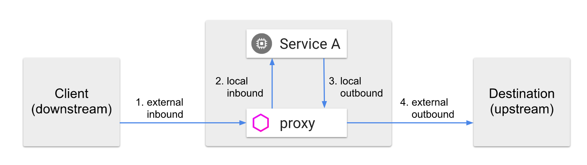

# traffic management

[toc]

### 概述



#### 1.service registry

##### （1）生成service registry
* 自动发现
  * 通过调用k8s接口，发现如下内容：
    * service 即k8s的service
    * endpoint 即k8s中的endpoints中的endpoint
      * 并且会根据endpoint对应的**pod的labels**，**作为这个endpoint的labels**

* 静态添加
  * 通过ServiceEntry在service registry中添加

##### （2）利用service registry配置envoy

|通过service registry生成的envoy的配置项||
|-|-|
|envoy的cluster的命名|`<DIRECTION>|<PORT>|<SUBSET>|<SERVICE_FQDN>`|

#### 2.数据处理流程
VirtualService需要通过hosts这个配置关联k8s的services（本质通过配置的hosts去查找该名字的virtualhosts，如果找到了，则修改，找不到则在80路由规则中添加）
VirtualService用于将流量路由到指定DestinationRule
* 如果没有匹配到VirtualService的流量，则正常处理（即发送到指定service进行负载）
DestinationRule用于对service进行分组
gateways to control ingress and egress traffic.

***

### 使用

#### 1. VirtualService（本质就是配置envoy的filter）
* 路由流量
  * 匹配流量
    * 可以匹配七层和四层的流量
    * 可以匹配从指定gateways进来的流量
    * 遵循匹配即停止的规则
  * 路由到相应的DestinationRule（即envoy中的cluster）

##### （1）清单文件格式

```yaml
apiVersion: networking.istio.io/v1alpha3
kind: VirtualService
metadata:
  name: xx
spec:
  hosts:
  - xx              #匹配目标地址（建议使用 short name并部署在相应的namespace中）
                    #对于http：
                    #   会配置virtualhosts，如果能匹配到相应的virtualhosts，则会修改virtualhosts，如果匹配不到，则默认在80的路由规则中添加virtualhosts）
                    #   两种方式：short name（会根据所在的namespace，自动生成完整的域名） 或者 完整的域名，这样才能够使得路由规则应用到相关的service上
                    #   当其他VirtualService使用同样的hosts不会生效（只有第一个生效）
                    # '*' 匹配所有目标地址（用于tcp路由）

  #如果要路由外部进来的流量，这里就需要指定gateways
  #添加这个选项后，既会路由指定的外部流量，也会路由内部流量
  gateways:
  - xx              #这里填GateWay的名字

  #配置tcp路由规则（好像要配合gateway一起使用，才能在envoy的listener产生配置，待确认）
  tcp: []

  #配置http路由规则（包括HTTP/1.1, HTTP2, gRPC）
  http: []          

  #配置tls路由规则
  tls: []
```

* destination设置
  * 即指定路由到envoy的哪个cluster: `<DIRECTION>|<PORT>|<SUBSET>|<SERVICE_FDQN>`
    * `<DIRECTION>: outbound`，因为对于当前服务，访问其他cluster是出站流量
    * `<PORT>: 指定的port（若未设置则使用service使用的port）`
    * `<SUBSET>: 指定的subset（若未指定则为空）`
    * `<SERVICE_FQDN>: 根据指定的host生成（如果host是short name会自动填充成FQDN`
  ```yaml
  - destination:
      #所以这里一般填servie名称
      host: reviews
      port:
        number: 8088
      subset: v2
  ```

##### （2）路由http流量

* 匹配http流量

（建议在生成环境中使用 完整域名（这样对部署的namespace就没有要求了）
```yaml
#每条规则可以设置相关匹配条件（也可以不设置）
- match:
  - headers:
      end-user:
        exact: jason

  route:
  #设置destination
  - destination:
      host: reviews
      port:
        number: 8088
      subset: v2
```

* 设置多个destination

```yaml
- route:
  - destination:
      host: reviews
      subset: v1
    weight: 75
  - destination:
      host: reviews
      subset: v2
    weight: 25
```

#### 2.DestinationRule（本质就是配置envoy的cluster）

* 根据endpoint的labels，将一个service下的endpoint划分成多个subset
  * istio对envoy的cluster的命名方式：`<DIRECTION>|<PORT>|<SUBSET>|<SERVICE_FQDN>`
  * 如果cluster已存在，则修改，如果不存在，则添加

##### （1）特点
* 将一个service下的endpoint划分为多个subset
* 可选的负载策略比较多

##### （2）清单文件格式
```yaml
apiVersion: networking.istio.io/v1alpha3
kind: DestinationRule
metadata:
  name: xx
spec:

  #service registry中的service（包含k8s中的service）
  host: xx     

  #配置全局转发策略      
  trafficPolicy:
    loadBalancer:
      #还有ROUND_ROBIN，LEAST_CONN和PASSTHROUGH
      simple: RANDOM  	

  #根据endpoint的labels进行分类
  #这里一共分了三个subset，利用version这个标签
  #名为v1的subset，包含有version=v1标签的pods的endpoints   
  subsets:
  - name: v1
    labels:
      version: v1
  - name: v2
    labels:
      version: v2
    trafficPolicy:
      loadBalancer:
        simple: ROUND_ROBIN
  - name: v3
    labels:
      version: v3
```

***
### GateWay
用来管理k8s集群的进入和外出流量，**与VirtualService结合使用**
#### 1.特点
* 只是允许特定流量进入k8s集群，并未指明具体的路由到何处
* 需要在VirtualService中绑定指定的GateWay后，允许进入的流量，才能被相应规则路由
#### 2.资源清单格式
```yaml
apiVersion: networking.istio.io/v1alpha3
kind: Gateway
metadata:
  name: xx
spec:

#指定应用于哪个ingressgateway（是一个pod）
  selector:
    app: my-gateway-controller

#设置允许进入的流量（可以允许指定客户端和协议的流量进入）
  servers:
    - hosts:
      - '*'
      port:
        name: http
        number: 80
        protocol: HTTP

```
***
### ServiceEntry
#### 1.特点
* 添加**条目**到**服务注册表**中(一般用于为**外部服务**添加)，envoy代理可以发送流量到该服务，像发送给其他内部服务一样
* 如果未为外部服务添加条目，默认则设为**unkown service**
* 一个条目就是一个服务
#### 2.清单格式
```yaml
apiVersion: networking.istio.io/v1alpha3
kind: ServiceEntry
metadata:
  name: xx
spec:

#设置该条目的内容（即设置service的名称和暴露的端口）
  hosts:
  - ext-svc.example.com   #当设置了hosts就没必要设置addresses了
  addresses:
  - 192.192.192.192/24    #可以设置VIP，即访问这个地址，会路由到后端endpoints
  ports:
  - number: 443
    name: https
    protocol: HTTPS

#用于指明该服务是外部的还是内部的
  location: MESH_EXTERNAL

#设置该service代理的后端地址，这里是静态解析，即地址已经给定
#动态解析是，不用设置endponts，会根据上面的hosts的名字，解析出多个ip地址
  resolution: static
  endpoints:
  - address: 2.2.2.2
  - address: 3.3.3.3
```

### unknown 和 passthroughcluster 和 BlackHole
* 当不知道的外部流量进来时，则标识来源为**unknown**
* 当流量发往外部不知道的服务时，则标记为目的为**passthroughcluster** 或者 **blackholw**
当允许流量外出时，为**passthroughcluster**
当不允许流量外出时，为**blackhole**


### 更多流量治理（无需修改代码）
#### 1.timeout
设置envoy proxy等待响应超过这个时间，则认为超时（即失败）
在VitualService中设置，无需修改代码
#### 2.retries
设置envoy proxy尝试连接服务的最大次数
在VirualService中设置
#### 3.circuit breakers（断路器，是一种保护机制）
设置envoy proxy支持的最大并发数、最大失败次数等
当达到上限，流量暂时就不会路由到该envoy proxy
在DestinationRule中设置
#### 4.fault injection（故障注入，是一种测试机制）
可以注入两种故障：delay 和 abort
在VirtualService中设置
#### 5.failure recovery（故障恢复）
对应用来说时透明的，即不需要配置
如果应用本身设置了故障恢复，可能会和istio的故障恢复冲突
有些故障是istio无法恢复的，需要应用自己解决（比如503错误）

### 总结
* VirtualService会应用到所有的envoy中
当指定gateway时会应用到该gateway所关联的ingress envoy中
* GateWay会应用到ingress envoy(即ingressgateway这个pod)中
* DestinationRule会应用到指定envoy中（一般

与k8s中Ingress比较
* 与k8s中的Ingress资源类似
ingress创建后会自动注入配置到ingress controller中
GateWay相当于自动注入配置到ingressgateway(pod)中
