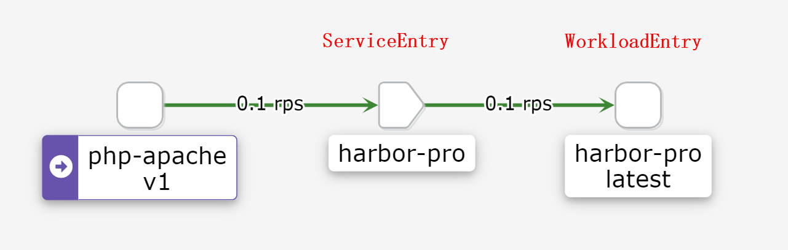

# WorkloadEntry

<!-- @import "[TOC]" {cmd="toc" depthFrom=1 depthTo=6 orderedList=false} -->
<!-- code_chunk_output -->

- [WorkloadEntry](#workloadentry)
    - [概述](#概述)
      - [1.功能：描述外部分workload](#1功能描述外部分workload)
    - [使用](#使用)
      - [1.清单文件](#1清单文件)
      - [2.demo](#2demo)
        - [（1）接入百度](#1接入百度)
        - [（2）访问外部ip时](#2访问外部ip时)

<!-- /code_chunk_output -->

### 概述

#### 1.功能：描述外部分workload
* WorkloadEntry需要配合ServiceEntry，单独使用没有任何意义



***

### 使用

#### 1.清单文件
```yaml
apiVersion: networking.istio.io/v1alpha3
kind: WorkloadEntry
metadata:
  name: <name>
spec:

  #如果是域名，则serviceentry中的resolution需要设置为DNS
  #如果是ip，则serviceentry中的resolution需要设置为STATIC（然后通过workloadSelector关联后端的workload）
  address: <ip_or_host>
  labels: {}
```

#### 2.demo

##### （1）接入百度
```yaml
apiVersion: networking.istio.io/v1alpha3
kind: WorkloadEntry
metadata:
  name: baidu
  namespace: istio-test
spec:
  address: www.baidu.com
  labels:
    app: baidu
    instance-id: baidu-1

---

apiVersion: networking.istio.io/v1alpha3
kind: ServiceEntry
metadata:
  name: baidu
  namespace: istio-test
spec:
  hosts:
  - "www.baidu.com"
  ports:
  - number: 80
    name: http
    protocol: HTTP
  location: MESH_INTERNAL
  resolution: DNS
  workloadSelector:
    labels:
      app: baidu
```

##### （2）访问外部ip时
```yaml
apiVersion: networking.istio.io/v1alpha3
kind: WorkloadEntry
metadata:
  name: harbor-pro
  namespace: istio-test
spec:
  address: 10.10.10.250
  labels:
    app: harbor-pro
    instance-id: host-250

---
apiVersion: networking.istio.io/v1alpha3
kind: ServiceEntry
metadata:
  name: harbor-pro
  namespace: istio-test
spec:
  #随便填，因为这里没用主机名
  hosts:
  - "harbor-pro.external"

  #这个ip必须要填，否则访问ip时，不会匹配到这个service entry
  addresses:
  - 10.10.10.250
  ports:
  - number: 80
    name: http
    protocol: HTTP
  location: MESH_INTERNAL
  resolution: STATIC

  #必须关联正确，否则访问不通（访问ip时，关联到了这个serviceentry，但是后端却没有关联）
  workloadSelector:
    labels:
      app: harbor-pro
```
