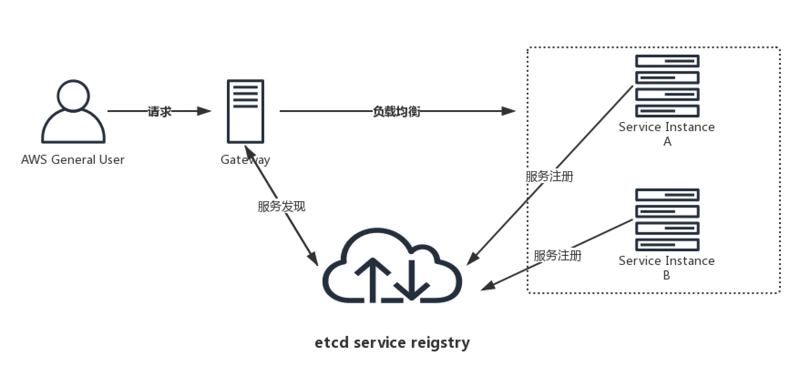

# etcd
[toc]

### 概述

#### 1.etcd特点
* 数据格式：key-value
* 存储方式：磁盘
* 有版本控制
  * 当修改数据会生成新的版本，原先的数据不会被删除或覆盖
  * 这样容器导致数据量增加，所以会有一个压缩的操作，压缩之后，之前版本的数据就会被删除
* 监视数据

#### 2.与redis比较
* redis
  * 数据存储在内存中，持久化可以存储到磁盘
  * 可用于数据库、缓存、消息代理
  * 支持更强多的数据类型
* etcd
  * 数据存储在磁盘中，保证了数据的可靠性
  * 更强的容错机制

* 所以，redis更适合用于缓存，etcd更适合用于用作数据库，存储配置信息


***

### etcdctl

#### 1.前提：指定使用的API version
有2和3（跟etcdctl版本无关）两个版本，api version设置不对，无法查询到数据
```shell
export ETCDCTL_API=3
```

#### 2.基础命令
```shell
etcdctl --version

#能够查看etcdctl version和默认使用的API version
```

#### 3.写入操作
```shell
etcdctl put <KEY> <VALUE>
```


```shell
etcdctl --endpoints=127.0.0.1:2379 \    #指定版本和endpoint
        --cacert=/etc/kubernetes/pki/etcd/ca.crt \
        --cert=/etc/kubernetes/pki/etcd/peer.crt \
        --key=/etc/kubernetes/pki/etcd/peer.key \
        get 路径 --prefix --keys-only                 #查看以这个路径为前缀的所有key

#get / --prefic --keys-only     列出etcd中所有的key
#member list      列出etcd中集群的成员
```

***

### 基于etcd的服务发现

#### 1.概述


* 服务注册
同一service的所有节点注册到相同目录下
* 健康检查
利用lease，如果节点是健康的，会不停的更新lease
* 服务发现
watch某一个key，当该key添加、删除、修改，都会收到通知
