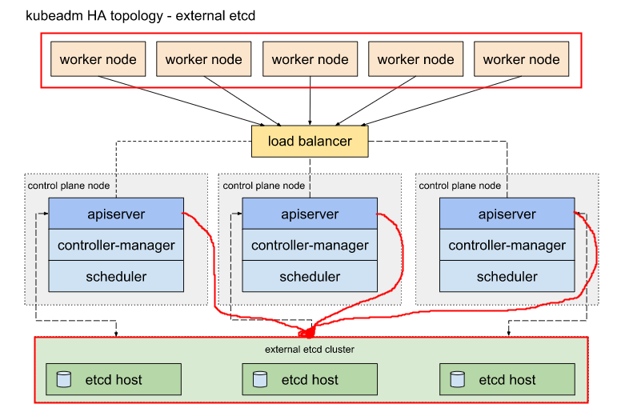

# 部署k8s集群
[toc]
### 概述

#### 1.两种架构模式
##### （1）内部etcd


##### （2）外部etcd


#### 2.kube-apiserver、kube-scheduler和kube-controller-manager的清单文件
```shell
/etc/kubernetes/manifeasts

#可以查看apiserver等的配置，包括etcd的地址等
#修改清单文件保存后，立即生效（不需要再apply）
```
***

### 安装步骤

#### 1.做好前提准备并且配置好yum源

（1）时间同步
（2）能够相互解析
```shell
/etc/hostname       #必须要修改主机名，因为节点的名字默认是主机名
/etc/hosts
```
（3）防火墙关闭
（4）卸载swap
```shell
#注释/etc/fstab中swap项
swapoff -a
```

#### 2.在所有节点上安装组件
```shell
#设置docker-ce的yum源
docker-ce     

#下面三个包都在k8s的yum源中
kubelet				
kubeadm
kubectl
```

#### 3.修改docker配置
防止日志量越来越大，导致存储耗尽
`vim /etc/docker/daemon.json`
```json
{
  "log-driver": "json-file",
  "log-opts": {
    "max-size": "10m",
    "max-file": "3"
  }
}

```
#### 4.设置相关服务开机自启（而不是现在就启动）
```shell
systemctl restart docker
systemctl enable docker kubelet
```

#### 5.初始化master节点
```shell
##kubeadm config images list
##可以先拉取镜像，再初始化

kubeadm init --control-plane-endpoint=域名:PORT \
             --upload-certs \
             --pod-network-cidr=10.244.0.0/16 \
             --service-cidr=10.96.0.0/12 \
             --kubernetes-version=v1.17.3

#如果要添加多个master节点，必须设置--control-plane-endpoint和--upload-certs
#还有其他设置：
#  --service-dns-domain=cluster.local
# ...

mkdir -p $HOME/.kube
cp -i /etc/kubernetes/admin.conf $HOME/.kube/config
```

#### 6.配置apiserver
```shell
vim /etc/kubernetes/manifests/kube-apiserver.yaml
```
```yaml
#允许kubernetes扩展API
--enable-aggregator-routing=true
```

#### 7.安装网络插件
  参考官网的安装步骤

**注意要修改pod cidr同上面我们设置的**
```shell
wget https://raw.githubusercontent.com/coreos/flannel/master/Documentation/kube-flannel.yml
vim kube-flannel.yml
kubectl apply -f kube-flannel.yml  
```

#### 8.添加node节点

（1）获取token用于加入该集群（在初始化节点上执行）
```shell
kubeadm token create --print-join-command
```
（2）加入该集群
```shell
#这个命令来自上面的结果
kubeadm join ...			
```

（3）如果需要在node上操作集群
```shell
cp -r ~/.kube ip:~
```

#### 9.添加mster节点
（1）获取token和证书（在初始化节点上执行）
```shell
kubeadm token create --print-join-command
kubeadm init phase upload-certs --upload-certs
```

（2）加入该集群
```shell
kubeadm join xx --token xx --discovery-token-ca-cert-hash xx \
                --control-plane --certificate-key xx

mkdir -p $HOME/.kube
cp -i /etc/kubernetes/admin.conf $HOME/.kube/config
```

#### 10.删除节点
（1））还原节点（需要到该节点上执行，执行kubeadm init或join等后想要还原）
```shell
kubeadm reset

#该节点要清理干净的话：
rm -rf /etc/cni/net.d
iptables -F
ipvsadm --clear
rm -rf $HOME/.kube/config

#删除虚拟网卡
ip link delete <INTERFACE>

#重启相关服务
systemctl restart docker kubelet

#最好重启一下主机，否则可能会有些其他问题
```

（2）删除节点
```shell
kubectl delete node NODENAME

#注意如果是master节点：可能会有问题
#可能需要先通过etcdctl删除etcd中的成员
```
***
### etcdctl

#### 1.语法
```shell
ETCDCTL_API=3 etcdctl --endpoints=127.0.0.1:2379 \    #指定版本和endpoint
        --cacert=/etc/kubernetes/pki/etcd/ca.crt \
        --cert=/etc/kubernetes/pki/etcd/peer.crt \
        --key=/etc/kubernetes/pki/etcd/peer.key \
        get 路径 --prefix --keys-only                 #查看以这个路径为前缀的所有key

#get / --prefic --keys-only     列出etcd中所有的key
#member list      列出etcd中集群的成员
```
***
### FAQ

#### 1.从其他节点无法访问该节点上开放的NodePort
```shell
iptables -A FORWARD -j ACCEPT
#是iptables的规则问题
```

#### 2.配置kube-proxy
```shell
kubectl edit configmap kube-proxy -n kube-system
```
比如：修改kube-proxy的mode（默认是ipvs）
```shell
kubectl edit configmap kube-proxy -n kube-system
#找到mode这个选项，改成ipvs即可
```
