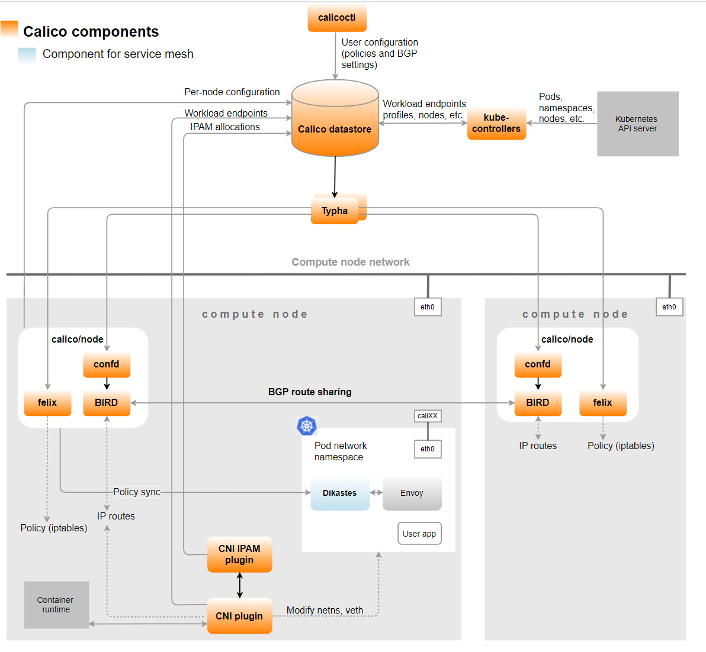

# overview

[toc]

### 概述

#### 1.相关api group

* `operator.tigera.io/v1`
  * 用于配置calico operator

* `crd.projectcalico.org/v1`
  * 用于配置calico（不要直接修改，修改operator的配置，会自动修改）

* `projectcalico.org/v3`
  * 用于配置calico（通过calicoctl修改）


#### 2.架构


##### （1）管理组件
* kube-controllers
  * 监听kubernetes api，调度calico相关的pod

* Typha
  * 类似于缓存，会与clico的数据库建立连接，然后其他组件通过typha读取相关数据

##### （2）calico-node pod中的组件

* felix
  * 网卡管理
  * 路由管理
  * ACL管理
  * 状态汇报

* BIRD（bird internet routing daemon）
  * 分发路由条目到BGP peer
  * 配置BGP route reflector

* confd（configuration management system）
  * 负责监听calico的数据库，当发生变化，更新BIRD相关的配置文件

##### （3）API相关组件
* CNI plugin
* Datastore plugin
* IPAM plugin

##### （4）其他组件
* Dikastes
  * 用于再istio中配置网络策略

#### 3.calico IPAM

##### （1）可以生成多个ip pools
pod cidr：`10.244.0.0/16`
分成多个ip pools：`10.244.1.0/24`、`10.244.2.0/24`等

##### （2）将一个ip pool分为多个更小的block

```yaml
ipPools:
- cidr: 10.244.0.0/16
  blockSize: 26
  nodeSelector: all()
```
一个node可以关联多个block，提高ip的利用率
当node上pods少时，分配一个block给这个node（按照flannel那种方式，此时就有很多ip浪费了，没有利用起来）
当node上pods多（ip不够用）时，可以分配多个block给这个node
