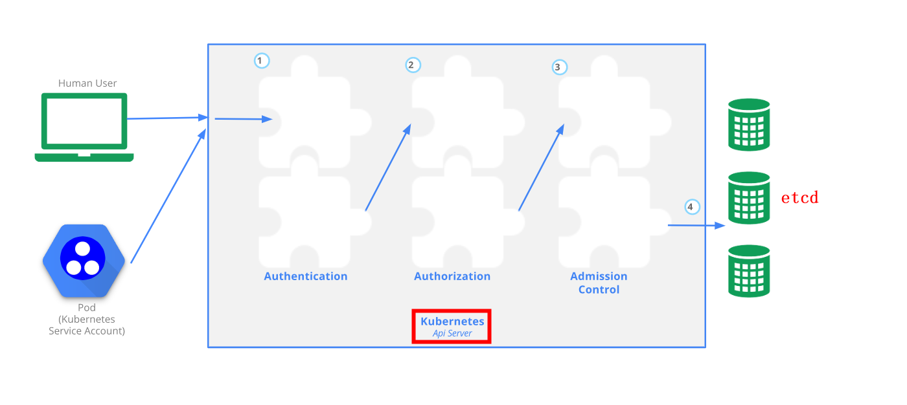

# overview

[toc]

### 概述

[参考](https://kubernetes.io/docs/concepts/security/controlling-access/)

#### 1.access control

* authentication
  * 认证用户身份
* authorization
  * 给用户授权（RBAC）
* admission_control
  * 能改 **修改** 或者 **拒绝** 请求
