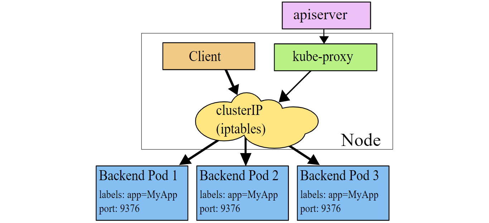
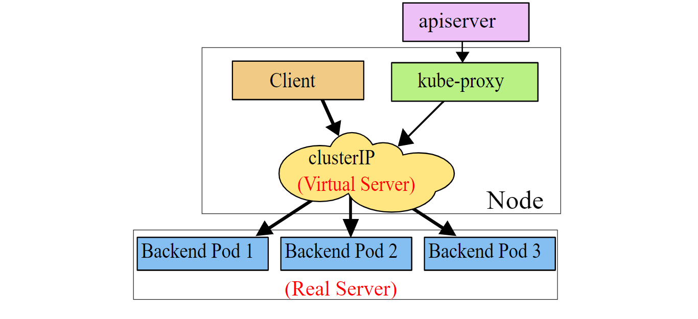

# service
[toc]
### 概述
#### 1.service
用于代理后端pod，service需要配置端口的映射，这样访问service的某个端口，才会被转发到后端pods的指定端口

#### 2.service三种工作模式

* userspace
  * 效率低
  * kube-proxy默认是轮询
  </br>
  ```
  请求 -> service（iptables，即内核空间） -> 本机的kube-proxy（即用户空间） -> service（iptables） -> 相应pod
  ```
  

</br>

* iptables
  * iptables调度方式：随机选择（非轮询）
  * 低系统开销，因为流量由Linux netfilter处理，而无需在用户空间和内核空间之间切换
  </br>
  ```
  请求 -> service（iptables） -> 相应pod
  ```
  

</br>

* ipvs
  * 性能最好
  * 支持多种调度方式（rr、lc等）
  </br>
  ```
  请求 -> ipvs -> 相应pod
  ```
  

#### 3.service四种类型

##### （1）ClusterIP（默认）
* 将service与指定pod绑定
* 随机分配一个地址（可以固定该ip），通过coreDNS组件对域名进行解析，仅用于集群内通信

##### （2）NodePort
* 将serivce与指定pod绑定
* 将node上指定端口映射到该service上的指定端口

##### （3）LoadBalancer
  用于在云上虚拟一个负载均衡器，进行调度

##### （4）ExternalName
* 能够使得集群内的pod能够与外界联系，这种类型的service就充当这个外出的桥梁
  * 即，集群内的pod，需要将请求先发送到service，service为其做代理外出取得数据，然后返回给pod
  * 像使用集群内部的资源一样，使用集群外部的资源
* 作用：路由外出的请求（提高了灵活性）

#### 4.headless service
* 无头service，即该service没有ClusterIP
* 当解析该service的域名时，将Endpoints（即podIP数组）返回
* 使用场景：
  * 自主选择权，让客户端自行决定使用哪个
  * 与StatefulSet一起使用
    * 比如构建es集群，es需要知道后端都有哪些pod，这时候只能使用headless-serivice

#### 5.service的FQDN			
* service的FQDN
```yaml
<SERVICENAME>.<NAMESPACE>.svc.<CLUSTERNAME>

#CLUSTERNAME可以通过kubeadm-config.yaml配置文件查看到
#可以简写成：<SERVICENAME>.<NAMESPACE>
#在同一个namespace中，可以简写成：<SERVICENAME>
```
* port的FQDN
```yaml
_<PORT_NAME>._<PORTP_ROTOCOL>.<SERVICENAME>.<NAMESPACE>.svc.<CLUSTERNAME>

#能够查询到SRV记录，即能够该port哪个端口提供服务
```
#### 6.service可以代理的后端资源
* pods			
通过selector选项设置代理哪些pods，会自动创建Endpoints
<br>
* 下面两种情况不能设置selector（即Endpoins也不会自动生成，需要手动创建）
  * 外部资源
  * 其他命名空间的service

#### 7.Endpoints
就是一个真实的访问点，service就是通过后端关联endpoints，实现代理功能的
##### （1）service与endponts的关系
* service或endpoints单独存在是没有意义的，因为**service**提供了**域名解析**，**endpoints**则提供了**后端访问点**
</br>
* 当创建Service时，指定了selector，根据selector中的标签会自动创建Endpoints
* 如果未指定selector，则不会自动创建Endpoints

##### （2）可以利用endpoints和无selector的service实现引入外部服务
（不需要通过externalName且必须填域名，这里可以利用ip）
* 首先创建无selector的service，并指明service上的端口号和后端的端口号
* 然后创建Endpoints，指向后端服务的ip和端口号

***

### 使用
#### 1.资源清单
```yaml
apiVersion: v1
kind: Service
metadata:
  name: xx
  namespace: default
spec:
  selector:
    xx1: xx
    xx2: xx
  type: NodePort       
  clusterIP: xx       #固定service的ip，可以设为None，则这个service即为无头service，type这项要去掉
  ports:
  - name: xx          #endpoints的端口名必须和这里一样
    port: xx          #service上暴露的端口，只有访问这些端口，流量才会被转发到后端相应的端口上
    targetPort: xx    #pod上的端口
    nodePort: xx      #当类型为NodePort时，才需要这一项
```

#### 2.创建ExternalName类型的service
```yaml
kind: Service
apiVersion: v1
metadata:
  name: xx
  namespace: xx
spec:
  type: ExternalName
  externalName: xx      
  #这里要填域名，不能填ip
  #外部的服务，访问上面的name时，就会路由到该域名
```

#### 3.Endpoints清单
```yaml
apiVersion: v1
kind: Endpoints
metadata:
  name: xx     #这个名字必须能给解析（这样，访问这个地址时，会被转发到后端的地址）
               #所以这个名字一般设为某个service的名字
subsets:

#这是一个subset				
#后端endpoint是这些subset的集合，分subset只是方便我们自己管理
- addresses:
  - ip: xx        #这里的ip不能是VIP（比如clusterIP），必须指向一个实体（比如pod）
  ports:
  - name: xx      #注意：这里的名字必须跟service中的port名字一样
    port: xx
```
