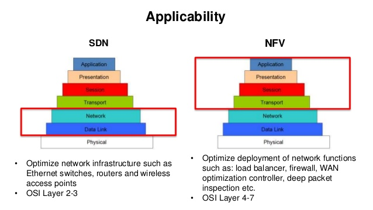

# overview

[toc]

### Introduction

#### 1.SDN vs NFV

* SDN和NFV的最终目的都是为了节约成本，方便管理

|SDN(software defined networking)|NFV(network function virtualization)|
|-|-|
|分离网络设备的控制平面和数据平面|分离硬件和软件，能够在普通服务器上，部署网络功能（比如：防火墙、load balance等，不需要特定的设备）|
|工作在第2、3层|工作在第4、5、6、7层|
