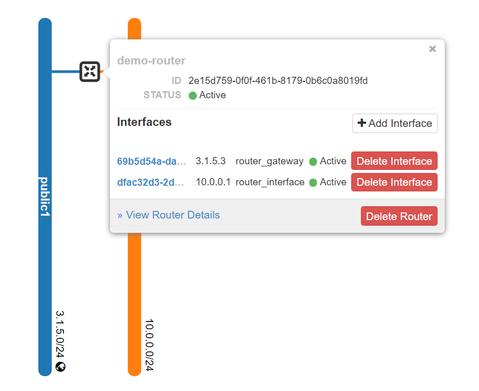
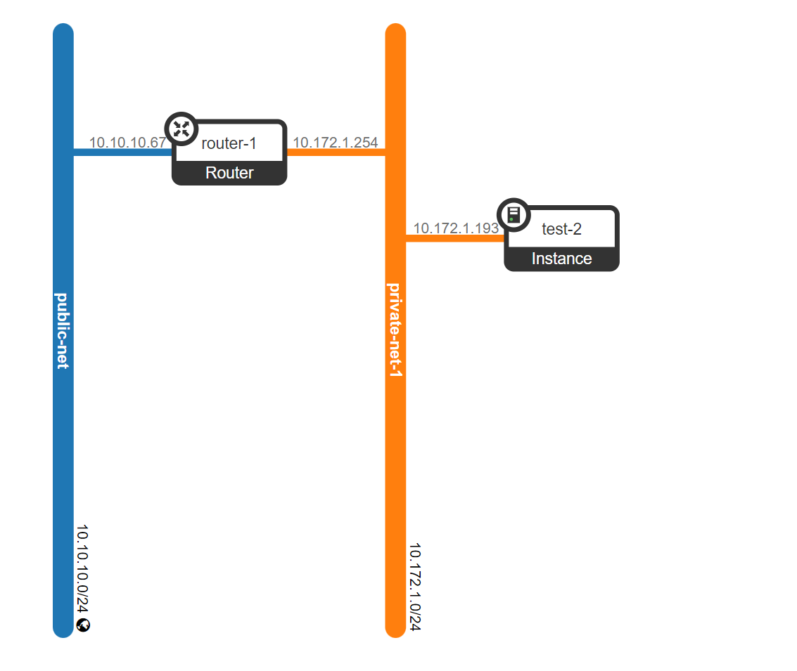

# deploy

[toc]

### 概述

#### 1.节点类型

|节点类型|服务|
|-|-|
|controller（奇数）|基础服务：heat（调度服务），keystone（认证服务），glance（镜像管理服务），cinder（块存储服务），swift（对象存储服务）等|
|compute|nova等|
|network|neutron等|
|storage（奇数）|ceph等|
|monitoring||

***

### 部署

#### 1.确定相关版本
* kolla-ansible版本
* openstack版本
* 操作系统版本
  * 需要根据openstack版本确定（[参考安装文档](https://docs.openstack.org/kolla-ansible/train/user/support-matrix)）
  * 建议选择ubuntu系统进行安装，因为选择centos时，容易出现一些包的错误
* 每个版本之间都有依赖关系，比如特定kolla-ansible版本只能部署特定的openstack版本，特定的openstack版本只能装在特定的操作系统上
[参考](https://docs.openstack.org/releasenotes/kolla-ansible/)

#### 2.注意

##### （1）deploy执行是幂等
即多次执行不会影响现有环境（前提是 所有的配置都是通过kolla-ansible脚本修改的，然后通过kolla-ansible deploy应用的）

#### 3.准备openstack相关机器

##### （1）建议选择ubuntu系统
因为选择centos时，容易出现一些包的错误
所有机器执行一下命令
```shell
systemctl stop apt-daily.timer
systemctl disable apt-daily.timer

systemctl stop apt-daily-upgrade.timer
systemctl disable apt-daily-upgrade.timer

systemctl stop apt-daily
systemctl disable apt-daily

systemctl stop apt-daily-upgrade
systemctl disable apt-daily-upgrade

systemctl stop unattended-upgrades.service
systemctl disable unattended-upgrades.service

#关闭防火墙
systemctl stop ufw.service
systemctl disable ufw.service

reboot
```

##### （2）加载kvm模块
所有机器上加载kvm_intel（或者kvm_amd）模块

##### （3）高可用：奇数台controller，奇数台storage
奇数台controller: 因为rabbitmq需要奇数个
奇数台storage: 因为ceph的mon需要奇数个

#### 4.准备好ansible部署机

##### （1）安装ansible所需依赖
```shell
yum -y install python3-devel libffi-devel gcc openssl-devel python3-libselinux

#apt-get -y install python-dev libffi-dev gcc libssl-dev python-selinux python-setuptools python3-venv
```

##### （2）在虚拟环境中安装python包依赖
```shell
python3 -m venv /root/kolla-env
source /root/kolla-env/bin/activate
pip install -U pip
pip install 'ansible<2.10'
pip install 'kolla-ansible == 9.*'
```

##### （3）配置ansible
```shell
$ mkdir /etc/ansible
$ vim /etc/ansible/ansible.cfg

[defaults]
host_key_checking=False
pipelining=True
forks=100
```

##### （4）准备好kolla配置文件
```shell
mkdir -p /etc/kolla
cp -r /root/kolla-env/share/kolla-ansible/etc_examples/kolla/* /etc/kolla

mkdir /root/kolla-deployment
cd /root/kolla-deployment
cp /root/kolla-env/share/kolla-ansible/ansible/inventory/* ./
```

#### 5.配置清单文件（@ansible）
```shell
vim multinode
```
```shell
[control]
control-1 ansible_host=10.172.0.224 ansible_user=lil ansible_password=cangoal ansible_become=true ansible_become_user=root ansible_become_password=cangoal
control-2 ansible_host=10.172.0.225 ansible_user=lil ansible_password=cangoal ansible_become=true ansible_become_user=root ansible_become_password=cangoal

[network:children]
control

[compute]
10.0.0.[13:14] ansible_user=ubuntu ansible_password=foobar ansible_become=true

[monitoring]
10.0.0.10
# This group is for monitoring node.
# Fill it with one of the controllers' IP address or some others.

[storage:children]
compute

[deployment]
localhost       ansible_connection=local become=true
# use localhost and sudo
```
```shell
ansible -i ./multinode all -m ping
```

#### 6.生成和修改密码
```shell
kolla-genpwd

#会在/etc/kolla/passwords.yml文件中生成密码
```

* 修改admin的登录密码
```shell
$ vim /etc/kolla/passwords.yml

keystone_admin_password: cangoal
```

#### 7.配置：`/etc/kolla/globals.yml`

* 注意：当不同主机的变量不一样时（比如网卡名不一样），需要 **注释** `globals.yaml`中的配置，然后在inventory配置相应的变量
  * 比如：
  ```shell
  [control]
  host-2 ... network_interface=enp2s0

  [network]
  host-1 ... network_interface=enp5s0
  ```
```yaml
#  设置镜像，下面的这些配置决定了镜像的名称：kolla/ubuntu-source-xx:train
kolla_base_distro: "ubuntu"
kolla_install_type: "source"
#  openstack的版本，用默认的，不要修改
#openstack_release: "train"
#openstack_tag: "{{ openstack_release ~ openstack_tag_suffix }}"
#openstack_tag_suffix: "{{ '' if base_distro != 'centos' or ansible_distribution_major_version == '7' else  '-centos8' }}"

#  配置加速镜像源，安装docker时进行配置（下面这个地址比较慢，不用添加）
# docker_custom_config:
#  registry-mirrors:
#  - https://05916ee38400267c0f42c0097caab960.mirror.swr.myhuaweicloud.com

#  指定私有仓库
docker_registry: xx
docker_registry_insecure: yes
docker_registry_username: admin
#  docker_registry_password在passwords.yml文件中设置

#给network_interface设置vip
kolla_internal_vip_address: "10.172.0.226"

#  openstack集群内部通信的网卡
#   tunnel等网络都会放在上面
network_interface: "eth0"

# 存储网络使用的网卡
storage_interface: "{{ network_interface }}"

#  在network节点上，该网卡用于openstack环境连接公网（网络节点的br-ex会用到该网卡）
#  需要未配置ip，且能够设置为promiscous模式
#  该网卡需要up
neutron_external_interface: "eth1"


enable_ceph: "yes"
enable_ceph_mds: "yes"
enable_cinder: "yes"

#  设置hypervisor类型（默认为：kvm）
#  当openstack安装在虚拟机上时，这里用qemu，用kvm会有问题
nova_compute_virt_type: "kvm"

#glance配置，enable ceph后默认使用rbd作为后端存储
```

#### 8.使用ceph

注意：ceph osd数量**至少是3个**，因为pool的默认副本数为3，如果osd数量小于3，会导致ceph不可用
如果要修改ceph的配置（比如默认的副本数等），[参考这里](https://docs.openstack.org/kolla-ansible/queens/reference/ceph-guide.html)
* 修改`/etc/kolla/globals.yml`
```yaml
enable_ceph: "yes"
```

* 标记磁盘（@storage-nodes）
这样就会在该磁盘上创建osd
```shell
parted <disk> -s -- mklabel gpt mkpart KOLLA_CEPH_OSD_BOOTSTRAP_BS 1 -1
#为什么这样标记，参考：
# roles/ceph/tasks/bootstrap_osds.yml
# roles/ceph/defaults/main.yml
```

#### 9.修改配置解决相关bug

##### （1）解决无法从volume-based image创建volume的问题
* 配置glance-api
```shell
$ mkdir /etc/kolla/config/glance
$ vim /etc/kolla/config/glance/glance-api.conf

[glance_store]
stores = rbd

```

或者等安装完成后（不推荐，因为重新执行deploy后，会被覆盖）
* 修改所有controller的`/etc/kolla/glance-api/glance-api.conf`
```shell
#修改下面的两个配置
[glance_store]
default_store = rbd
stores = rbd
...
```

* 重启所有controller的glance-api这个容器

##### （2）ceph-mgr内存使用越来越多
* 关闭ceph-mgr的dashboard模块（下面这种更改方式是临时的）
```shell
docker exec -it <ceph_mgr_container> -it /bin/bash
ceph mgr module disable dashboard
ceph mgr module ls
```

#### 10.进行部署
```shell
kolla-ansible -i ./multinode bootstrap-servers
kolla-ansible -i ./multinode prechecks
#可以提前准备镜像：kolla-ansible -i ./multinode pull
kolla-ansible -i ./multinode deploy
```

#### 11.使用openstack

```shell
#安装openstack客户端(注意client版本，可能跟openstack版本不兼容)
pip install python-openstackclient==5.5.1
#生产admin-openrc.sh文件
kolla-ansible post-deploy
```

#### 12.部署Loadbalancer

[参考](https://docs.openstack.org/kolla-ansible/train/reference/networking/octavia.html)
* 制作镜像

```shell
apt -y install debootstrap qemu-utils kpartx

git clone https://opendev.org/openstack/octavia -b stable/train

python3 -m venv dib-venv
source dib-venv/bin/activate
pip install diskimage-builder

cd octavia/diskimage-create

#有必要设置代理，不然总是超时
#export http_proxy='http://10.10.10.103:1080'
#export https_proxy='http://10.10.10.103:1080'
./diskimage-create.sh
#用完记得关闭代理（即删除这两个环境变量）
```

* 上传镜像
```shell
source /etc/kolla/admin-openrc.sh
source /root/kolla-env/bin/activate
openstack image create --progress --container-format bare --disk-format qcow2 --private --tag amphora --file amphora-x64-haproxy.qcow2  amphora-x64-haproxy.qcow2
```

* 生成证书
```shell
(umask 077;openssl genrsa -aes256 -out server_ca.key)
openssl req -new -x509 -key server_ca.key -out server_ca.crt -days 3650

(umask 077;openssl genrsa -aes256 -out client_ca.key)
openssl req -new -x509 -key client_ca.key -out client_ca.crt -days 3650

(umask 077;openssl genrsa -aes256 -out client.key)
openssl req -new -key client.key -out client.csr -subj '/CN=xx'
openssl x509 -req -in client.csr -CA client_ca.crt -CAkey client_ca.key -CAcreateserial -days 3650 -out client.crt

openssl rsa -in client_ca.key -out client.cert-and-key
cat client_ca.crt >> client.cert-and-key

#client_ca是用给amphora agent用于签署证书的
cp client_ca.crt /etc/kolla/config/octavia/client_ca.cert.pem
#server_ca是用于签署服务端的证书
cp server_ca.crt /etc/kolla/config/octavia/server_ca.cert.pem
cp server_ca.key /etc/kolla/config/octavia/server_ca.key.pem
#amphora agent使用的证书（是用server_ca签署的）
cp client.cert-and-key /etc/kolla/config/octavia/client.cert-and-key.pem

vim /etc/kolla/passwords.yml
#octavia_ca_password: xx
```

* 创建ssh keypair
```shell
#创建的是公钥，公钥会被放到amphora的authorized_keys中
openstack keypair create octavia_ssh_key   --os-username octavia   --os-password "$(cat /etc/kolla/passwords.yml | grep octavia_keystone_password | awk '{ print $2 }')"
#注意私钥会打印出来，注意保存
```

* 修改：`/etc/kolla/globals.yaml`
```shell
enable_octavia: "yes"
#网络id（controller必须能达到这个网络，所以用私有网络不行，可以使用public网络或者管理网络）
octavia_amp_boot_network_list: "07810178-94ec-4fe7-ae9e-c12f4cd41b52"
#amphora的security group id
octavia_amp_secgroup_list: "8c2b28eb-2714-40c2-ac94-151238031043,7a9aea64-d67e-4c0d-a3b2-6fa12194866c"
#amphora使用的flavor id
octavia_amp_flavor_id: "8b81c090-1129-452c-bd31-5d5a9b3bb116"
```

* 部署
```shell
kolla-ansible -i ./multinode deploy
```

#### 12.执行一个demo
```shell
source /etc/kolla/admin-openrc.sh
#会创建example networks、images等待
#需要先修改init-runonce中的相关配置：EXT_NET_CIDR、EXT_NET_RANGE、EXT_NET_GATEWAY
/root/kolla-env/share/kolla-ansible/init-runonce
```

下面的这些操作在init-runonce这个脚本中已经实现了
##### （1）创建供应商网络（即external网络）


* 创建虚拟网络
```shell
#--provider-physical-network physnet1
#指定这个虚拟网路应用在哪个物理网络，physnet1是在/etc/kolla/neutron-openvswitch-agent/ml2_conf.ini配置文件中定义的：bridge_mappings = physnet1:br-ex
openstack network create --external \
    --provider-physical-network physnet1 \
    --provider-network-type flat \
    public1   #随便取
```

* 创建子网（即创建网段和分配地址，要根据外出网卡的实际情况进行配置）
```shell
openstack subnet create --no-dhcp \
    --network public1 \
    --subnet-range 3.1.5.0/24 --gateway 3.1.5.254 \ #用于外部通信的那张网卡 所在的网段，真实存在的网关
    --allocation-pool start=3.1.5.2,end=3.1.5.11  \ #这个子网能分配的ip地址
     public1-subnet
```

##### （2）创建租户网络


* 创建虚拟网络
```shell
openstack network create \
    --provider-network-type vxlan \
    demo-net    #随便取
```

* 创建子网（即创建网段和分配地址，网段可以随便设置，只要不冲突就行）
```shell
openstack subnet create \
    --network demo-net \
    --subnet-range 10.0.0.0/24 \    #设置该租户所在网段，该租户创建的虚拟的ip就要从其中分配
    --gateway 10.0.0.254 \    #指定网关地址，之后配置在虚拟路由器上就行
    --dns-nameserver 114.114.114.114 \
    demo-subnet
```

##### （3）创建路由器



* 创建虚拟路由器
```shell
openstack router create demo-router
```

* 在路由器上创建一个端口，并将该端口加入到某个租户网络
```shell
#在demo-router路由器上创建一个端口，并将该端口加入到demo-subnet这个子网中
#该端口的地址 就是 该子网的gateway地址
openstack router add subnet demo-router demo-subnet
```

* 将外部网络的某个地址设置为路由器的默认网关

或者通过下面的命令行
```shell
#在demo-router路由器上创建一个端口，并将该端口加入到外部网络的子网中
#该端口的地址 就是 该子网中可分配地址的随机一个
openstack router set --enable-snat --external-gateway public1 demo-router
```

#### 13.创建security group用于对外（即当使用floating ip时）
* 可以具体到端口，一般不会具体到ip（因为对外提供服务不会限制某些具体ip）

```shell
openstack security group create public

#protocol、port等默认为所有
openstack security group rule create --ingress  --remote-ip 0.0.0.0/0 public
openstack security group rule create --ingress  --ethertype ipv6 --remote-ip ::/0 public
```


#### 14.从host能够ping instance（默认不可以）

##### （1）分配floating ip

##### （2）在host上配置路由
* 比如网络架构如下，只要在host上添加如下路由



```shell
ip route add 10.172.0.0/16 via 10.10.10.68
```

***

### 添加或删除节点

[参考](https://docs.openstack.org/kolla-ansible/xena/user/adding-and-removing-hosts.html)

#### 1.添加controller

```shell
#使用--limit可以节省时间，因为不需要部署其他机器了
kolla-ansible -i ./multinode bootstrap-servers --limit <new_host>
kolla-ansible -i ./multinode pull --limit <new_host>
kolla-ansible -i ./multinode deploy
```

#### 2.添加compute

```shell
kolla-ansible -i ./multinode bootstrap-servers --limit <new_host>
kolla-ansible -i ./multinode pull --limit <new_host>
kolla-ansible -i ./multinode deploy
```

#### 3.删除controller
需要注意的是，不仅仅要做参考文档中的某些步骤，可能还需要其他步骤，因为有些组件的集群需要手动调整，比如：
* ceph需要用客户端命令删除相应的mon

#### 4.可能遇到的问题及恢复办法

##### （1）mariadb无法启动
```shell
kolla-ansible -i ./multinode mariadb_recovery
```

***

### 覆盖配置（除了`global.yaml`）

* 可以覆盖某个具体服务的具体配置
[参考](https://docs.openstack.org/kayobe/latest/configuration/reference/kolla-ansible.html)

***

### trouble shooting

#### 1.检查时，python sdk报错
将目标机上的python换成python3
```shell
ln -fs /usr/bin/python3 /usr/bin/python
```
然后再次执行任务
```shell
kolla-ansible -i ./multinode bootstrap-servers
kolla-ansible -i ./multinode prechecks
```

#### 2.创建instance时，Sending discover failed（通过dhcp获取ip失败）
需要具体查看日志：`/var/log/kolla/neutron/neutron-dhcp-agent.log`和`/var/log/kolla/neutron/dnsmasq.log`
