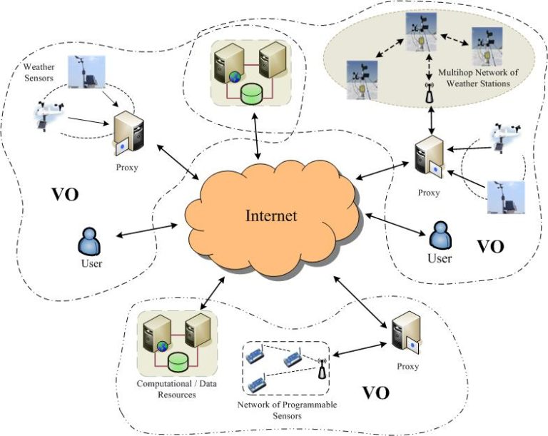

# overview

[toc]

### 概述

#### 1.grid computing vs cloud computing
|criteria|grid computing|cloud computing|
|-|-|-|
|目的|大规模的计算|降低成本，增加回报|
|管理|分散管理系统|集中管理系统（所有主机都由提供商进行集中管理）|
|访问|通过grid中间件|通过web协议|
|计算|提供最大计算能力|按需提供计算能力|
|虚拟化|数据和计算资源的虚拟化|硬件和软件平台的虚拟化|
|使用|面向应用|面向服务|

* grid computing

* cloud computing

#### 2.一个虚拟机不能跨多个物理机
