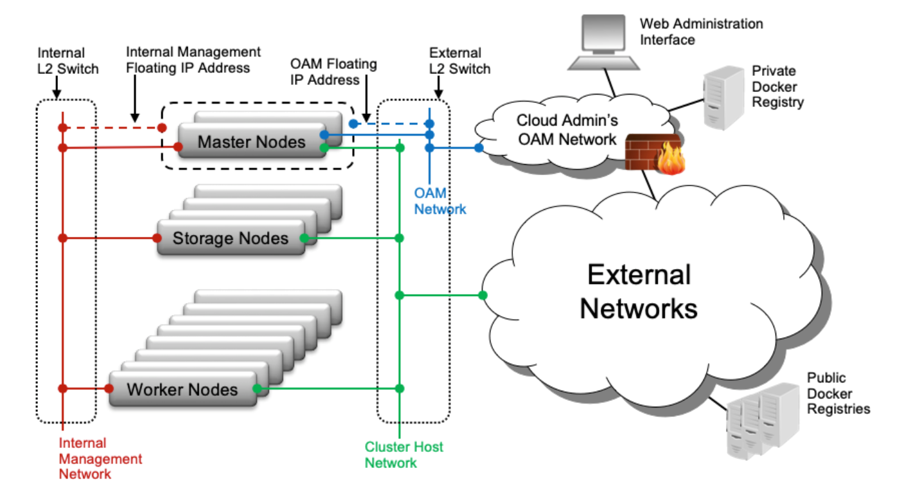

# network

[toc]

### 概述

#### 1.网络架构

这个图是单个云环境的网络架构

* 说明
  * 如果cluster host network是外部网络，则可以通过该网络对外提供服务
  * 如果cluster host network是内部网络，则可以通过OAM或者其他网络对外提供服务

* 注意：如果设置的地址网段，已经有部分地址被其他环境使用，需要特别指定地址的范围

* 不同云环境中的 management网络 和 OAM网络，需要通过三层路由互通
* 多个云环境不能共享managment网络的广播域

|网络|用途|说明|默认设置的网段|
|-|-|-|-|
|PXE网络|在一个cloud中，网络装机|在一个cloud中，主控制节点通过iso安装，其他节点都是通过PXE进行安装|默认使用的是management网络|
|cluster host网络|在一个cloud中，k8s集群中主机用于通信的地址|用于配置k8s每个节点的地址（所以apiserver也是监听在此地址上，clico的隧道也是建立在此地址之上）|192.168.206.0/24|
|storage网络|存储网络|当所有云环境使用同一个存储时，所有的节点必须能够和存储节点互通（这种架构比较少，一般都是每个云环境都有属于自己的存储）||
|internal management网络|整个云环境私有的管理网络（即外部不能访问该网络）|多个云环境不能共享managment网络的广播域（因为组播的原因） 不同云环境的管理网络必须要能够通过三层路由实现互通||
|multicast management网络|当有两个controllers，用组播地址在管理网络通信||239.1.1.0/28|
|OAM（operation、admin、management）网络|提供外部对云环境中所有controllers的访问（starlingx平台通过该网络对外暴露接口、web访问页面、ssh等）|只在controller上有OAM网络，worker节点上没有OAM网络 不同云环境的管理网络必须要能够通过三层路由实现互通 下面服务需要OAM的支持：DNS、Docker Registry、NTP||
