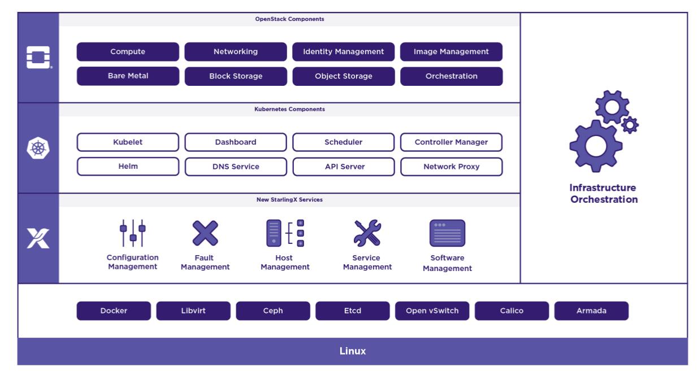
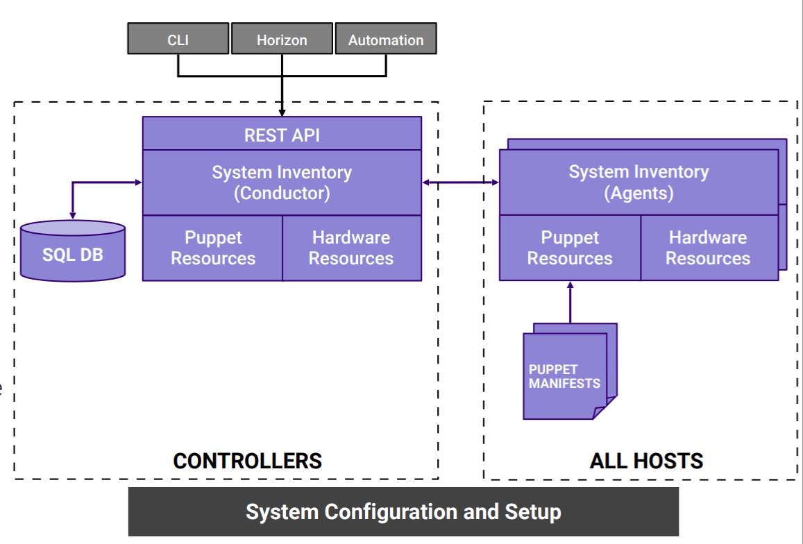
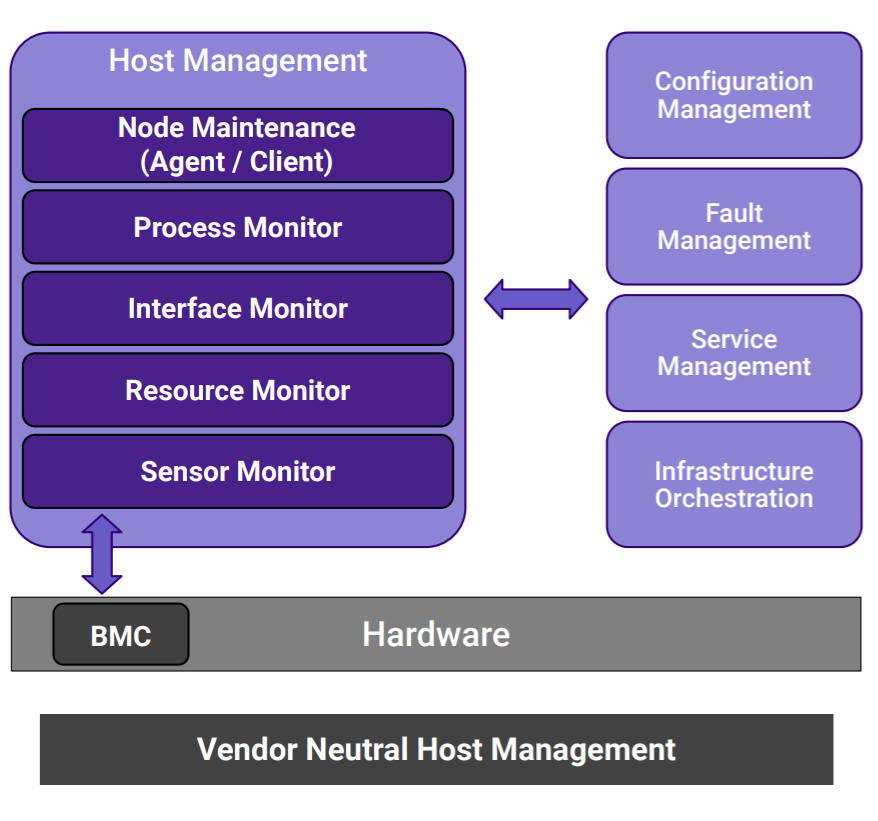
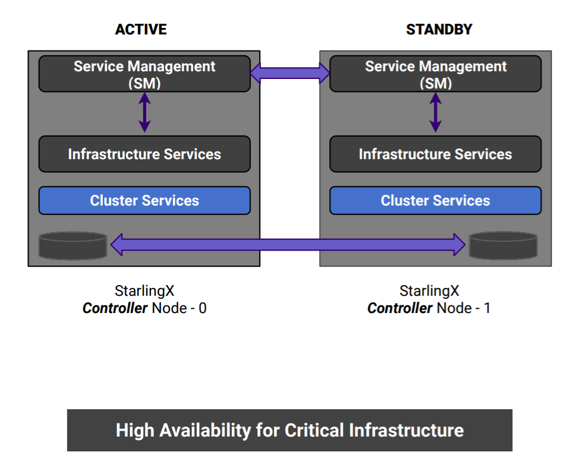
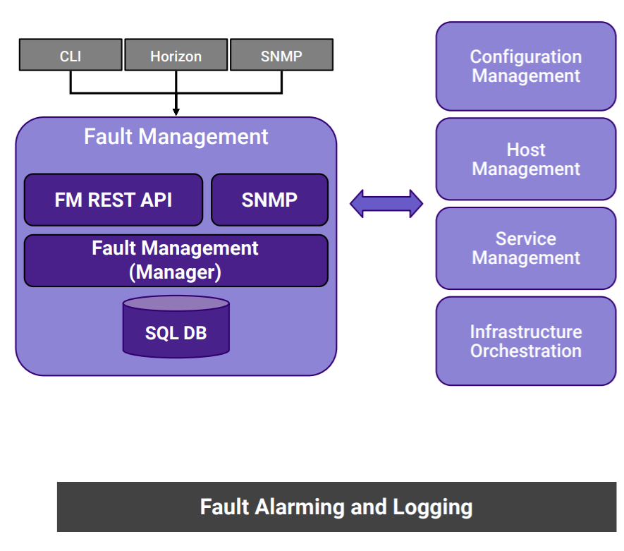
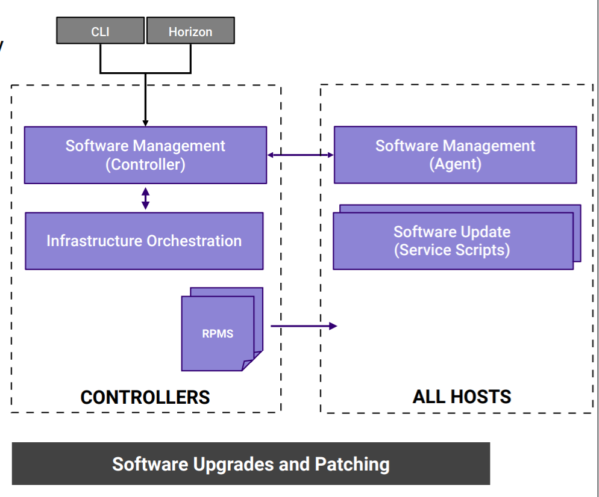
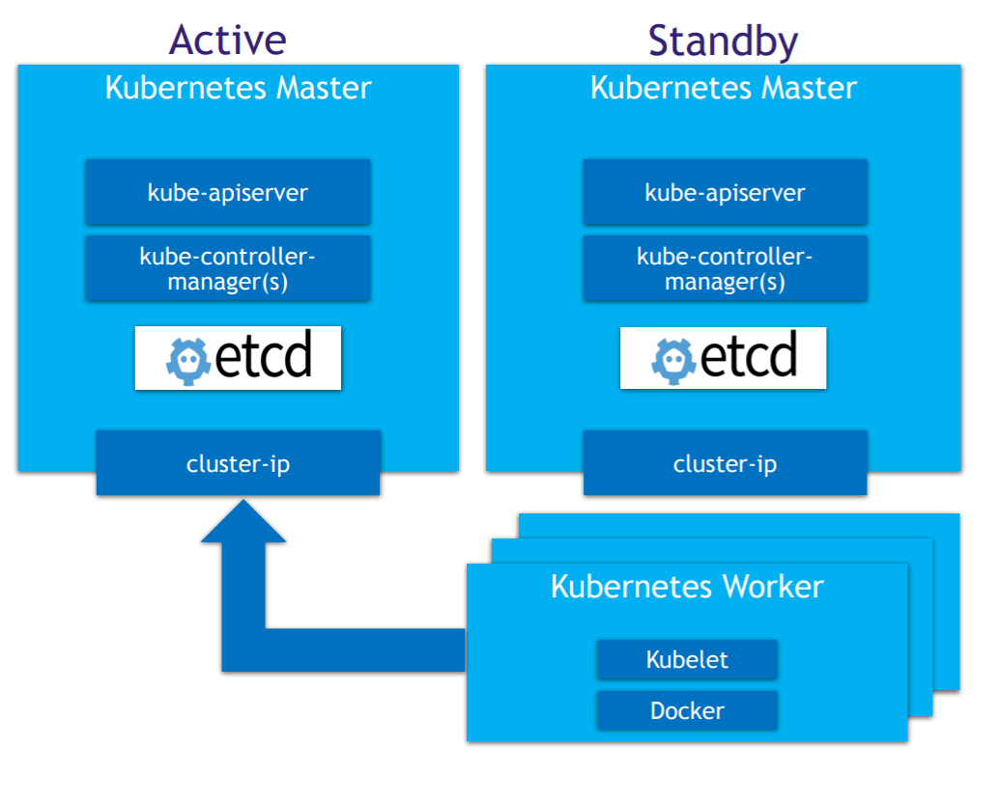
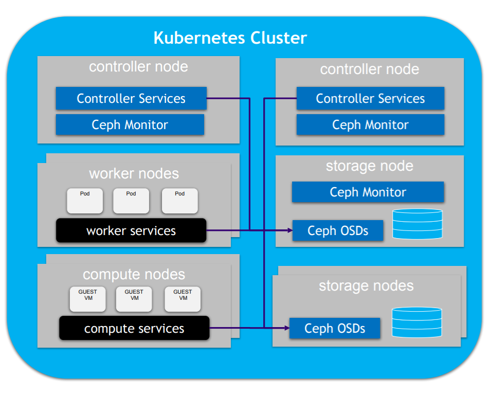

# overview

<!-- @import "[TOC]" {cmd="toc" depthFrom=1 depthTo=6 orderedList=false} -->
<!-- code_chunk_output -->

- [overview](#overview)
    - [概述](#概述)
      - [1.相关术语](#1相关术语)
      - [2.starlingx架构](#2starlingx架构)
      - [3.starlingx管理能力](#3starlingx管理能力)
        - [（1）configuration management（配置管理）](#1configuration-management配置管理)
        - [（2）host management（主机管理）](#2host-management主机管理)
        - [（3）service management（服务管理）](#3service-management服务管理)
        - [（4）fault management（故障管理）](#4fault-management故障管理)
        - [（5）software management（软件管理，正在加入）](#5software-management软件管理正在加入)
      - [4.starlingx上的k8s架构](#4starlingx上的k8s架构)

<!-- /code_chunk_output -->

### 概述

#### 1.相关术语

* All-in-one controller node
则该node会包含controller功能、worker功能和storage功能

* controller
控制节点（即控制平面），要么一个，要么两个（高可用active/standby）
主要提供的能力：
  * 控制云环境
  * 控制openstack云环境

* Management Network
整个云环境的私有管理网络，云外部不能访问该网络

* OAM Network
starlingx平台通过该网络对外暴露接口、web访问页面、ssh等
只在controller上有OAM网络

#### 2.starlingx架构

#### 3.starlingx管理能力

##### （1）configuration management（配置管理）

* 安装基础软件
* 配置节点（包括网络、存储等）
* inventory discovery（主机信息的发现）
  * puppet resources（通过puppet发现的主机的系统配置信息）
  * 硬件资源

##### （2）host management（主机管理）

* 主机全生命周期的管理
* 主机的监控
* 检测主机故障并恢复

##### （3）service management（服务管理）

* 服务的监控
* 服务的高可用
* 采用多种方式来避免脑裂

##### （4）fault management（故障管理）

* 提供告警
* 提供日志

##### （5）software management（软件管理，正在加入）

* 软件的自动更新（包括系统软件和服务软件）

#### 4.starlingx上的k8s架构
* 容器运行时使用的是containered

* 部署架构

* 存储架构

