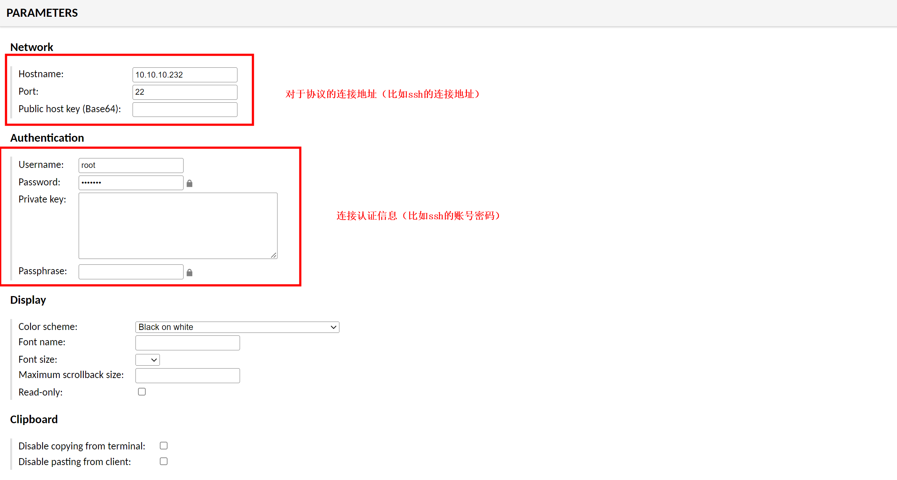
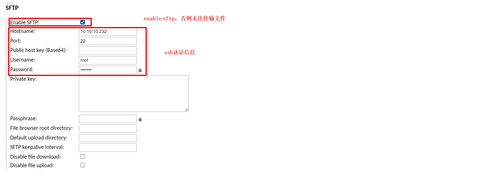
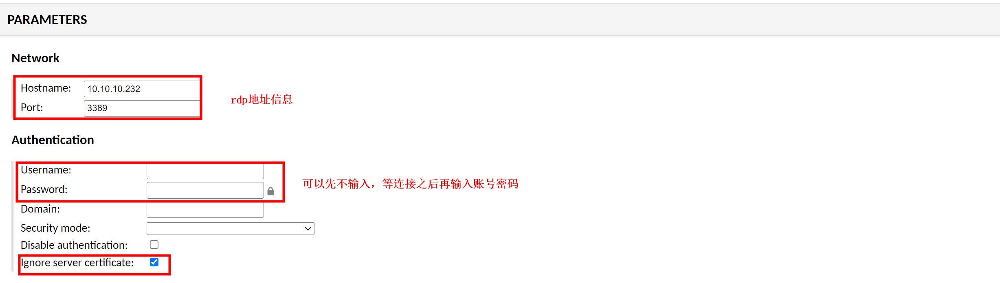

# guacamole

[toc]

### 概述

#### 1.支持的远程协议（远程桌面协议和远程终端协议）

##### （1）VNC（590*）
Virtual Network Computing

##### （2）RDP（3389）
remote desktop protocol

##### （3）ssh（22）

##### （4）telnet（23）
不能传输文件

##### （5）k8s
连接k8s中某个容器的控制台

#### 2.架构


* gucd负责 转换 guacamole协议 和 远程协议
  * 需要**安装相应的 远程协议库**（查看是否支持相应的远程协议：`ls /lib/`）
* guacamole（也就是guacamole client）
  * 提供前端页面 并 转发guacamole协议到guacad
  * 需要连接数据库，存储 认证 和 连接 信息

#### 3.端口

|服务|端口号|
|-|-|
|guacd|4822|

***

### 使用

#### 1.部署guacd
```shell
docker run -d --name guacd -p 4822:4822 guacamole/guacd
#-e GUACD_LOG_LEVEL=debug
```

#### 2.部署guacamole（client）

##### （1）创建数据库（以PostgreSQL为例子）

* 获取数据库脚本
```shell
docker run --rm guacamole/guacamole /opt/guacamole/bin/initdb.sh --postgres > /tmp/initdb.sql
```

* 启动数据库
```shell
docker run -d \
    --name pgsql \
    -e POSTGRES_PASSWORD=cangoal \
    -e PGDATA=/var/lib/postgresql/data/pgdata \
    -v /var/lib/postgresql/data:/var/lib/postgresql/data \
    -v /tmp:/tmp \
    -p 5432:5432 \
    postgres

docker exec -it pgsql /bin/bash

$ su - postgres
$ createdb guacamole_db
$ ls /tmp/initdb.sql
$ cat /tmp/initdb.sql | psql -d guacamole_db -f -

$ vim /var/lib/postgresql/data/pgdata/pg_hba.conf
# host all all all password
#其他host all all all需要注释掉
docker restart pgsql
```

##### （2）启动guacamole

```shell
docker run --name guacamole \
    --link guacd:guacd  \
    --link pgsql:pgsql \
    -e POSTGRES_HOSTNAME=pgsql \
    -e POSTGRES_DATABASE=guacamole_db \
    -e POSTGRES_USER=postgres \
    -e POSTGRES_PASSWORD=cangoal \
    -d -p 8080:8080 guacamole/guacamole
```

##### （3）访问guacamole
`http://<ip>:8080/guacamole`
`guacadmin/guacadmin`


***

### 使用

#### 1.创建连接

##### （1）以ssh为例

[参考](https://guacamole.apache.org/doc/gug/configuring-guacamole.html#configuring-connections)




* 注意如果不是ssh协议（需要利用sftp进行文件传输，需要输入sftp认证信息）


##### （2）以rdp为例
其他内容参考ssh的例子



#### 2.连接后的使用

[参考](https://guacamole.apache.org/doc/gug/using-guacamole.html)

* 打开工具栏：
  * `ctrl+alt+shift`
  * 手机等设备：在左边缘往右划
* 手机等设备
  * 模拟鼠标的右键：长按
  * 输入信息：用text-input模式，就可以使用手机键盘进行输入
