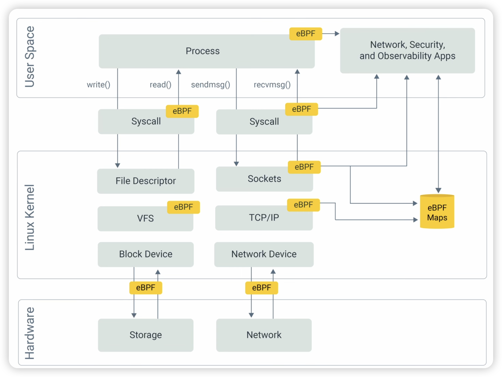
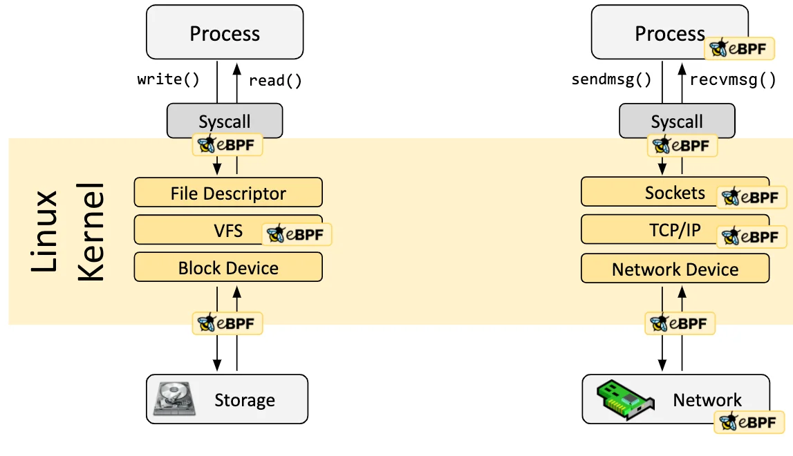
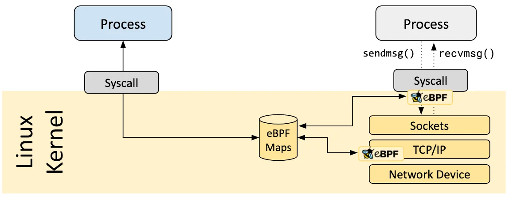

# eBPF

<!-- @import "[TOC]" {cmd="toc" depthFrom=1 depthTo=6 orderedList=false} -->

<!-- code_chunk_output -->

- [eBPF](#ebpf)
    - [Overview](#overview)
      - [1.Intro](#1intro)
      - [2.Hook](#2hook)
      - [3.Maps](#3maps)
      - [4.Helper Calls](#4helper-calls)
      - [5.Development Toolchains](#5development-toolchains)

<!-- /code_chunk_output -->

### Overview

#### 1.Intro

* language + runtime
    * eBPF is a **programming language** and **runtime** to extend operating system

    * eBPF programs  `-->`  byte code  `-->` run in the kernel's eBPF virtual machine `--JIT compiler-->` machine code

#### 2.Hook
* eBPF programs are 
    * **event-driven**
    * run when the kernel or an application passes a certain hook point

* pre-defined hooks
    * system calls
    * function entry/exit
    * kernel tracepoints
    * network events
    * ...

* custom hooks
    * create a kernel probe (kprobe) or user probe (uprobe) to attach eBPF programs almost anywhere in kernel or user applications

#### 3.Maps
* share collected information between (eBPF programms and user space) and to store state
* supported map types
    * hash tables, arrays
    * LRU (least recently used)
    * ring buffer
    * stack trace
    * ...

#### 4.Helper Calls
* eBPF programs 
    * cannot call into arbitrary kernel functions
    * can make function calls into helper functions
        * Helper calls are used within the kernel or within eBPF programs to access kernel functionality
        * System calls provide an interface between user space and kernel space

* available helper calls
    * Get current time & date
    * eBPF map access
    * Get process/cgroup context
    * Manipulate network packets and forwarding logic
    * ...

#### 5.Development Toolchains
* bcc (Python)
* bpftrace
* eBPF Go Library
* libbpf C/C++ Library