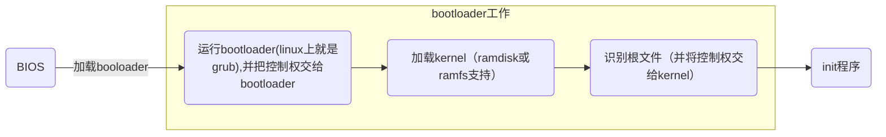

# boot

<!-- @import "[TOC]" {cmd="toc" depthFrom=1 depthTo=6 orderedList=false} -->
<!-- code_chunk_output -->

- [boot](#boot)
    - [概述](#概述)
      - [1.启动流程](#1启动流程)
        - [（1）bootloader有**两个阶段**：](#1bootloader有两个阶段)
      - [2.内存有两种：](#2内存有两种)
    - [使用](#使用)
      - [1.在grub中手动引导系统启动（即grub.cfg文件未生效）](#1在grub中手动引导系统启动即grubcfg文件未生效)
        - [（1）进入单用户模式(即救援模式):](#1进入单用户模式即救援模式)
        - [（2）进入ramdisk:](#2进入ramdisk)
      - [2.破解密码（在grub中）](#2破解密码在grub中)
      - [3.制作引导盘（可以破解系统）](#3制作引导盘可以破解系统)
        - [（1）添加磁盘，进行分区和格式化（分区的格式为msdos）](#1添加磁盘进行分区和格式化分区的格式为msdos)
        - [（2）创建boot目录进行挂载](#2创建boot目录进行挂载)
        - [（3）安装grub2](#3安装grub2)
        - [（4）将vmlinuz和initrd移如boot目录下](#4将vmlinuz和initrd移如boot目录下)
        - [（5）开机进入BIOS，选择指定的引导盘](#5开机进入bios选择指定的引导盘)
      - [4.制作简单的根文件系统:](#4制作简单的根文件系统)
        - [（1）创建sysroot目录并根所需要的相应目录](#1创建sysroot目录并根所需要的相应目录)
        - [（2）复制/bin/bash程序到目录下](#2复制binbash程序到目录下)
        - [（3）复制bash所需要的动态库](#3复制bash所需要的动态库)
        - [（4）用chroot验证](#4用chroot验证)
      - [5.利用安装盘进行系统修复:](#5利用安装盘进行系统修复)
      - [6.生成initramfs](#6生成initramfs)
      - [7.在一块磁盘上安装双操作系统](#7在一块磁盘上安装双操作系统)
      - [8.进入initramfs后的操作](#8进入initramfs后的操作)

<!-- /code_chunk_output -->

### 概述

#### 1.启动流程


##### （1）bootloader有**两个阶段**：
* bootloader程序的主要作用是**识别磁盘的文件系统**
* stage1
  * 读取磁盘的主引导扇区（MBR），指明去哪个分区（即文件系统）读取 引导加载程序（bootloader）
* stage1_5
  * 读取指定分区的引导扇区，从而定位到bootloader程序，进而将bootloader程序读取到内存中来
* stage2
  * grub存放`/boot/grub2/`目录下，kernel存放在`/boot/`目录下
  * stage2及内核等通常放在一个基本磁盘分区(通常是一个单独的分区)，原因:
    * 一般根分区可能会设置为逻辑卷,用于动态扩展
    * 如果/boot目录和根目录在同一个分区,grub很难识别特殊的分区


#### 2.内存有两种：
* RAM		  	
random access memory，断电后，这里面的内容都会清空  
</br>
* ROM			
read only memory，用来存储BIOS程序（主要功能：加电自检(检查硬件状况)、加载bootloader）  

***

### 使用

#### 1.在grub中手动引导系统启动（即grub.cfg文件未生效）

```shell
#首先要切换到内核所在的分区，比如：set root=(hd0,gpt1)
#ls /boot/ 看依稀啊是否有 内核文件 和 ram disk文件
linux16 /boot/vmlinuz-3... root=/dev/mapper/centos-root <各种参数>
initrd16 /boot/initrd...
boot

#第一个root:
#   用来指定使用哪个磁盘上的boot
#   所以如果boot没有单独的分区,就需要使用/boot/vmlinuz...来加载内核
#第二个root:
#   用来指定根文件系统具体的位置(一般在某个磁盘下,如:/dev/sd2)
#各种参数:
#   比如：rd.break console=tty0就可以进入ramdisk,进行系统操作
#initrd16:
#   指定ramdisk(或ramfs)
#   ramdisk:用内存虚拟磁盘,是一个简装版的rootfs,提供根文件系统所需要的驱动等,并非必须,取决与内核能否直接驱动rootfs所在的设备
```

##### （1）进入单用户模式(即救援模式):
  (1) 选择指定目录,按"e"进入编辑模式
  (2) 在内核那一行,最后加上single(或者1,或者s)
  (3) 按ctrl+x即可进入

##### （2）进入ramdisk:
  (1) 选择指定目录,按"e"进入编辑模式
  (2) 在内核那一行,最后加上rd.break console=tty0
  (3) 按ctrl+x即可进入

#### 2.破解密码（在grub中）
* 在启动界面按 e 进入编辑状态
* 找到Linux16所在的行,在末尾添加 rd.break console=tty0   //进入特定模式,并重新开启一个终端
* 按下 ctrl+x 进入恢复模式
* 以可写方式挂载硬盘中的根目录,并设置root密码
```shell
#重新挂载根目录
mount -o remount,rw /sysroot

#暂时切换根目录到sysroot(而sysroot其实就是最原始的根目录,只不过重新进行了挂载)
chroot /sysroot

passwd root

#标志下次启动重做SElinux,因为刚刚修改了/etc/shadow文件,此模式下没有SElinux,所以/etc/shaow的SElinux属性会被取消,再次开机会产生问题
touch /.autorelabel

exit
reboot
```


#### 3.制作引导盘（可以破解系统）

##### （1）添加磁盘，进行分区和格式化（分区的格式为msdos）
```shell
parted /dev/vdb mklabel msdos
parted /dev/vdb mkpart primary 1 10%
```

##### （2）创建boot目录进行挂载
```shell
mkdir /mnt/boot
mount /dev/vdb1 /mnt/boot
```

##### （3）安装grub2
```shell
grub2-install 磁盘 --boot-directory=/路径/boot
```

##### （4）将vmlinuz和initrd移如boot目录下

##### （5）开机进入BIOS，选择指定的引导盘

#### 4.制作简单的根文件系统:

##### （1）创建sysroot目录并根所需要的相应目录
```shell
mkdir /mnt/sysroot
cd /mnt/sysroot
mkdir etc bin sbin lib lib64 home root usr var proc dev
```

##### （2）复制/bin/bash程序到目录下
```shell
cp /bin/bash /mnt/sysroot/bin
```

##### （3）复制bash所需要的动态库
```shell
ldd /bin/bash
cp ...
```

##### （4）用chroot验证
```shell
chroot /mnt/sysroot
```

#### 5.利用安装盘进行系统修复:     

光盘的救援模式会提供一个完好的文件系统,并且会把我们的操作系统挂载到一个目录下
可以切换至我们的根目录进行相关操作

1.引导方式选择安装盘
2.进入troubleshooting
3.选择rescue system

#### 6.生成initramfs
```shell
dracut /boot/initramfs-`uname -r`.img `uname -r`
```

#### 7.在一块磁盘上安装双操作系统
  1.先安装windows,且留有充足空间
  2.利用U盘引导
  3.安装centos,安装在剩余的分区上
  4.安装后,只能启动centos
  5.下载ntfs-3G软件,编译安装,能够识别windows操作系统
  6.修改grub.cfg文件:grub2-mkconfig -o /boot/grub2/grub.cfg

#### 8.进入initramfs后的操作

[参考](https://unix.stackexchange.com/questions/672137/lvm-volume-group-not-found)
```shell
sudo vgchange -ay
sudo mount /dev/mapper/vg0-root /mnt # mount root partition
sudo mount /dev/sda2 /mnt/boot # mount boot partition
sudo mount -t proc proc /mnt/proc
sudo mount -t sysfs sys /sys
sudo mount -o bind /run /mnt/run # to get resolv.conf for internet access
sudo mount -o bind /dev /mnt/dev
sudo chroot /mnt
```
