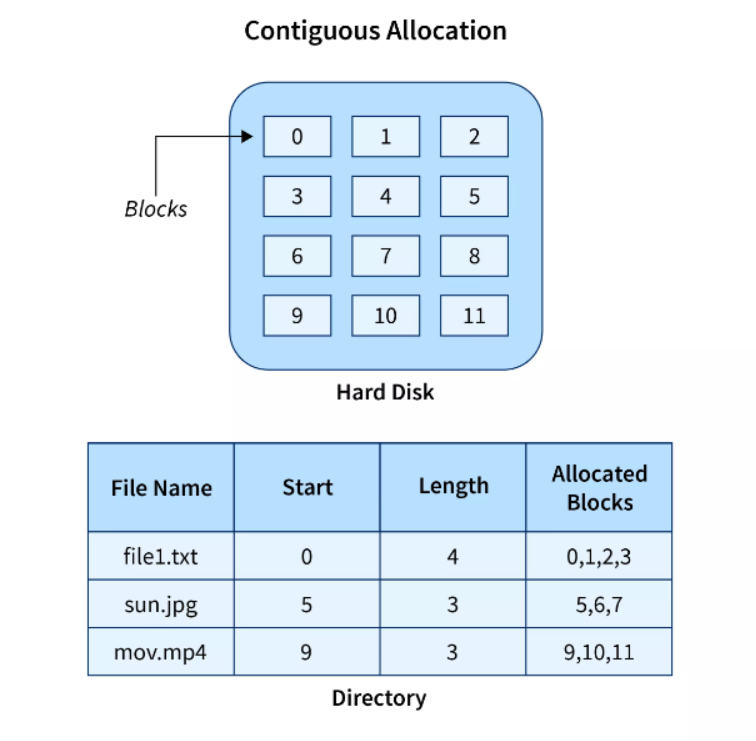
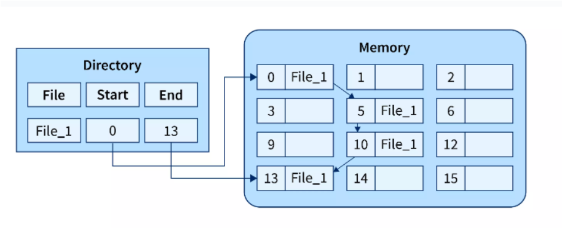
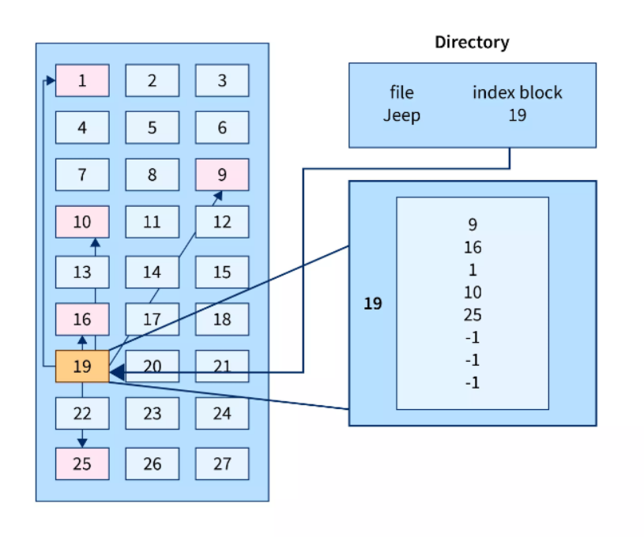
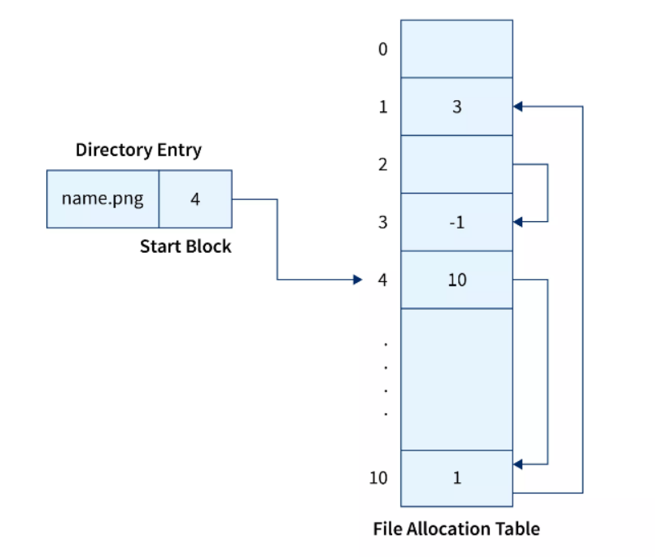
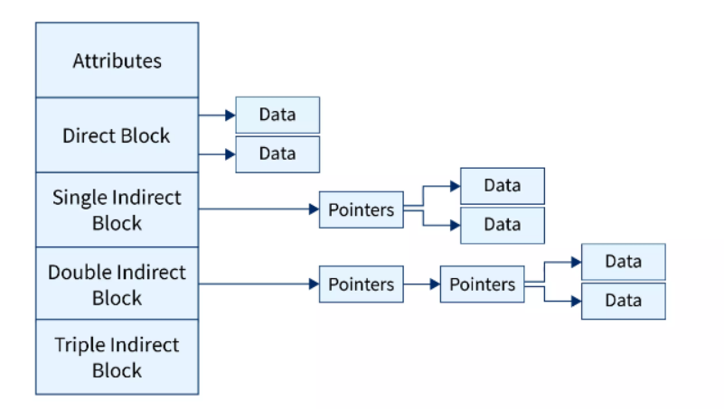
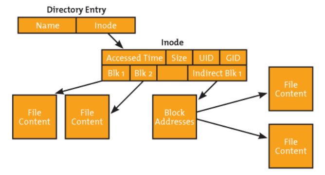
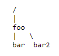

# 文件系统

<!-- @import "[TOC]" {cmd="toc" depthFrom=1 depthTo=6 orderedList=false} -->
<!-- code_chunk_output -->

- [文件系统](#文件系统)
    - [基本概念](#基本概念)
      - [1.文件系统中的概念](#1文件系统中的概念)
        - [(1) namespace](#1-namespace)
        - [(2) 文件描述符](#2-文件描述符)
        - [(3) 打开文件表 维护的信息](#3-打开文件表-维护的信息)
        - [(4) 数据块和扇区](#4-数据块和扇区)
      - [2.文件系统接口标准化: 虚拟文件系统（VFS）](#2文件系统接口标准化-虚拟文件系统vfs)
      - [3.五种文件分配方式 (file allocation method)](#3五种文件分配方式-file-allocation-method)
        - [(1) contiguous allocation](#1-contiguous-allocation)
        - [(2) linked file allocation](#2-linked-file-allocation)
        - [(3) indexed file allocation](#3-indexed-file-allocation)
        - [(4) file allocation table (FAT)](#4-file-allocation-table-fat)
        - [(5) Inode](#5-inode)
      - [4.文件系统基本数据结构](#4文件系统基本数据结构)
        - [(1) 文件系统控制块（superblock）](#1-文件系统控制块superblock)
        - [(2) 文件控制块（inode，即索引节点）](#2-文件控制块inode即索引节点)
        - [(3) 目录项（dentry：directory entry）](#3-目录项dentrydirectory-entry)
      - [5.文件数据块的两种缓存方式](#5文件数据块的两种缓存方式)
        - [(1) 数据块缓存](#1-数据块缓存)
        - [(2) 页缓存](#2-页缓存)
      - [6.UFS多级索引分配](#6ufs多级索引分配)
      - [7.文件系统架构的demo](#7文件系统架构的demo)
      - [8.几种特殊的文件系统类型](#8几种特殊的文件系统类型)
        - [（1）`tmpfs`、`ramfs或/dev/ram*`](#1tmpfs-ramfs或devram)
        - [（2）`/dev/loop*`](#2devloop)

<!-- /code_chunk_output -->

### 基本概念

#### 1.文件系统中的概念

##### (1) namespace

* 一个目录就是一个单独的namesapce
  * 在一个具体的namespace（即目录）中，可以使用相对路径
  * 在global namespace（即根目录）中，必须使用绝对路径

##### (2) 文件描述符
* 操作系统为**每个进程**维护一个**打开文件表**
* 整个系统维护一个**系统打开文件表**
* 文件描述符是打开文件的标识

##### (3) 打开文件表 维护的信息
* 文件指针
  * 最近一次读写位置
* 文件打开计数
  * 当前打开文件的次数（即多少进程打开了这个文件）
* 文件的磁盘位置
  * 会将部分内容缓存到内存当中
* 访问权限

##### (4) 数据块和扇区

* **磁盘**的基本操作单元是 **扇区**（一般为512 bytes）
* **文件系统**中的基本操作单元是 **数据块**
  * 连续的多个扇区构成一个数据块

#### 2.文件系统接口标准化: 虚拟文件系统（VFS）
对所有不同文件系统（比如: ext3、ext4、xfs等）的抽象，为上层提供统一的接口
文件系统的抽象：
* 文件
* 目录项
* 索引节点
* 挂载点

#### 3.五种文件分配方式 (file allocation method)

##### (1) contiguous allocation

##### (2) linked file allocation

##### (3) indexed file allocation

##### (4) file allocation table (FAT)

* FAT内容
  * 每一项 有两个指针：当前数据块的地址 和 在FAT中的地址（存储下一个数据块地址）
* FAT存储在内存中
* 与linked allocation比较：
  * FAT适合随即访问
    * linked allocation需要遍历之前所有的块
    * FAT遍历的是之前块的地址

##### (5) Inode
* 一个文件一个Inode

#### 4.文件系统基本数据结构

##### (1) 文件系统控制块（superblock）
* 每个**文件系统**一个
* 文件系统详细信息
  * 块、块大小、空余块等

##### (2) 文件控制块（inode，即索引节点）
* 每个**文件**一个（目录也是文件）
* 文件的信息
  * 数据块地址、访问权限、拥有者等

##### (3) 目录项（dentry：directory entry）

* 用来描述目录中文件层次结构（树形结构）
* 一个目录由多个目录项组成
* 指向文件控制块、父目录、子目录等
>举例：  

这里一共有三个目录项，分别是：
>>/ 和 foo
foo 和 bar
foo 和 bar2  

#### 5.文件数据块的两种缓存方式

##### (1) 数据块缓存

##### (2) 页缓存

将虚拟存储和数据块缓存结合，统一缓存数据块和内存页
因为虚拟存储会将部分页置换到外存即文件系统，所以这两者有密切的关系
* 将文件数据块映射成页，对文件的读写操作被转换成对内存的访问
* 在文件访问时，可能导致缺页或脏页
* 问题：需要协调用于页缓存的页面数

#### 6.UFS多级索引分配

#### 7.文件系统架构的demo

#### 8.几种特殊的文件系统类型

##### （1）`tmpfs`、`ramfs或/dev/ram*`
* `tmpfs`将数据放在虚拟内存中
  * 使用场景：
    * 1.`/dev/shm`，用于进程间通信的共享内存
    * 2.pod的临时存储（ephemeral storage）
* `ramfs或/dev/ram*`将数据放在物理内存中（不能swap）

##### （2）`/dev/loop*`
使普通文件可以作为块存储访问
  * 使用场景：
    * 挂载disk images

