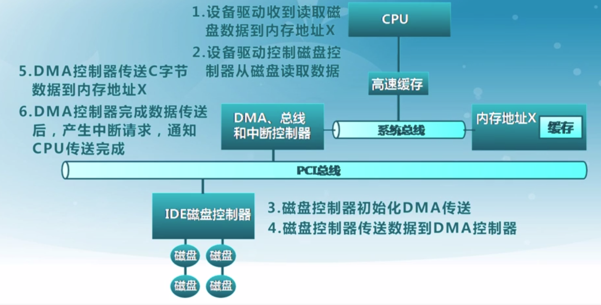

# IO子系统

<!-- @import "[TOC]" {cmd="toc" depthFrom=1 depthTo=6 orderedList=false} -->
<!-- code_chunk_output -->

- [IO子系统](#io子系统)
    - [基础概念](#基础概念)
      - [1.三种常见设备接口类型](#1三种常见设备接口类型)
        - [（1）字符设备](#1字符设备)
        - [（2）块设备](#2块设备)
        - [（3）网络设备](#3网络设备)
      - [2.硬件I/O结构](#2硬件io结构)
      - [3.内核I/O结构](#3内核io结构)
      - [4.I/O地址](#4io地址)
      - [5.cpu与设备控制器的数据传输方式](#5cpu与设备控制器的数据传输方式)
        - [（1）程序控制I/O](#1程序控制io)
        - [（2）直接内存访问（DMA）](#2直接内存访问dma)
      - [6.I/O设备通知操作系统的两种方式](#6io设备通知操作系统的两种方式)
      - [7.磁盘缓存——访问频率置换算法（frequency-based replacement）](#7磁盘缓存访问频率置换算法frequency-based-replacement)

<!-- /code_chunk_output -->

### 基础概念

#### 1.三种常见设备接口类型

##### （1）字符设备
* 如：键盘、鼠标等
* 访问特征
  * 以 **字节** 为单位顺序访问

##### （2）块设备
* 如：磁盘等
* 访问特征
  * 以均匀的**数据块**为单位访问
* 访问方式
  * 原始I/O
  * 以文件系统接口访问
  * 把磁盘映射到内存当中

##### （3）网络设备
* 如：以太网、无线等
* 访问特征
  * 格式化报文交换

#### 2.硬件I/O结构

#### 3.内核I/O结构

#### 4.I/O地址
* cpu用来控制I/O硬件
* I/O地址是内存地址或端口号

#### 5.cpu与设备控制器的数据传输方式

##### （1）程序控制I/O
* cpu直接在I/O地址进行读写数据
* 适用于小型的设备I/O

##### （2）直接内存访问（DMA）
* 设备控制器可直接访问系统总线
* 控制器直接与内存互相传输数据（**传输数据时不影响cpu**）
* 适用于高吞吐量I/O

#### 6.I/O设备通知操作系统的两种方式
* 轮询
* 中断
>高速设备会将两种方法结合起来，有数据来时产生中断，然后cpu会轮询，如果一段时间轮询不到数据，则又会切换到中断模式  

#### 7.磁盘缓存——访问频率置换算法（frequency-based replacement）
将LRU和LFU结合

* 缓存块被访问时移动到栈顶，新区域中的缓存块被访问时，引用计数不增加
* 淘汰时，在旧区域中选择访问频率最低的缓存块淘汰
