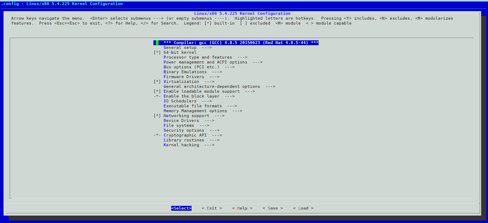

# upgrade kernel

<!-- @import "[TOC]" {cmd="toc" depthFrom=1 depthTo=6 orderedList=false} -->
<!-- code_chunk_output -->

- [upgrade kernel](#upgrade-kernel)
    - [upgrade](#upgrade)
      - [1.下载源码](#1下载源码)
      - [2.配置kernel](#2配置kernel)
        - [（1） 配置方式（特殊需求）](#1-配置方式特殊需求)
      - [3.安装依赖](#3安装依赖)
      - [4.安装](#4安装)
      - [5.使用已经编译好的包（替代上面的所有步骤）](#5使用已经编译好的包替代上面的所有步骤)
        - [(1) redhat系列](#1-redhat系列)
        - [(2) ubuntu](#2-ubuntu)
      - [5.设置grub](#5设置grub)

<!-- /code_chunk_output -->

### upgrade

#### 1.下载源码
[地址](https://www.kernel.org/)

```shell
tar xf linux-5.4.225.tar.xz
cd linux-5.4.225
```

#### 2.配置kernel

* kernel配置文件
```shell
cp -v /boot/config-$(uname -r) .config
```

##### （1） 配置方式（特殊需求）
* 一个feature有三种状态
  * `y`表示会构建到内核中
  * `m`表示会构建为模块
  * 注释 表示不构建此feature
```shell
CONFIG_SCSI=y
CONFIG_SCSI=m
# CONFIG_SCSI is not set
```

#### 3.安装依赖
```shell
#apt-get install build-essential libncurses-dev bison flex libssl-dev libelf-dev
yum install ncurses-devel bison flex elfutils-libelf-devel openssl-devel
```

#### 4.安装
* 设置安装选项（即需要开启或者关闭某些feature）

```shell
make menuconfig
```



* 编译（注意gcc的版本会影响，建议采用比较新的版本）
  * 如果不合适的gcc版本会导致编译错误
```shell
#用echo ""，表示使用默认配置（不要询问你）
#因为有些新功能原先的配置(.config)里没有包含，所以会询问你
echo "" | make -j $(nproc)
```

* 安装模块
```shell
make modules_install
```

* 安装kernel
```shell
make install
#成功后查看: /boot/vmlinuz-<version>
```

#### 5.使用已经编译好的包（替代上面的所有步骤）

##### (1) redhat系列

* 有外网
[epel仓库](http://elrepo.org/tiki/HomePage)
```shell
rpm --import https://www.elrepo.org/RPM-GPG-KEY-elrepo.org
#对于el7系列
yum install https://www.elrepo.org/elrepo-release-7.el7.elrepo.noarch.rpm

#安装最新版
yum --enablerepo=elrepo-kernel install kernel-lt
```

* 无外网
[下载地址](https://elrepo.org/linux/kernel/)

```shell
#找到DOWNLOAD选项，进行下载
rpm -ivh kernel-lt-5.4.225-1.el7.elrepo.x86_64.rpm

#下面的包可以选择安装（不是必须，建议先不安装）
#在See Also找到下面的相关包
rpm -ivh kernel-lt-devel-5.4.225-1.el7.elrepo.x86_64.rpm
rpm -ivh kernel-lt-headers-5.4.225-1.el7.elrepo.x86_64.rpm
rpm -ivh kernel-lt-tools-5.4.225-1.el7.elrepo.x86_64.rpm
rpm -ivh kernel-lt-tools-libs-devel-5.4.225-1.el7.elrepo.x86_64.rpm
```

##### (2) ubuntu

* 有外网
```shell
sudo add-apt-repository ppa:cappelikan/ppa
sudo apt update
sudo apt install mainline
```

* 无外网
[下载地址](https://kernel.ubuntu.com/mainline/)

```shell
dpkg -i linux-headers-6.4.16-060416_6.4.16-060416.202309130834_all.deb
dpkg -i linux-headers-6.4.16-060416-generic_6.4.16-060416.202309130834_amd64.deb
dpkg -i linux-image-unsigned-6.4.16-060416-generic_6.4.16-060416.202309130834_amd64.deb	
dpkg -i linux-modules-6.4.16-060416-generic_6.4.16-060416.202309130834_amd64.deb

#这个命令会自动安装依赖（需要外网）
sudo apt-get -f install
```

#### 5.设置grub
```shell
#生成grub配置
grub2-mkconfig -o /boot/grub2/grub.cfg
#设置默认kernel（即修改/boot/grub2/grub.cfg文件）
grubby --set-default /boot/vmlinuz-<version>
```
