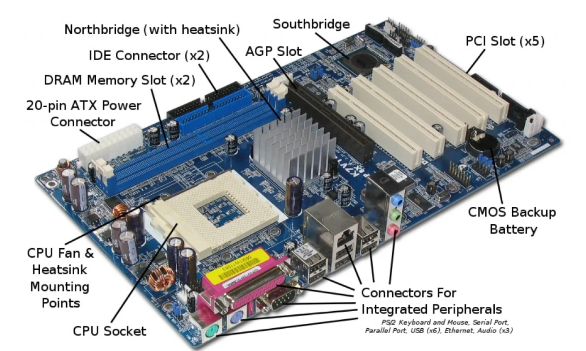

# overview

[toc]

### 概述

#### 1.motherboard（主板）
是一种PCB（printed circuit board，印刷电路板），通过电子印刷术 构建电路系统，避免了人工接线，提高了产品的质量
* BIOS程序是存储在主板上的CMOS中的
  * 所以主板本身是有电源的（没电了储存在CMOS里的设置就会丢失）

#### 2.southbridge 和 northbridge

* 北桥芯片 处理高速信号（现代计算机北桥芯片已经被cpu芯片取代）
  * 主要负责CPU、内存、显卡、南桥之间的数据交换
* 南桥芯片 处理低速信号
  * 控制主板上的各种接口、PS/2鼠标控制、USB控制、PCI总线IDE以及主板上的其他芯片（如集成声卡、集成RAID卡、集成网卡等）

#### 3.bus（总线）

##### （1）定义
是计算机各种组件之间传送信息的**公共通信干线**
设备通过相应的bus interface连接到相应的bus上
主机的各个部件通过总线相连接，**外部设备**通过相应的**bus interface**接到相应的**external bus**上，再与system bus相连接

##### （2）分类

* internal bus（system bus） vs external bus

  * internal bus（system bus）: 内部组件（memory、cpu等）用于通信的总线
  * external bus: 外部组件（USB、SATA等）用于通信的总线

* parallel bus vs serial bus

  * parallel bus: 一次能够传输几个比特
  * serial bus: 一次智能传输一个比特

##### (3) internal bus（system bus）

* 有三个总线：

  * 地址总线：负责传输 数据地址
  * 数据总线：负责传输 数据
  * 控制总线：负责传输 控制信号

##### （4）bus大致架构

#### 4.pci（peripheral component interconnect）
是一种标准，用于接入外部设备
有pci总线和pci插槽

#### 5.`COM`（communication port，串口）

#### 6.VGA（video graphics array）
显卡上输出模拟信号的接口

#### 7.FC HBA（fiber channel host bus adapter）
用于连接FC网络，就像以太网卡用来连接以太网一样

#### 8.硬盘相关接口

* SCSI（small computer system interface）
  * SAS（serial attached SCSI）

* IDE（Integrated Drive Electronics）
  * ATA（advanced technology attachment）
  * SATA（serial ATA）

* FC（fiber channel）
  * 和SCSI接口一样光纤通道最初也不是为硬盘设计开发的接口技术，是专门为网络系统设计的，但随着存储系统对速度的需求，才逐渐应用到硬盘系统中

#### 9.cpu

##### (1) 基本参数

* Socket
cpu的插槽（一个插槽代表一个主板上的芯片）
 
* Core
cpu的核心，一个核心代表一个独立的处理器（即物理cpu，提供真正的并行能力）
 
* Thead
超线程，只是操作系统指令的队列（提高cpu的性能，但不能提供真正的并行能力）
会**欺骗**操作系统，把一个Thread当作一个逻辑CPU
 
* CPU（逻辑CPU）
`逻辑CPU = Socket * Core per socket * Thread per core`
`物理CPU = Socket * Core per socket`

##### (2) frequency

* 决定了多少cpu cycles per second
  * 一个cpu cyclie能够执行一些操作