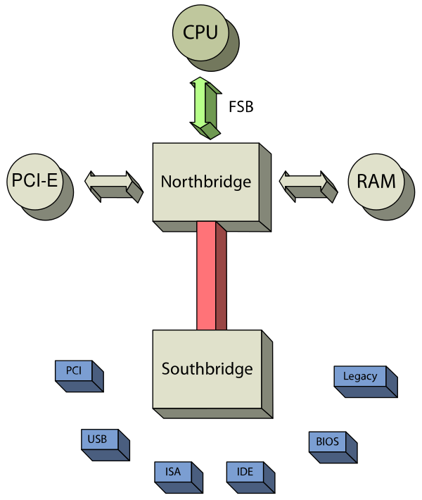
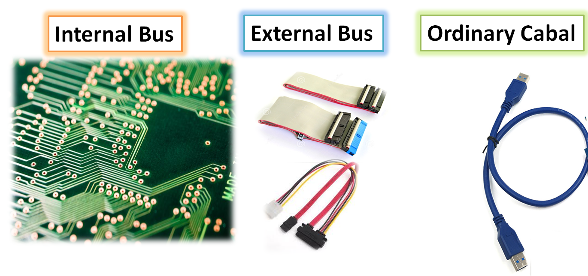
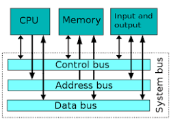
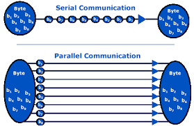
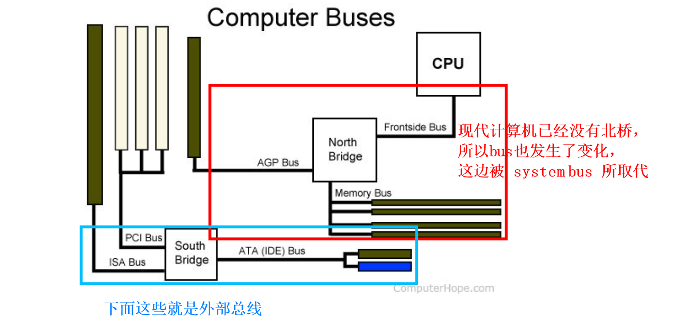

# overview

[toc]

### 概述

#### 1.motherboard（主板）
是一种PCB（printed circuit board，印刷电路板），通过电子印刷术 构建电路系统，避免了人工接线，提高了产品的质量
* BIOS程序是存储在主板上的CMOS中的
  * 所以主板本身是有电源的（没电了储存在CMOS里的设置就会丢失）

#### 2.southbridge 和 northbridge

* 北桥芯片 处理高速信号（现代计算机北桥芯片已经被cpu芯片取代）
  * 主要负责CPU、内存、显卡、南桥之间的数据交换
* 南桥芯片 处理低速信号
  * 控制主板上的各种接口、PS/2鼠标控制、USB控制、PCI总线IDE以及主板上的其他芯片（如集成声卡、集成RAID卡、集成网卡等）

#### 3.bus（总线）

##### （1）定义
是计算机各种组件之间传送信息的**公共通信干线**
设备通过相应的bus interface连接到相应的bus上
主机的各个部件通过总线相连接，**外部设备**通过相应的**bus interface**接到相应的**external bus**上，再与system bus相连接

##### （2）分类

* internal bus（system bus） vs external bus
  * internal bus（system bus）: 内部组件（memory、cpu等）用于通信的总线
  * external bus: 外部组件（USB、SATA等）用于通信的总线

* internal bus（system bus）里面有三个总线：
  * 地址总线：负责传输 数据地址
  * 数据总线：负责传输 数据
  * 控制总线：负责传输 控制信号

* parallel bus vs serial bus
  * parallel bus: 一次能够传输几个比特
  * serial bus: 一次智能传输一个比特

##### （3）bus大致架构

