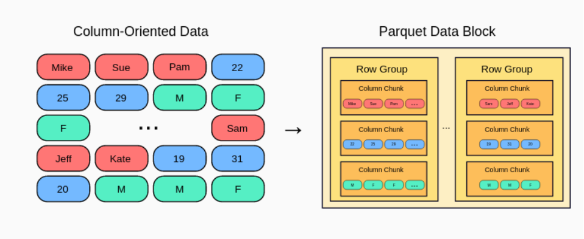

# data file format

<!-- @import "[TOC]" {cmd="toc" depthFrom=1 depthTo=6 orderedList=false} -->

<!-- code_chunk_output -->

- [data file format](#data-file-format)
    - [概述](#概述)
      - [1.两类数据文件格式](#1两类数据文件格式)
        - [(1) row-based](#1-row-based)
        - [(2) columnar storage](#2-columnar-storage)
      - [2.常用文件格式对比](#2常用文件格式对比)
        - [(1) ORC](#1-orc)
      - [3.压缩方式](#3压缩方式)
      - [4.delta lake vs data lake](#4delta-lake-vs-data-lake)

<!-- /code_chunk_output -->

### 概述

#### 1.两类数据文件格式

##### (1) row-based
* 将一行的数据存储在一起
* 形式: **plain** text
* 适用场景：写密集型

* 具体实现
    * **CSV** (comma-separated values)

##### (2) columnar storage
* 将一列的数据存储在一起
* 特点
    * 适合读取部分数据（不适合读取全部数据，这个性能不如row-based）
    * 写性能较差
        * 需要大量CPU和内存
        * 需要遍历，才能定位到某一行数据（row-based只需要进行排序，就可以很快定位到）
        * 优化: row group (parquet)
            * 每个row group中，会列出每列的min和max，从而能够很快定位到数据
            
    * **压缩**性能更好
        * 因为一列数据的类型都相同，能进行更有效的压缩
* 形式: **binary**
* 适用场景：读取密集型（分析或历史数据）
* 具体实现
    * **parquet**
        * metadata 也存在文件中
            * 包括数据类型，压缩方式等等，这样读取数据时就不会有歧义（而CSV就没有存储这些数据）

#### 2.常用文件格式对比
Feature|CSV(Comma-separated values)|JSON|Avro|ORC(Optimized Row Columnar )|Parquet|SequenceFile
-|-|-|-|-|-|-
Format|Text|Text|Binary|Binary|Binary|Binary
Structure|Row-oriented|Semi-structured|Schema-based|Column-oriented|Column-oriented|Key-value pairs
Human Readable|Yes|Yes|No|No|No|No
Compression|Gzip, Deflate, BZip2 (externally applied)|Gzip, Deflate, LZ4, Snappy, Zstandard (externally applied)|Snappy, Deflate, BZip2, LZ4, Zstandard (internally supported)|Snappy, Zstandard, LZO (internally supported)|Snappy, Gzip, LZO, Zstandard (internally supported)|Gzip, BZip2, LZO, Snappy, Deflate (internally supported)
Schema Evolution|Limited|Yes|Yes|Yes|Yes|Limited
Nested Data|No|Yes|Yes|Yes|Yes|No
Performance (Write)|Fast|Fast|Slow|Moderate|Moderate|Fast
Performance (Read)|Slow|Slow|Fast|Fast|Fast|Fast
Querying|Inefficient|Inefficient|Efficient|Efficient|Efficient|Efficient for key-based lookups
Storage Efficiency|Low|Moderate|High|High|High|High
Tooling Support|Widespread|Widespread|Moderate|Moderate|Widespread|Widespread in Hadoop ecosystem
Use Cases|Data exchange, small datasets|Data exchange, APIs, configuration files|Data integration, schema-flexible data|Hive data, read-heavy workloads|Analytics, data warehousing|Intermediate data, sorting, indexing, MapReduce I/O

##### (1) ORC
* 先根据行，划分为多个stripe
* 每个stripe中使用列存储
    * 包含了每个column的min/max的索引数据

#### 3.压缩方式
| Feature | Gzip | Deflate | Snappy | LZ4 | Zstandard | Brotli | zlib |
|-|-|-|-|-|--|-|-|
| Compression Algorithm | DEFLATE (zlib) | DEFLATE (zlib) | LZ77 + Huffman coding | LZ77 + Huffman coding | LZ77 + Huffman coding + entropy coding | LZ77 + Huffman coding + context modeling | Foundation library for Deflate, LZ4, etc. |
| Compression Ratio | Good | Good | Moderate | Moderate | Very good | Very good | N/A |
| Compression Speed | Slow | Slow | Very fast | Very fast | Fast | Moderate | N/A |
| Decompression Speed | Fast | Fast | Very fast | Very fast | Fast | Fast | N/A |
| Memory Usage | High | High | Low | Low | Low | Low | N/A |
| File Format Support | .gz | .zip, .png, .pdf, etc. | Multiple formats | Multiple formats | Multiple formats | .br | N/A |
| Common Use Cases | General-purpose compression, web content, text files | Archiving, data transfer, web content, images | Log files, data streams, network traffic | Databases, gaming, embedded systems | Web content, database compression, cold storage | Web content, fonts, JavaScript files | Provides library functions for various compression algorithms |
| Features: | - Wide format support | - Part of standard formats | - Very fast compression & decompression | - Very fast compression & decompression | - Good compression ratio & speed balance | - Excellent compression ratio | - Enables multiple algorithms with customization |

#### 4.delta lake vs data lake