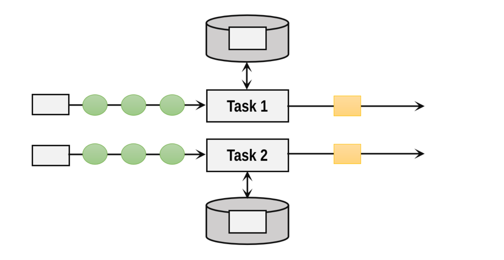

# State


<!-- @import "[TOC]" {cmd="toc" depthFrom=1 depthTo=6 orderedList=false} -->

<!-- code_chunk_output -->

- [State](#state)
    - [state](#state-1)
      - [1. 介绍](#1-介绍)
      - [2.状态一致性](#2状态一致性)
        - [(1) 状态一致级别](#1-状态一致级别)
        - [(2) 端到端的状态一致性](#2-端到端的状态一致性)
      - [3. 端到端精确一次的实现](#3-端到端精确一次的实现)
        - [(1) 源算子](#1-源算子)
        - [(2) flink](#2-flink)
        - [(3) 输出算子](#3-输出算子)
      - [4.Keyed State使用](#4keyed-state使用)
        - [(1) demo (以value state为例)](#1-demo-以value-state为例)
        - [(2) TTL](#2-ttl)
      - [5.operator state使用（不常用）](#5operator-state使用不常用)
        - [(1) demo (以ListState为例)](#1-demo-以liststate为例)
        - [(2) BroadcastState (相当于全局状态，所有并行度共享)](#2-broadcaststate-相当于全局状态所有并行度共享)
      - [6.state backend (状态的存储方式)](#6state-backend-状态的存储方式)
        - [(1) HashMapStateBackend (默认的)](#1-hashmapstatebackend-默认的)
        - [(2) EmbeddedRocksDBStateBackend](#2-embeddedrocksdbstatebackend)
    - [Fault Tolerance](#fault-tolerance)
      - [1.checkpoint](#1checkpoint)
        - [(1) 周期性进行保存](#1-周期性进行保存)
        - [(2) 保存的时间点（要保证一致性）](#2-保存的时间点要保证一致性)
      - [2.checkpoint实现原理](#2checkpoint实现原理)
        - [(1) barrier](#1-barrier)
        - [(2) 基于barrier对齐的exactly once原理](#2-基于barrier对齐的exactly-once原理)
        - [(3) 基于非barrier对齐的exactly once原理](#3-基于非barrier对齐的exactly-once原理)
        - [(4) 基于barrier对齐的at least once原理](#4-基于barrier对齐的at-least-once原理)
      - [3.增量checkpoint](#3增量checkpoint)
      - [4.checkpoint使用](#4checkpoint使用)
        - [(1) 相关配置](#1-相关配置)
        - [(2) 从checkpoint进行恢复](#2-从checkpoint进行恢复)
      - [5.savepoint](#5savepoint)
        - [(1) 保存savepoint](#1-保存savepoint)
        - [(2) 从savepoint进行恢复](#2-从savepoint进行恢复)

<!-- /code_chunk_output -->


### state

#### 1. 介绍
* **并行**任务之间**不能共享**状态
* Keyed State：经过keyby，存储状态
    * 每个key维持一个状态，相同key的数据，只能访问**本key**的状态



#### 2.状态一致性

##### (1) 状态一致级别
* at most once
* at least once
* exactly once

##### (2) 端到端的状态一致性
数据源、流处理器（即flink）、外部存储系统，都需要状态一致
* 如果其中一个环节无法做到状态一致，整个系统也无法做到

#### 3. 端到端精确一次的实现

##### (1) 源算子
* 需要保存**偏移量**状态（即读取到了哪条数据），并且外部数据原需要支持**重置**偏移量
    * 比如: 数据处理一半，宕机了，此处外部数据源的偏移量为99,而源算子记录的偏移量为97,则当程序重启时，源算子需要重置外部数据原的偏移量，从98开始读取

##### (2) flink
* 支持精确一次

##### (3) 输出算子
* 幂等
* 或事务（比较复杂）
    * 两阶段提交
        * 第一阶段
            * 预提交
                * 当checkpoint完成后，新的数据到，会开启一个新的事务
                * 将该数据发往外部系统，但不提交事务
        * 第二阶段
            * 提交事务（如果有失败，则回滚，然后重启读取状态，再次提交）
                * 当本次checkpoint完成后，才提交本次事务
                * 所以checkpoint的时间间隔 要小于 外部系统的事务超时时间

#### 4.Keyed State使用

* 支持以下几种类型

```python
#状态存储的是一个值
ValueState<T> getState(ValueStateDescriptor<T>)

#状态存储的是一个list
ListState<T> getListState(ListStateDescriptor<T>)

# 状态存储的是一个dict
MapState<UK, UV> getMapState(MapStateDescriptor<UK, UV>)

# 对存储的对象进行reduce并只存储当前的结果（所以需要提供一个reduce函数）（比如： 放入第一个对象，不进行任何操作，放入第二个对象，进行reduce，只存储当前的结果，放入第三个对象，将上一次的结果与该对象进行reduce，只存储当前的结果）
# reduce是对 两个对象 进行处理，然后返回一个对象（输入的两个参数、输出的参数类型都必须一样）
ReducingState<T> getReducingState(ReducingStateDescriptor<T>)

# 与reduce类似，只不过输入的两个参数、输出的参数类型可以不一样
AggregatingState<IN, OUT> getAggregatingState(AggregatingStateDescriptor<IN, ACC, OUT>)
```

##### (1) demo (以value state为例)
```python
from pyflink.common.typeinfo import Types
from pyflink.datastream import StreamExecutionEnvironment, FlatMapFunction, RuntimeContext
from pyflink.datastream.state import ValueStateDescriptor

class CountWindowAverage(FlatMapFunction):

    def __init__(self):
        self.sum = None

    def open(self, runtime_context: RuntimeContext):

        #定义状态
        descriptor = ValueStateDescriptor(
            "average",  #状态名
            Types.PICKLED_BYTE_ARRAY()  #状态类型
        )
        #初始化状态（如果保存了状态，现在程序重启了，状态会加载进来，不是初始值）
        self.sum = runtime_context.get_state(descriptor)

    def flat_map(self, value):
        # access the state value
        current_sum = self.sum.value()
        if current_sum is None:
            current_sum = (0, 0)

        # update the count
        current_sum = (current_sum[0] + 1, current_sum[1] + value[1])

        # update the state
        self.sum.update(current_sum)

        # if the count reaches 2, emit the average and clear the state
        if current_sum[0] >= 2:
            self.sum.clear()
            yield value[0], int(current_sum[1] / current_sum[0])


env = StreamExecutionEnvironment.get_execution_environment()
env.from_collection([(1, 3), (1, 5), (1, 7), (1, 4), (1, 2)]) \
    .key_by(lambda row: row[0]) \
    .flat_map(CountWindowAverage()) \
    .print()

env.execute()
```

##### (2) TTL
状态的有效时间，当状态过期了，就相当于进行了clear，状态就会变为初始值（比如null）
* 状态过期，并没有立即清除，而是进行了标记，会周期进行清除

```python
ttl_config = StateTtlConfig \
  .new_builder(Time.seconds(10)) \   #设置多就超时（这里设置的是10s）
  .set_update_type(StateTtlConfig.UpdateType.OnCreateAndWrite) \    # 如果进行了创建或写操作，重新更新超时时间（10s）
  .set_state_visibility(StateTtlConfig.StateVisibility.NeverReturnExpired) \    #状态过期还未清除的情况下，能够被读取
  .build()

state_descriptor = ValueStateDescriptor("text state", Types.STRING())
state_descriptor.enable_time_to_live(ttl_config)
```

#### 5.operator state使用（不常用）

* 支持以下几种类型
    * ListState
    * UnionListState
        * 与ListState区别:
            * 当并行度调整时，怎么重新分配状态
                * 比如map原先并行度为2,重启后并行度为3,ListState会将状态值，平均分配到这两个并行度，而UnionListState会将完整的状态给每一个并行度
    * BroadcastState
        * 所有并行度都拥有一份完整的状态

##### (1) demo (以ListState为例)
```java
public class BufferingSink
        implements SinkFunction<Tuple2<String, Integer>>,
                   CheckpointedFunction {

    private final int threshold;

    private transient ListState<Tuple2<String, Integer>> checkpointedState;

    private List<Tuple2<String, Integer>> bufferedElements;

    public BufferingSink(int threshold) {
        this.threshold = threshold;
        this.bufferedElements = new ArrayList<>();
    }

    @Override
    public void invoke(Tuple2<String, Integer> value, Context contex) throws Exception {
        bufferedElements.add(value);
        if (bufferedElements.size() >= threshold) {
            for (Tuple2<String, Integer> element: bufferedElements) {
                // send it to the sink
            }
            bufferedElements.clear();
        }
    }

    @Override
    public void snapshotState(FunctionSnapshotContext context) throws Exception {
        checkpointedState.clear();
        for (Tuple2<String, Integer> element : bufferedElements) {
            checkpointedState.add(element);
        }
    }

    @Override
    public void initializeState(FunctionInitializationContext context) throws Exception {
        //定义状态
        ListStateDescriptor<Tuple2<String, Integer>> descriptor =
            new ListStateDescriptor<>(
                "buffered-elements",
                TypeInformation.of(new TypeHint<Tuple2<String, Integer>>() {}));

        //初始化状态（如果保存了状态，现在程序重启了，状态会加载进来，不是初始值）
        checkpointedState = context.getOperatorStateStore().getListState(descriptor);

        //读取状态
        if (context.isRestored()) {
            for (Tuple2<String, Integer> element : checkpointedState.get()) {
                bufferedElements.add(element);
            }
        }
    }
}
```

##### (2) BroadcastState (相当于全局状态，所有并行度共享)
```python
#数据流
color_partitioned_stream = item_stream.key_by(lambda item: ...)

# 创建一个流，用于广播状态
rule_state_descriptor = MapStateDescriptor("RuleBroadcastState", Types.STRING(), Types.PICKLED_BYTE_ARRAY())
rule_broadcast_stream = rule_stream.broadcast(rule_state_descriptor)

#定义处理函数（如果进行了keyby，则使用KeyedBroadcastProcessFunction
class MyKeyedBroadcastProcessFunction(KeyedBroadcastProcessFunction):

    def __init__(self):
        self._map_state_desc = MapStateDescriptor("item", Types.STRING(), Types.LIST(Types.PICKLED_BYTE_ARRAY()))
        self._rule_state_desc = MapStateDescriptor("RulesBroadcastState", Types.STRING(), Types.PICKLED_BYTE_ARRAY())
        self._map_state = None
    
    def open(self, ctx: RuntimeContext):
        self._map_state = ctx.get_map_state(self._map_state_desc)
    

    #广播流的处理：获取数据，放入广播状态中
    def process_broadcast_element(value: Rule, ctx: KeyedBroadcastProcessFunction.Context):
        ctx.get_broadcast_state(self._rule_state_desc).put(value.name, value)
    
    #数据流的处理
    def process_element(value: Item, ctx: KeyedBroadcastProcessFunction.ReadOnlyContext):
        shape = value.get_shape()

        for rule_name, rule in ctx.get_broadcast_state(self._rule_state_desc).items():

            stored = self._map_state.get(rule_name)
            if stored is None:
                stored = []
            
            if shape == rule.second and len(stored) > 0:
                for i in stored:
                    yield "MATCH: {} - {}".format(i, value)
                stored = []
            
            if shape == rule.first:
                stored.append(value)
            
            if len(stored) == 0:
                self._map_state.remove(rule_name)
            else:
                self._map_state.put(rule_name, stored)

#connect两个流
output = color_partitioned_stream \
    .connect(rule_broadcast_stream) \
    .process(MyKeyedBroadcastProcessFunction())

```

#### 6.state backend (状态的存储方式)

##### (1) HashMapStateBackend (默认的)
将状态存放在TaskManager的内存中

##### (2) EmbeddedRocksDBStateBackend
存储到RocksDB数据库中，适用状态数据非常大，不适合放在内存中
* 存储为序列化的字节数组，因此读写操作需要进行序列化和反序列化

***

### Fault Tolerance

#### 1.checkpoint

##### (1) 周期性进行保存

##### (2) 保存的时间点（要保证一致性）
* 一条数据**经过了整条链路的处理**，保存**处理这条数据时**的状态
    * 而不是一条数据才处理一半就进行保存，这样无法保证一致性

#### 2.checkpoint实现原理

##### (1) barrier
* 在数据流中插入barrier（一种特殊的数据结构，**有编号**）
    * 说明该编号之前的数据状态已保存
* 当barrier经过算子时，会触发checkpoint，从而保存状态
    * 并且会发送ACK到TaskManager
* 当TaskManager收到所有的ACK，才认为本次checkpoint成功了

##### (2) 基于barrier对齐的exactly once原理

* 当上游是两个并行度时，当下游
    * 收到一个barrier时，该barrier后面的数据会**等着**
    * **等到**两个**编号相同**的barrier都到时，才会进行checkpoint，然后**再处理**后续的数据
* 存在的问题：
    * 可能导致数据积压

##### (3) 基于非barrier对齐的exactly once原理
* 当**第一个**barrier到达算子的**输入缓冲区**时
    * 直接将该barrier放入到该算子的**输出缓冲区**，向下游传递
    * **标记**数据
        * 标记被该barrier越过的输入缓冲区和输出缓冲区的数据
        * 标记同编号的其他barrier前面的数据
    * 将**标记的数据和状态**一起进行checkpoint

##### (4) 基于barrier对齐的at least once原理
* 当上游是两个并行度时，当下游
    * 收到一个barrier时，该barrier后面的数据不会等待，而是继续处理
        * 这样就可能导致一个数据被处理多次
    * **等到**两个**编号相同**的barrier都到时，才会进行checkpoint

#### 3.增量checkpoint
* 状态的变更会记录到changelog中，changelog持续保存到checkpoint中

* 状态物化：状态表定期保存，独立于checkpoint

* 状态物化完成后，changelog就可以截断到相应的点（即之前的内容不再保存）


* 缺点
    * 为实验性功能
    * 消耗更多的IO
    * 消耗更多CPU（进行序列号）
    * TaskManager消耗更多内存（缓存状态更改）

#### 4.checkpoint使用

##### (1) 相关配置
```python
from pyflink.datastream.checkpointing_mode import CheckpointingMode

# 开启checkpoint
# start a checkpoint every 1000 ms
env.enable_checkpointing(1000)

# 开启 exactly once （默认使用的基于barrier对齐的)
env.get_checkpoint_config().set_checkpointing_mode(CheckpointingMode.EXACTLY_ONCE)
# 允许 基于非barrier对齐的exactly once
env.get_checkpoint_config().enable_unaligned_checkpoints()
# 当对齐模式超时时，自动切换为非对齐模式的exactly once（必须基于上述的配置开启）
env.get_checkpoint_config().set_alignment_timeout(Duration.of_seconds(5))

# 持久化到外部系统
# 取消job时，checkpoint仍然保留，默认不保留
env.get_checkpoint_config().enable_externalized_checkpoints(ExternalizedCheckpointCleanup.RETAIN_ON_CANCELLATION)
# 设置checkpoint的存储位置
env.get_checkpoint_config().set_checkpoint_storage(FileSystemCheckpointStorage("hdfs://hadoop-01:9000/chk"))

# checkpoints have to complete within one minute, or are discarded
env.get_checkpoint_config().set_checkpoint_timeout(60000)

# make sure 500 ms of progress happen between checkpoints
env.get_checkpoint_config().set_min_pause_between_checkpoints(500)

# only two consecutive checkpoint failures are tolerated
env.get_checkpoint_config().set_tolerable_checkpoint_failure_number(2)

# allow only one checkpoint to be in progress at the same time
env.get_checkpoint_config().set_max_concurrent_checkpoints(1)
```

##### (2) 从checkpoint进行恢复
```shell
flink run ... -s <checkpoint_path>
```

#### 5.savepoint
本质和checkpoint一样，只不过savepoint是由用户主动触发的
* 每个算子指定一个uid，便于后续的恢复

##### (1) 保存savepoint
```shell
flink stop --savepointPath <target_path> <job_id>
#如果使用的是yarn application模式，还需要加上: -yid <application_id>
```

##### (2) 从savepoint进行恢复
```shell
flink run ... -s <savepoint_path>
```