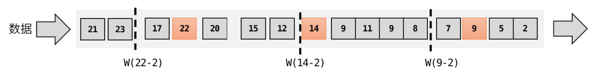
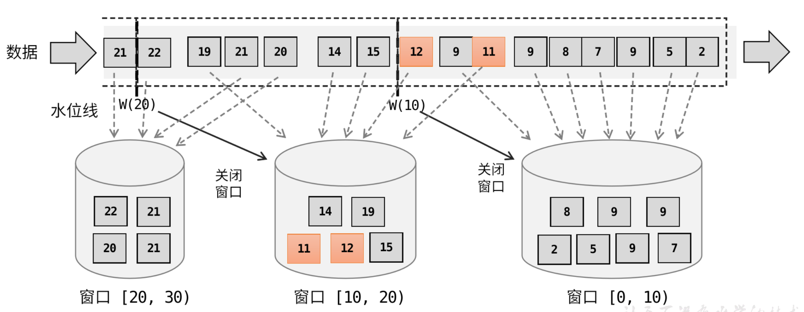

# overview


<!-- @import "[TOC]" {cmd="toc" depthFrom=1 depthTo=6 orderedList=false} -->

<!-- code_chunk_output -->

- [overview](#overview)
    - [使用](#使用)
      - [1.基本使用](#1基本使用)
        - [(1) 常用stream](#1-常用stream)
        - [(2) event time 和 processing time](#2-event-time-和-processing-time)
      - [2.source和sink算子](#2source和sink算子)
        - [(1) 文件](#1-文件)
        - [(2) kafka](#2-kafka)
      - [3.常用转换算子](#3常用转换算子)
        - [(1) 基本](#1-基本)
        - [(2) 分组（datastream -> keydstream）](#2-分组datastream---keydstream)
        - [(3) 聚合（keydstream -> datastream）](#3-聚合keydstream---datastream)
        - [(4) Physical Partitioning (datastream -> datastream)](#4-physical-partitioning-datastream---datastream)
      - [4.分流和合流](#4分流和合流)
        - [(1) 分流](#1-分流)
        - [(2) 合流](#2-合流)
      - [5.window](#5window)
        - [(1) 窗口有两个维度: time 和 count](#1-窗口有两个维度-time-和-count)
        - [(2) tumbling windows](#2-tumbling-windows)
        - [(3) sliding windows](#3-sliding-windows)
        - [(4) session windows](#4-session-windows)
        - [(5) global windows](#5-global-windows)
        - [(6) triger (触发器) 和 evictor (移除器)](#6-triger-触发器-和-evictor-移除器)
      - [6.window使用](#6window使用)
        - [(1) non-keyed windows](#1-non-keyed-windows)
        - [(2) keyd windows](#2-keyd-windows)
        - [(3) window finction](#3-window-finction)
      - [7.watermark](#7watermark)
        - [(1) 水位线的设置](#1-水位线的设置)
        - [(2) 水位线和窗口](#2-水位线和窗口)
        - [(3) 水位线的传递](#3-水位线的传递)
      - [8.watermark和window的使用](#8watermark和window的使用)
        - [(1) 内置水位线策略](#1-内置水位线策略)
        - [(2) 自定义水位线策略](#2-自定义水位线策略)
        - [(3) 可以在获取数据生成水位线](#3-可以在获取数据生成水位线)
        - [(4) 设置空闲等待时间](#4-设置空闲等待时间)
        - [(5) 窗口延迟关闭（处理迟到数据）](#5-窗口延迟关闭处理迟到数据)
        - [(6) 窗口关闭后处理迟到数据（放入侧输出流）](#6-窗口关闭后处理迟到数据放入侧输出流)
      - [9.数据关联: join](#9数据关联-join)
        - [(1) windows join](#1-windows-join)
        - [(2) interval join](#2-interval-join)
      - [10.process function](#10process-function)

<!-- /code_chunk_output -->

```shell
pip install apache-flink==1.18.0
```

### 使用

#### 1.基本使用

* `a.txt`
```txt
hello flink
hello spark
hello hive
```

```python
from pyflink.common import Types
from pyflink.datastream import StreamExecutionEnvironment
from pyflink.common import Configuration

def split_words(x):
    result = []
    for i in x.split():
        result.append((i,1))
    return result

#配置
conf = Configuration().set_string(key="rest.port", value="8081")

# 创建执行环境
env = StreamExecutionEnvironment.get_execution_environment(conf)

# 读取数据
ds = env.read_text_file("a.txt")
# socketTextStream 从socket读取数据，pyflink不支持
# ds = env.socketTextStream('localhost', 9999)

# 所有的结果返回都是列表
# output_type说明列表中每个元素的类型
# 使用索引为0的元素进行分组，求索引为1的元素的和
ds = ds.flat_map(split_words, output_type=Types.TUPLE([Types.STRING(),Types.INT()]))\
    .key_by(lambda x: x[0], key_type=Types.STRING())\
    .sum(1)

ds.print()

# 开始读取数据
env.execute("test_app")

'''
结果：由于是流处理，所以每一行是一个输入，有一个输入计算一次，每次计算都保留结果（所以是有状态的）
2> (spark,1)
5> (flink,1)
4> (hello,1)
4> (hello,2)
4> (hello,3)
10> (hive,1)
'''
```

* [配置](../../../configuration.md)
```python
conf = Configuration().set_string(key="rest.port", value="8081")
env = StreamExecutionEnvironment.get_execution_environment(conf)
env.set_runtime_mode(RuntimeExecutionMode(1))
env.get_config().set_auto_watermark_interval(20)
```

##### (1) 常用stream
* datastream
    * 一个datastream中的元素类型必须一样
* keyedstream
    * 经过keyby的stream

##### (2) event time 和 processing time


* event time
    * 数据产生的时间（即数据本身携带的时间戳）
* processing time
    * 数据被处理的时间

#### 2.source和sink算子

用于数据的读取和写入，[参考](https://nightlies.apache.org/flink/flink-docs-release-1.18/docs/connectors/datastream/overview/)

##### (1) 文件

* source

```python
from pyflink.datastream.connectors.file_system import FileSource, StreamFormat

source = FileSource.for_record_stream_format(StreamFormat.text_line_format(),"a.txt").build()
ds = env.from_source(source, WatermarkStrategy.no_watermarks(), "file Source")
```

* sink
```python
data_stream = ...

sink = FileSink \
    .for_row_format(OUTPUT_PATH, Encoder.simple_string_encoder("UTF-8")) \
    .with_rolling_policy(RollingPolicy.default_rolling_policy(
        part_size=1024 ** 3, rollover_interval=15 * 60 * 1000, inactivity_interval=5 * 60 * 1000)) \
    .build()

data_stream.sink_to(sink)
```

##### (2) kafka
* 需要下载依赖的jar，然后加载该jar包，[参考](https://nightlies.apache.org/flink/flink-docs-release-1.18/docs/connectors/datastream/kafka/)
    * 直接加载（建议）
    ```shell
    cp /home/liamlea/Downloads/flink-sql-connector-kafka-3.0.2-1.18.jar ~/miniconda3/envs/flink/lib/python3.9/site-packages/pyflink/lib/
    ```
    * 在代码中加载
    ```python
    env.add_jars("file:///home/liamlea/Downloads/flink-sql-connector-kafka-3.0.2-1.18.jar")
    ```

* source
```python
env = StreamExecutionEnvironment.get_execution_environment()

#set_value_only_deserializer，反序列化器，kafka中存储的数据是kv类型的，这个反序列化器表示只取value
source = KafkaSource.builder() \
    .set_bootstrap_servers("10.10.10.163:19092") \
    .set_topics("flink-test_topic") \
    .set_group_id("my-group-1") \
    .set_starting_offsets(KafkaOffsetsInitializer.committed_offsets(KafkaOffsetResetStrategy.LATEST)) \
    .set_value_only_deserializer(SimpleStringSchema()) \
    .build()

ds = env.from_source(source, WatermarkStrategy.no_watermarks(), "Kafka Source")
```

#### 3.常用转换算子

[所有算子](https://nightlies.apache.org/flink/flink-docs-release-1.18/docs/dev/datastream/operators/overview/)

##### (1) 基本
* map
* filter
    * 对元素进行判断，true则保留
* flat_map
    * 一个输入，返回多个输出

##### (2) 分组（datastream -> keydstream）
* key_by

##### (3) 聚合（keydstream -> datastream）
* sum
* min
* max
* minby
    * 返回包含字段最小值的整条数据
* maxby
* reduce
* [用户自定义函数](https://nightlies.apache.org/flink/flink-docs-release-1.18/docs/dev/datastream/user_defined_functions/)（pyflink不支持）

##### (4) Physical Partitioning (datastream -> datastream)
一个并行度（即子任务）就是一个分区
* shuffle
* rebalance
* rescale
    * 局部轮询
* broadcast
    * 每个分区（即子任务）都会收到一份数据
* partitionCustom
    * 自定义分区

#### 4.分流和合流

##### (1) 分流
[参考](https://nightlies.apache.org/flink/flink-docs-release-1.18/docs/dev/datastream/side_output/)

对数据进行分流，则能够实现不同的流，进行不同的处理
* 本质就是对数据进行打标，然后根据标签做不同的处理

* 分流
```python
input = ...  # type: DataStream
output_tag = OutputTag("side-output", Types.STRING())

class MyProcessFunction(ProcessFunction):

    def process_element(self, value: int, ctx: ProcessFunction.Context):
        # 设置判断条件，进行打标
        
        # emit data to regular output
        yield value

        # emit data to side output
        yield output_tag, "sideout-" + str(value)


main_data_stream = input \
    .process(MyProcessFunction(), Types.INT())
```

* 获取指定的流
```python
output_tag = OutputTag("side-output", Types.STRING())

main_data_stream = ...  # type: DataStream

side_output_stream = main_data_stream.get_side_output(output_tag)  # type: DataStream
```

##### (2) 合流

* union
    * 多条stream的数据类型要一致
    * DataStream* → DataStream

* connect
    * 两个stream的数据类型可以不一样，返回连接流
    * DataStream,DataStream → ConnectedStream
    * 对应使用的算子也不一样，但是输出的类型要一样
        * 比如: map算子，要实现两个map
            * 对第一个stream，使用map1，对第二个stream，使用map2
            * map1和map2的输出类型要一样

#### 5.window

用于框定一定范围内的数据，然后进行分析等

##### (1) 窗口有两个维度: time 和 count

##### (2) tumbling windows
* 窗口之间没有重叠，也没有间隔


##### (3) sliding windows
* window slide（滑动步长）
    * 注意：窗口包含的内容是向**过去的内容**（而不是未来的）
    * 比如size=10s, slide=5s
        * 当14:20，则此时会开启一个新的窗口，旧的窗口会关闭（14:10 - 14:20）
        * 当14:25，则此时会开启一个新的窗口，旧的窗口会关闭（14:15 - 14:25）


##### (4) session windows
* 只有时间维度
* 如果相邻两个数据的时间间隔（gap）< **会话超时时间**（可以根据获取的数据进行动态调整），则说明还在保持会话
* 一个会话就是一个窗口（会话的时长就是窗口的大小）


##### (5) global windows
相同的key的数据放到同一个global window中，只有在窗口结束或手动触发时，才会进行计算

##### (6) triger (触发器) 和 evictor (移除器)
* 会根据不同的事件，触发相应的动作
    * 比如 OnProcessingTime事件，当处理的时间戳 > 窗口的最大时间戳时，会产生这个事件

#### 6.window使用

##### (1) non-keyed windows
所有的数据都在一个子任务内（即并行度为1）

```python
stream
       .window_all(...)             <-  required: "assigner"
      [.trigger(...)]               <-  optional: "trigger" (else default trigger)
      [.allowed_lateness(...)]      <-  optional: "lateness" (else zero)
      [.side_output_late_data(...)] <-  optional: "output tag" (else no side output for late data)
       .reduce/aggregate/apply()    <-  required: "function"
      [.get_side_output(...)]       <-  optional: "output tag"
```

##### (2) keyd windows
每个key都有一个子任务进行处理
```python
stream
       .key_by(...)
       .window(...)                 <-  required: "assigner"
      [.trigger(...)]               <-  optional: "trigger" (else default trigger)
      [.allowed_lateness(...)]      <-  optional: "lateness" (else zero)
      [.side_output_late_data(...)] <-  optional: "output tag" (else no side output for late data)
       .reduce/aggregate/apply()    <-  required: "function"（可以多种window functions结合使用）
      [.get_side_output(...)]       <-  optional: "output tag"
```

* demo
```python
from pyflink.datastream.window import TumblingProcessingTimeWindows,CountTumblingWindowAssigner

#ds.window(CountTumblingWindowAssigner)
ds.window(TumblingProcessingTimeWindows)
```

##### (3) window finction

* ReduceFunction
    * 来一条数据，进行一次计算
    * 输入的两个参数、输出的参数类型都必须一样
    ```python
    input = ...  # type: DataStream

    input \
        .key_by(<key selector>) \
        .window(<window assigner>) \
        .reduce(lambda v1, v2: (v1[0], v1[1] + v2[1]),
                output_type=Types.TUPLE([Types.STRING(), Types.LONG()]))
    ```
* AggregateFunction
    * 来一条数据，进行一次计算
    * 参数类型都可以不一样（也就是reduce的通用版本）
    ```python
    class AverageAggregate(AggregateFunction):
    
        #初始化聚合器: 这里设置了一个(0,0)的元组
        def create_accumulator(self) -> Tuple[int, int]:
            return 0, 0

        #聚合的逻辑，指定输入的类型、存储的中间结果类型、返回值的类型
        def add(self, value: Tuple[str, int], accumulator: Tuple[int, int]) -> Tuple[int, int]:
            return accumulator[0] + value[1], accumulator[1] + 1

        #获取聚合的结果
        def get_result(self, accumulator: Tuple[int, int]) -> float:
            return accumulator[0] / accumulator[1]

        #会话窗口才会用到这个方法
        def merge(self, a: Tuple[int, int], b: Tuple[int, int]) -> Tuple[int, int]:
            return a[0] + b[0], a[1] + b[1]

    input = ...  # type: DataStream

    input \
        .key_by(<key selector>) \
        .window(<window assigner>) \
        .aggregate(AverageAggregate(),
                accumulator_type=Types.TUPLE([Types.LONG(), Types.LONG()]),
                output_type=Types.DOUBLE())
    ```
* ProcessWindowFunction
    * 来一个数据先存起来，窗口触发时，统一进行计算
    ```python
    class MyProcessWindowFunction(ProcessWindowFunction):
        #key是用于分组的key
        #context是处理的上下文（能够获取更多信息）
        #elements是这个窗口内的所有数据
        def process(self, key: str, context: ProcessWindowFunction.Context,
                    elements: Iterable[Tuple[str, int]]) -> Iterable[str]:
            count = 0
            for _ in elements:
                count += 1
            yield "Window: {} count: {}".format(context.window(), count)

    input = ...  # type: DataStream

    input \
        .key_by(lambda v: v[0]) \
        .window(TumblingEventTimeWindows.of(Time.minutes(5))) \
        .process(MyProcessWindowFunction())
    ```

#### 7.watermark


是**一个算子**（即任务）**属性**，用于描述**事件时间进展**，所有每个算子都有自己的水位线
* 比如当水位线为`2020-12-22 12:10:10.30`，表示对于该算子，这个时间点**之前**产生的数据都已经**到达**


##### (1) 水位线的设置

* 需要考虑 乱序、延迟等问题
* 比如选择其中最大的时间戳，然后再减去2s，作为水位线


* 如果要保证绝对正确，就必须等足够长的时间
* 如果要处理更快，水位线延迟就不能太长

##### (2) 水位线和窗口

* 注意水位线的生成**跟窗口没有关系**，默认是（20ms）生成一次水位线



##### (3) 水位线的传递
* 水位线 本质就是**数据**（跟普通的数据流一样），会传递下
    * 跟普通数据不一样，水位线数据不会触发相应的计算动作，而是**更新算子的水位线**
* 算子的水位线会**广播**给其所有下游的算子
* 有**多个并行度**时，使用**最小**的水位线
    * 如果上游的某一个并行度长时间没有数据过来，会导致水位线一直使用的那个最小值
        * 设置**空闲等待时间**


#### 8.watermark和window的使用

* 设置水位线的生成时间（默认为20ms），不建议修改
```python
env.get_config().set_auto_watermark_interval(20)
```

##### (1) 内置水位线策略

* 创建水位线策略

```python
class FirstElementTimestampAssigner(TimestampAssigner):
    #设置提取时间戳的方法
    def extract_timestamp(self, value, record_timestamp):
        return value[0]

# for_bounded_out_of_orderness 无序数据流（延迟设置为20s）（这里的延迟是为了处理乱序数据）
WatermarkStrategy \
    .for_bounded_out_of_orderness(Duration.of_seconds(20)) \
    .with_timestamp_assigner(FirstElementTimestampAssigner())
```

* 使用事件时间窗口（之前都是使用的处理时间窗口）
```python
ds.assign_timestamp_and_watermarks(<watermark strategy>)\
.window(TumblingEventTimeWindows)
```

##### (2) 自定义水位线策略
* python不支持
```java
@Public
public interface WatermarkGenerator<T> {

    // 每当有数据来，进行的动作
    void onEvent(T event, long eventTimestamp, WatermarkOutput output);

    // 水位线生成周期到了（默认为20ms），进行的动作
    void onPeriodicEmit(WatermarkOutput output);
}
```

##### (3) 可以在获取数据生成水位线
```python
stream = env.from_source(
    source=kafka_source,
    watermark_strategy=WatermarkStrategy.for_bounded_out_of_orderness(Duration.of_seconds(20)),
    source_name="kafka_source")
```

##### (4) 设置空闲等待时间
```python
WatermarkStrategy \
    .for_bounded_out_of_orderness(Duration.of_seconds(20)) \
    .with_idleness(Duration.of_minutes(1))
```

##### (5) 窗口延迟关闭（处理迟到数据）
* 正常情况下，水位线到达了窗口的时间，会触发窗口的关闭
    * 如果有一个属于该窗口的值到达，会直接忽略
* 设置延迟后，水位线到达了窗口的时间，会触发输出，但不会关闭窗口
    * 在这期间，有这个窗口的值，会放入窗口进行计算
    * 当水位线到了 窗口的时间+延迟的时间，才会关闭窗口
```python
input = ...  # type: DataStream
input \
    .key_by(<key selector>) \
    .window(<window assigner>) \
    .allowed_lateness(<time>) \
    .<windowed transformation>(<window function>)
```

##### (6) 窗口关闭后处理迟到数据（放入侧输出流）
```python
late_output_tag = OutputTag("late-data", type_info)

input = ...  # type: DataStream

result = input \
    .key_by(<key selector>) \
    .window(<window assigner>) \
    .allowed_lateness(<time>) \
    .side_output_late_data(late_output_tag) \
    .<windowed transformation>(<window function>)

late_stream = result.get_side_output(late_output_tag)
```

#### 9.数据关联: join

输出的流是关联成功的数据

##### (1) windows join
* 基于时间窗口进行join
```java
stream.join(otherStream)
    .where(<KeySelector>)
    .equalTo(<KeySelector>)
    .window(<WindowAssigner>)
    .apply(<JoinFunction>);
```

##### (2) interval join
* 基于指定时间间隔进join
* 只支持事件时间


```java
import org.apache.flink.api.java.functions.KeySelector;
import org.apache.flink.streaming.api.functions.co.ProcessJoinFunction;
import org.apache.flink.streaming.api.windowing.time.Time;

...

DataStream<Integer> orangeStream = ...;
DataStream<Integer> greenStream = ...;

orangeStream
    .keyBy(<KeySelector>)
    .intervalJoin(greenStream.keyBy(<KeySelector>))
    .between(Time.milliseconds(-2), Time.milliseconds(1))
    .process (new ProcessJoinFunction<Integer, Integer, String>(){

        @Override
        public void processElement(Integer left, Integer right, Context ctx, Collector<String> out) {
            out.collect(left + "," + right);
        }
    });
```

#### 10.process function

* 所有算子是基于process实现的
* 可以使用数据的上下文（比如时间戳等）
* 不同的流有相应的processfunction

* KeyedProcessFunction
    * 相同key设置的触发器会进行去重
```python
import datetime
from pyflink.common import Row, WatermarkStrategy
from pyflink.common.typeinfo import Types
from pyflink.common.watermark_strategy import TimestampAssigner
from pyflink.datastream import StreamExecutionEnvironment
from pyflink.datastream.functions import KeyedProcessFunction, RuntimeContext
from pyflink.datastream.state import ValueStateDescriptor
from pyflink.table import StreamTableEnvironment


#自定义一个KeyedProcessFunction
class CountWithTimeoutFunction(KeyedProcessFunction):

    def __init__(self):
        self.state = None

    def open(self, runtime_context: RuntimeContext):
        self.state = runtime_context.get_state(ValueStateDescriptor(
            "my_state", Types.PICKLED_BYTE_ARRAY()))

    #每收到一个数据触发一次这个动作
    def process_element(self, value, ctx: 'KeyedProcessFunction.Context'):
        # retrieve the current count
        current = self.state.value()
        if current is None:
            current = Row(value.f1, 0, 0)

        # update the state's count
        current[1] += 1

        # set the state's timestamp to the record's assigned event time timestamp
        current[2] = ctx.timestamp()

        # write the state back
        self.state.update(current)

        # 注册一个 eventtime 定时器
        ctx.timer_service().register_event_time_timer(current[2] + 60000)

    #定时器触发的动作
    def on_timer(self, timestamp: int, ctx: 'KeyedProcessFunction.OnTimerContext'):
        # get the state for the key that scheduled the timer
        result = self.state.value()

        # check if this is an outdated timer or the latest timer
        if timestamp == result[2] + 60000:
            # emit the state on timeout
            yield result[0], result[1]


class MyTimestampAssigner(TimestampAssigner):

    def __init__(self):
        self.epoch = datetime.datetime.utcfromtimestamp(0)

    def extract_timestamp(self, value, record_timestamp) -> int:
        return int((value[0] - self.epoch).total_seconds() * 1000)


if __name__ == '__main__':
    env = StreamExecutionEnvironment.get_execution_environment()
    t_env = StreamTableEnvironment.create(stream_execution_environment=env)

    t_env.execute_sql("""
            CREATE TABLE my_source (
              a TIMESTAMP(3),
              b VARCHAR,
              c VARCHAR
            ) WITH (
              'connector' = 'datagen',
              'rows-per-second' = '10'
            )
        """)

    stream = t_env.to_append_stream(
        t_env.from_path('my_source'),
        Types.ROW([Types.SQL_TIMESTAMP(), Types.STRING(), Types.STRING()]))
    watermarked_stream = stream.assign_timestamps_and_watermarks(
        WatermarkStrategy.for_monotonous_timestamps()
                         .with_timestamp_assigner(MyTimestampAssigner()))

    # apply the process function onto a keyed stream
    result = watermarked_stream.key_by(lambda value: value[1]) \
                               .process(CountWithTimeoutFunction()) \
                               .print()
    env.execute()
```