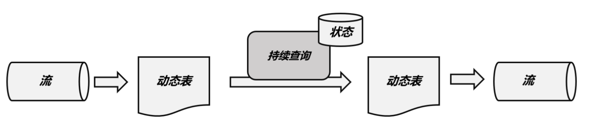

# overview


<!-- @import "[TOC]" {cmd="toc" depthFrom=1 depthTo=6 orderedList=false} -->

<!-- code_chunk_output -->

- [overview](#overview)
    - [概述](#概述)
      - [1.基本概念](#1基本概念)
        - [(1) dynamic tables](#1-dynamic-tables)
        - [(2) continuous query](#2-continuous-query)
      - [2.持续查询的流程](#2持续查询的流程)
        - [(1) stream -> dynamic tables](#1-stream---dynamic-tables)
        - [(2) continuous query](#2-continuous-query-1)
        - [(3) dynamic tables -> stream](#3-dynamic-tables---stream)
      - [3.时间属性](#3时间属性)
        - [(1) 事件时间](#1-事件时间)
        - [(2) 事件时间](#2-事件时间)
    - [使用](#使用)
      - [1.基本使用](#1基本使用)
        - [(1) stream和table相互转换](#1-stream和table相互转换)
      - [2.自定义函数](#2自定义函数)

<!-- /code_chunk_output -->


### 概述

#### 1.基本概念

##### (1) dynamic tables
表中的数据动态变换，则称为动态表

##### (2) continuous query
对动态表进行查询，查询结果也会动态变化，这就是持续查询

#### 2.持续查询的流程


##### (1) stream -> dynamic tables


##### (2) continuous query
* 更新操作


* 追加操作


##### (3) dynamic tables -> stream

* appen-only stream
    * 动态表仅通过 INSERT 修改，新增的一行，就会放入流中

* retract stream
    * 动态表之前的数据可能发生变化
    * 有两类stream消息: add和restract
        * retract: 通过将减去的值放入流中，从而进行抵消
    * SQL操作和stream流对应关系
        * INSERT -- add消息
        * DELETE -- retract消息
        * UPDATE -- 先retract再add

    

* upsert stream
    * 有两类stream消息: upsert和delete
        * upsert: update 和 insert
    * SQL操作和stream流对应关系
        * INSERT、UPDATE -- upsert消息
            * 更新数据时，会撤销之前的upsert，即在流中放入一个-U 消息
        * DELETE -- delete消息
    
    

#### 3.时间属性

##### (1) 事件时间
* 在表中添加一个TIMESTAMP类型的字段: `ts TIMESTAMP(3)`

##### (2) 事件时间
* 调用系统当前时间: `ts AS PROCTIME()`

*** 

### 使用

#### 1.基本使用
```python
from pyflink.table import *

from pyflink.datastream import StreamExecutionEnvironment
from pyflink.table import StreamTableEnvironment

s_env = StreamExecutionEnvironment.get_execution_environment()
table_env = StreamTableEnvironment.create(s_env)

# Create a source table
table_env.executeSql("""CREATE TEMPORARY TABLE SourceTable (
  f0 STRING
) WITH (
  'connector' = 'datagen',
  'rows-per-second' = '100'
)
""")

# Create a sink table
table_env.executeSql("CREATE TEMPORARY TABLE SinkTable WITH ('connector' = 'blackhole') LIKE SourceTable (EXCLUDING OPTIONS) ")

# Create a Table from a Table API query
table1 = table_env.from_path("SourceTable").select(...)

# Create a Table from a SQL query
table2 = table_env.sql_query("SELECT ... FROM SourceTable ...")

# Emit a Table API result Table to a TableSink, same for SQL result
table_result = table1.execute_insert("SinkTable")
```


##### (1) stream和table相互转换
```python
from pyflink.datastream import StreamExecutionEnvironment
from pyflink.table import StreamTableEnvironment
from pyflink.common.typeinfo import Types

env = StreamExecutionEnvironment.get_execution_environment()
t_env = StreamTableEnvironment.create(env)

# create a DataStream
ds = env.from_collection(["Alice", "Bob", "John"], Types.STRING())

# interpret the insert-only DataStream as a Table
t = t_env.from_data_stream(ds)

# register the Table object as a view and query it
t_env.create_temporary_view("InputTable", t)
res_table = t_env.sql_query("SELECT UPPER(f0) FROM InputTable")

# interpret the insert-only Table as a DataStream again
res_ds = t_env.to_data_stream(res_table)

# add a printing sink and execute in DataStream API
res_ds.print()

env.execute()
```

* table进行了更新
    * 使用to_changelog_stream
```python
from pyflink.datastream import StreamExecutionEnvironment
from pyflink.table import StreamTableEnvironment
from pyflink.common.typeinfo import Types

# create environments of both APIs
env = StreamExecutionEnvironment.get_execution_environment()
t_env = StreamTableEnvironment.create(env)

# create a DataStream
ds = env.from_collection([("Alice", 12), ("Bob", 10), ("Alice", 100)],
                          type_info=Types.ROW_NAMED(
                          ["a", "b"],
                          [Types.STRING(), Types.INT()]))

input_table = t_env.from_data_stream(ds).alias("name", "score")

# register the Table object as a view and query it
# the query contains an aggregation that produces updates
t_env.create_temporary_view("InputTable", input_table)
res_table = t_env.sql_query("SELECT name, SUM(score) FROM InputTable GROUP BY name")

# interpret the updating Table as a changelog DataStream
res_stream = t_env.to_changelog_stream(res_table)

# add a printing sink and execute in DataStream API
res_stream.print()
env.execute()
```

#### 2.自定义函数
[参考](https://nightlies.apache.org/flink/flink-docs-release-1.18/docs/dev/table/functions/udfs/)，python不支持