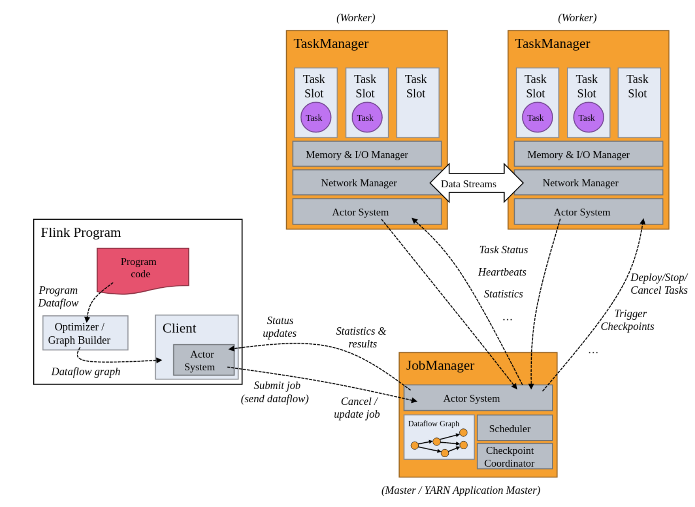
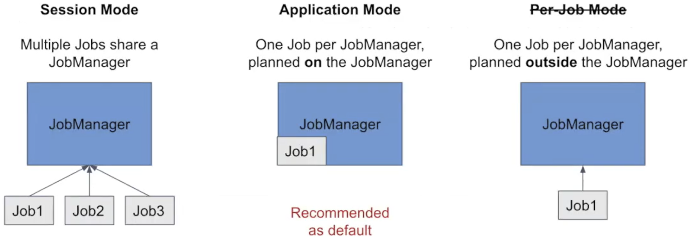
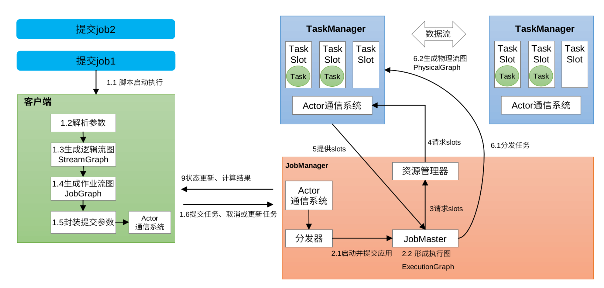
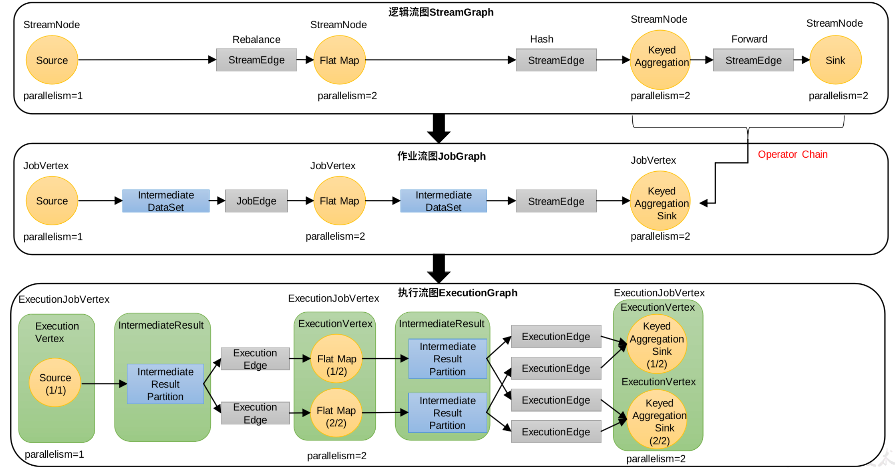
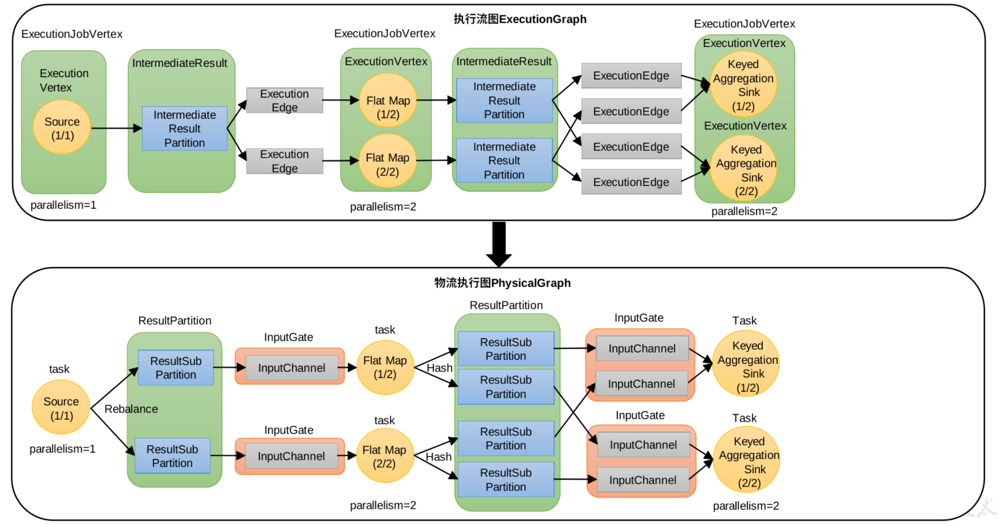

# flink

<!-- @import "[TOC]" {cmd="toc" depthFrom=1 depthTo=6 orderedList=false} -->

<!-- code_chunk_output -->

- [flink](#flink)
    - [概述](#概述)
      - [1.flink](#1flink)
        - [(1) 特点](#1-特点)
      - [2.flink vs sparkstreaming](#2flink-vs-sparkstreaming)
      - [3.architecture](#3architecture)
      - [4.部署模式](#4部署模式)
        - [(1) session mode](#1-session-mode)
        - [(2) per-job mode（淘汰）](#2-per-job-mode淘汰)
        - [(3) application mode（建议）](#3-application-mode建议)
      - [5.job提交流程（以standalone session为例）](#5job提交流程以standalone-session为例)
      - [6.operator chain (算子链)](#6operator-chain-算子链)
        - [(1) one-to-one (类似于窄依赖)](#1-one-to-one-类似于窄依赖)
        - [(2) redistributing (类似于宽依赖)](#2-redistributing-类似于宽依赖)
        - [(3) 合并算子链 (类似于stage)](#3-合并算子链-类似于stage)
      - [7.parallelism并行度](#7parallelism并行度)
      - [8.task slots (任务槽)](#8task-slots-任务槽)
        - [(1) slot数量](#1-slot数量)
        - [(2) slot共享](#2-slot共享)
      - [9.parallelism 和 task slots的关系](#9parallelism-和-task-slots的关系)
        - [(1) yarn动态申请](#1-yarn动态申请)

<!-- /code_chunk_output -->

### 概述

#### 1.flink

**数据流** 上的 **有状态** 计算

* 会存储状态信息
    * 比如没来一个数据计算一次，会保存这个计算结果，以便后续的计算

##### (1) 特点

* 高吞吐和低延迟
* 结果的准确性
    * 提供了event time 和 processing time
* exactly once
* 良好的容错性

#### 2.flink vs sparkstreaming

||Flink|Sparkstreaming|
|-|-|-|
|计算模型|流计算|微批处理（比如3s一个批次）（可以处理流数据）|
|时间语义|事件时间、处理时间|处理时间|
|窗口|多、灵活|少、不灵活（窗口必须是批次的整数）|
|状态|有|无|
|流式SQL|有|无|

#### 3.architecture

#### 4.部署模式

##### (1) session mode
先启动flink集群，然后在客户端运行main方法，将flink jobs提交到该集群执行

##### (2) per-job mode（淘汰）
在客户端运行main方法（可能包含多个jobs），一个flink job启动一个集群进行执行
只有如下部署方式支持: yarn、k8s
* 缺点:
    * 需要在client端下载依赖，然后传到集群（application mode解决了这种缺陷）

##### (3) application mode（建议）
一个application一个集群，在集群中运行main方法 和 该main方法中的所有jobs

#### 5.job提交流程（以standalone session为例）

* StreamGraph -> JobGraph -> ExecutionGraph

* ExecutionGraph -> PhysicalGraph

#### 6.operator chain (算子链)

##### (1) one-to-one (类似于窄依赖)

##### (2) redistributing (类似于宽依赖)

##### (3) 合并算子链 (类似于stage)
当相邻的算子的都是 one-to-one 并且 并行度相同，可以合并为一个task
* 默认会进行合并，也可以设置不进行合并

* 什么情况下不合并
    * 当其中的算子计算量都比较大时，建议分开

#### 7.parallelism并行度

* 一个特定算子的子任务数，称为该算子的并行度
* 一个job的并行度，就是所有算子中最大的并行度

#### 8.task slots (任务槽)

在一个**TaskManager**中，有多少个task slots就会把**内存**分成多少份，task会寻找空闲的slot，来执行任务，**一个task不能使用多个slot**

##### (1) slot数量
建议设为CPU的核心数

##### (2) slot共享
在**同一个共享组**（默认为default共享组）中的 **不同任务**（即算子）的子任务（即task）可以**同时**使用同一个slot

#### 9.parallelism 和 task slots的关系

* task slots是一个TaskManager的并发执行能力
* parallelism是实际的并发数
    * 当**parallelism > task slots * TaskManager数量** 时，任务就会调度失败

##### (1) yarn动态申请

yarn的taskmanager数量是动态申请的 = job并行度 / 每个TM的slots数量