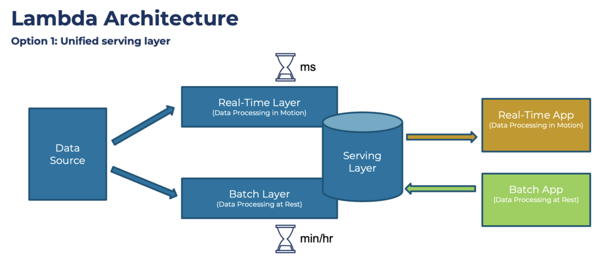
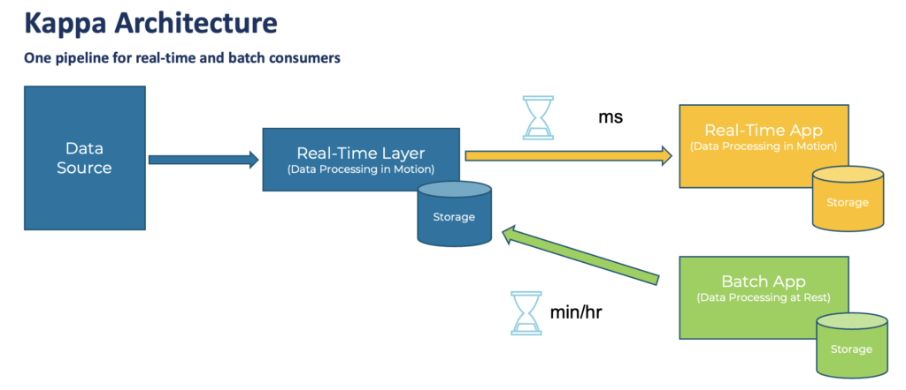
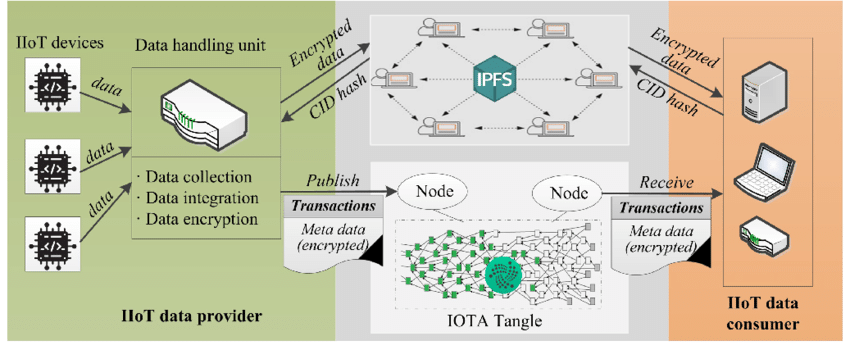

# overview

<!-- @import "[TOC]" {cmd="toc" depthFrom=1 depthTo=6 orderedList=false} -->

<!-- code_chunk_output -->

- [overview](#overview)
    - [概述](#概述)
      - [1.data lake](#1data-lake)
      - [2.写时模式和读时模式](#2写时模式和读时模式)
      - [3.常见的数据湖实现方案](#3常见的数据湖实现方案)
        - [(1) 基于hadoop生态](#1-基于hadoop生态)
        - [(2) 基于云平台](#2-基于云平台)
        - [(3) 基于商业产品](#3-基于商业产品)
      - [4.数据处理架构](#4数据处理架构)
        - [(1) Lambda架构](#1-lambda架构)
        - [(2) Kapa架构](#2-kapa架构)
        - [(3) IOTA架构](#3-iota架构)

<!-- /code_chunk_output -->

### 概述

#### 1.data lake

是一种 支持任意数据格式、并保留原始数据内容的 大规模存储**系统架构**，并且支持海量数据的分析处理

* 集中存储
    * 保留原始数据格式
    * 支持任意格式
* 支持海量数据分析

#### 2.写时模式和读时模式

* 写时模式
    * 数据写入前，就定义好schema，关系数据库等都是

* 读时模式
    * 数据读取前，才定义schema，数据湖就是读时模式

#### 3.常见的数据湖实现方案

##### (1) 基于hadoop生态

* HDFS作为存储层
* Spark、Flink等作为计算引擎，进行数据处理

##### (2) 基于云平台

##### (3) 基于商业产品

#### 4.数据处理架构

##### (1) Lambda架构

* 说明
    * batch layer
        * 批处理，比如一个小时处理一次
    * speed layer
        * 实时处理，比如现在5:40，5:00的时候做了一次批处理，5:00到现在进行的是实时处理
    * serving layer
        * 整合两部分处理，供用户查询

* 问题
    * 批处理和流处理，需要各自维护代码
    * 复杂
    * 容易造成数据丢失

##### (2) Kapa架构

* 说明
    * 批处理和流处理使用同一个技术栈

* 问题
    * 历史数据处理能力有限
    * join更加复杂
    * 乱序问题

##### (3) IOTA架构

* 适合IOT和边缘云场景