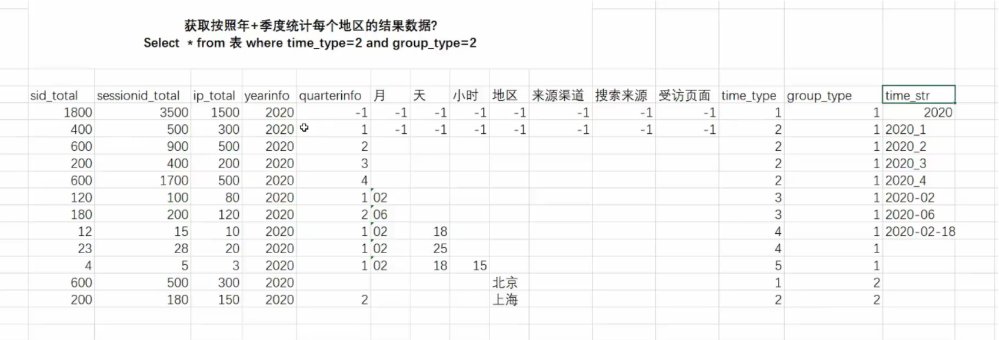
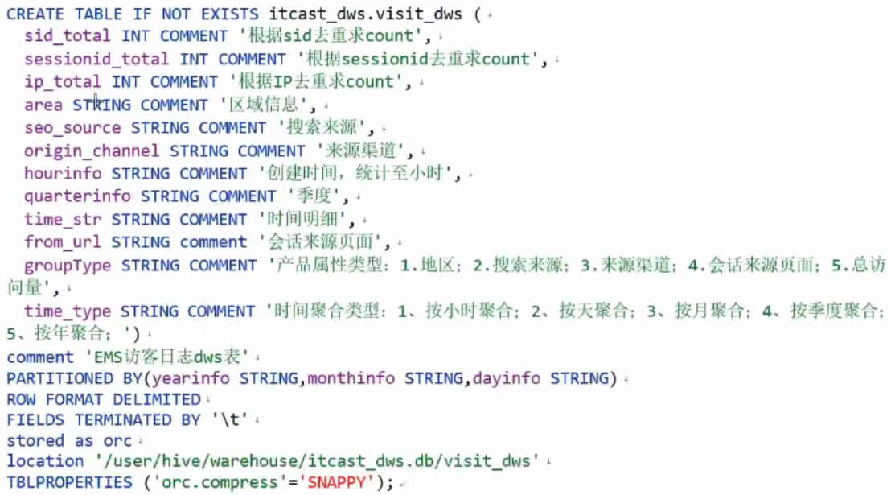

# demos


<!-- @import "[TOC]" {cmd="toc" depthFrom=1 depthTo=6 orderedList=false} -->

<!-- code_chunk_output -->

- [demos](#demos)
    - [访问咨询主题看板](#访问咨询主题看板)
      - [1.建模分析](#1建模分析)
        - [(1) ODS](#1-ods)
        - [(2) DIM](#2-dim)
        - [(3) DW](#3-dw)
        - [(4) ADS](#4-ads)
      - [2.建模准备](#2建模准备)
        - [(1) 数据存储格式和压缩方案](#1-数据存储格式和压缩方案)
        - [(2) 全量和增量](#2-全量和增量)
        - [(3) hive分区](#3-hive分区)
        - [(4) 内部表和外部表](#4-内部表和外部表)
      - [3.建模操作](#3建模操作)
        - [(1) ODS](#1-ods-1)
        - [(2) DWD](#2-dwd)
        - [(3) DWS](#3-dws)
        - [(4) ADS](#4-ads-1)
      - [4.数据处理分析](#4数据处理分析)
        - [(1) ODS: 数据导入](#1-ods-数据导入)
        - [(2) DWD](#2-dwd-1)
        - [(3) DWS](#3-dws-1)
        - [(4) ADS: 数据导出](#4-ads-数据导出)
      - [5.增量数据处理](#5增量数据处理)
        - [(1) ODS: 导入增量数据](#1-ods-导入增量数据)
        - [(2) DWD: 对增量数据进行清洗](#2-dwd-对增量数据进行清洗)
        - [(3) DWS](#3-dws-2)
    - [意向用户主题看板](#意向用户主题看板)
      - [1.建模分析](#1建模分析-1)
        - [(1) ODS](#1-ods-2)
        - [(2) DIM](#2-dim-1)
        - [(3) DW](#3-dw-1)
        - [(4) ADS](#4-ads-2)
      - [2.建模操作](#2建模操作)
        - [(1) ODS](#1-ods-3)
        - [(2) DIM](#2-dim-2)
        - [(3) DWD](#3-dwd)
        - [(4) DWM](#4-dwm)
        - [(5) DWS](#5-dws)
      - [3.数据处理分析](#3数据处理分析)
        - [(1) ODS: 数据导入](#1-ods-数据导入-1)
        - [(2) DWD](#2-dwd-2)
        - [(3) DWM](#3-dwm)
        - [(4) DWS](#4-dws)
      - [4.增量数据处理 (拉链表)](#4增量数据处理-拉链表)

<!-- /code_chunk_output -->


### 访问咨询主题看板

需要统计的指标: 访问量和咨询量

#### 1.建模分析

##### (1) ODS
* 业务表（即事实表）有几张就在这里建几张表
    * 业务表有哪些字段，这里与之相同
    * 添加一个特殊字段: starts_time (表示导入数据的时间)
* 建表时，按照天进行分区，这样后续可以加入增量数据
* 如果其中的表会存在变更的行为（不是增量数据），采用缓慢渐变维的方式

##### (2) DIM
不需要，当前主题，压根没有维度表

##### (3) DW

* DWD


* DWM
    * 不需要，因为数据有**重复**，这里不能提前聚合
* DWS



##### (4) ADS

#### 2.建模准备

##### (1) 数据存储格式和压缩方案

* 存储格式:
    * 如果数据不是来源于普通文本文件的数据, 一般存储格式选择为列式的ORC存储
    * 如果数据来源于普通文本文件的数据, 一般存储格式选择为行式的textFile格式
* 压缩方案
    * snappy

##### (2) 全量和增量
* 全量统计:  需要面对公司所有的数据进行统计分析, 数据体量一般比较大的
    * 解决方案: 采用分批次执行(比如按年)

* 增量统计:  一般是以T+1模式统计, 当前的数据, 在第二天才会进行统计操作
##### (3) hive分区
* 当查询的时候, 指定分区字段, 可以减少查询表数据扫描量, 从而提升效率

##### (4) 内部表和外部表

判断当前这份数据是否具有绝对的控制权
* 比如ODS层的数据都从外部导入的，可以设成外部表
* 比如DW层的数据都是自己分析出来的，可以设置为内部表

#### 3.建模操作

##### (1) ODS

* 建库
```sql
create database IF NOT EXISTS itcast_ods;
```

* 建表
    * 字段与业务表（存储在mysql中的）的字段一样
```sql
-- 访问咨询表
CREATE EXTERNAL TABLE IF NOT EXISTS itcast_ods.web_chat_ems (
  id INT comment '主键',
  create_date_time STRING comment '数据创建时间',
  session_id STRING comment '七陌sessionId',
  sid STRING comment '访客id',
  create_time STRING comment '会话创建时间',
  seo_source STRING comment '搜索来源',
  seo_keywords STRING comment '关键字',
  ip STRING comment 'IP地址',
  area STRING comment '地域',
  country STRING comment '所在国家',
  province STRING comment '省',
  city STRING comment '城市',
  origin_channel STRING comment '投放渠道',
  user_match STRING comment '所属坐席',
  manual_time STRING comment '人工开始时间',
  begin_time STRING comment '坐席领取时间 ',
  end_time STRING comment '会话结束时间',
  last_customer_msg_time_stamp STRING comment '客户最后一条消息的时间',
  last_agent_msg_time_stamp STRING comment '坐席最后一下回复的时间',
  reply_msg_count INT comment '客服回复消息数',
  msg_count INT comment '客户发送消息数',
  browser_name STRING comment '浏览器名称',
  os_info STRING comment '系统名称')
comment '访问会话信息表'
PARTITIONED BY(starts_time STRING)
ROW FORMAT DELIMITED
FIELDS TERMINATED BY '\t'
stored as orc
location '/user/hive/warehouse/itcast_ods.db/web_chat_ems_ods'
TBLPROPERTIES ('orc.compress'='ZLIB');

-- 访问咨询附属表
CREATE EXTERNAL TABLE IF NOT EXISTS itcast_ods.web_chat_text_ems (
  id INT COMMENT '主键来自MySQL',
  referrer STRING comment '上级来源页面',
  from_url STRING comment '会话来源页面',
  landing_page_url STRING comment '访客着陆页面',
  url_title STRING comment '咨询页面title',
  platform_description STRING comment '客户平台信息',
  other_params STRING comment '扩展字段中数据',
  history STRING comment '历史访问记录'
) comment 'EMS-PV测试表'
PARTITIONED BY(start_time STRING)
ROW FORMAT DELIMITED 
FIELDS TERMINATED BY '\t'
stored as orc
location '/user/hive/warehouse/itcast_ods.db/web_chat_text_ems_ods'
TBLPROPERTIES ('orc.compress'='ZLIB');
```

##### (2) DWD

* 建库
```sql
CREATE DATABASE IF NOT EXISTS `itcast_dwd`;
```

* 建表
```sql
create table if not exists itcast_dwd.visit_consult_dwd(
  session_id STRING comment '七陌sessionId',
  sid STRING comment '访客id',
  create_time bigint comment '会话创建时间',
  seo_source STRING comment '搜索来源',
  ip STRING comment 'IP地址',
  area STRING comment '地域',
  msg_count int comment '客户发送消息数',
  origin_channel STRING COMMENT '来源渠道',
  referrer STRING comment '上级来源页面',
  from_url STRING comment '会话来源页面',
  landing_page_url STRING comment '访客着陆页面',
  url_title STRING comment '咨询页面title',
  platform_description STRING comment '客户平台信息',
  other_params STRING comment '扩展字段中数据',
  history STRING comment '历史访问记录',
  hourinfo string comment '小时'
)
comment '访问咨询DWD表'
partitioned by(yearinfo String,quarterinfo string, monthinfo String, dayinfo string)
row format delimited fields terminated by '\t'
stored as orc
location '/user/hive/warehouse/itcast_dwd.db/visit_consult_dwd'
tblproperties ('orc.compress'='SNAPPY');
```

##### (3) DWS
* 建库
```sql
CREATE DATABASE IF NOT EXISTS `itcast_dws`;
```

* 建表
```sql
-- 访问量统计结果表
CREATE TABLE IF NOT EXISTS itcast_dws.visit_dws (
  sid_total INT COMMENT '根据sid去重求count',
  sessionid_total INT COMMENT '根据sessionid去重求count',
  ip_total INT COMMENT '根据IP去重求count',
  area STRING COMMENT '区域信息',
  seo_source STRING COMMENT '搜索来源',
  origin_channel STRING COMMENT '来源渠道',
  hourinfo STRING COMMENT '创建时间，统计至小时',
  time_str STRING COMMENT '时间明细',
  from_url STRING comment '会话来源页面',
  groupType STRING COMMENT '产品属性类型：1.地区；2.搜索来源；3.来源渠道；4.会话来源页面；5.总访问量',
  time_type STRING COMMENT '时间聚合类型：1、按小时聚合；2、按天聚合；3、按月聚合；4、按季度聚合；5、按年聚合；')
comment 'EMS访客日志dws表'
PARTITIONED BY(yearinfo STRING,quarterinfo STRING,monthinfo STRING,dayinfo STRING)
ROW FORMAT DELIMITED
FIELDS TERMINATED BY '\t'
stored as orc
location '/user/hive/warehouse/itcast_dws.db/visit_dws'
TBLPROPERTIES ('orc.compress'='SNAPPY');

-- 咨询量统计结果表
CREATE TABLE IF NOT EXISTS itcast_dws.consult_dws
(
  sid_total INT COMMENT '根据sid去重求count',
  sessionid_total INT COMMENT '根据sessionid去重求count',
  ip_total INT COMMENT '根据IP去重求count',
  area STRING COMMENT '区域信息',
  origin_channel STRING COMMENT '来源渠道',
  hourinfo STRING COMMENT '创建时间，统计至小时',
  time_str STRING COMMENT '时间明细',
  groupType STRING COMMENT '产品属性类型：1.地区；2.来源渠道',
  time_type STRING COMMENT '时间聚合类型：1、按小时聚合；2、按天聚合；3、按月聚合；4、按季度聚合；5、按年聚合；'
)
COMMENT '咨询量DWS宽表'
PARTITIONED BY (yearinfo string,quarterinfo STRING, monthinfo STRING, dayinfo string)
ROW FORMAT DELIMITED FIELDS TERMINATED BY '\t'
STORED AS ORC
LOCATION '/user/hive/warehouse/itcast_dws.db/consult_dws'
TBLPROPERTIES ('orc.compress'='SNAPPY');
```

##### (4) ADS

* 建库
```sql
create database scrm_bi default character set utf8mb4 collate utf8mb4_general_ci;
```
* 建表
```sql
-- 访问量的结果表:
CREATE TABLE IF NOT EXISTS scrm_bi.visit_dws (
  sid_total INT COMMENT '根据sid去重求count',
  sessionid_total INT COMMENT '根据sessionid去重求count',
  ip_total INT COMMENT '根据IP去重求count',
  area varchar(32) COMMENT '区域信息',
  seo_source varchar(32) COMMENT '搜索来源',
  origin_channel varchar(32) COMMENT '来源渠道',
  hourinfo varchar(32) COMMENT '创建时间，统计至小时',
  time_str varchar(32) COMMENT '时间明细',
  from_url varchar(32) comment '会话来源页面',
  groupType varchar(32) COMMENT '产品属性类型：1.地区；2.搜索来源；3.来源渠道；4.会话来源页面；5.总访问量',
  time_type varchar(32) COMMENT '时间聚合类型：1、按小时聚合；2、按天聚合；3、按月聚合；4、按季度聚合；5、按年聚合；',
  yearinfo varchar(32) COMMENT '年' ,
  quarterinfo varchar(32) COMMENT '季度',
  monthinfo varchar(32) COMMENT '月',
  dayinfo varchar(32) COMMENT '天'
)comment 'EMS访客日志dws表';

-- 咨询量的结果表:
CREATE TABLE IF NOT EXISTS scrm_bi.consult_dws
(
  sid_total INT COMMENT '根据sid去重求count',
  sessionid_total INT COMMENT '根据sessionid去重求count',
  ip_total INT COMMENT '根据IP去重求count',
  area varchar(32) COMMENT '区域信息',
  origin_channel varchar(32) COMMENT '来源渠道',
  hourinfo varchar(32) COMMENT '创建时间，统计至小时',
  time_str varchar(32) COMMENT '时间明细',
  groupType varchar(32) COMMENT '产品属性类型：1.地区；2.来源渠道',
  time_type varchar(32) COMMENT '时间聚合类型：1、按小时聚合；2、按天聚合；3、按月聚合；4、按季度聚合；5、按年聚合；',
  yearinfo varchar(32) COMMENT '年' ,
  quarterinfo varchar(32) COMMENT '季度',
  monthinfo varchar(32) COMMENT '月',
  dayinfo varchar(32) COMMENT '天'
)COMMENT '咨询量DWS宽表';
```

#### 4.数据处理分析

##### (1) ODS: 数据导入
* 数据流: mysqll -> hive
* 方式:
    * sqoop (已经淘汰)
    * airflow

##### (2) DWD
* 数据流: ODS -> DWD
* 进行数据初步清洗
```sql
insert into table itcast_dwd.visit_consult_dwd partition(yearinfo,quarterinfo,monthinfo,dayinfo)
select
    wce.session_id,
    wce.sid,
    unix_timestamp(wce.create_time) as create_time,  
    wce.seo_source,
    wce.ip,
    wce.area,
    wce.msg_count,
    wce.origin_channel,
    wcte.referrer,
    wcte.from_url,
    wcte.landing_page_url,
    wcte.url_title,
    wcte.platform_description,
    wcte.other_params,
    wcte.history,
    substr(wce.create_time,12,2) as hourinfo,
    substr(wce.create_time,1,4) as yearinfo, 
    quarter(wce.create_time) as quarterinfo,
    substr(wce.create_time,6,2) as monthinfo,
    substr(wce.create_time,9,2) as dayinfo
from itcast_ods.web_chat_ems wce join itcast_ods.web_chat_text_ems wcte
    on wce.id = wcte.id;
```

##### (3) DWS
* 数据流: DWD -> DWS
* 数据分析，生成各个主题的指标
* 分析访问量
    * 以时间为基准, 统计总访问量
    ```sql
    -- 统计每年的总访问量
    insert into table itcast_dws.visit_dws partition(yearinfo,quarterinfo,monthinfo,dayinfo)
    select  
    count(distinct sid) as  sid_total,
    count(distinct session_id) as sessionid_total,
    count(distinct ip) as ip_total,
    '-1' as area,
    '-1' as seo_source,
    '-1' as origin_channel,
    '-1' as hourinfo,
    yearinfo as time_str,
    '-1' as from_url,
    '5' as grouptype,
    '5' as time_type,
    yearinfo,
    '-1' as quarterinfo,
    '-1' as monthinfo,
    '-1' as dayinfo
    from  itcast_dwd.visit_consult_dwd
    group by yearinfo;

    -- 统计每年每季度的总访问量
    insert into table itcast_dws.visit_dws partition(yearinfo,quarterinfo,monthinfo,dayinfo)
    select  
    count(distinct sid) as  sid_total,
    count(distinct session_id) as sessionid_total,
    count(distinct ip) as ip_total,
    '-1' as area,
    '-1' as seo_source,
    '-1' as origin_channel,
    '-1' as hourinfo,
    concat(yearinfo,'_',quarterinfo) as time_str,
    '-1' as from_url,
    '5' as grouptype,
    '4' as time_type,
    yearinfo,
    quarterinfo,
    '-1' as monthinfo,
    '-1' as dayinfo
    from  itcast_dwd.visit_consult_dwd
    group by yearinfo,quarterinfo;

    -- 统计每年每季度每月的总访问量
    insert into table itcast_dws.visit_dws partition(yearinfo,quarterinfo,monthinfo,dayinfo)
    select  
    count(distinct sid) as  sid_total,
    count(distinct session_id) as sessionid_total,
    count(distinct ip) as ip_total,
    '-1' as area,
    '-1' as seo_source,
    '-1' as origin_channel,
    '-1' as hourinfo,
    concat(yearinfo,'-',monthinfo) as time_str,
    '-1' as from_url,
    '5' as grouptype,
    '3' as time_type,
    yearinfo,
    quarterinfo,
    monthinfo,
    '-1' as dayinfo
    from  itcast_dwd.visit_consult_dwd
    group by yearinfo,quarterinfo,monthinfo;

    -- 统计每年每季度每月每天的总访问量
    insert into table itcast_dws.visit_dws partition(yearinfo,quarterinfo,monthinfo,dayinfo)
    select  
    count(distinct sid) as  sid_total,
    count(distinct session_id) as sessionid_total,
    count(distinct ip) as ip_total,
    '-1' as area,
    '-1' as seo_source,
    '-1' as origin_channel,
    '-1' as hourinfo,
    concat(yearinfo,'-',monthinfo,'-',dayinfo) as time_str,
    '-1' as from_url,
    '5' as grouptype,
    '2' as time_type,
    yearinfo,
    quarterinfo,
    monthinfo,
    dayinfo
    from  itcast_dwd.visit_consult_dwd
    group by yearinfo,quarterinfo,monthinfo,dayinfo;

    -- 统计每年每季度每月每天每小时的总访问量
    insert into table itcast_dws.visit_dws partition(yearinfo,quarterinfo,monthinfo,dayinfo)
    select  
    count(distinct sid) as  sid_total,
    count(distinct session_id) as sessionid_total,
    count(distinct ip) as ip_total,
    '-1' as area,
    '-1' as seo_source,
    '-1' as origin_channel,
    hourinfo,
    concat(yearinfo,'-',monthinfo,'-',dayinfo,' ',hourinfo) as time_str,
    '-1' as from_url,
    '5' as grouptype,
    '1' as time_type,
    yearinfo,
    quarterinfo,
    monthinfo,
    dayinfo
    from  itcast_dwd.visit_consult_dwd
    group by yearinfo,quarterinfo,monthinfo,dayinfo,hourinfo;
    ```

    * 基于时间统计各个受访页面的访问量
    ```sql
    -- 统计每年各个受访页面的访问量
    insert into table itcast_dws.visit_dws partition(yearinfo,quarterinfo,monthinfo,dayinfo)
    select  
    count(distinct sid) as  sid_total,
    count(distinct session_id) as sessionid_total,
    count(distinct ip) as ip_total,
    '-1' as area,
    '-1' as seo_source,
    '-1' as origin_channel,
    '-1' as hourinfo,
    yearinfo as time_str,
    from_url,
    '4' as grouptype,
    '5' as time_type,
    yearinfo,
    '-1' as quarterinfo,
    '-1' as monthinfo,
    '-1' as dayinfo
    from  itcast_dwd.visit_consult_dwd
    group by yearinfo,from_url;

    -- 统计每年,每季度各个受访页面的访问量
    insert into table itcast_dws.visit_dws partition(yearinfo,quarterinfo,monthinfo,dayinfo)
    select  
    count(distinct sid) as  sid_total,
    count(distinct session_id) as sessionid_total,
    count(distinct ip) as ip_total,
    '-1' as area,
    '-1' as seo_source,
    '-1' as origin_channel,
    '-1' as hourinfo,
    concat(yearinfo,'_',quarterinfo) as time_str,
    from_url,
    '4' as grouptype,
    '4' as time_type,
    yearinfo,
    quarterinfo,
    '-1' as monthinfo,
    '-1' as dayinfo
    from  itcast_dwd.visit_consult_dwd
    group by yearinfo,quarterinfo,from_url;

    -- 统计每年,每季度,每月各个受访页面的访问量
    insert into table itcast_dws.visit_dws partition(yearinfo,quarterinfo,monthinfo,dayinfo)
    select  
    count(distinct sid) as  sid_total,
    count(distinct session_id) as sessionid_total,
    count(distinct ip) as ip_total,
    '-1' as area,
    '-1' as seo_source,
    '-1' as origin_channel,
    '-1' as hourinfo,
    concat(yearinfo,'-',monthinfo) as time_str,
    from_url,
    '4' as grouptype,
    '3' as time_type,
    yearinfo,
    quarterinfo,
    monthinfo,
    '-1' as dayinfo
    from  itcast_dwd.visit_consult_dwd
    group by yearinfo,quarterinfo,monthinfo,from_url;

    -- 统计每年,每季度,每月.每天各个受访页面的访问量
    insert into table itcast_dws.visit_dws partition(yearinfo,quarterinfo,monthinfo,dayinfo)
    select  
    count(distinct sid) as  sid_total,
    count(distinct session_id) as sessionid_total,
    count(distinct ip) as ip_total,
    '-1' as area,
    '-1' as seo_source,
    '-1' as origin_channel,
    '-1' as hourinfo,
    concat(yearinfo,'-',monthinfo,'-',dayinfo) as time_str,
    from_url,
    '4' as grouptype,
    '2' as time_type,
    yearinfo,
    quarterinfo,
    monthinfo,
    dayinfo
    from  itcast_dwd.visit_consult_dwd
    group by yearinfo,quarterinfo,monthinfo,dayinfo,from_url;

    -- 统计每年,每季度,每月.每天,每小时各个受访页面的访问量
    insert into table itcast_dws.visit_dws partition(yearinfo,quarterinfo,monthinfo,dayinfo)
    select  
    count(distinct sid) as  sid_total,
    count(distinct session_id) as sessionid_total,
    count(distinct ip) as ip_total,
    '-1' as area,
    '-1' as seo_source,
    '-1' as origin_channel,
    hourinfo,
    concat(yearinfo,'-',monthinfo,'-',dayinfo,' ',hourinfo) as time_str,
    from_url,
    '4' as grouptype,
    '1' as time_type,
    yearinfo,
    quarterinfo,
    monthinfo,
    dayinfo
    from  itcast_dwd.visit_consult_dwd
    group by yearinfo,quarterinfo,monthinfo,dayinfo,hourinfo,from_url;
    ```

* 分析咨询量
    * 基于时间统计总咨询量
    ```sql
    -- 统计每年的总咨询量
    insert into table itcast_dws.consult_dws partition(yearinfo,quarterinfo,monthinfo,dayinfo)
    select  
        count(distinct sid) as sid_total,
        count(distinct session_id) as sessionid_total,
        count(distinct ip) as ip_total,
        '-1' as area,
        '-1' as origin_channel,
        '-1' as hourinfo,
        yearinfo as time_str,
        '3' as grouptype,
        '5' as time_type,
        yearinfo,
        '-1' as quarterinfo,
        '-1' as monthinfo,
        '-1' as dayinfo
    from  itcast_dwd.visit_consult_dwd where msg_count >= 1
    group by yearinfo;

    -- 统计每年每季度的总咨询量
    insert into table itcast_dws.consult_dws partition(yearinfo,quarterinfo,monthinfo,dayinfo)
    select  
        count(distinct sid) as sid_total,
        count(distinct session_id) as sessionid_total,
        count(distinct ip) as ip_total,
        '-1' as area,
        '-1' as origin_channel,
        '-1' as hourinfo,
        concat(yearinfo,'_',quarterinfo) as time_str,
        '3' as grouptype,
        '4' as time_type,
        yearinfo,
        quarterinfo,
        '-1' as monthinfo,
        '-1' as dayinfo
    from  itcast_dwd.visit_consult_dwd where msg_count >= 1
    group by yearinfo,quarterinfo;

    -- 统计每年每季度每月的总咨询量
    insert into table itcast_dws.consult_dws partition(yearinfo,quarterinfo,monthinfo,dayinfo)
    select  
        count(distinct sid) as sid_total,
        count(distinct session_id) as sessionid_total,
        count(distinct ip) as ip_total,
        '-1' as area,
        '-1' as origin_channel,
        '-1' as hourinfo,
        concat(yearinfo,'-',monthinfo) as time_str,
        '3' as grouptype,
        '3' as time_type,
        yearinfo,
        quarterinfo,
        monthinfo,
        '-1' as dayinfo
    from  itcast_dwd.visit_consult_dwd where msg_count >= 1
    group by yearinfo,quarterinfo,monthinfo;

    -- 统计每年每季度每月每天的总咨询量
    insert into table itcast_dws.consult_dws partition(yearinfo,quarterinfo,monthinfo,dayinfo)
    select  
        count(distinct sid) as sid_total,
        count(distinct session_id) as sessionid_total,
        count(distinct ip) as ip_total,
        '-1' as area,
        '-1' as origin_channel,
        '-1' as hourinfo,
        concat(yearinfo,'-',monthinfo,'-',dayinfo) as time_str,
        '3' as grouptype,
        '2' as time_type,
        yearinfo,
        quarterinfo,
        monthinfo,
        dayinfo
    from  itcast_dwd.visit_consult_dwd where msg_count >= 1
    group by yearinfo,quarterinfo,monthinfo,dayinfo;

    -- 统计每年每季度每月每天每小时的总咨询量
    insert into table itcast_dws.consult_dws partition(yearinfo,quarterinfo,monthinfo,dayinfo)
    select  
        count(distinct sid) as sid_total,
        count(distinct session_id) as sessionid_total,
        count(distinct ip) as ip_total,
        '-1' as area,
        '-1' as origin_channel,
        hourinfo,
        concat(yearinfo,'-',monthinfo,'-',dayinfo,' ',hourinfo) as time_str,
        '3' as grouptype,
        '1' as time_type,
        yearinfo,
        quarterinfo,
        monthinfo,
        dayinfo
    from  itcast_dwd.visit_consult_dwd where msg_count >= 1
    group by yearinfo,quarterinfo,monthinfo,dayinfo,hourinfo;
    ```

    * 基于时间,统计各个地区的咨询量
    ```sql
    -- 统计每年各个地区的咨询量
    insert into table itcast_dws.consult_dws partition(yearinfo,quarterinfo,monthinfo,dayinfo)
    select  
        count(distinct sid) as sid_total,
        count(distinct session_id) as sessionid_total,
        count(distinct ip) as ip_total,
        area,
        '-1' as origin_channel,
        '-1' as hourinfo,
        yearinfo as time_str,
        '1' as grouptype,
        '5' as time_type,
        yearinfo,
        '-1' as quarterinfo,
        '-1' as monthinfo,
        '-1' as dayinfo
    from  itcast_dwd.visit_consult_dwd where msg_count >= 1
    group by yearinfo,area;

    -- 统计每年每季度各个地区的咨询量
    insert into table itcast_dws.consult_dws partition(yearinfo,quarterinfo,monthinfo,dayinfo)
    select  
        count(distinct sid) as sid_total,
        count(distinct session_id) as sessionid_total,
        count(distinct ip) as ip_total,
        area,
        '-1' as origin_channel,
        '-1' as hourinfo,
        concat(yearinfo,'_',quarterinfo) as time_str,
        '1' as grouptype,
        '4' as time_type,
        yearinfo,
        quarterinfo,
        '-1' as monthinfo,
        '-1' as dayinfo
    from  itcast_dwd.visit_consult_dwd where msg_count >= 1
    group by yearinfo,quarterinfo,area;

    -- 统计每年每季度每月各个地区的咨询量
    insert into table itcast_dws.consult_dws partition(yearinfo,quarterinfo,monthinfo,dayinfo)
    select  
        count(distinct sid) as sid_total,
        count(distinct session_id) as sessionid_total,
        count(distinct ip) as ip_total,
        area,
        '-1' as origin_channel,
        '-1' as hourinfo,
        concat(yearinfo,'-',monthinfo) as time_str,
        '1' as grouptype,
        '3' as time_type,
        yearinfo,
        quarterinfo,
        monthinfo,
        '-1' as dayinfo
    from  itcast_dwd.visit_consult_dwd where msg_count >= 1
    group by yearinfo,quarterinfo,monthinfo,area;

    -- 统计每年每季度每月每天各个地区的咨询量
    insert into table itcast_dws.consult_dws partition(yearinfo,quarterinfo,monthinfo,dayinfo)
    select  
        count(distinct sid) as sid_total,
        count(distinct session_id) as sessionid_total,
        count(distinct ip) as ip_total,
        area,
        '-1' as origin_channel,
        '-1' as hourinfo,
        concat(yearinfo,'-',monthinfo,'-',dayinfo) as time_str,
        '1' as grouptype,
        '2' as time_type,
        yearinfo,
        quarterinfo,
        monthinfo,
        dayinfo
    from  itcast_dwd.visit_consult_dwd where msg_count >= 1
    group by yearinfo,quarterinfo,monthinfo,dayinfo,area;

    -- 统计每年每季度每月每天每小时各个地区的咨询量
    insert into table itcast_dws.consult_dws partition(yearinfo,quarterinfo,monthinfo,dayinfo)
    select  
        count(distinct sid) as sid_total,
        count(distinct session_id) as sessionid_total,
        count(distinct ip) as ip_total,
        area,
        '-1' as origin_channel,
        hourinfo,
        concat(yearinfo,'-',monthinfo,'-',dayinfo,' ',hourinfo) as time_str,
        '1' as grouptype,
        '1' as time_type,
        yearinfo,
        quarterinfo,
        monthinfo,
        dayinfo
    from  itcast_dwd.visit_consult_dwd where msg_count >= 1
    group by yearinfo,quarterinfo,monthinfo,dayinfo,hourinfo,area;
    ```

##### (4) ADS: 数据导出

* 数据流: hive -> mysql
* 方式:
    * sqoop (已经淘汰)
    * airflow

#### 5.增量数据处理

##### (1) ODS: 导入增量数据
* 数据流: mysql -> hive
* 使用where等条件过滤出增量数据，并导入到hive中

##### (2) DWD: 对增量数据进行清洗
* 数据流: hive -> DWD
* 使用where等条件过滤出增量数据，进行清洗

##### (3) DWS
* 数据流: DWD -> DWS
* 删除某些旧的主题指标，生成新的各个主题的指标

***

### 意向用户主题看板

需要统计的指标: 意向量

#### 1.建模分析

##### (1) ODS
* 业务表（即事实表）有几张就在这里建几张表
    * 业务表有哪些字段，这里与之相同
    * 添加一个特殊字段: starts_time (表示导入数据的时间)
* 建表时，按照天进行分区，这样后续可以加入增量数据
* 如果其中的表会存在变更的行为（不是增量数据），采用缓慢渐变维的方式

##### (2) DIM
存储维度表的数据，当前维度表有:
* customer(客户表)
* itcast_subject(学科表)
* itcast_school(校区表)
* employee(员工表)
* scrm_department(部门表)

##### (3) DW

* DWD
```properties
需要清洗内容: 
	将标记为删除的数据进行过滤掉 

需要转换内容:
   1) 将create_date_time 转换为 yearinfo  monthinfo dayinfo hourinfo
   2) 将origin_type 转换为 origin_type_state (用于统计线上线下)
   		转换逻辑: origin_type的值为: NETSERVICE 或者 PRESIGNUP 认为线上 其余认为线下
   3) 将clue_state 转换为 clue_state_stat (用于统计新老维度)
        转换逻辑:clue_state的值为 VALID_NEW_CLUES 为新客户  其余暂定为老客户
   4) 将校区和学科的 id字段, 如果为 0 或者 null 转换为 -1
```
* DWM
    * 因为数据有**重复**，这里不能提前聚合
    * 维度退化
        * 将 事实表 和 所有维度表 合并 为一个表
* DWS
    * 各个维度的指标统计

##### (4) ADS
省略


#### 2.建模操作

##### (1) ODS

* 建库
```sql
create database IF NOT EXISTS itcast_ods;
```

* 建表
    * 内部表
        * 需要对表进行修改
    * 拉链表（有start_time和end_time）
    * 分区表: 根据时间分区
    * 分桶表: 
        * 客户意向表 根据id分桶 并进行 排序
        * 客户线索表 根据customer_clue_id进行分桶 并进行 排序
        * 为了后续进行SMB
            * 分桶字段是后续用于join的字段，并进行了排序
            * 桶的数量相等
    ```sql
    -- 客户意向表(内部 分区 分桶表, 拉链表)
    CREATE TABLE IF NOT EXISTS itcast_ods.`customer_relationship` (
    `id` int COMMENT '客户关系id',
    `create_date_time` STRING COMMENT '创建时间',
    `update_date_time` STRING COMMENT '最后更新时间',
    `deleted` int COMMENT '是否被删除（禁用）',
    `customer_id` int COMMENT '所属客户id',
    `first_id` int COMMENT '第一条客户关系id',
    `belonger` int COMMENT '归属人',
    `belonger_name` STRING COMMENT '归属人姓名',
    `initial_belonger` int COMMENT '初始归属人',
    `distribution_handler` int COMMENT '分配处理人',
    `business_scrm_department_id` int COMMENT '归属部门',
    `last_visit_time` STRING COMMENT '最后回访时间',
    `next_visit_time` STRING COMMENT '下次回访时间',
    `origin_type` STRING COMMENT '数据来源',
    `itcast_school_id` int COMMENT '校区Id',
    `itcast_subject_id` int COMMENT '学科Id',
    `intention_study_type` STRING COMMENT '意向学习方式',
    `anticipat_signup_date` STRING COMMENT '预计报名时间',
    `level` STRING COMMENT '客户级别',
    `creator` int COMMENT '创建人',
    `current_creator` int COMMENT '当前创建人：初始==创建人，当在公海拉回时为 拉回人',
    `creator_name` STRING COMMENT '创建者姓名',
    `origin_channel` STRING COMMENT '来源渠道',
    `comment` STRING COMMENT '备注',
    `first_customer_clue_id` int COMMENT '第一条线索id',
    `last_customer_clue_id` int COMMENT '最后一条线索id',
    `process_state` STRING COMMENT '处理状态',
    `process_time` STRING COMMENT '处理状态变动时间',
    `payment_state` STRING COMMENT '支付状态',
    `payment_time` STRING COMMENT '支付状态变动时间',
    `signup_state` STRING COMMENT '报名状态',
    `signup_time` STRING COMMENT '报名时间',
    `notice_state` STRING COMMENT '通知状态',
    `notice_time` STRING COMMENT '通知状态变动时间',
    `lock_state` STRING COMMENT '锁定状态',
    `lock_time` STRING COMMENT '锁定状态修改时间',
    `itcast_clazz_id` int COMMENT '所属ems班级id',
    `itcast_clazz_time` STRING COMMENT '报班时间',
    `payment_url` STRING COMMENT '付款链接',
    `payment_url_time` STRING COMMENT '支付链接生成时间',
    `ems_student_id` int COMMENT 'ems的学生id',
    `delete_reason` STRING COMMENT '删除原因',
    `deleter` int COMMENT '删除人',
    `deleter_name` STRING COMMENT '删除人姓名',
    `delete_time` STRING COMMENT '删除时间',
    `course_id` int COMMENT '课程ID',
    `course_name` STRING COMMENT '课程名称',
    `delete_comment` STRING COMMENT '删除原因说明',
    `close_state` STRING COMMENT '关闭装填',
    `close_time` STRING COMMENT '关闭状态变动时间',
    `appeal_id` int COMMENT '申诉id',
    `tenant` int COMMENT '租户',
    `total_fee` DECIMAL COMMENT '报名费总金额',
    `belonged` int COMMENT '小周期归属人',
    `belonged_time` STRING COMMENT '归属时间',
    `belonger_time` STRING COMMENT '归属时间',
    `transfer` int COMMENT '转移人',
    `transfer_time` STRING COMMENT '转移时间',
    `follow_type` int COMMENT '分配类型，0-自动分配，1-手动分配，2-自动转移，3-手动单个转移，4-手动批量转移，5-公海领取',
    `transfer_bxg_oa_account` STRING COMMENT '转移到博学谷归属人OA账号',
    `transfer_bxg_belonger_name` STRING COMMENT '转移到博学谷归属人OA姓名',
    `end_time` STRING COMMENT '有效截止时间')
    comment '客户关系表'
    PARTITIONED BY(start_time STRING)
    clustered by(id) sorted by(id) into 10 buckets
    ROW FORMAT DELIMITED
    FIELDS TERMINATED BY '\t'
    stored as orc
    TBLPROPERTIES ('orc.compress'='ZLIB');

    -- 客户线索表: (内部分区分桶表, 拉链表)
    CREATE TABLE IF NOT EXISTS itcast_ods.customer_clue (
    id int COMMENT 'customer_clue_id',
    create_date_time STRING COMMENT '创建时间',
    update_date_time STRING COMMENT '最后更新时间',
    deleted STRING COMMENT '是否被删除（禁用）',
    customer_id int COMMENT '客户id',
    customer_relationship_id int COMMENT '客户关系id',
    session_id STRING COMMENT '七陌会话id',
    sid STRING COMMENT '访客id',
    status STRING COMMENT '状态（undeal待领取 deal 已领取 finish 已关闭 changePeer 已流转）',
    users STRING COMMENT '所属坐席',
    create_time STRING COMMENT '七陌创建时间',
    platform STRING COMMENT '平台来源 （pc-网站咨询|wap-wap咨询|sdk-app咨询|weixin-微信咨询）',
    s_name STRING COMMENT '用户名称',
    seo_source STRING COMMENT '搜索来源',
    seo_keywords STRING COMMENT '关键字',
    ip STRING COMMENT 'IP地址',
    referrer STRING COMMENT '上级来源页面',
    from_url STRING COMMENT '会话来源页面',
    landing_page_url STRING COMMENT '访客着陆页面',
    url_title STRING COMMENT '咨询页面title',
    to_peer STRING COMMENT '所属技能组',
    manual_time STRING COMMENT '人工开始时间',
    begin_time STRING COMMENT '坐席领取时间 ',
    reply_msg_count int COMMENT '客服回复消息数',
    total_msg_count int COMMENT '消息总数',
    msg_count int COMMENT '客户发送消息数',
    comment STRING COMMENT '备注',
    finish_reason STRING COMMENT '结束类型',
    finish_user STRING COMMENT '结束坐席',
    end_time STRING COMMENT '会话结束时间',
    platform_description STRING COMMENT '客户平台信息',
    browser_name STRING COMMENT '浏览器名称',
    os_info STRING COMMENT '系统名称',
    area STRING COMMENT '区域',
    country STRING COMMENT '所在国家',
    province STRING COMMENT '省',
    city STRING COMMENT '城市',
    creator int COMMENT '创建人',
    name STRING COMMENT '客户姓名',
    idcard STRING COMMENT '身份证号',
    phone STRING COMMENT '手机号',
    itcast_school_id int COMMENT '校区Id',
    itcast_school STRING COMMENT '校区',
    itcast_subject_id int COMMENT '学科Id',
    itcast_subject STRING COMMENT '学科',
    wechat STRING COMMENT '微信',
    qq STRING COMMENT 'qq号',
    email STRING COMMENT '邮箱',
    gender STRING COMMENT '性别',
    level STRING COMMENT '客户级别',
    origin_type STRING COMMENT '数据来源渠道',
    information_way STRING COMMENT '资讯方式',
    working_years STRING COMMENT '开始工作时间',
    technical_directions STRING COMMENT '技术方向',
    customer_state STRING COMMENT '当前客户状态',
    valid STRING COMMENT '该线索是否是网资有效线索',
    anticipat_signup_date STRING COMMENT '预计报名时间',
    clue_state STRING COMMENT '线索状态',
    scrm_department_id int COMMENT 'SCRM内部部门id',
    superior_url STRING COMMENT '诸葛获取上级页面URL',
    superior_source STRING COMMENT '诸葛获取上级页面URL标题',
    landing_url STRING COMMENT '诸葛获取着陆页面URL',
    landing_source STRING COMMENT '诸葛获取着陆页面URL来源',
    info_url STRING COMMENT '诸葛获取留咨页URL',
    info_source STRING COMMENT '诸葛获取留咨页URL标题',
    origin_channel STRING COMMENT '投放渠道',
    course_id int COMMENT '课程编号',
    course_name STRING COMMENT '课程名称',
    zhuge_session_id STRING COMMENT 'zhuge会话id',
    is_repeat int COMMENT '是否重复线索(手机号维度) 0:正常 1：重复',
    tenant int COMMENT '租户id',
    activity_id STRING COMMENT '活动id',
    activity_name STRING COMMENT '活动名称',
    follow_type int COMMENT '分配类型，0-自动分配，1-手动分配，2-自动转移，3-手动单个转移，4-手动批量转移，5-公海领取',
    shunt_mode_id int COMMENT '匹配到的技能组id',
    shunt_employee_group_id int COMMENT '所属分流员工组',
    ends_time STRING COMMENT '有效时间')
    comment '客户关系表'
    PARTITIONED BY(starts_time STRING)
    clustered by(customer_relationship_id) sorted by(customer_relationship_id) into 10 buckets
    ROW FORMAT DELIMITED
    FIELDS TERMINATED BY '\t'
    stored as orc
    TBLPROPERTIES ('orc.compress'='ZLIB');
    ```

##### (2) DIM
* 建库
```sql
create database IF NOT EXISTS itcast_dimen;
```

* 建表
```sql
-- 客户表
CREATE TABLE IF NOT EXISTS itcast_dimen.`customer` (
  `id` int COMMENT 'key id',
  `customer_relationship_id` int COMMENT '当前意向id',
  `create_date_time` STRING COMMENT '创建时间',
  `update_date_time` STRING COMMENT '最后更新时间',
  `deleted` int  COMMENT '是否被删除（禁用）',
  `name` STRING COMMENT '姓名',
  `idcard` STRING  COMMENT '身份证号',
  `birth_year` int COMMENT '出生年份',
  `gender` STRING COMMENT '性别',
  `phone` STRING COMMENT '手机号',
  `wechat` STRING COMMENT '微信',
  `qq` STRING COMMENT 'qq号',
  `email` STRING COMMENT '邮箱',
  `area` STRING COMMENT '所在区域',
  `leave_school_date` date COMMENT '离校时间',
  `graduation_date` date COMMENT '毕业时间',
  `bxg_student_id` STRING COMMENT '博学谷学员ID，可能未关联到，不存在',
  `creator` int COMMENT '创建人ID',
  `origin_type` STRING COMMENT '数据来源',
  `origin_channel` STRING COMMENT '来源渠道',
  `tenant` int,
  `md_id` int COMMENT '中台id')
comment '客户表'
PARTITIONED BY(start_time STRING)
ROW FORMAT DELIMITED 
FIELDS TERMINATED BY '\t'
stored as orc
TBLPROPERTIES ('orc.compress'='SNAPPY');

-- 学科表
CREATE TABLE IF NOT EXISTS itcast_dimen.`itcast_subject` (
  `id` int COMMENT '自增主键',
  `create_date_time` timestamp COMMENT '创建时间',
  `update_date_time` timestamp COMMENT '最后更新时间',
  `deleted` STRING COMMENT '是否被删除（禁用）',
  `name` STRING COMMENT '学科名称',
  `code` STRING COMMENT '学科编码',
  `tenant` int COMMENT '租户')
comment '学科字典表'
PARTITIONED BY(start_time STRING)
ROW FORMAT DELIMITED 
FIELDS TERMINATED BY '\t'
stored as orc
TBLPROPERTIES ('orc.compress'='SNAPPY');

-- 校区表
CREATE TABLE IF NOT EXISTS itcast_dimen.`itcast_school` (
  `id` int COMMENT '自增主键',
  `create_date_time` timestamp COMMENT '创建时间',
  `update_date_time` timestamp  COMMENT '最后更新时间',
  `deleted` STRING COMMENT '是否被删除（禁用）',
  `name` STRING COMMENT '校区名称',
  `code` STRING COMMENT '校区标识',
  `tenant` int COMMENT '租户')
comment '校区字典表'
PARTITIONED BY(start_time STRING)
ROW FORMAT DELIMITED 
FIELDS TERMINATED BY '\t'
stored as orc
TBLPROPERTIES ('orc.compress'='SNAPPY');

-- 员工表
CREATE TABLE IF NOT EXISTS itcast_dimen.employee (
  id int COMMENT '员工id',
  email STRING COMMENT '公司邮箱，OA登录账号',
  real_name STRING COMMENT '员工的真实姓名',
  phone STRING COMMENT '手机号，目前还没有使用；隐私问题OA接口没有提供这个属性，',
  department_id STRING COMMENT 'OA中的部门编号，有负值',
  department_name STRING COMMENT 'OA中的部门名',
  remote_login STRING COMMENT '员工是否可以远程登录',
  job_number STRING COMMENT '员工工号',
  cross_school STRING COMMENT '是否有跨校区权限',
  last_login_date STRING COMMENT '最后登录日期',
  creator int COMMENT '创建人',
  create_date_time STRING COMMENT '创建时间',
  update_date_time STRING COMMENT '最后更新时间',
  deleted STRING COMMENT '是否被删除（禁用）',
  scrm_department_id int COMMENT 'SCRM内部部门id',
  leave_office STRING COMMENT '离职状态',
  leave_office_time STRING COMMENT '离职时间',
  reinstated_time STRING COMMENT '复职时间',
  superior_leaders_id int COMMENT '上级领导ID',
  tdepart_id int COMMENT '直属部门',
  tenant int COMMENT '租户',
  ems_user_name STRING COMMENT 'ems用户名称'
)
comment '员工表'
PARTITIONED BY(start_time STRING)
ROW FORMAT DELIMITED
FIELDS TERMINATED BY '\t'
stored as orc
TBLPROPERTIES ('orc.compress'='SNAPPY');

-- 部门表
CREATE TABLE IF NOT EXISTS itcast_dimen.`scrm_department` (
  `id` int COMMENT '部门id',
  `name` STRING COMMENT '部门名称',
  `parent_id` int COMMENT '父部门id',
  `create_date_time` STRING COMMENT '创建时间',
  `update_date_time` STRING COMMENT '更新时间',
  `deleted` STRING COMMENT '删除标志',
  `id_path` STRING COMMENT '编码全路径',
  `tdepart_code` int COMMENT '直属部门',
  `creator` STRING COMMENT '创建者',
  `depart_level` int COMMENT '部门层级',
  `depart_sign` int COMMENT '部门标志，暂时默认1',
  `depart_line` int COMMENT '业务线，存储业务线编码',
  `depart_sort` int COMMENT '排序字段',
  `disable_flag` int COMMENT '禁用标志',
  `tenant` int COMMENT '租户')
comment 'scrm部门表'
PARTITIONED BY(start_time STRING)
ROW FORMAT DELIMITED
FIELDS TERMINATED BY '\t'
stored as orc
TBLPROPERTIES ('orc.compress'='SNAPPY');
```

##### (3) DWD

* 建库
```sql
CREATE DATABASE IF NOT EXISTS `itcast_dwd`;
```

* 建表
    * 保持分区和分桶
```sql
CREATE TABLE IF NOT EXISTS itcast_dwd.`itcast_intention_dwd` (
  `rid` int COMMENT 'id',
  `customer_id` STRING COMMENT '客户id',
  `create_date_time` STRING COMMENT '创建时间',
  `itcast_school_id` STRING COMMENT '校区id',
  `deleted` STRING COMMENT '是否被删除',
  `origin_type` STRING COMMENT '来源渠道',
  `itcast_subject_id` STRING COMMENT '学科id',
  `creator` int COMMENT '创建人',
  `hourinfo` STRING COMMENT '小时信息',
  `origin_type_stat` STRING COMMENT '数据来源:0.线下；1.线上'
)
comment '客户意向dwd表'
PARTITIONED BY(yearinfo STRING,monthinfo STRING,dayinfo STRING)
clustered by(rid) sorted by(rid) into 10 buckets
ROW FORMAT DELIMITED 
FIELDS TERMINATED BY '\t'
stored as ORC
TBLPROPERTIES ('orc.compress'='SNAPPY');
```

##### (4) DWM

* 建库
```sql
CREATE DATABASE IF NOT EXISTS `itcast_dwm`;
```

* 建表
```sql
CREATE TABLE IF NOT EXISTS itcast_dwm.`itcast_intention_dwm` (
  `customer_id` STRING COMMENT 'id信息',
  `create_date_time` STRING COMMENT '创建时间',
  `area` STRING COMMENT '区域信息',
  `itcast_school_id` STRING COMMENT '校区id',
  `itcast_school_name` STRING COMMENT '校区名称',
  `deleted` STRING COMMENT '是否被删除',
  `origin_type` STRING COMMENT '来源渠道',
  `itcast_subject_id` STRING COMMENT '学科id',
  `itcast_subject_name` STRING COMMENT '学科名称',
  `hourinfo` STRING COMMENT '小时信息',
  `origin_type_stat` STRING COMMENT '数据来源:0.线下；1.线上',
  `clue_state_stat` STRING COMMENT '新老客户：0.老客户；1.新客户',
  `tdepart_id` STRING COMMENT '创建者部门id',
  `tdepart_name` STRING COMMENT '咨询中心名称'
)
comment '客户意向dwm表'
PARTITIONED BY(yearinfo STRING,monthinfo STRING,dayinfo STRING)
clustered by(customer_id) sorted by(customer_id) into 10 buckets
ROW FORMAT DELIMITED
FIELDS TERMINATED BY '\t'
stored as ORC
TBLPROPERTIES ('orc.compress'='SNAPPY');
```

##### (5) DWS

* 建库
```sql
CREATE DATABASE IF NOT EXISTS `itcast_dws`;
```

* 建表
```sql
CREATE TABLE IF NOT EXISTS itcast_dws.itcast_intention_dws (
   `customer_total` INT COMMENT '聚合意向客户数',
   `area` STRING COMMENT '区域信息',
   `itcast_school_id` STRING COMMENT '校区id',
   `itcast_school_name` STRING COMMENT '校区名称',
   `origin_type` STRING COMMENT '来源渠道',
   `itcast_subject_id` STRING COMMENT '学科id',
   `itcast_subject_name` STRING COMMENT '学科名称',
   `hourinfo` STRING COMMENT '小时信息',
   `origin_type_stat` STRING COMMENT '数据来源:0.线下；1.线上',
   `clue_state_stat` STRING COMMENT '客户属性：0.老客户；1.新客户',
   `tdepart_id` STRING COMMENT '创建者部门id',
   `tdepart_name` STRING COMMENT '咨询中心名称',
   `time_str` STRING COMMENT '时间明细',
   `groupType` STRING COMMENT '产品属性类别：1.总意向量；2.区域信息；3.校区、学科组合分组；4.来源渠道；5.咨询中心;',
   `time_type` STRING COMMENT '时间维度：1、按小时聚合；2、按天聚合；3、按周聚合；4、按月聚合；5、按年聚合；'
)
comment '客户意向dws表'
PARTITIONED BY(yearinfo STRING,monthinfo STRING,dayinfo STRING)
ROW FORMAT DELIMITED
FIELDS TERMINATED BY '\t'
stored as orc
TBLPROPERTIES ('orc.compress'='SNAPPY');
```

#### 3.数据处理分析

##### (1) ODS: 数据导入
* 数据流: mysql -> ODS、DIM
* 方式:
    * sqoop (已经淘汰)
    * airflow

##### (2) DWD
* 数据流: ODS -> DWD
* 进行数据初步清洗
    * 对customer_relationship进行清洗
    * customer_clue不需要清洗，仍然在ODS层

##### (3) DWM
* 数据流: ODS、DWD -> DWM
* 维度退化
```sql
#开启优化: 
--分区
SET hive.exec.dynamic.partition=true;
SET hive.exec.dynamic.partition.mode=nonstrict;
set hive.exec.max.dynamic.partitions.pernode=10000;
set hive.exec.max.dynamic.partitions=100000;
set hive.exec.max.created.files=150000;
--hive压缩
set hive.exec.compress.intermediate=true;
set hive.exec.compress.output=true;
--写入时压缩生效
set hive.exec.orc.compression.strategy=COMPRESSION;
--分桶
set hive.enforce.bucketing=true; -- 开启分桶支持, 默认就是true
set hive.enforce.sorting=true; -- 开启强制排序

-- 优化: 
set hive.auto.convert.join=true;  -- map join
set hive.optimize.bucketmapjoin = true; -- 开启 bucket map join
-- 开启SMB map join
set hive.auto.convert.sortmerge.join=true;
set hive.auto.convert.sortmerge.join.noconditionaltask=true;
-- 写入数据强制排序
set hive.enforce.sorting=true;
-- 开启自动尝试SMB连接
set hive.optimize.bucketmapjoin.sortedmerge = true;

#通过 执行计划, 查看是否生效: explain

insert into table itcast_dwm.itcast_intention_dwm partition(yearinfo,monthinfo,dayinfo)
select  
    iid.customer_id,
    iid.create_date_time,
    c.area,
    iid.itcast_school_id,
    sch.name as itcast_school_name,
    iid.deleted,
    iid.origin_type,
    iid.itcast_subject_id,
    sub.name as itcast_subject_name,
    iid.hourinfo,
    iid.origin_type_stat,
    -- if(cc.clue_state = 'VALID_NEW_CLUES',1,if(cc.clue_state = 'VALID_PUBLIC_NEW_CLUE','0','-1')) as clue_state_stat, -- 此处有转换
    case cc.clue_state 
        when 'VALID_NEW_CLUES' then '1'
        when 'VALID_PUBLIC_NEW_CLUE' then '0'
        else '-1' 
    end as clue_state_stat,
    emp.tdepart_id,
    dept.name as tdepart_name,
    iid.yearinfo,
    iid.monthinfo,
    iid.dayinfo
from itcast_dwd.itcast_intention_dwd  iid
    left join itcast_ods.customer_clue cc on cc.customer_relationship_id = iid.rid
    left join itcast_dimen.customer c on  iid.customer_id = c.id
    left join itcast_dimen.itcast_subject sub on  iid.itcast_subject_id = sub.id
    left join itcast_dimen.itcast_school sch  on iid.itcast_school_id = sch.id
    left join itcast_dimen.employee emp on iid.creator = emp.id
    left join itcast_dimen.scrm_department dept on emp.tdepart_id = dept.id;
```

##### (4) DWS
* 数据流: ODS、DWD -> DWM
* 统计分析，生成指标

#### 4.增量数据处理 (拉链表)
参考 overview中的拉链表