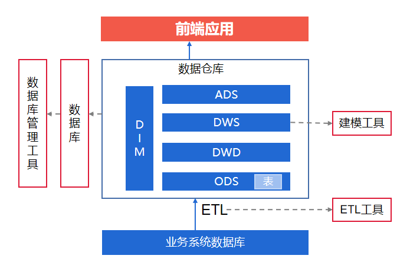
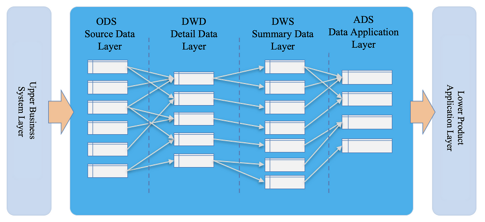

# overview

<!-- @import "[TOC]" {cmd="toc" depthFrom=1 depthTo=6 orderedList=false} -->

<!-- code_chunk_output -->

- [overview](#overview)
    - [概述](#概述)
      - [1.数仓分层](#1数仓分层)
        - [(1) ODS (operational data store)](#1-ods-operational-data-store)
        - [(2) DW (data warehouse)](#2-dw-data-warehouse)
        - [(3) ADS (application data service)](#3-ads-application-data-service)
        - [(4) DIM (dimension)](#4-dim-dimension)

<!-- /code_chunk_output -->

### 概述

#### 1.数仓分层

##### (1) ODS (operational data store)
* 获取原始数据
    * 数据仓库源头系统的数据表通常会原封不动的存储一份
    * 来源:
        * 业务库: 使用sqoop来抽取
        * 实时采集

##### (2) DW (data warehouse) 
* DWD (data warehouse detail)
    * 主要对ODS数据层做一些数据清洗和规范化的操作
* DWB (data warehouse base) 或 DWM (data warehouse middleware)
    * 该层会在DWD层的数据基础上，对数据进行轻度的聚合操作，生成一系列中间表，提升公共指标的复用性
* DWS (data warehouse summary)
    * 基于中间层的基础数据，整合汇总成分析某一个主题域的服务数据层
    * 生成宽表（即一张表中包含的业务内容比较多，即字段比较多）

##### (3) ADS (application data service)
* 该层主要是提供数据产品和数据分析使用的数据，一般存储在mysql等系统中，比如报表数据等

##### (4) DIM (dimension)
* 贯穿整个处理过程的，比如用户表，每一次都需要使用该表查询相关信息
