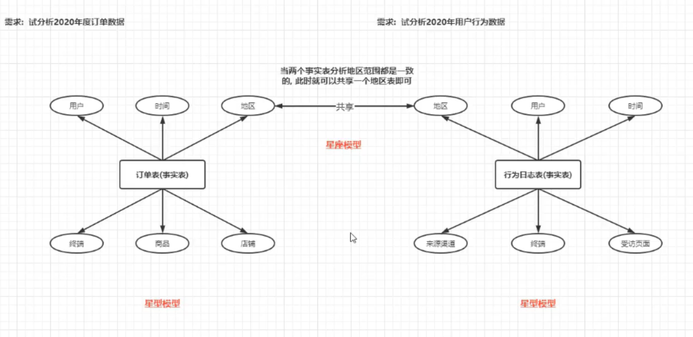

# overview

<!-- @import "[TOC]" {cmd="toc" depthFrom=1 depthTo=6 orderedList=false} -->

<!-- code_chunk_output -->

- [overview](#overview)
    - [概述](#概述)
      - [1.数据仓库 和 数据集市](#1数据仓库-和-数据集市)
      - [2.维度分析](#2维度分析)
        - [(1) 维度](#1-维度)
        - [(2) 维度分层](#2-维度分层)
        - [(3) 维度下钻 (Drill Down) 和 上卷 (Roll Up)](#3-维度下钻-drill-down-和-上卷-roll-up)
        - [(4) 维度退化](#4-维度退化)
      - [3.数仓建模](#3数仓建模)
        - [(1) 三范式建模和维度建模](#1-三范式建模和维度建模)
        - [(2) 事实表](#2-事实表)
        - [(3) 维度表](#3-维度表)
      - [4.维度建模三种模型](#4维度建模三种模型)
        - [(1) 星型模型](#1-星型模型)
        - [(2) 雪花模型](#2-雪花模型)
        - [(3) 星座模型](#3-星座模型)
      - [5.Slowly Changing Dimension (缓慢渐变维)](#5slowly-changing-dimension-缓慢渐变维)
        - [(1) SCD1](#1-scd1)
        - [(2) SCD2 (也称为拉链表，最常用)](#2-scd2-也称为拉链表最常用)
        - [(3) SCD3](#3-scd3)
      - [6.数仓分层](#6数仓分层)
        - [(1) ODS (operational data store)](#1-ods-operational-data-store)
        - [(2) DW (data warehouse)](#2-dw-data-warehouse)
        - [(3) ADS (application data service)](#3-ads-application-data-service)
        - [(4) DIM (dimension)](#4-dim-dimension)
      - [7.数仓建模举例](#7数仓建模举例)
        - [(1) ODS](#1-ods)
        - [(2) DW](#2-dw)
        - [(3) ADS](#3-ads)
        - [(4) DIM](#4-dim)

<!-- /code_chunk_output -->

### 概述

#### 1.数据仓库 和 数据集市

* Data Warehouse
    * 所有数据经过简单处理的集合（ODS层）
* Data Mart
    * 在数据仓库的基础上，对某一主题或领域数据进行分析处理

#### 2.维度分析

针对某一个主题，可以从不同的维度进行统计分析，得出各种指标的过程

##### (1) 维度
分析的角度，比如：时间、地域、颜色等

##### (2) 维度分层

* 比如：时间维度，有以下分层
    * 年
        * 季度
            * 月
* 比如: 区域维度，有以下分层
    * 省
        * 市
            * 县

##### (3) 维度下钻 (Drill Down) 和 上卷 (Roll Up)

* 比如: 以月为基准
    * 如果需要统计天、小时，则称为下钻
    * 如果需要统计季度、年，则称为上卷

##### (4) 维度退化
减少维度表的关联操作
* 做法: 将需要用到的维度字段，退化到事实表中，这样分析时，就不需要关联维度表了

#### 3.数仓建模
如何在hive中建表

##### (1) 三范式建模和维度建模
* 三范式建模
    * 用于关系型数据库中，需要遵循严格的范式
* 维度建模
    * 用于分析性数据库中，对数据没有严格要求，只要对分析结果没什么影响

##### (2) 事实表
每一条数据用于描述一个具体的事实信息
分析就是基于事实表进行的

* 分类
    * 事务事实表
        * 保存的是最原子的数据
        * 比如订单表等
    * 周期快照事实表
        * 以指定的时间间隔记录事实
        * 由事务事实表加工产生
        * 比如 以天聚合订单表，生成一个周期快照事实表，后续需要按照月、年等聚合，可以在此基础上，从而减少计算量
    * 累积快照事实表
        * 完整覆盖一个事务的**生命周期的时间跨度**，用来记录整个生命周期的关键时间点
        * 比如：一个表记录了每个订单的下单时间、付款时间、
        发货时间、签收时间、确认收货时间、售后截至时间等

##### (3) 维度表
对事实表进行统计分析时，基于某一维度（比如用户），而这个维度的信息在其他表（比如用户信息表）中，这个表就称为维度表
维度表不一定存在，但是维度一定存在

* 分类
    * 高基数维度表
        * 指表中的数据量比较庞大，而且数据也在发生变换
        * 比如商品表、用户信息表等
    * 低基数维度表
        * 指表中的数据量比较少，不怎么变换
        * 比如区域表、配置表等

#### 4.维度建模三种模型

##### (1) 星型模型
* 特点
    * 只有一个事实表，有多个维度表
    * 维度表之间没有任何依赖
* 数仓发展初期最容易产生的模型

##### (2) 雪花模型
* 特点
    * 只有一个事实表，有多个维度表
    * 维度表可以相互关联
* 数仓发展畸形产生的模型，不便于维护和使用

##### (3) 星座模型
* 特点
    * 有多个事实表，有多个维度表
    * 一定条件下，事实表可以共享维度表
* 数仓发展中后期最容易产生的模型

#### 5.Slowly Changing Dimension (缓慢渐变维)

解决维度表在缓慢发生变换的问题，比如用户修改了用户名，当数仓同步数据库数据时，这里就会发生变化

##### (1) SCD1
直接覆盖，不维护历史的记录
* 适用: 对错误数据的处理

##### (2) SCD2 (也称为拉链表，最常用)
给维度记录建立一个新的版本记录，从而维护维度历史
* 通过加两个字段（生效时间，失效时间），标识这个记录在哪个 时间段内是有效的

##### (3) SCD3
在维度表中新增一列，记录当前的值
* 缺点：会更改表结构

#### 6.数仓分层

##### (1) ODS (operational data store)
* 获取原始数据
    * 数据仓库源头系统的数据表通常会原封不动的存储一份
    * 来源:
        * 业务库: 使用sqoop来抽取
        * 实时采集

##### (2) DW (data warehouse) 
* DWD (data warehouse detail)
    * 主要对ODS数据层做一些数据清洗和规范化的操作，以及少量的维度退化
* DWB (data warehouse base) 或 DWM (data warehouse middleware)
    * 该层会在DWD层的数据基础上，对数据进行轻度的聚合操作，生成一系列中间表，提升公共指标的复用性，以及少量的维度退化
    * 当数据有重复时，不能提前聚合
        * 比如按小时提前聚合，统计每小时内的用户，如果提前按小时提前聚合了，后面需要按天聚合，则会导致数据不准确，因为不同小时内用户可能重复
* DWS (data warehouse summary)
    * 基于中间层的基础数据，整合汇总成分析某一个主题域的业务数据层
    * 生成宽表（即一张表中包含的业务内容比较多，即字段比较多）
    * 一般一个指标对应一个统计结果表，该表中存储的是 该指标 在不同维度下的 统计数据

##### (3) ADS (application data service)
* 该层主要是提供数据产品和数据分析使用的数据，一般存储在mysql等系统中，比如报表数据等

##### (4) DIM (dimension)
* 贯穿整个处理过程的，比如用户表，每一次都需要使用该表查询相关信息
* 当维度比较多的时候会添加这一层，少的情况下，可以使用维度退化

#### 7.数仓建模举例

##### (1) ODS
* 业务表有几张就在这里建几张表
    * 业务表有哪些字段，这里与之相同
* 建表时，按照天进行分区，这样后续可以加入增量数据

##### (2) DW

* DWD

* DWM
    * 不需要，因为数据有重复，这里不能提前聚合
* DWS

##### (3) ADS

##### (4) DIM
不需要，当前主题，压根没有维度表
