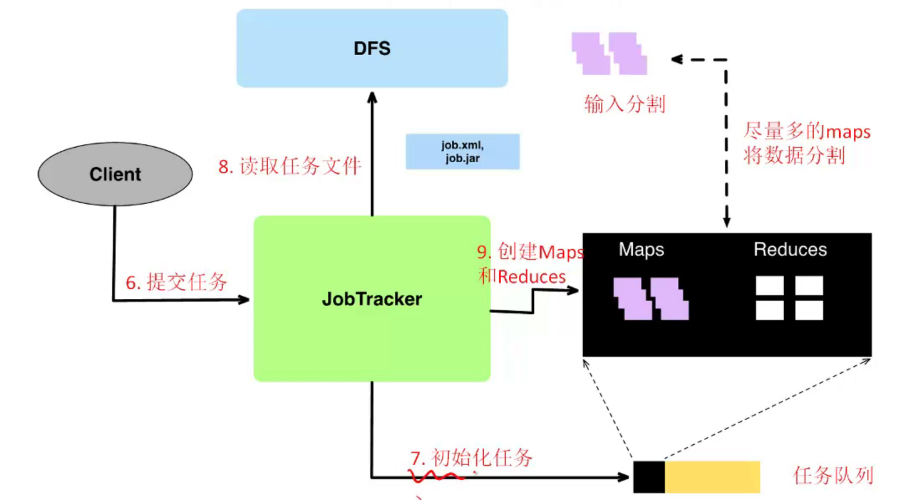
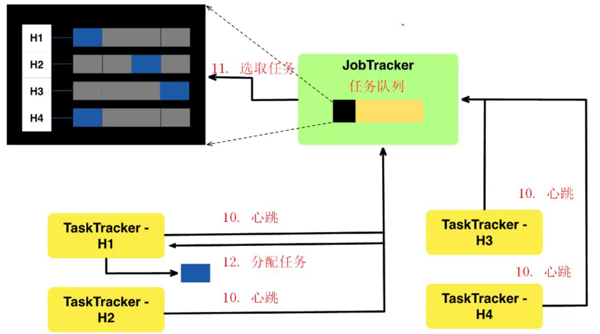

# overview

<!-- @import "[TOC]" {cmd="toc" depthFrom=1 depthTo=6 orderedList=false} -->

<!-- code_chunk_output -->

- [overview](#overview)
    - [概述](#概述)
      - [1.Hadoop MapReduce](#1hadoop-mapreduce)
        - [(1) 基本架构](#1-基本架构)
        - [(2) 执行过程](#2-执行过程)
      - [2.Yarn](#2yarn)
        - [(1) 4类角色](#1-4类角色)
        - [(2) 资源调度策略](#2-资源调度策略)

<!-- /code_chunk_output -->

### 概述

#### 1.Hadoop MapReduce

##### (1) 基本架构

* client
    * 提交作业
    * 查看状态

* JobTracker (master)
    * 接受MapReduce任务
    * 分配任务给Worker
    * 监控任务
    * 处理错误

* TaskTracker (worker)
    * 管理本地的Map和Reduce任务
    * 管理中间输出

* Task
    * 一个独立的进程，运行Map/Reduce函数

##### (2) 执行过程

#### 2.Yarn

* 管理节点、进行MapReduce job的调度（代替了原先的JobTracker）

##### (1) 4类角色
* Resource Manager
    * 集群资源管理
* Node Manager
    * 单机资源管理
* **Application Manager**
    * 单任务管理（需要用户实现具体的内容）
* Task
    * 单任务执行

##### (2) 资源调度策略

* FIFO：不用
    * 单队列，队列内部FIFO，所有资源只给一个程序运行
* Capacity：Apache
    * 多队列，队列内部FIFO，资源分配给不同的队列，队列内部所有资源只给一个程序运行
* Fair：CDH
    * 多队列，队列内部共享资源，队列内部的资源可以给多个程序运行