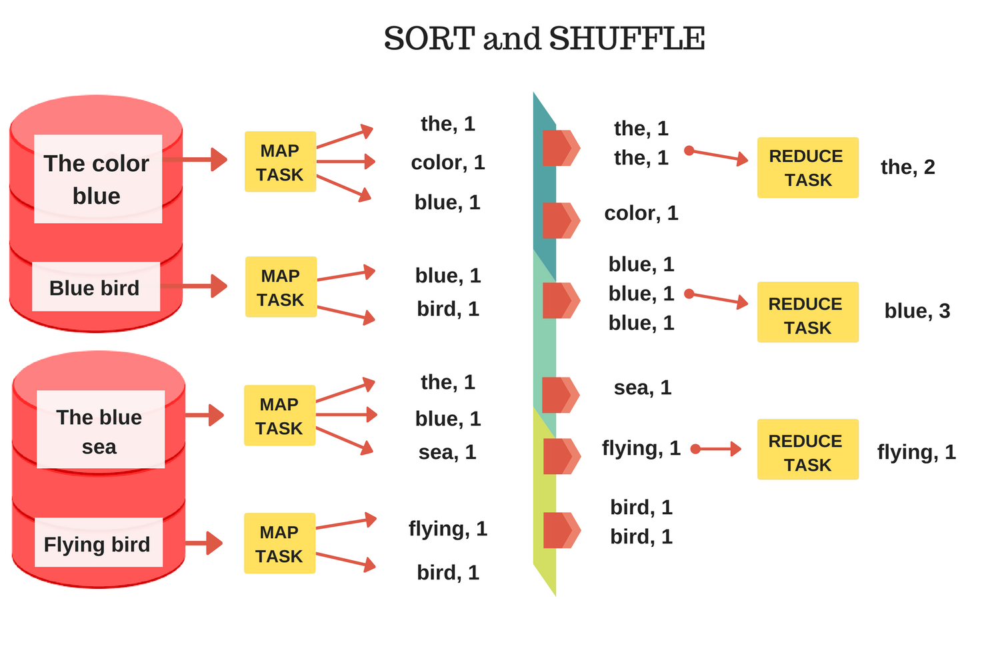
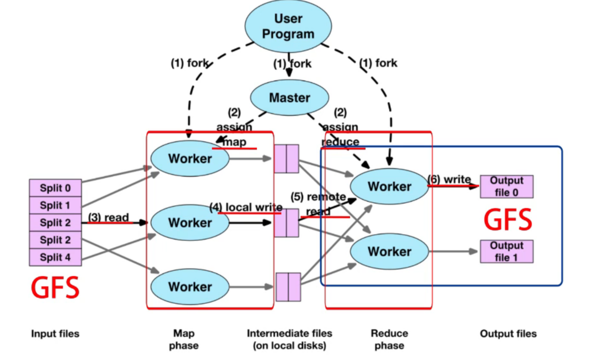

# MapReduce


<!-- @import "[TOC]" {cmd="toc" depthFrom=1 depthTo=6 orderedList=false} -->

<!-- code_chunk_output -->

- [MapReduce](#mapreduce)
    - [概述](#概述)
      - [1.MapReduce](#1mapreduce)
        - [(1) Map](#1-map)
        - [(2) shuffle](#2-shuffle)
        - [(3) Reduce](#3-reduce)
        - [(4) 举例： 词频统计](#4-举例-词频统计)
        - [(5) 局限性](#5-局限性)
      - [2.MapReduce执行流程](#2mapreduce执行流程)
        - [(1) 执行流程](#1-执行流程)
        - [(2) M和R的数量 (由用户指定)](#2-m和r的数量-由用户指定)
        - [(3) shuffle (即group by key) 过程](#3-shuffle-即group-by-key-过程)
        - [(4) MapReduce数据流](#4-mapreduce数据流)
        - [(5) 性能优化: MapReduce冗余执行](#5-性能优化-mapreduce冗余执行)
        - [(6) 故障处理](#6-故障处理)

<!-- /code_chunk_output -->

### 概述

#### 1.MapReduce

##### (1) Map
* 输入 -> lsit(key,value)
* 编程模型: `map()函数`
```java
function map(String name, String document):
    // name: document name
    // document: document contents
    for each word w in document:
        emit (w, 1)
```
##### (2) shuffle
重新放置这些(key,value)，key相同的放到同一个reduce任务中

##### (3) Reduce
* 对每一个key进行聚合
* 编程模型: `reduce()函数`
```java
function reduce(String word, Iterator partialCounts):
    // word: a word
    // partialCounts: a list of aggregated partial counts
    sum = 0
    for each pc in partialCounts:
        sum += pc
    emit (word, sum)
```

##### (4) 举例： 词频统计


##### (5) 局限性

* 对数据的要求
    * 数据能够切分且是独立的
    * 操作必须是确定性的和幂等的
* 数据流极其严格，不够灵活
    * map后就必须reduce
* 过于抽象，只有map、reduce两个函数，里面实现的内容千差万别，系统无法对其中的代码进行优化

#### 2.MapReduce执行流程

##### (1) 执行流程
* 将输入数据分割成 M 块，在每块上分布式调用map()函数
    * 通常一个GFS块分为一个或多个map块
* 输入数据由不同的服务器并行处理
* 通过将中间结果分为 R 块，对每个块分布式调用reduce()函数
    * 注意：中间结果的所有具有相同key值的，要放在同一个reduce块中


##### (2) M和R的数量 (由用户指定)

* M >> #servers
    * M的数量应该远大于服务器的数量，能够有助于负载均衡，以及快速恢复

* R > #servers
    * R的数量不宜太大，因为每个reduce()调用，对应一个单独的输出文件

##### (3) shuffle (即group by key) 过程

* map()中的emit(key,value)函数，会根据key计算出一个shard_id，从而划分为多个shard
    * 一个reduce对应一个shard_id（本质就是将中间结果hash到一个reduce中）
        * 注意区分shard_id和shard:
            * shard_id是一个bucket（对应于一个reduce）
            * shard就是一个数据块（一个shard_id中可能有M个shard）
    * shard结果会存储在本地
* reduce启动后会分配一个shard_id，reduce会跟所有map进行通信，让map将指定shard_id的shard发送给自己
* 在每个reduce中对shard进行排序，从而实现group by key
    * 排序是为了group by key，因为一个reduce中可以有多个不同key的数据
        * 如果使用hash，需要占用大量的内存，使用外排序更合适


##### (4) MapReduce数据流



##### (5) 性能优化: MapReduce冗余执行
* 现实情况：整个任务完成时间是由最慢的节点决定的
* 解决方案：在接近结束时，生成冗余任务
    * 谁最先结束，接受谁的计算结果
* 影响：极大地缩短任务完成时间

##### (6) 故障处理
* 计算节点故障
    * 控制节点通过周期性的心跳来检测故障
    * 如果故障，则在别处重新执行

* 主节点故障
    * 恢复故障后，整个任务重新执行