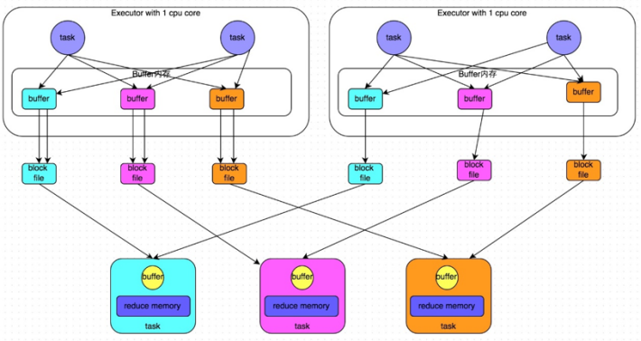

# RDD 

<!-- @import "[TOC]" {cmd="toc" depthFrom=1 depthTo=6 orderedList=false} -->

<!-- code_chunk_output -->

- [RDD](#rdd)
    - [概述](#概述)
      - [1.RDD (resilient distributed datasets)](#1rdd-resilient-distributed-datasets)
        - [(1) dataset](#1-dataset)
        - [(2) partiton](#2-partiton)
        - [(3) resilient](#3-resilient)
        - [(4) lineage](#4-lineage)
        - [(5) 局限性](#5-局限性)
      - [2.RDD vs MapReduce](#2rdd-vs-mapreduce)
      - [3.缓存](#3缓存)
        - [(1) why](#1-why)
        - [(2) 几种方式](#2-几种方式)
      - [4.checkpoint](#4checkpoint)
      - [5.Fault tolerance](#5fault-tolerance)
        - [(1) 容错依赖以下特性实现](#1-容错依赖以下特性实现)
      - [6.shuffle（是影响性能的关键因素）](#6shuffle是影响性能的关键因素)
        - [(1) HashShuffleManager （旧版本）](#1-hashshufflemanager-旧版本)
        - [(2) sortShuffleManager](#2-sortshufflemanager)

<!-- /code_chunk_output -->

### 概述

[RDD文档](https://spark.apache.org/docs/latest/rdd-programming-guide.html)

#### 1.RDD (resilient distributed datasets)

内存抽象（将多个台机器的内存抽象成一个内存）

##### (1) dataset
* 基于**数据集合**，而不是单个数据
* 由确定的粗粒度操作产生（比如：map、filter等）

##### (2) partiton

* 实现分布式
* 当资源较少时，可以先计算一部分partition
* 可以设置partitioning规则，将相关的数据集划分到一个partition（即可以放在同一台机器），便于计算
* 一个partition一个**task**任务

##### (3) resilient
* Fault tolerance
* Lazy Evaluation
* Caching

##### (4) lineage
* 数据集之间有血缘关系（即依赖关系）
    * 原数据集 --操作1--> RDD1 --操作2--> RDD2

##### (5) 局限性
* 对于细粒度的数据更新，由于spark基于粗粒度RDD只读的 数据对象模型
    * 需要RDD变换（即有大量数据的复制），导致处理效率不高

#### 2.RDD vs MapReduce

#### 3.缓存

不仅缓存数据，还缓存lineage

##### (1) why
* 因为RDD是过程数据（即调用Action算子时才会进行计算）
* 比如某一个RDD存在于多个计算链中，则需要计算n次，会浪费资源
* 缓存的好处是，只需要计算一次
* 但是这种方式会浪费存储

##### (2) 几种方式

|方式|说明|
|-|-|
|MEMORY_ONLY（推荐）|缓存在内存中，如果内存不够，只缓存一部分partition，其他的partition使用的时候重新计算|
|DISK_ONLY|任务执行完，会将写入磁盘的数据删除|
|MEMORY_AND_DISK|优先缓存在内存中，内存不够缓存到磁盘上|

#### 4.checkpoint

数据永久存储在hdfs中，可供以后使用
而缓存到磁盘，任务执行完毕，数据就会删除

#### 5.Fault tolerance

##### (1) 容错依赖以下特性实现
* immutable
    * 数据一旦产生，就不能修改
* Lineage Tracking
    * 保留对数聚集的一系列操作，通过对原数据集执行这一系列操作就能恢复
* Data Replication
    * 可以跨节点拷贝数据

#### 6.shuffle（是影响性能的关键因素）

* shuffle就是调整**各分区间的数据分布**

##### (1) HashShuffleManager （旧版本）

##### (2) sortShuffleManager

