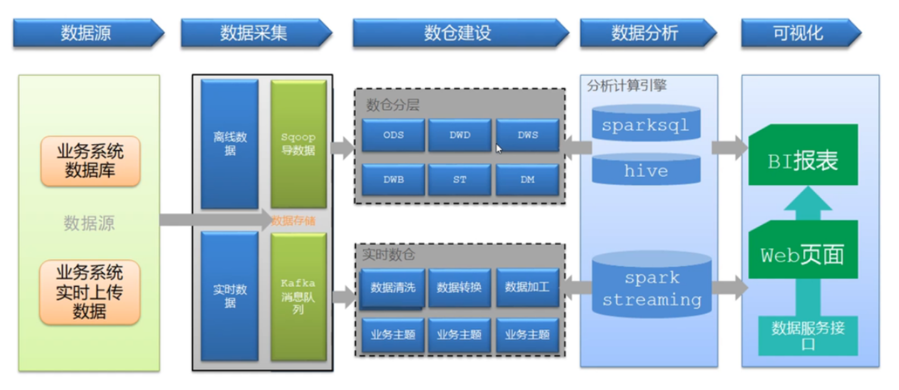
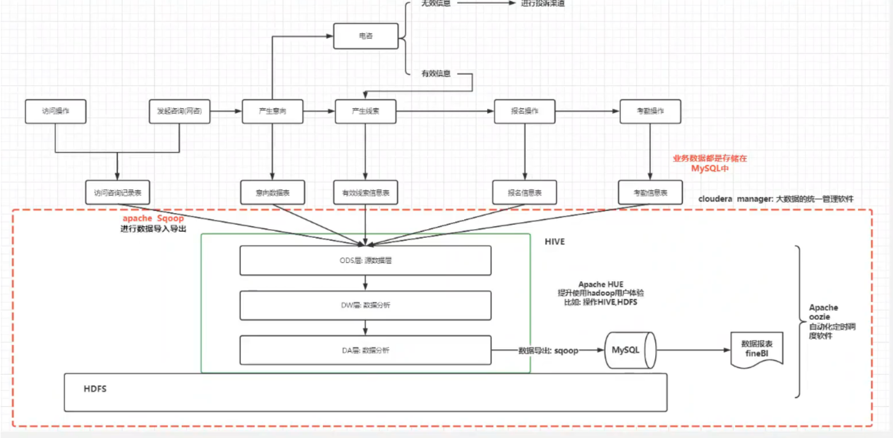

# overview

<!-- @import "[TOC]" {cmd="toc" depthFrom=1 depthTo=6 orderedList=false} -->

<!-- code_chunk_output -->

- [overview](#overview)
    - [概述](#概述)
      - [1.大数据问题](#1大数据问题)
        - [(1) 数据孤岛 （数仓）](#1-数据孤岛-数仓)
        - [(2) 非结构化数据 （数据湖）](#2-非结构化数据-数据湖)
        - [(3) 原始数据 （数据湖）](#3-原始数据-数据湖)
      - [2.大数据](#2大数据)
        - [(1) 数据特点 (4V)](#1-数据特点-4v)
        - [(2) 数据类型](#2-数据类型)
        - [(3) 大数据生命周期](#3-大数据生命周期)
        - [(4) 大数据深度加工](#4-大数据深度加工)
        - [(5) 处理方式](#5-处理方式)
        - [(6) 大数据的数据质量](#6-大数据的数据质量)
        - [(7) 大数据的价值](#7-大数据的价值)
      - [3.大数据技术体系](#3大数据技术体系)
      - [4.大数据和云计算的关系](#4大数据和云计算的关系)
      - [5.架构设计](#5架构设计)
      - [6.数据流](#6数据流)

<!-- /code_chunk_output -->

### 概述

#### 1.大数据问题
当 输入数据x 大到超过了一定的 计算能力c 和 可容忍的时间t，即成为大数据问题
* 比如：100MB的数据量并不大，但要在1毫秒之内对100MB完成数据的挖掘分析，可能超越目前常用设备的数据处理能力

##### (1) 数据孤岛 （数仓）
数据分散，数据没有集中存放

##### (2) 非结构化数据 （数据湖）
数仓不适合处理非结构化数据，因为数仓需要建模

##### (3) 原始数据 （数据湖）
想要保存海量原始数据

#### 2.大数据

##### (1) 数据特点 (4V)
* volume
    * 数据量大
* velocity
    * 产生速度快
* variety
    * 数据种类多
* value
    * 价值密度低

##### (2) 数据类型
* 结构化
* 半结构化
* 非结构化

##### (3) 大数据生命周期

* 生命周期
    * acquisition/recording
    * extraction/cleaning/annotation
    * integration/aggregation/representaion
    * analysis/modeling
    * interpretation

* 需要解决的问题
    * heterogeneity
    * scale
    * timeliness
    * privacy
    * human collaboration

##### (4) 大数据深度加工
* raw data
* information
* knowledge
* insight

##### (5) 处理方式

* batch (批量)
    * 在一定的周期内收集数据，然后进行处理
    * 高延迟
* real-time (实时)
    * 数据刚到达就进行处理
    * 低延迟
* online (在线)

##### (6) 大数据的数据质量
* 精确性
* 一致性
* 完整性
* 时效性

##### (7) 大数据的价值
* 价值密度的稀疏
    * 比如微博每天1亿条记录，很多是价值的，而红楼梦确很有价值
* 长尾问题
    * 只有少量的类别含有较多样本（head），大部分类别的样本数都很少（tail）

#### 3.大数据技术体系

* 采集与集成
* 存储和管理
* 分析与挖掘
* 可视化
* 计算范型
* 隐私与安全

#### 4.大数据和云计算的关系

#### 5.架构设计

#### 6.数据流 
