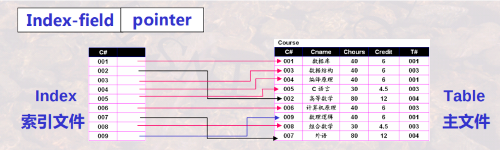
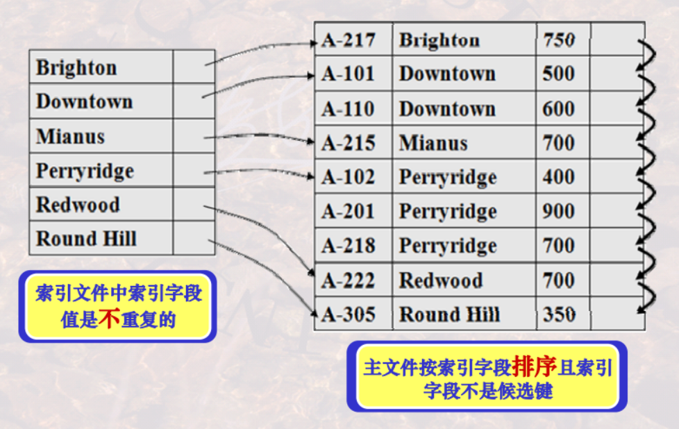
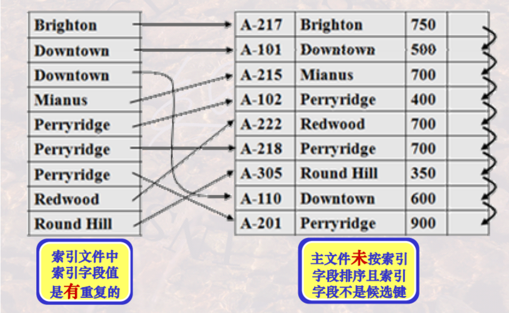
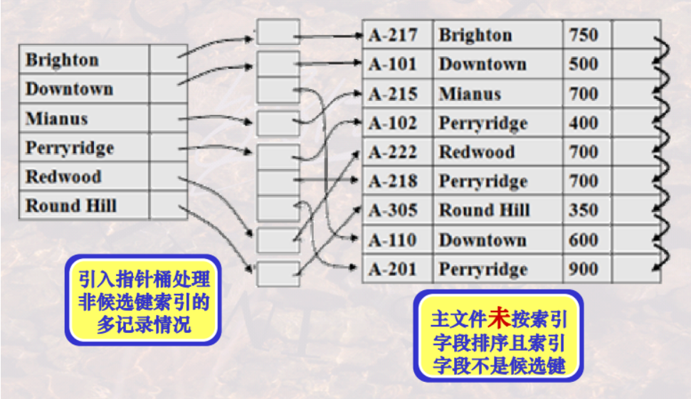
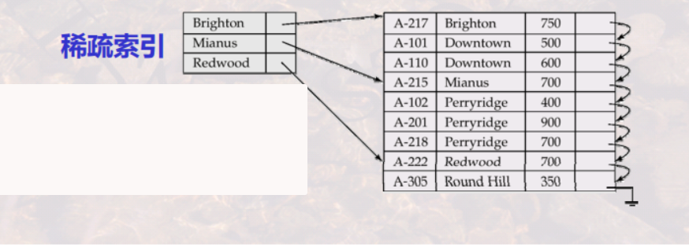
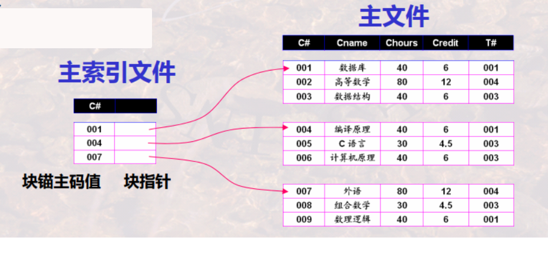
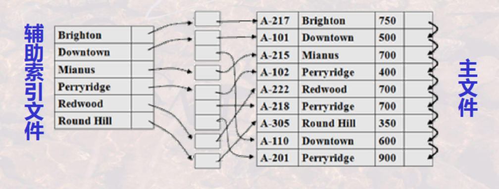
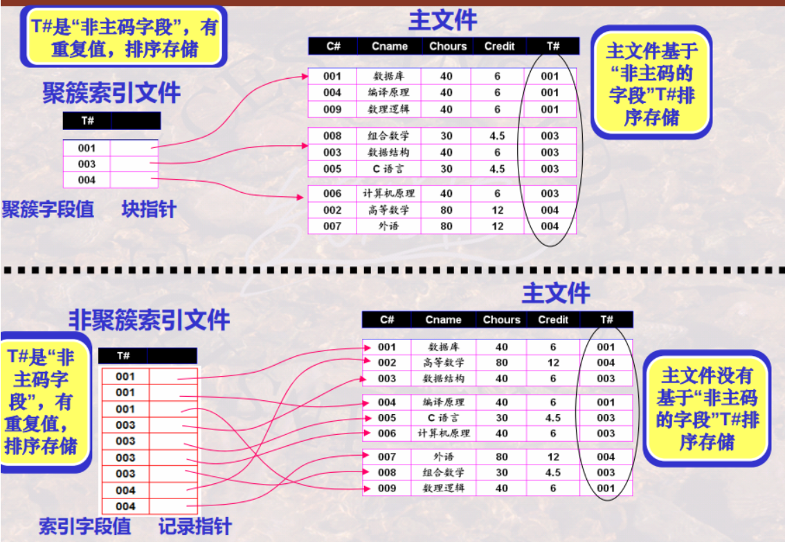
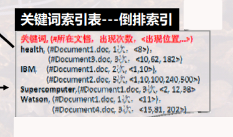

# index


<!-- @import "[TOC]" {cmd="toc" depthFrom=1 depthTo=6 orderedList=false} -->

<!-- code_chunk_output -->

- [index](#index)
    - [概述](#概述)
      - [1.index (索引)](#1index-索引)
        - [(1) 定义](#1-定义)
        - [(2) 索引文件组织形式](#2-索引文件组织形式)
        - [(3) SQL中索引知识](#3-sql中索引知识)
      - [2.dense index 和 sparse index](#2dense-index-和-sparse-index)
        - [(1) 稠密索引](#1-稠密索引)
        - [(2) 稀疏索引](#2-稀疏索引)
      - [3.primary index、secondary index、clustered index](#3primary-index-secondary-index-clustered-index)
        - [(1) 主索引](#1-主索引)
        - [(2) 辅助索引](#2-辅助索引)
        - [(3) 聚簇索引](#3-聚簇索引)
      - [4.inverted index](#4inverted-index)
      - [5.multi-level index](#5multi-level-index)

<!-- /code_chunk_output -->

### 概述

#### 1.index (索引)

##### (1) 定义
是定义在 在存储表(Table)基础之上，一种辅助存储结构，用于快速定位所需记录

* 由两部分组成
    * index-field (索引字段)
        * 由Table中某些列(通常是一列)中的值**串接**而成
    * pointer (指针)
        * 指向Table中包含索引字段值的记录在磁盘上的存储位置

* 索引文件和主文件
    * 存储索引项的文件为索引文件
    * 存储表的文件称为主文件



##### (2) 索引文件组织形式

* ordered indices (排序索引文件)
    * 按 索引字段值 的某一种顺序组织索引文件
* hash indices (散列索引文件)
    * 依据 索引字段值 使用散列函数 分配散列桶 的方式存储

##### (3) SQL中索引知识

* 创建主键，系统会自动创建主索引（即用主键创建索引）

* 创建索引
```SQL
CREATE [unique] INDEX indexname
    ON tablename ( colname [asc | desc]
        {, colname [asc | desc] . . .} );
```

* 删除索引
```SQL
DROP INDEX indexname;
```

#### 2.dense index 和 sparse index

##### (1) 稠密索引
* 索引项包含 所有索引字段的值

* 非候选键属性的稠密索引
    * 索引文件中的索引字段不重复，主文件中的索引字段按顺序排列
    

    * 索引文件中的索引字段不重复，主文件中的索引字段未按顺序排列
    

    * 索引文件中的索引字段重复
    

##### (2) 稀疏索引
* 索引项包含 部分索引字段的值
* 如何定位记录
    * 要求: 主文件必须是按对应索引字段属性**排序**存储
    * 定位索引字段值为 K的记录:
        * 首先找相邻的小于K的最大索引字段值所对应的索引项
        * 从该索引项所对应的记录开始顺序进行Table的检索


#### 3.primary index、secondary index、clustered index

##### (1) 主索引
创建**主键**，系统会**自动创建**主索引（即用主键创建索引）
* 主索引特点
    * 是**稀疏索引**
    * 是**有序**的
        * 因为是稀疏索引，所以排序后，更方便查找
        * 如果主文件的**主键是排序的**，才能充分发挥这种优势
    * 索引的字段值是 **块锚** 的字段值，指针指向 **数据块**
        * **block anchor (块锚)**，也叫anchor record (锚记录)
            * 每一个数据块的第一条记录
    * 能够决定记录的**存储位置**
        * 比如插入一条数据，如果主键是有序的，则会将记录存储在指定数据块中



##### (2) 辅助索引
除了主索引外的索引
* 辅助索引特点
    * 是**稠密索引**
    * 允许主文件中的索引字段**重复**



##### (3) 聚簇索引
* 聚簇字段
    * 字段值可以**重复**且经过了**排序**
    * 聚簇索引通常定义在聚簇字段上
* 聚簇索引
    * 索引中邻近的记录在主文件中也是临近存储的
    * 聚簇索引通常是对聚簇字段上的每一个不同值有一个索引项
        * 由于有相同聚簇字段值的记录可能存储于若干块中，则索引项的指针指向其中的第一个块
    * 一个主文件只能有一个聚簇索引文件，但可以有多个非聚簇索引文件
    * 主索引通常是聚簇索引（当主键是有序的）
    * 能够决定记录的**存储位置**
        * 比如插入一条数据，则会将记录存储在指定数据块中



#### 4.inverted index

* forward index (正排索引)
    * 一个文档包含了哪些词汇
* inverted index (倒排索引)
    * 一个词汇包含在哪些文档中



#### 5.multi-level index

当索引项比较多时，可以对索引再建立索引，依此类推，形成
多级索引
