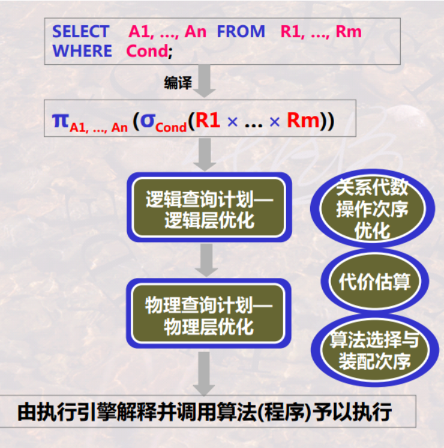
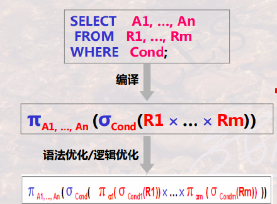
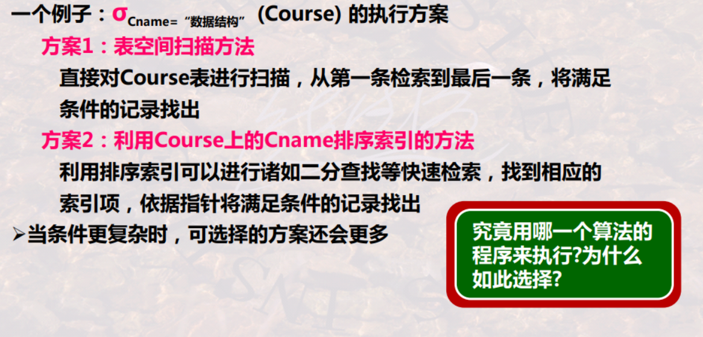
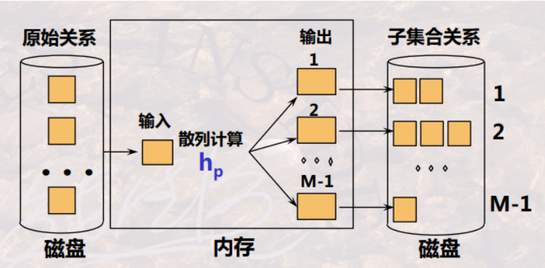
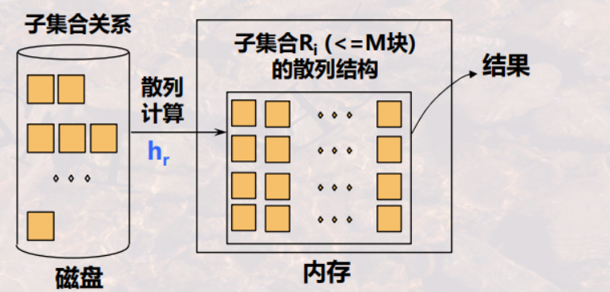
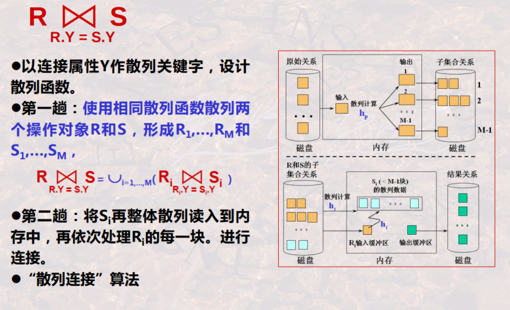

# query optimization

<!-- @import "[TOC]" {cmd="toc" depthFrom=1 depthTo=6 orderedList=false} -->

<!-- code_chunk_output -->

- [query optimization](#query-optimization)
    - [概述](#概述)
      - [1.数据库三大类操作](#1数据库三大类操作)
      - [2.三个层面查询优化](#2三个层面查询优化)
        - [(1) 语义优化](#1-语义优化)
        - [(2) 语法优化（逻辑查询优化）](#2-语法优化逻辑查询优化)
        - [(3) 执行优化（物理查询优化）](#3-执行优化物理查询优化)
      - [3.逻辑查询优化](#3逻辑查询优化)
        - [(1) 优化策略](#1-优化策略)
      - [4.物理查询优化](#4物理查询优化)
        - [(1) why](#1-why)
        - [(2) 物理查询运算符](#2-物理查询运算符)
        - [(3) 衡量物理查询计划的优劣](#3-衡量物理查询计划的优劣)
        - [(4) 代价估算](#4-代价估算)
    - [物理查询算法](#物理查询算法)
      - [1.表空间扫描法（以连接操作为例）](#1表空间扫描法以连接操作为例)
        - [(1) 基本实现算法](#1-基本实现算法)
        - [(2) 全主存实现算法](#2-全主存实现算法)
        - [(3) 半主存实现算法](#3-半主存实现算法)
        - [(4) 大关系实现算法](#4-大关系实现算法)
      - [2.基于索引的算法](#2基于索引的算法)
        - [(1) 应用场景](#1-应用场景)
        - [(2) 举例](#2-举例)
        - [(3) 基于有序索引的连接算法](#3-基于有序索引的连接算法)
      - [3.流水线计算策略](#3流水线计算策略)
        - [(1) 迭代器](#1-迭代器)
      - [4.一趟扫描算法 (one-pass scan algorithm)](#4一趟扫描算法-one-pass-scan-algorithm)
        - [(1) 去重](#1-去重)
        - [(2) 分组聚集](#2-分组聚集)
      - [5.基于排序的两趟扫描（多趟扫描）](#5基于排序的两趟扫描多趟扫描)
        - [(1) 去重](#1-去重-1)
        - [(2) 分组聚集](#2-分组聚集-1)
        - [(3) 连接运算](#3-连接运算)
      - [6.基于散列的两趟扫描（多趟扫描）](#6基于散列的两趟扫描多趟扫描)
        - [(1) 概述](#1-概述)
        - [(2) 去重](#2-去重)
        - [(3) 分组](#3-分组)
        - [(4) 连接](#4-连接)

<!-- /code_chunk_output -->

### 概述

#### 1.数据库三大类操作
* 单一元组的一元操作
* 整个关系的一元操作
* 整个关系的二元操作

#### 2.三个层面查询优化

##### (1) 语义优化

* 利用模型的语义及完整性规则，优化查询
    * 比如： 去掉无关的表、属性等，从而改写成语义等价效果更好的语句
        * 此种优化还在研究中，暂不讨论

##### (2) 语法优化（逻辑查询优化）

* 改变关系代数的操作次序，尽可能早做选择和投影运算

##### (3) 执行优化（物理查询优化）

* 存取路径和执行算法的选择与执行次序优化
    * 为每一个关系代数操作选取优化的执行层例行程序，形成物理查询计划

#### 3.逻辑查询优化

##### (1) 优化策略
* 尽可能地早做选择和投影
    * 可使中间结果变小，节省几个数量级的执行时间
* 把选择与投影串接起来
    * 一元运算序列可一起执行，只需对整个关系扫描一遍
* 把投影与其前或后的二元运算结合起来
    * 在第一次用关系时去掉一些无关属性，可以避免多次扫描整个关系
* 把某些选择与其前的笛卡尔积合并成一个连接
    * 当R×S前有选择运算且其中有条件是R、S属性间比较的运算时，可将其转化为连接运算可节省时间
* 执行连接运算前对关系做适当预处理
    * 文件排序、建立临时索引等，可使两关系公共值高效联接
* 找出表达式里的公共子表达式
    * 若公共子表达式结果不大，则预先计算，以后可读入此结果，节时多，尤当视图情况下有用

#### 4.物理查询优化

##### (1) why

##### (2) 物理查询运算符
用于实现逻辑运算符，通常是关系代数操作符的一个特定实现（即具体的程序）
* 比如： 实现表空间扫描算法的具体程序、实现一趟算法的具体程序等

物理查询计划由多个**选择**的物理查询运算符按**次序**装配而成

##### (3) 衡量物理查询计划的优劣
* 衡量I/O访问次数
* 衡量CPU的占用时间
* 内存使用代价
* .....

##### (4) 代价估算

* 需要依据数据库的一些统计信息，进行代价估算，选择合适的 例行程序

* 常见统计信息：
    * T(R)
        * 关系R的元组数目
    * B(R)
        * 关系R的磁盘块数目
    * I(R)
        * 关系R的每个元组的字节数
    * f(R)
        * R的块因子 , 即一块能够存储的R的元组数目
    * V(A, R)
        * R中属性A出现不同值的数目
    * b
        * 每个磁盘块的字节数

* 收集统计信息
    * 不同数据库收集方法不相同，比如mysql每天会更新一次统计信息，如果需要立即更新需要使用`ANALYSE TABLE <table_name>`命令

* 进行代价估算，举例
    * 估算一个投影 $\pi_L(R)$ 的大小
        * $T(\pi_L(R)) = T(R)$
    * 估算选择运算 $S = \sigma_{A<c}(R)$ 的大小
        * T(S) = T(R) / 2
    * ......

***

### 物理查询算法

#### 1.表空间扫描法（以连接操作为例）

* 已知:
    * $T_R、T_S$分别是关系R和关系S的 元组数目
    * $B_R、B_S$分别是关系R和关系S存储数据的 块的数量
    * b 是每次块的字节数
    * $I_R、I_S$分别是关系R和关系S的 每个元组的字节数
    * M 是内存中能够使用的 缓存页数
* 则计算$R\times S$需要读取的块数
    * $B_{R\times S}=T_RT_S(I_R+I_S)/b$

##### (1) 基本实现算法

* 应用条件: 仅需要三个内存页即可应用，一页装入R，一页装入S，一页输出
* 算法复杂度（假设一次I/O只读一个数据块），则需要的I/O数：
    * $B_R+B_R\times B_S$

##### (2) 全主存实现算法

* 应用条件: $M \ge B_R+B_S$
* 算法复杂度（假设一次I/O只读一个数据块），则需要的I/O数：
    * $B_R+B_S$

##### (3) 半主存实现算法

* 应用条件: M只能装下$B_R$
* 算法复杂度（假设一次I/O只读一个数据块），则需要的I/O数：
    * $B_R+B_S$

##### (4) 大关系实现算法

* 应用条件: $B_R \ge M、B_S \ge M$
* 算法复杂度（假设一次I/O只读一个数据块），则需要的I/O数：
    * $(B_S/(M-2))B_R+B_S$

* 优化： 内存结构采用散列，R关系通过A属性散列，S关系通过B属性散列
    * 能够减少循环

#### 2.基于索引的算法

##### (1) 应用场景
* 选择条件中有涉及到索引属性时

##### (2) 举例

* 已知:
    * T(R)=20000 表示关系R有2000个元组（即记录）
    * B(R)=1000 表示R关系的元组存储在1000个数据块上
    * R上有一个属性a，a上有索引
    * 考虑$\sigma_{a=0}(R)$

* 如果R数据是聚簇的，且不使用索引，查询代价＝1000个I/O
* 如果R数据不是聚簇的，且不使用索引，查询代价＝20000个I/O
* 如果a有100个不同的索引值 且 数据是聚簇的，则平均一个index对应的数据有1000/100=10个数据块，查询代价=1000/100=10个I/O
* 如果a有100个不同的索引值 且 数据是非聚簇的，则平均一个index对应的数据有20000/100=200个数据块，查询代价=20000/100=200个I/O
* 如果a有100个不同的索引值，查询代价=20000/20000  =1个I/O

##### (3) 基于有序索引的连接算法

#### 3.流水线计算策略

* 依赖迭代器
* 需要内存存储临时数据
    * 当内存不足时，需要多趟扫描

##### (1) 迭代器

* 一元操作

* 二元操作

#### 4.一趟扫描算法 (one-pass scan algorithm)
* 只读取一次输入
    * 比如: 计算列表元素的数量、找到最大值
    * 一趟扫描不能解决的问题：
        * 找到链表的中间元素（第一趟计算链表的长度，第二趟找出中间的元素）

##### (1) 去重
* 一趟扫描应用条件：
    * 需要在内存中保存已处理过的元组
* 建立合适的内存结构，来保存处理过的数据
* 算法复杂性（假设一次I/O只读一个数据块），则需要的I/O数： 
    * B(R)
        * 即存储R关系的数据块数量

##### (2) 分组聚集
* 一趟扫描应用条件：
    * 需要在内存中保存所有的分组和每个分组的信息
* 建立合适的内存结构（这里适合使用散列），来保存处理过的数据
* 算法复杂性（假设一次I/O只读一个数据块），则需要的I/O数： 
    * B(R)
        * 即存储R关系的数据块数量

#### 5.基于排序的两趟扫描（多趟扫描）
* 也就是external merge sort，[参考](../../programming/data_structure/sort.md)
* two-phase的算法复杂性（假设一次I/O只读一个数据块），则需要的I/O数：
    * 考虑最终结果的写回
        * 4B(R)
            * 子集合排序阶段读一遍写一遍 2B(R)
            * 合并阶段读一遍写一遍 2B(R)
* 更大规模数据集的排序问题—多趟/多阶段

##### (1) 去重

* pass 1
    * 划分子表，并进行子表排序
* pass 2
    * 归并阶段，在排序的基础上，直接将重复的记录剔出掉

##### (2) 分组聚集

* pass 1
    * 划分子表，并进行子表排序
* pass 2
    * 归并阶段，在排序基础上
        * 将不重复的记录，作为新分组输出
        * 将重复的记录进行分组聚集计算
            * 由于是排序的，所以重复记录都是连续的

##### (3) 连接运算
* pass 1
    * 划分R和S的子表并进行子表排序，排序均基于Y属性排序
* pass 2
    * 归并时注意是R的输入还是S的输入。R和S的两路输入之间进行连接检查并连接后输出

#### 6.基于散列的两趟扫描（多趟扫描）

##### (1) 概述

* pass 1
    * 构建散列子表
        * 这样重复数据和一些其他数据都会被放入在同一个子表中
        * 用散列函数$h_p$将原始关系划 分成M-1个子表 (其中M是内存的块数)
    

* pass 2
    * 处理每个子表，使用一趟扫描算法，比如：
        * 用另一散列函数$h_r$将子表读入内存并建立内存结构（其中bukcet数量<= 内存块的数量）
            * 再一次hash，能够使数据的划分更加精细（比如原来子集中只有数据有2块，经过这一次hash，到内存中就有6块）
            * 能够更方便的处理数据
    

##### (2) 去重
* pass 1
    * 将原始关系通过$h_p$散列成M-1个子表，并进行存储
* pass 2
    * 处理每个子表，使用一趟扫描算法，比如：
        * 并用另一函数$h_r$形成散列数据结构
        * 对数据进行hash的同时，比较桶里是否已经有相同的数据了

##### (3) 分组
* pass 1
    * 将原始关系通过$h_p$散列成M-1个子表，并进行存储
* pass 2
    * 处理每个子表，使用一趟扫描算法，比如：
        * 并用另一函数$h_r$形成散列数据结构
        * 对内存中散列结构的数据 进行分组聚集操作

##### (4) 连接

* pass 1
    * 分别对关系R和S，根据属性Y 构建散列表
    * 只有当散列值一样的R和S子表，才能合并（即Ri只能和Si合并）
* pass 2
    * 将Ri在内存中构建散列结构
    * 再依次处理Si的每个数据，进行连接（Si无需构建散列结构）