# query optimization

<!-- @import "[TOC]" {cmd="toc" depthFrom=1 depthTo=6 orderedList=false} -->

<!-- code_chunk_output -->

- [query optimization](#query-optimization)
    - [概述](#概述)
      - [1.查询优化](#1查询优化)
        - [(1) 优化角度](#1-优化角度)
        - [(2) 数据库三大类操作](#2-数据库三大类操作)
      - [2.流水线计算策略（实现物理实现算法）](#2流水线计算策略实现物理实现算法)
        - [(1) 迭代器](#1-迭代器)
        - [(2) 一趟扫描 (内存足够)](#2-一趟扫描-内存足够)
    - [物理实现算法](#物理实现算法)
      - [1.表空间扫描法（以连接操作为例）](#1表空间扫描法以连接操作为例)
        - [(1) 基本实现算法](#1-基本实现算法)
        - [(2) 全主存实现算法](#2-全主存实现算法)
        - [(3) 半主存实现算法](#3-半主存实现算法)
        - [(4) 大关系实现算法](#4-大关系实现算法)
      - [2.基于索引的算法](#2基于索引的算法)
        - [(1) 应用场景](#1-应用场景)
        - [(2) 举例](#2-举例)
        - [(3) 基于有序索引的连接算法](#3-基于有序索引的连接算法)

<!-- /code_chunk_output -->

### 概述

#### 1.查询优化

##### (1) 优化角度

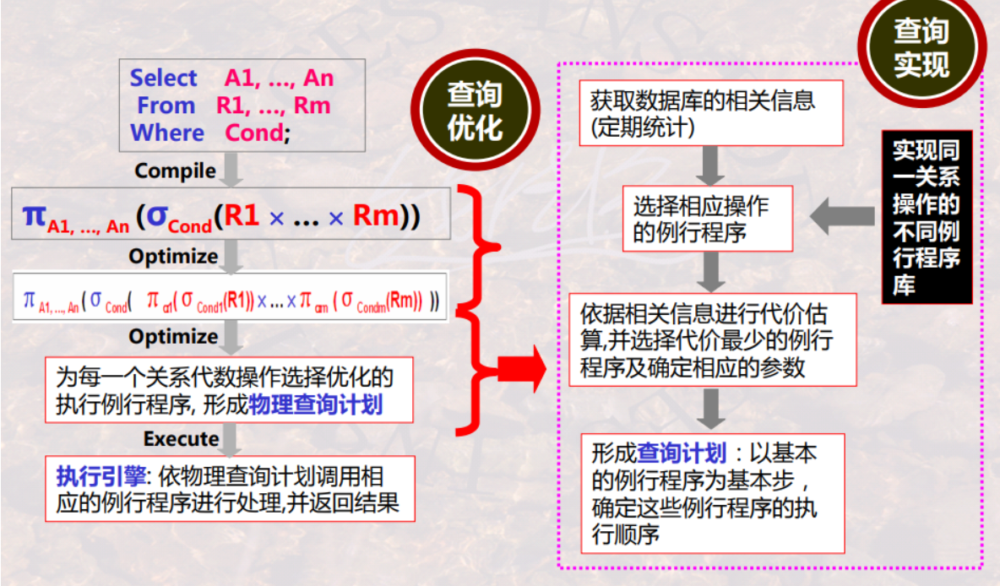

* 逻辑查询优化
    * 对关系代数的优化
* 物理查询优化
    * 降低IO次数
    * 充分利用内存减少循环

##### (2) 数据库三大类操作
* 单一元组的一元操作
* 整个关系的一元操作
* 整个关系的二元操作

#### 2.流水线计算策略（实现物理实现算法）
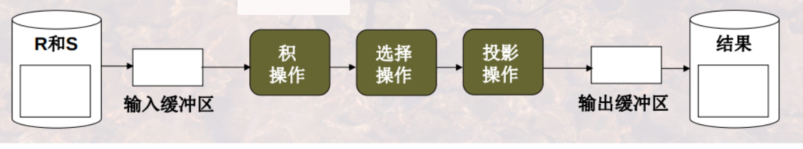

* 依赖迭代器
* 需要内存存储临时数据
    * 当内存不足时，需要多趟扫描

##### (1) 迭代器

* 一元操作
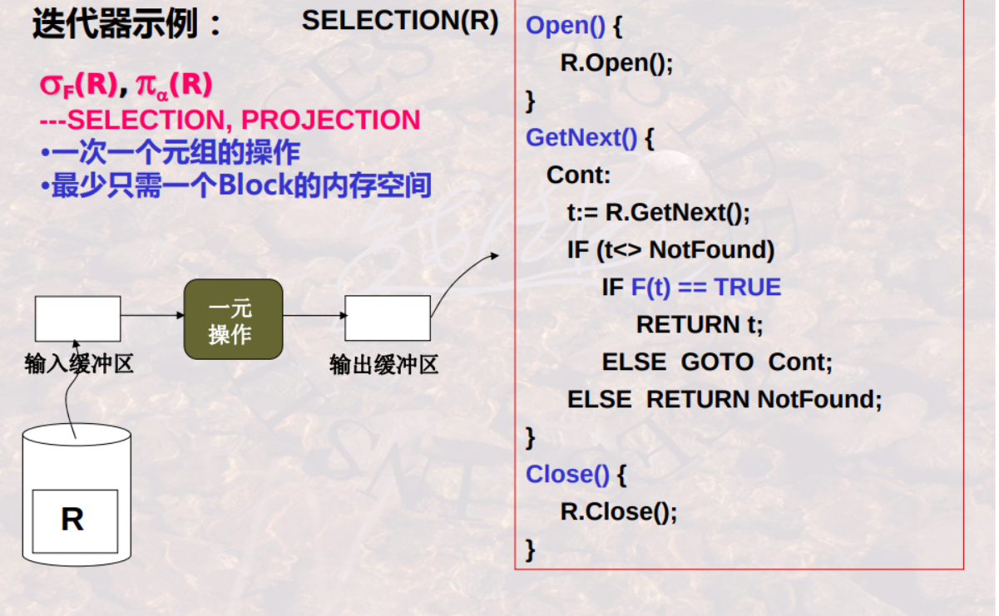
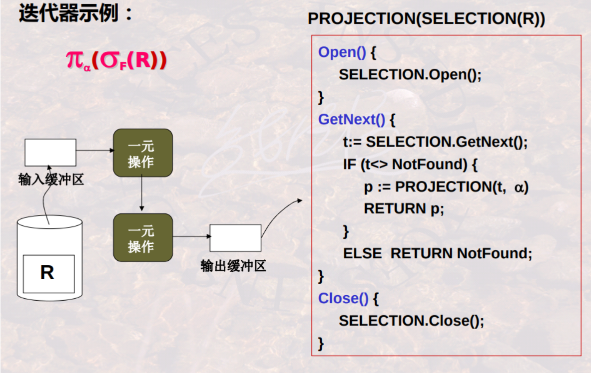

* 二元操作
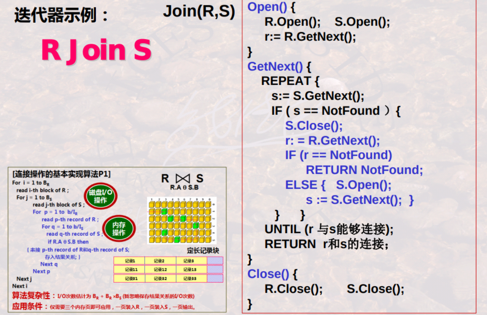

##### (2) 一趟扫描 (内存足够)
* 比如： 去重
    * 应用条件：
        * 需要在内存中保存已处理过的元组
    * 建立合适的内存结构，来保存处理过的数据
    * 算法复杂性: B(R)
    
    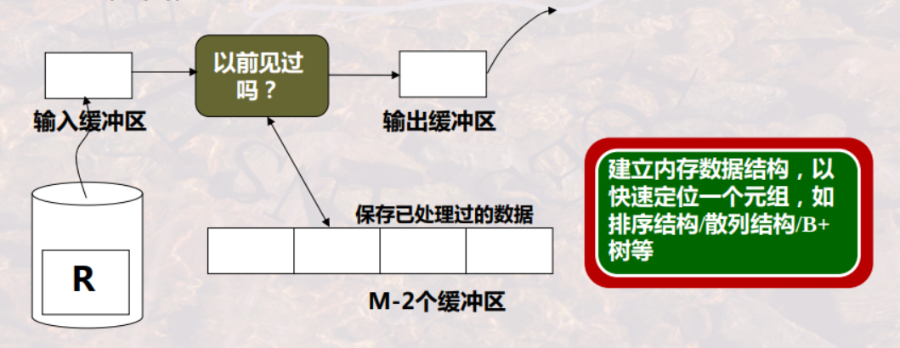

* 比如： 分组聚集
    * 应用条件：
        * 需要在内存中保存所有的分组和每个分组的信息
    * 建立合适的内存结构（这里适合使用散列），来保存处理过的数据
    * 算法复杂性: B(R)

    

***

### 物理实现算法

#### 1.表空间扫描法（以连接操作为例）

* 已知:
    * $T_R、T_S$分别是关系R和关系S的 元组数目
    * $B_R、B_S$分别是关系R和关系S存储数据的 块的数量
    * b 是每次块的字节数
    * $I_R、I_S$分别是关系R和关系S的 每个元组的字节数
    * M 是内存中能够使用的 缓存页数
* 则计算$R\times S$需要读取的块数
    * $B_{R\times S}=T_RT_S(I_R+I_S)/b$

##### (1) 基本实现算法
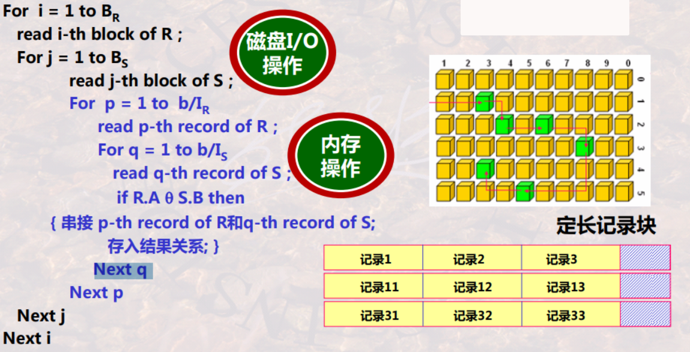

* 应用条件: 仅需要三个内存页即可应用，一页装入R，一页装入S，一页输出
* 算法复杂度（假设一次I/O只读一个数据块），则需要的I/O数：
    * $B_R+B_R\times B_S$

##### (2) 全主存实现算法
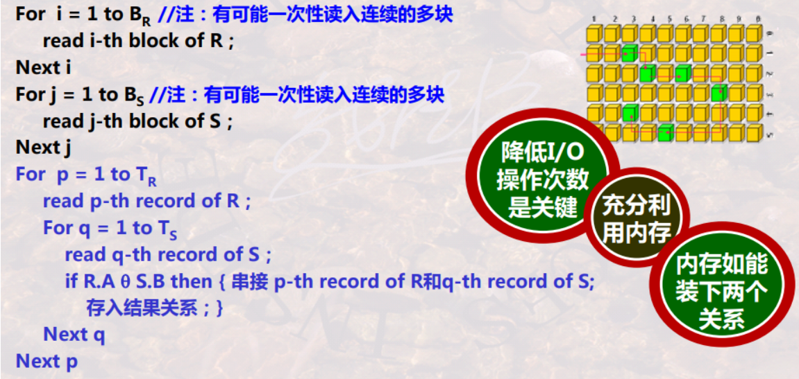

* 应用条件: $M \ge B_R+B_S$
* 算法复杂度（假设一次I/O只读一个数据块），则需要的I/O数：
    * $B_R+B_S$

##### (3) 半主存实现算法

* 应用条件: M只能装下$B_R$
* 算法复杂度（假设一次I/O只读一个数据块），则需要的I/O数：
    * $B_R+B_S$

##### (4) 大关系实现算法

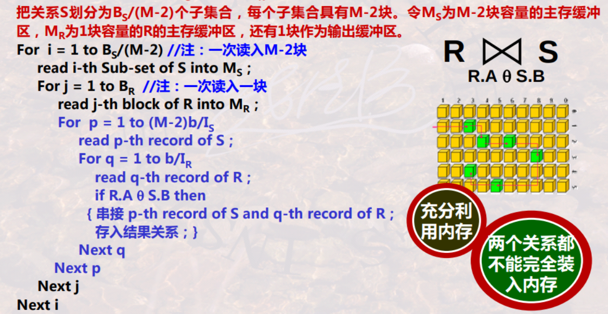

* 应用条件: $B_R \ge M、B_S \ge M$
* 算法复杂度（假设一次I/O只读一个数据块），则需要的I/O数：
    * $(B_S/(M-2))B_R+B_S$

* 优化： 内存结构采用散列，R关系通过A属性散列，S关系通过B属性散列
    * 能够减少循环

#### 2.基于索引的算法

##### (1) 应用场景
* 选择条件中有涉及到索引属性时

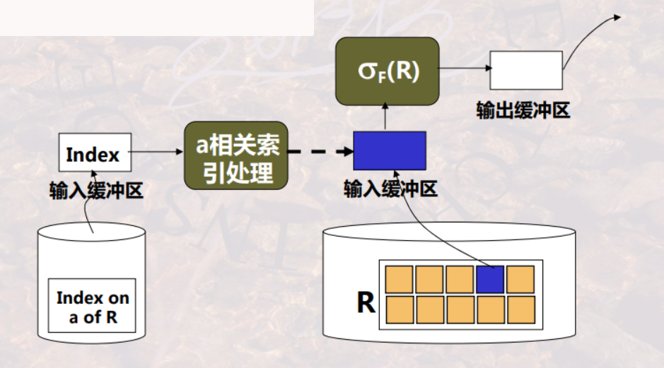

##### (2) 举例

* 已知:
    * T(R)=20000 表示关系R有2000个元组（即记录）
    * B(R)=1000 表示R关系的元组存储在1000个数据块上
    * R上有一个属性a，a上有索引
    * 考虑$\sigma_{a=0}(R)$

* 如果R数据是聚簇的，且不使用索引，查询代价＝1000个I/O
* 如果R数据不是聚簇的，且不使用索引，查询代价＝20000个I/O
* 如果a有100个不同的索引值 且 数据是聚簇的，则平均一个index对应的数据有1000/100=10个数据块，查询代价=1000/100=10个I/O
* 如果a有100个不同的索引值 且 数据是非聚簇的，则平均一个index对应的数据有20000/100=200个数据块，查询代价=20000/100=200个I/O
* 如果a有100个不同的索引值，查询代价=20000/20000  =1个I/O

##### (3) 基于有序索引的连接算法
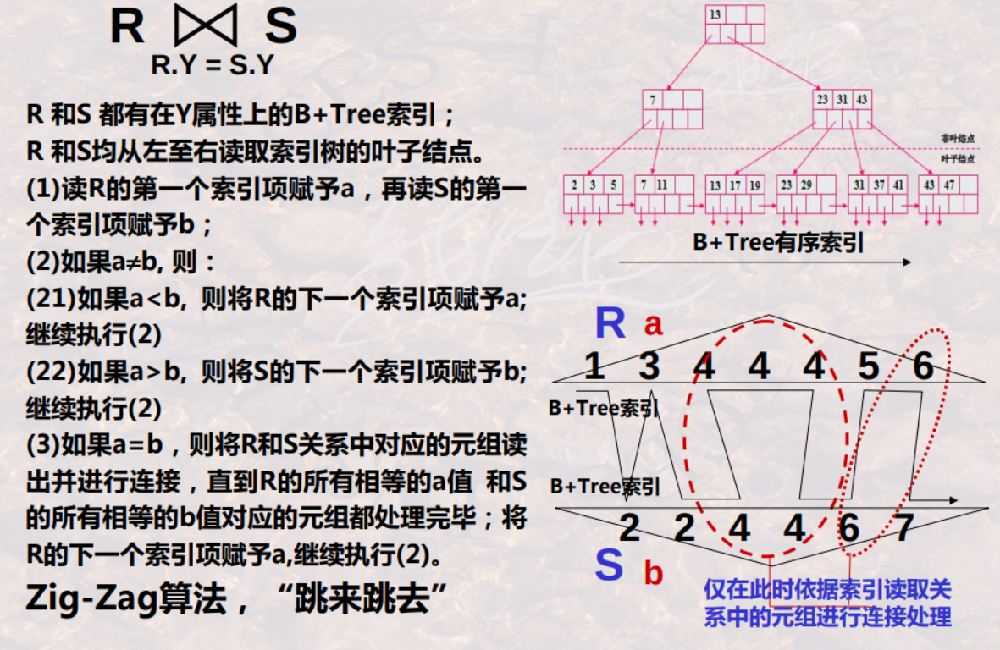