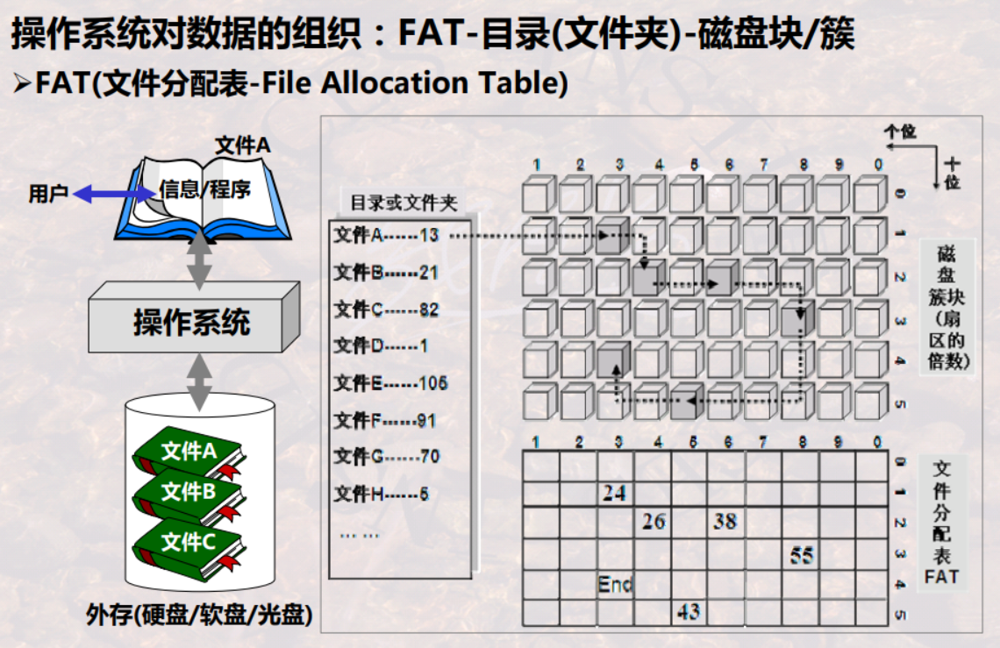
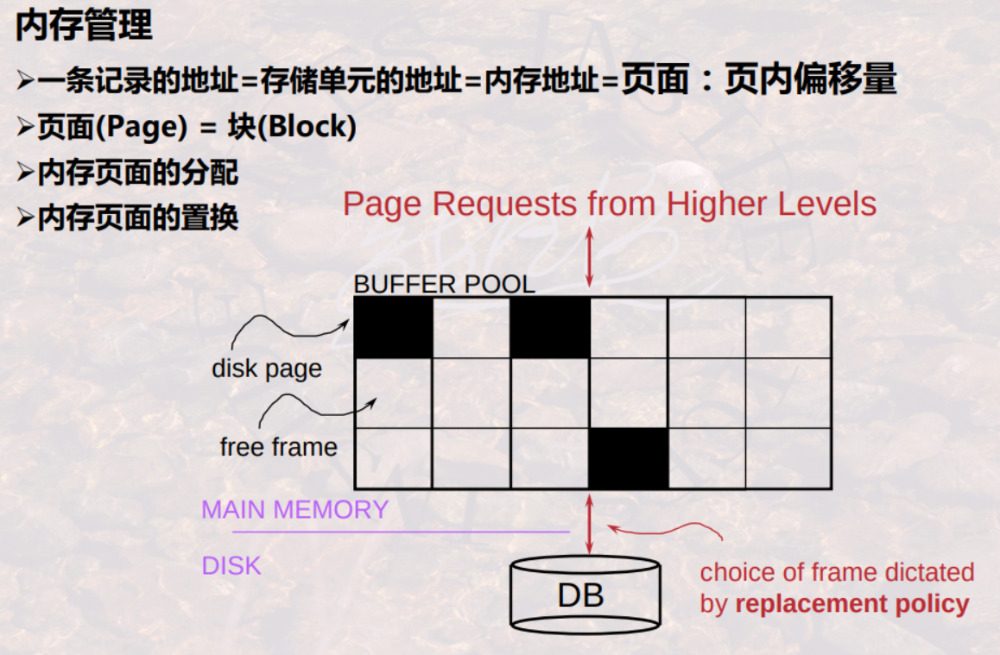
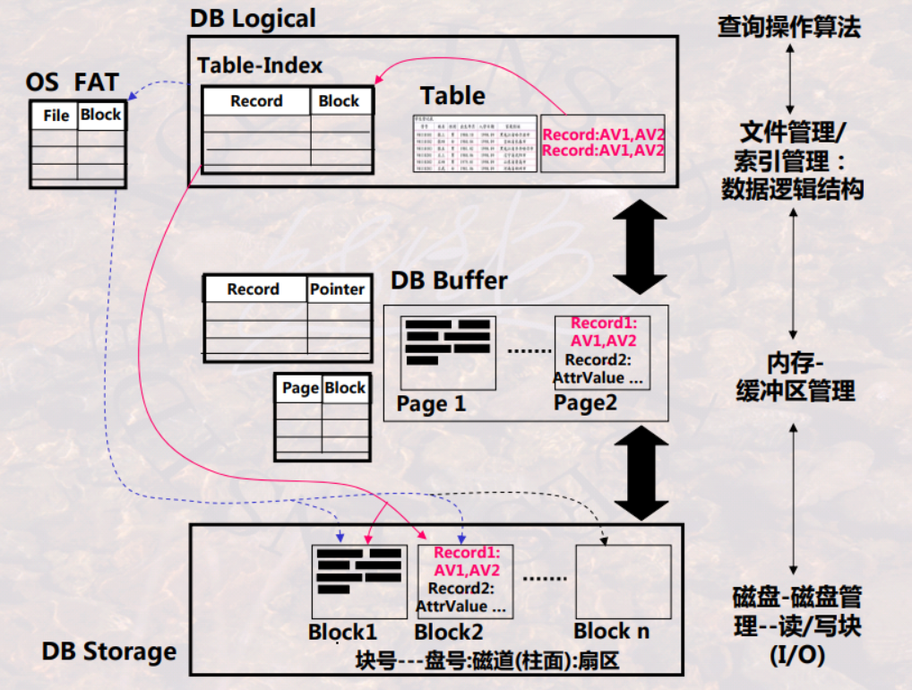
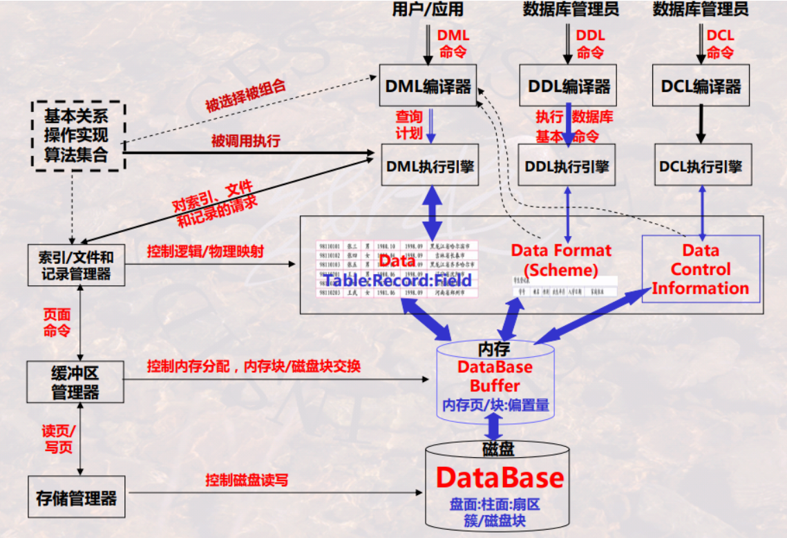
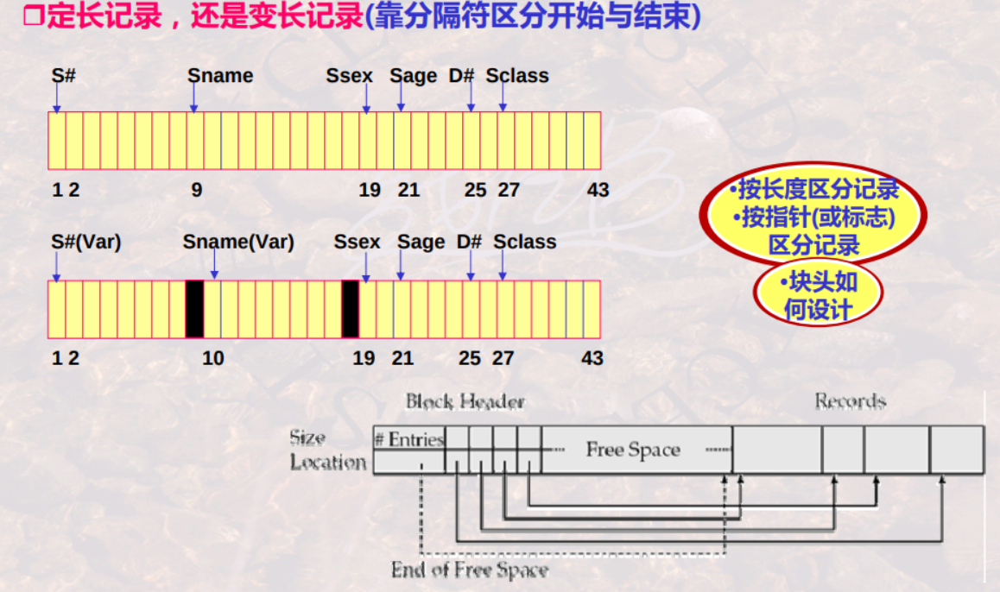
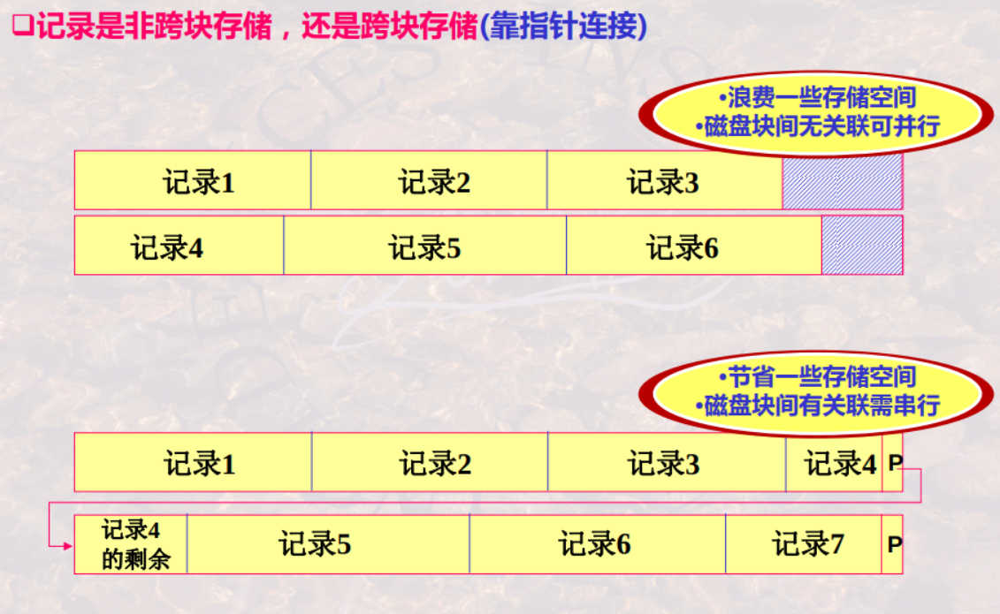
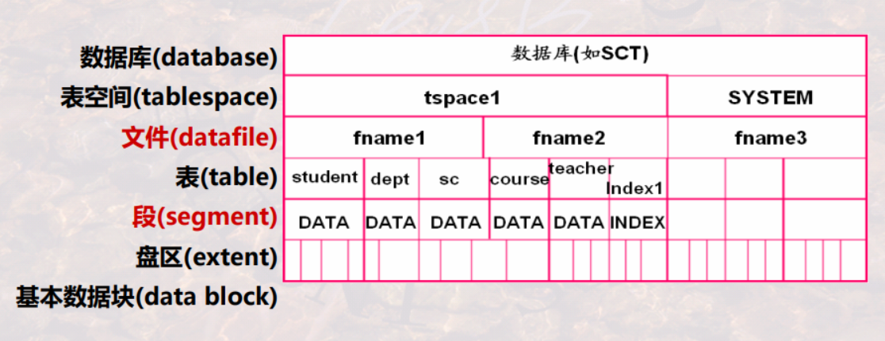
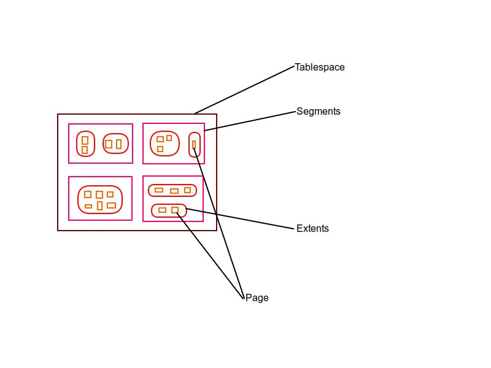

# storage system

<!-- @import "[TOC]" {cmd="toc" depthFrom=1 depthTo=6 orderedList=false} -->

<!-- code_chunk_output -->

- [storage system](#storage-system)
    - [概述](#概述)
      - [1.存储体系](#1存储体系)
        - [(1) 文件系统](#1-文件系统)
        - [(2) 内存](#2-内存)
        - [(3) 磁盘HDD](#3-磁盘hdd)
      - [2.DBMS数据存储](#2dbms数据存储)
        - [(1) 映射关系](#1-映射关系)
        - [(2) 基本架构](#2-基本架构)
      - [3.数据库记录在磁盘上的存储](#3数据库记录在磁盘上的存储)
        - [(1) 定长记录和变长记录](#1-定长记录和变长记录)
        - [(2) 非跨块和跨块存储](#2-非跨块和跨块存储)
      - [4.数据库的文件组织方法](#4数据库的文件组织方法)
        - [(1) heap file (无序记录文件)](#1-heap-file-无序记录文件)
        - [(2) sequential file (有序记录文件)](#2-sequential-file-有序记录文件)
        - [(3) hash file (散列文件)](#3-hash-file-散列文件)
        - [(4) clustering file (聚簇文件)](#4-clustering-file-聚簇文件)
      - [5.ORACLE的物理存储](#5oracle的物理存储)
        - [(1) 逻辑存储层](#1-逻辑存储层)
        - [(2) 物理存储层](#2-物理存储层)

<!-- /code_chunk_output -->

### 概述

#### 1.存储体系

##### (1) 文件系统

##### (2) 内存

##### (3) 磁盘HDD
物理存取算法考虑的关键：
* 降低I/O次数
* 降低寻道/旋转延迟时间：
    * 同一磁道连续存储
    * 同一柱面不同磁道并行存储
    * 多个磁盘并行存储

#### 2.DBMS数据存储

##### (1) 映射关系

##### (2) 基本架构

#### 3.数据库记录在磁盘上的存储

##### (1) 定长记录和变长记录

##### (2) 非跨块和跨块存储

#### 4.数据库的文件组织方法

##### (1) heap file (无序记录文件)

* 记录是无序的，可以存储于任意由空间的位置
* 特点
    * 更新效率高
        * 删除记录可以直接删除，也可以标记为删除
        * 新记录总插入到文件尾部，新记录也可以添加到删除的位置
    * 检索效率低
    * 需要周期性**数据库重组**
        * 频繁删增记录时会造成空间浪费，所以需要周期性重新组织数据库

##### (2) sequential file (有序记录文件)
* 记录按某属性或属性组值的顺序插入
* 特点
    * 更新效率可能很低
        * 在更新时要移动其他记录，为插入记录留出空间
    * 检索效率高
    * 改进:
        * 使用一个临时的无序文件(被称为溢出文件)保留新增的记录
        * 需要周期性数据库重组

##### (3) hash file (散列文件)

* 按某属性或属性组的值,依据一个散列函数来计算其应存放的位置（bucket），将记录放入其中
* 特点
    * 更新效率和检索效率都有一定的提高
    * 存在问题
        * 桶溢出、桶的数目以及桶的大小，动态散列技术等等

##### (4) clustering file (聚簇文件)
* 将具有相同或相似属性值的记录存放于连续的磁盘簇块中
* 特点
    * 将若干个相互关联的Table存储于一个文件中，这可提高多表情况下的查询速度

#### 5.ORACLE的物理存储

##### (1) 逻辑存储层

* database
  * 每个数据库分成若干个tablespace
* tablespace
  * 每个tablespace由若干个datafile（操作系统文件）构成

* datafile
  * 操作系统文件仅起**占位**的作用且**真实占用**了磁盘
    * 所以创建文件，文件的大小不应设置太大，可设置成**动态扩展**文件大小
  * 有多个文件且都有足够的空间写入，则表的数据会**轮询**写入这些文件

* table
  * 操作系统文件中 存储若干个表
  * 一个表可存储在多个文件中

##### (2) 物理存储层

* data block (数据块，也叫页)
  * 是文件IO的基本单元
* extent (区)
  * 一个区是 若干个**连续**的数据块
    * 连续的块是为了提高查询效率
* segment (段)
  * 是一组 分配了**特定数据结构** 的区