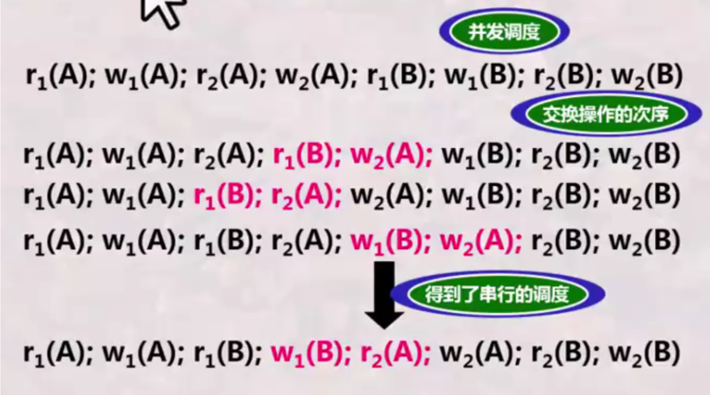
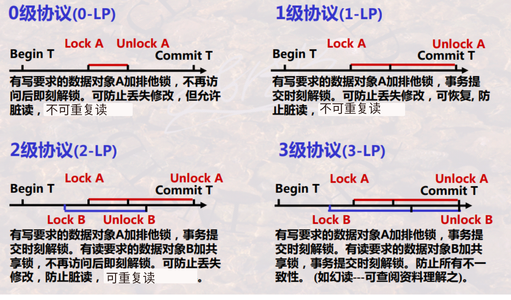
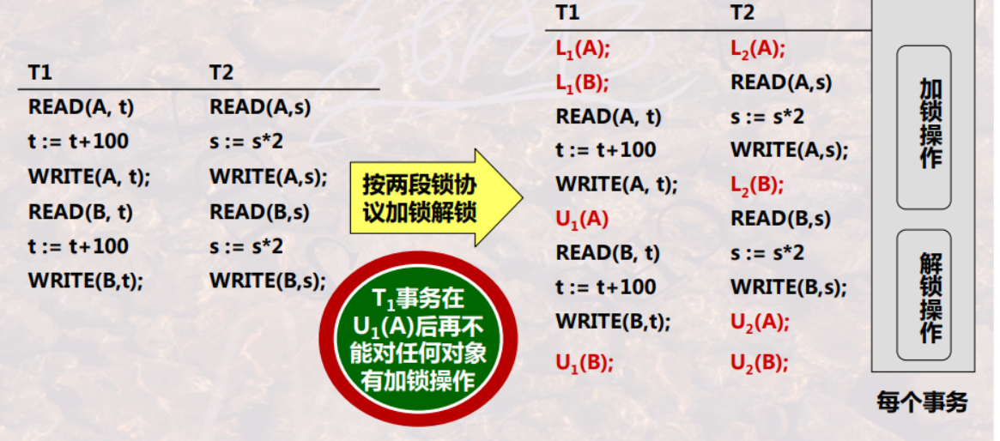
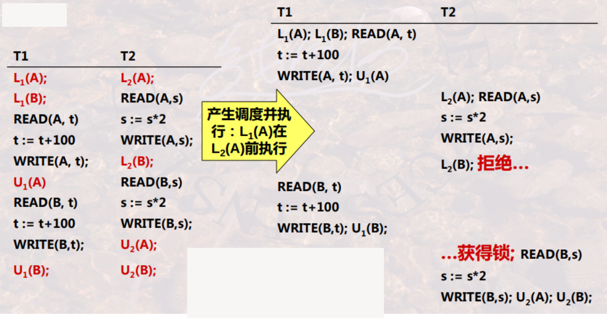
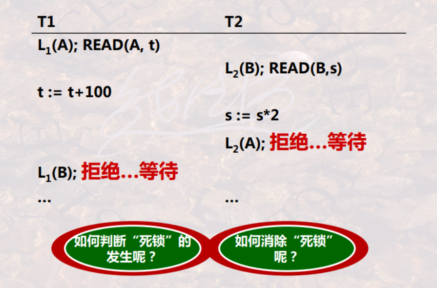

# transaction

<!-- @import "[TOC]" {cmd="toc" depthFrom=1 depthTo=6 orderedList=false} -->

<!-- code_chunk_output -->

- [transaction](#transaction)
    - [概述](#概述)
      - [1.transaction（事务）](#1transaction事务)
      - [2.ACID](#2acid)
        - [（1）Atomicity（原子性）](#1atomicity原子性)
        - [（2）Consistency（一致性）](#2consistency一致性)
        - [（3）Isolation（隔离性）](#3isolation隔离性)
        - [（4）Durability（持久性）](#4durability持久性)
      - [3.transaction schedule (事务调度)](#3transaction-schedule-事务调度)
        - [(1) serial schedule (串行调度)](#1-serial-schedule-串行调度)
        - [(2) concurrent schedule (并发调度)](#2-concurrent-schedule-并发调度)
        - [(3) seriable schedule (可串行调度)](#3-seriable-schedule-可串行调度)
      - [4.seriable schedule](#4seriable-schedule)
        - [(1) 表达事务调度的模型](#1-表达事务调度的模型)
        - [(2) 冲突](#2-冲突)
        - [(3) 冲突可串行性](#3-冲突可串行性)
        - [(4) 冲突可串行性判别算法](#4-冲突可串行性判别算法)
      - [5.基于锁的并发控制](#5基于锁的并发控制)
        - [(1) 锁的类型](#1-锁的类型)
        - [(2) 加锁/解锁的时机](#2-加锁解锁的时机)
        - [(3) SQL隔离级别](#3-sql隔离级别)
        - [(4) 锁的粒度 (locking granularity)](#4-锁的粒度-locking-granularity)
      - [6.两段锁协议 (基于锁的并发控制)](#6两段锁协议-基于锁的并发控制)
        - [(1) 2LP (two-phase locking protocol)](#1-2lp-two-phase-locking-protocol)
        - [(2) 满足冲突可串行性](#2-满足冲突可串行性)
        - [(3) 可能产生死锁](#3-可能产生死锁)

<!-- /code_chunk_output -->

### 概述

#### 1.transaction（事务）
一个工作单元，即执行**一组SQL语句**，这个操作是**原子**的

#### 2.ACID

#####  （1）Atomicity（原子性）

##### （2）Consistency（一致性）
* 数据需要满足一定的规则
比如从A账号转200到B账号
当A账号减掉200的同时，B账号必须同时增加200（因为需要满足A+B的值不变的规则）
当A账号不足200时，该操作必须失败（因为需要满足>=0的规则）
 
* 实现一致性的方式：
  * 通过AID保证C，即AID是手段，C是目的

##### （3）Isolation（隔离性）
事务的结果通常对其他事务不可见，直到该事务完成为止。

##### （4）Durability（持久性）
事务的更改是永久的，即使在事务完成的瞬间，服务器宕机了，数据也不会丢失

#### 3.transaction schedule (事务调度)

用于描述 多个事务 的执行顺序，即 多个事务中的操作是如何交错执行的

##### (1) serial schedule (串行调度)
* 事务按顺序一个一个执行

##### (2) concurrent schedule (并发调度)
* 多个事务从宏观上看是并行执行的
    * 但其微观上的基本操作(读、写)则是交叉执行的

* 并发调度的正确性
    * 当并发调度是可串行的，则称该并发调度是正确的
    * 判断方法： 判断并发调度是否具有冲突可串行性

##### (3) seriable schedule (可串行调度)
* 一个调度对数据库状态的影响都和某个串行调度相同，则称可串行调度
* 可串行化调度一定是正确的并行调度

#### 4.seriable schedule

##### (1) 表达事务调度的模型
* 事务表达：
    * $r_T(A)$: 事务T读A
    * $w_T(A)$: 事务T写A
* 事务调度表达，比如:
    * 事务1的调度
        * $T_1:r_1(A);w_1(A);r_1(B);w_1(B)$
    * 事务2的调度
        * $T_2:r_2(A);w_2(A);r_2(B);w_2(B)$
    * 事务1和2的调度
        * $r_1(A);w_1(A)；r_2(A);w_2(A);$

##### (2) 冲突
* 调度中一对连续的动作，如果他们的顺序交换，那么涉及的事务中至少有一个事务的行为会改变

* 存在以下几种冲突情况
    * 同一事务的任何两个操作都是冲突的
        * $r_i(X);w_i(Y)$
        * $w_i(X);r_i(Y)$
    * 不同事务对同一元素的两个写操作是冲突的
        * $w_i(X);w_j(Y)$
    * 不同事务对同一元素的一读一写操作是冲突的
        * $r_i(X);w_j(X)$
        * $w_i(X);r_j(X)$

##### (3) 冲突可串行性
* 一个调度，如果通过交换相邻两个**无冲突**的操作能够转换到某一个**串行**的调度，则称此调度为冲突可串行化的调度

##### (4) 冲突可串行性判别算法
* 构造一个前驱图(有向图)
* 结点是每一个事务Ti
* 如果Ti的一个操作与Tj的一个操作发生冲突 且Ti在Tj前执行
    * 则绘制一条边，由Ti指向Tj, 表征Ti要在Tj前执行
* 测试检查: 如果此有向图没有环，则是冲突可串行化的

#### 5.基于锁的并发控制

##### (1) 锁的类型

* 排他锁 X (exclusive locks)
    * 只有一个事务能读、写
* 共享锁 S (shared locks)
    * 所有事务都可以读，但任何事务都不能写
* 更新锁 U (update locks)
    * 初始读，以后可升级为写
* 增量锁 I (incremental locks)
    * 对于一部分数据库，对数据库的操作仅仅只涉及加与减操作。这样针对这种情况，我们引入增量锁
    * inc(A,c)
        * A - 为属性的值
        * c - 为增加的量（c可以为负数）

* 锁的相容性

|持有的锁 \ 申请的锁|S|X|U|
|-|-|-|-|
|S|Y|N|Y|
|X|N|N|N|
|U|N|N|N|

##### (2) 加锁/解锁的时机

* 读未提交 (read uncommitted) ---相当于0级协议
* 读已提交 (read committed) ---相当于1级协议
* 可重复读(repeatable read) ---相当于2级协议
* 可串行化(serializable) ---相当于3级协议

##### (3) SQL隔离级别

* 脏读 (dirty reads)
    * 读到**未提交**的数据
* 可重复读 (repeatable reads)
    * 在一个事务中，**多次**读**同一条记录**，数据都一样，不会因为中途另一个事务的提交而导致读的数据不一样
* 幻读 (phantom reads)
    * 在一个事务中，能够读取另一个并发事务**新增或删除**的**记录**

|隔离级别|脏读|不可重复读|幻读|
|-|-|-|-|
|读未提交 (read uncommitted)|Y|Y|Y|
|读提交 (read committed)|N|Y|Y|
|可重复读 (repeatable read)|N|N|Y（mysql在这个隔离级别，解决了幻读的问题）|
|串行化 (serializable)|N|N|N|

##### (4) 锁的粒度 (locking granularity)

* 属性值、元组、元组集合、整个关系、整个DB某索引项、整个索引
    * 由前往后:  并发度小，锁的开销小

#### 6.两段锁协议 (基于锁的并发控制)

##### (1) 2LP (two-phase locking protocol)
* 在一个事务中
* 读写数据之前一定要获得锁
* 所有加锁请求 先于 任何一个 解锁请求
    * 即分为两个阶段：加锁段和解锁段

* 按照2LP加锁举例:

##### (2) 满足冲突可串行性
* 两段封锁协议是可以保证冲突可串行性的
* 所以是正确的并发控制

* 两个按照2LP加锁的事务 并发调度 举例

* 如果将L1(B)这个锁放在U1(A)后面，则T2的事务可能在T1的中间（即U1(A)）后面执行完，由于T1和T2中对B的操作有冲突，所以不符号冲突可串行性，所以这不是一个正确的并发调度

##### (3) 可能产生死锁
