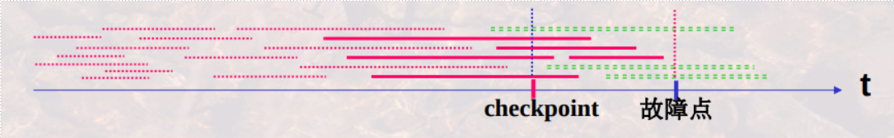
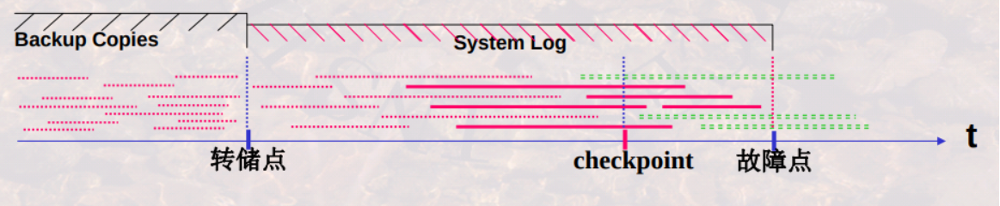
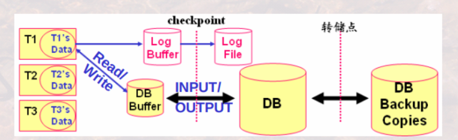
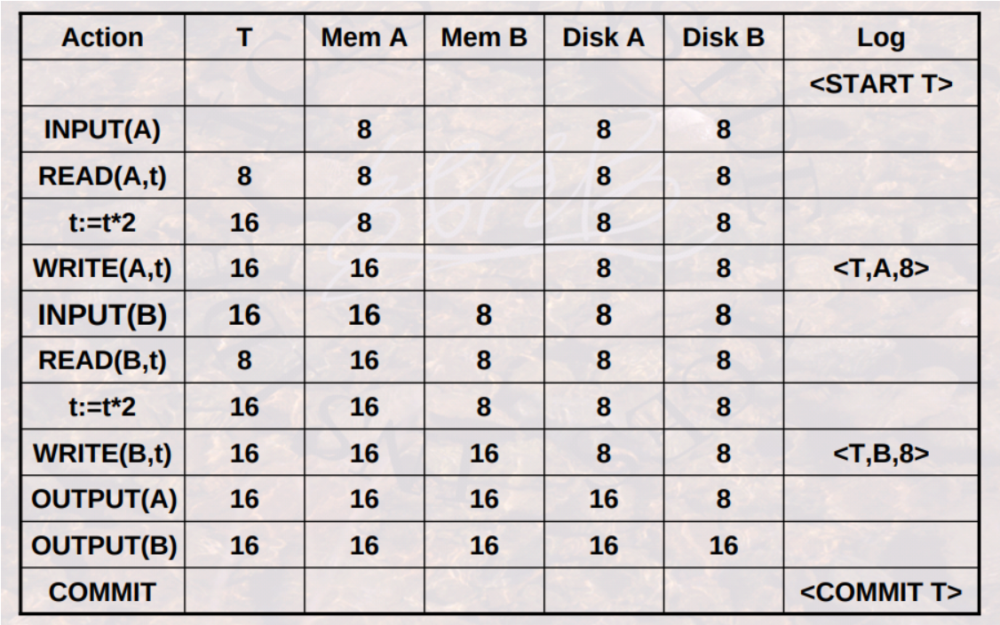
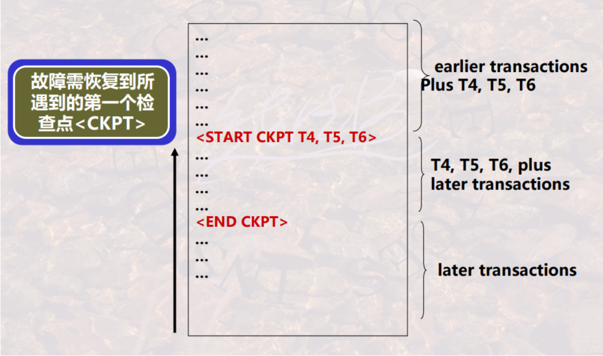
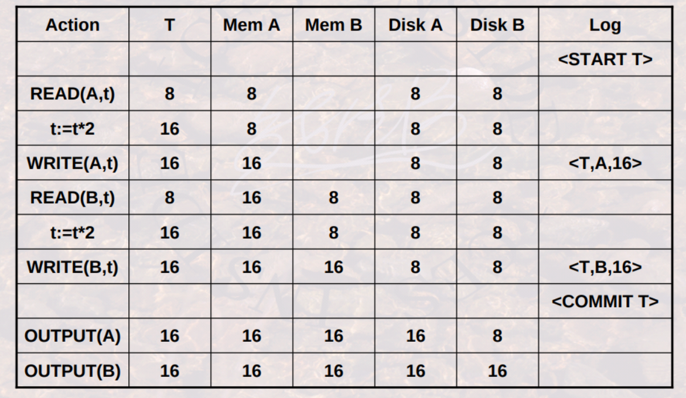
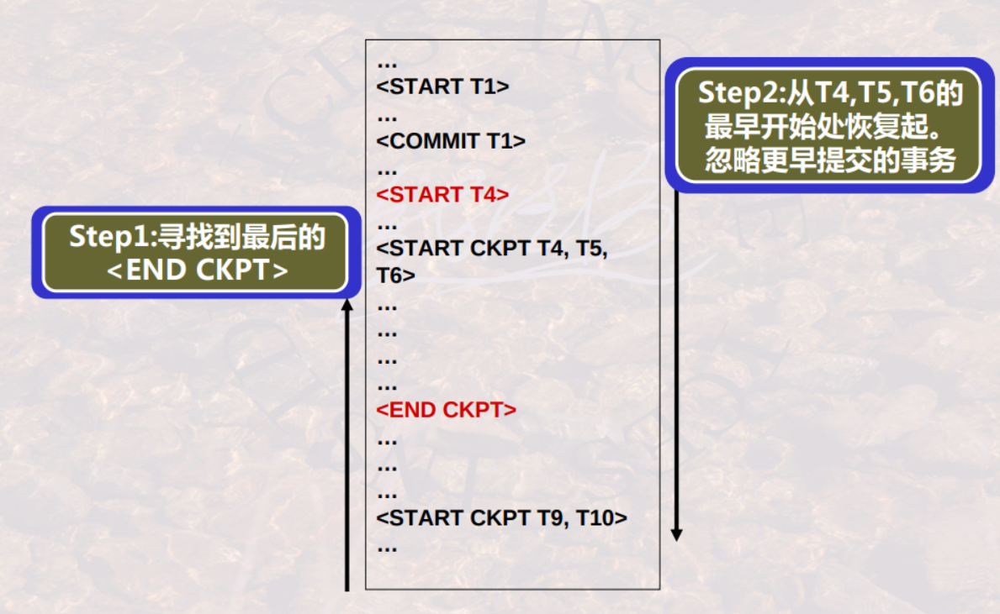
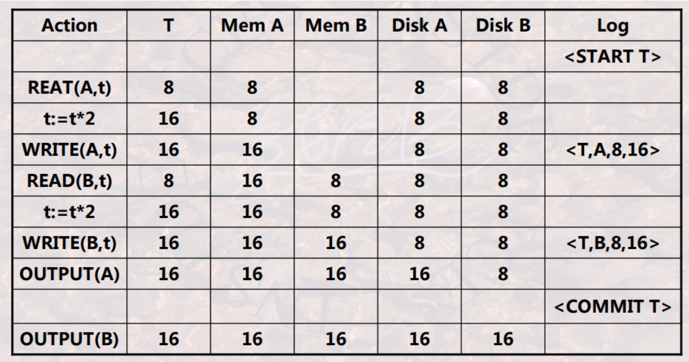

# fault recovery

<!-- @import "[TOC]" {cmd="toc" depthFrom=1 depthTo=6 orderedList=false} -->

<!-- code_chunk_output -->

- [fault recovery](#fault-recovery)
    - [概述](#概述)
      - [1.数据库的故障](#1数据库的故障)
        - [(1) 事务故障](#1-事务故障)
        - [(2) 系统故障](#2-系统故障)
        - [(3) 介质故障](#3-介质故障)
      - [2.故障恢复的要求](#2故障恢复的要求)
      - [3.事务故障恢复](#3事务故障恢复)
      - [4.系统故障恢复](#4系统故障恢复)
        - [(1) 运行日志(Transaction Log)](#1-运行日志transaction-log)
        - [(2) WAL (write ahead logging)](#2-wal-write-ahead-logging)
        - [(3) 检查点(checkpoint)](#3-检查点checkpoint)
        - [(4) 系统故障的恢复](#4-系统故障的恢复)
      - [5.介质故障恢复](#5介质故障恢复)
        - [(1) 副本 (copy)](#1-副本-copy)
        - [(2) 转储点 (Savepoint)](#2-转储点-savepoint)
        - [(3) 介质故障的恢复](#3-介质故障的恢复)
      - [6.事务和存储](#6事务和存储)
        - [(1) 事务涉及到的操作](#1-事务涉及到的操作)
        - [(2) 缓冲区处理策略](#2-缓冲区处理策略)
        - [(3) 缓冲区处理策略与日志/恢复策略的关系](#3-缓冲区处理策略与日志恢复策略的关系)
      - [7.运行日志详述](#7运行日志详述)
        - [(1) 日志记录的信息](#1-日志记录的信息)
        - [(2) 静止检查点和非静止检查点](#2-静止检查点和非静止检查点)
        - [(3) undo型日志](#3-undo型日志)
        - [(4) redo型日志](#4-redo型日志)
        - [(5) undo/redo结合型日志](#5-undoredo结合型日志)

<!-- /code_chunk_output -->

### 概述

#### 1.数据库的故障

##### (1) 事务故障
某一个程序(事务)自身运行错误所引起的故障
* 影响该程序(事务)本身

##### (2) 系统故障
由于掉电、非正常关机等所引起的故障
* 影响正在运行的事务以及数据库缓冲区, 数据库缓冲区将涉及正在运行和已经运行的事务

##### (3) 介质故障
由于介质损坏等所引起的故障
* 影响是全面的，既影响内存中的数据, 又影响介质中存储的数据

#### 2.故障恢复的要求

要保证事务的 
* 原子性
* 持久性
    * 已提交的事务对数据库产生的影响是持久的
    * 未提交的事务对数据库不应有影响

#### 3.事务故障恢复

* 重做事务(Redo)
    * 重做事务可保证已提交事务的持久性
* 撤消事务(Undo)
    * 撤销事务则消除未提交事务的影响

#### 4.系统故障恢复

##### (1) 运行日志(Transaction Log)
* DBMS维护的一个文件，该文件以流水方式记录了**每一个事务**对数据库的每一次操作及操作顺序
* 运行日志直接写入**介质存储**上 (经过缓冲立即写入介质)

##### (2) WAL (write ahead logging)
* 当事务对数据库进行操作时：
    * 先写**运行日志**
    * 写成功后，再与**数据库缓冲区**进行信息交换

##### (3) 检查点(checkpoint)
* 在该时刻, DBMS强制使内存DB Buffer中的内容与介质DB中的内容保持一致，即将DB Buffer更新的所有内容写回DB中
* 在检查点之前**内存**中数据与**介质**中数据是保持**一致**的

##### (4) 系统故障的恢复
* 按照运行日志记录的事务操作顺序恢复
    * 检查点之前结束的事务不需要恢复(已经写回DB)
    * 检查点之后结束或发生的事务需要依据运行日志进行恢复(不能确定是否写回DB):
        * 故障点前结束的事务Redo
        * 故障点时刻未结束的事务Undo

* 红虚线
    * 表示在checkpoint前已经完成的事务
    * 这些事务不需要进行系统故障恢复
* 红实线
    * 表示在checkpoint还未完成，在故障点前已经完成的事务
    * 进行系统故障恢复时，这些事务需要Redo
* 绿虚线
    * 表示在故障点还未完成的事务
    * 进行系统故障恢复时，这些事务需要Undo

#### 5.介质故障恢复

##### (1) 副本 (copy)

在某一时刻，对数据库在其他介质存储上产生的另一份等同记录

##### (2) 转储点 (Savepoint)

* 在转储点之前的数据都进行了备份
* 转储点的确定
    * 过频，影响系统工作效率
    * 过疏，会造成运行日志过大，也影响系统运行性能

##### (3) 介质故障的恢复
* 用副本替换被破坏的数据库
* 在用副本恢复后还需要依据运行日志进行恢复

#### 6.事务和存储

##### (1) 事务涉及到的操作

* 元素
    * 通常， 1 元素 = 1 磁盘块 = 1 内存页/块
    * 可以更小，=1 记录 或更大 =1 关系

* READ(X,t)：将元素X读到事务的局部变量t中
* WRITE(X,t)：将事务局部变量t写回元素X
* INPUT(X)：将元素X从磁盘读入到内存缓冲区中
* OUTPUT(X)：将元素X写回到磁盘中
* COMMIT：事务提交
* ABORT：事务撤销

##### (2) 缓冲区处理策略
* Force：内存中的数据最晚在commit的时候写入磁盘
* No force：内存中的数据可以一直保留，在commit之后过一段时间再写入磁盘
    * 此时在系统崩溃的时候可能还没写入到磁盘，需要Redo
* Steal：允许在事务commit之前把内存中的数据写入磁盘
* No steal：不允许在事务commit之前把内存中的数据写入磁盘

##### (3) 缓冲区处理策略与日志/恢复策略的关系

#### 7.运行日志详述

##### (1) 日志记录的信息

* `<Start T>`，表示事务T已经开始
* `<Commit T>`，表示事务T成功完成
* `<Abort T>`，事务T未成功，被中止
* 对于undo型日志: `<T, X, v1>`
    * 表示事务T改变了数据库元素X，X原来的值为v1(X的旧值)
* 对于redo型日志: `<T, X, v2>`
    * 表示事务T改变了数据库元素X，X新的值为v2
* 对于undo/redo结合型日志: `<T, X, v1,v2>`
    * 表示事务T改变了数据库元素X，X原来的值为v1(X的旧值)，X新的值为v2

##### (2) 静止检查点和非静止检查点
* 静止检查点
    * 停止接受新的事务, 等到所有当前活跃事务提交或终止，并在日志中写入了COMMIT或ABORT记录后
    * 将日志刷新到磁盘，写入日志记录`<CKPT>`，并再次刷新日志

* 非静止检查点
    * 在设置检查点时不必关闭系统，允许新事务进入
    * 写入一条`<START CKPT(T1,…,Tk)>`
        * 其中T1,…,Tk 是所有活跃的未结束的事务
    * 继续正常的操作，直到T1,…,Tk都完成时，写入`<END CKPT>`

##### (3) undo型日志

* 对于任一事务T，按下列顺序执行
    * 首先，`<T, X, v>`被写到日志中
    * 其次，OUTPUT(X)（即将数据写入磁盘）
    * 最后，`<COMMIT T>`或`<ABORT T>`被写到日志中（即commit或abort事务）

* 举例

* 利用undo型日志进行恢复
    * 从日志的**尾部开始**按日志记录的反序，处理每一日志记录，**撤销** **未完成**事务（即没有commit的事务）的所有修改
    * 结合非静止checkpoint
    
        * 找到最后一个checkpoint
        * 从后往前恢复到该checkpoint的`<start CKPT ...>`那里（即undo）

* 缺点
    * 可能引起性能下降(因可能频繁地写磁盘)

##### (4) redo型日志

* 对于任一事务T，按下列顺序执行
    * 首先，`<T, X, v>`被写到日志中
    * 其次，`<COMMIT T>`被写到日志中（即commit事务）
    * 最后，OUTPUT(X)（即将数据写入磁盘）

* 举例

* 利用undo型日志进行恢复
    * 从日志的**起始位置**开始按日志记录的正序处理每一日志记录，**重做** **已提交**事务的所有修改
    * 结合非静止checkpoint
    
        * 找到最后一个checkpoint
        * 从该checkpoint的`<start CKPT ...>`恢复到最后（即redo）

* 缺点
    * 灵活性差(数据必须在Commit后才可见)

##### (5) undo/redo结合型日志
* 对于任一事务T，按下列顺序执行
    * 首先，`<T, X, u, v>`被写到日志中
    * `<COMMIT T>`和OUTPUT(X) 无所谓顺序

* 举例

* 利用undo/redo结合型日志进行恢复
    * 自前向后地，按日志记录的正序，重做所有已提交的事务
    * 自后向前，按日志记录的反序，撤销所有未完成事务的所有修改