# normal form

<!-- @import "[TOC]" {cmd="toc" depthFrom=1 depthTo=6 orderedList=false} -->

<!-- code_chunk_output -->

- [normal form](#normal-form)
    - [概述](#概述)
      - [1.函数依赖](#1函数依赖)
        - [(1) 定义](#1-定义)
        - [(2) 完全或部分 函数依赖](#2-完全或部分-函数依赖)
        - [(3) 传递函数依赖](#3-传递函数依赖)
      - [2.函数依赖基本概念](#2函数依赖基本概念)
        - [(1) 候选键、主键、外键、超键](#1-候选键-主键-外键-超键)
        - [(2) 逻辑蕴含 (logical implication)](#2-逻辑蕴含-logical-implication)
        - [(3) 闭包 (closure)](#3-闭包-closure)
      - [3.函数依赖的公理和定理](#3函数依赖的公理和定理)
        - [(1) 公理](#1-公理)
        - [(2) 定理](#2-定理)
        - [(3) 属性闭包](#3-属性闭包)
      - [4.函数依赖的覆盖 (cover)](#4函数依赖的覆盖-cover)
        - [(1) 覆盖](#1-覆盖)
        - [(2) 定理](#2-定理-1)
        - [(3) 最小覆盖](#3-最小覆盖)
      - [5.范式 (normal form)](#5范式-normal-form)
        - [(1) 第一范式 (1NF)](#1-第一范式-1nf)
        - [(2) 第二范式 (2NF)](#2-第二范式-2nf)
        - [(3) 第三范式 (3NF)](#3-第三范式-3nf)
        - [(4) Boyce-Codd范式 (BCNF)](#4-boyce-codd范式-bcnf)
        - [(5) 第四范式 (4NF)](#5-第四范式-4nf)
      - [6.多值依赖](#6多值依赖)
        - [(1) 定义](#1-定义-1)
      - [7.模式分解](#7模式分解)
        - [(1) 定义](#1-定义-2)
        - [(2) 无损连接性和保持依赖性](#2-无损连接性和保持依赖性)
      - [8.连接依赖 (JD)](#8连接依赖-jd)

<!-- /code_chunk_output -->

### 概述

#### 1.函数依赖

##### (1) 定义
* 设关系$R(A_1,A_2,...,A_n)$，X和Y均为$(A_1,A_2,...,A_n)$的子集
    * 任意两元组u、v中对应的X属性相等，
    * 则有u、v中对应的Y属性也相等
* 则称X函数决定Y（或Y依赖于X）
* 记为$X\rightarrow Y$

* 举例

##### (2) 完全或部分 函数依赖
* 对于关系$R(A_1,A_2,...,A_n)$，有函数依赖$X\rightarrow Y$
    * 若对于X的真子集X'都有$X'\nrightarrow Y$
        * 则称Y完全函数依赖于X，记作$X\xrightarrow{f} Y$
        * 否则称Y部分函数依赖于X，记作$X\xrightarrow{p} Y$

* 举例
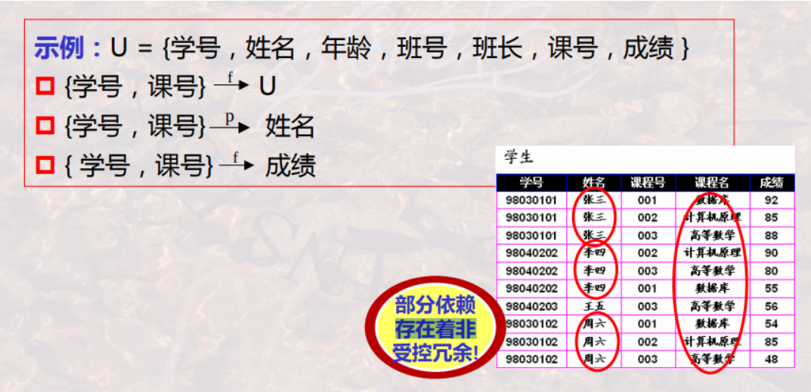

##### (3) 传递函数依赖

* 对于关系$R(A_1,A_2,...,A_n)$，有函数依赖$X\rightarrow Y$，$Y\rightarrow Z$
    * 且$Y\nsubseteq X$，$Z\nsubseteq X$，$Z\nsubseteq Y$，$Y\nrightarrow X$
    * 则$X\rightarrow Z$，则称Z传递函数依赖于X

* 举例
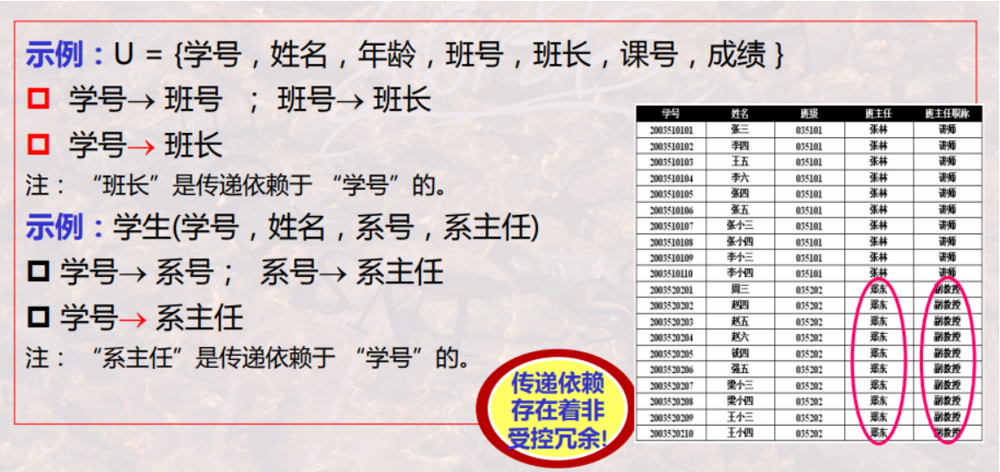

#### 2.函数依赖基本概念

##### (1) 候选键、主键、外键、超键
通过函数依赖的角度定义（本质和数据库中定义的一样）
* 设K为R(U)中的**属性组**，若$K\xrightarrow{f} U$
    * 则称K是R(U)上的候选建

* 若 $K\subset S$，则称S是R(U)上的超键
* 可任选一个候选键作为R的主键
* 包含在候选键中的属性称为主属性，其他属性称为非主属性
* 关系R中的一个属性组，它不是R的候选键，是另一个关系S的候选键

##### (2) 逻辑蕴含 (logical implication)

* 设F是关系模式R(U)中的一个函数依赖集合，X，Y是U的属性子集
    * 如果从 F中的函数依赖 能够推导出 $X\rightarrow Y$
    * 则称F逻辑蕴涵$X\rightarrow Y$
    * 记作$F\models X\rightarrow Y$

##### (3) 闭包 (closure)

* 设F是关系模式R(U)中的一个函数依赖集合
    * 被F逻辑蕴涵的所有函数依赖集合
    * 称为F的必包，记作$F^+$

#### 3.函数依赖的公理和定理

##### (1) 公理
* 设关系$R(U)$，其中U是属性集$(A_1,A_2,...,A_n)$，F为R(U)的一个函数依赖集，记为R(U,F)
    * 自反律
        * 若$Y\subseteq X\subseteq U$，则F逻辑蕴涵$X\rightarrow Y$
    * 增广律
        * 若F中包括$X\rightarrow Y$，且$Z\subseteq U$，则F逻辑蕴涵$XZ\rightarrow YZ$
    * 传递律
        * 若F中包括$X\rightarrow Y$，且$Y\rightarrow Z$，则F逻辑蕴涵$X\rightarrow Z$

##### (2) 定理
* 合并律
    * 若$X\rightarrow Y$且$X\rightarrow Z$，则$X\rightarrow YZ$
* 伪传递律
    * 若$X\rightarrow Y$且$WY\rightarrow Z$，则$XW\rightarrow Y$
* 分解律
    * 若$X\rightarrow Y$且$Z\subseteq Y$，则$X\rightarrow Z$

##### (3) 属性闭包
* 对于R(U, F)，其中U是属性集$(A_1,A_2,...,A_n)$，F为R(U)的一个函数依赖集
    * $X^+_{F}=\{A_i|其中A_i是U中的单属性，X\subseteq U，且能够根据上述几个公理从F推导出X\rightarrow A_i\}$
    * 则称$X^+_{F}$是X关于F的属性闭包

* 计算方式
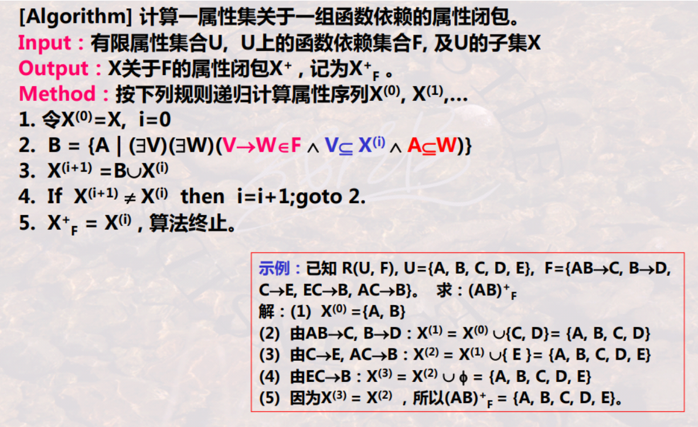

#### 4.函数依赖的覆盖 (cover)

##### (1) 覆盖
* 对R(U)上的两个函数依赖集合F、G,
    * 如果$F^+=G^+$
    * 则称F和G是等价的，也称F覆盖G 或者 G覆盖F

##### (2) 定理
* 每个函数依赖集F 可被 一个 其右端只有一个属性 的函数依赖之集G 覆盖
    * 其右端只有一个属性 的函数依赖之集G，形如: $G=\{A\rightarrow XX, B\rightarrow XX, C \rightarrow XX\}$

##### (3) 最小覆盖
* 函数依赖集F为最小覆盖需要满足：
    * F中每个函数依赖的右部是单个属性
    * 对于任何$(X\rightarrow A) \in F$，有$F-\{X\rightarrow A\}$不等价于F
    * 对于任何$(X\rightarrow A) \in F$，$Z\subset X$，$(F-\{X\rightarrow A\})\cup \{Z\rightarrow A\}$不等价于F

#### 5.范式 (normal form)

##### (1) 第一范式 (1NF)
* 若关系模式R(U)中关系的每个分量都是**不可分的数据项**
* 则称R(U)属于第一范式，记为$R(U)\in 1NF$

* 举例
    * Star( name, address(street, city) )
    * Start不属于1NF

* 不符合1NF的处理 
    * 将 非1NF转换为 1NF
    * 引入新的数据模型处理：Object-Oriented Data Mode

##### (2) 第二范式 (2NF)
* 若$R(U)\in 1NF$，U中的每一个**非主属性** **完全依赖于 候选键**
* 则称R(U)属于第二范式，记为$R(U)\in 2NF$

* 举例
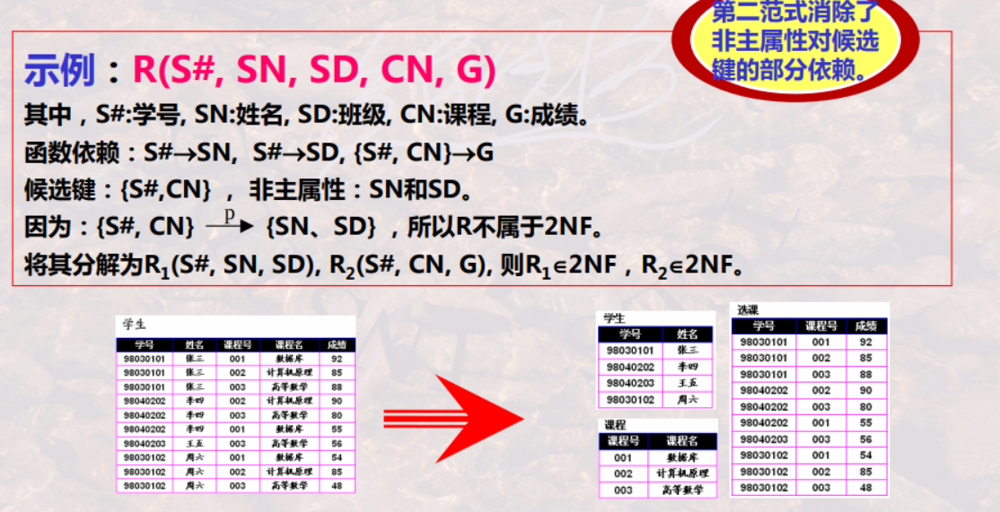
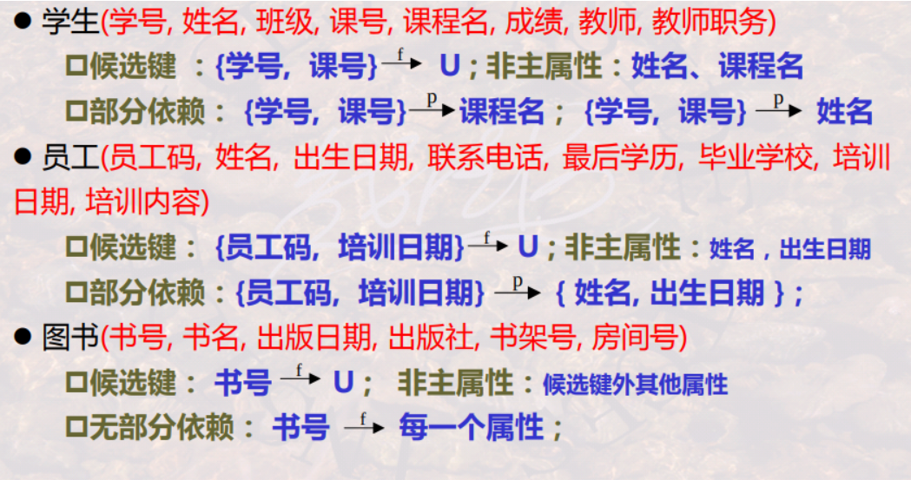

##### (3) 第三范式 (3NF)
* 若$R(U,F)\in 2NF$，不满足下面的情况：
    * 候选键X，属性组$Y\subseteq U$，非主属性A （且$A\notin X，A\notin Y，Y\nsubseteq X，Y\nrightarrow X$）
    * 使得$X\rightarrow Y，Y\rightarrow A$成立
        * 因为R(U)属于2NF，则存在$X\rightarrow A$
        * 所以上述的意思是不存在**传递依赖**
* 则称R(U)属于第三范式，记为$R(U)\in 3NF$

* 举例
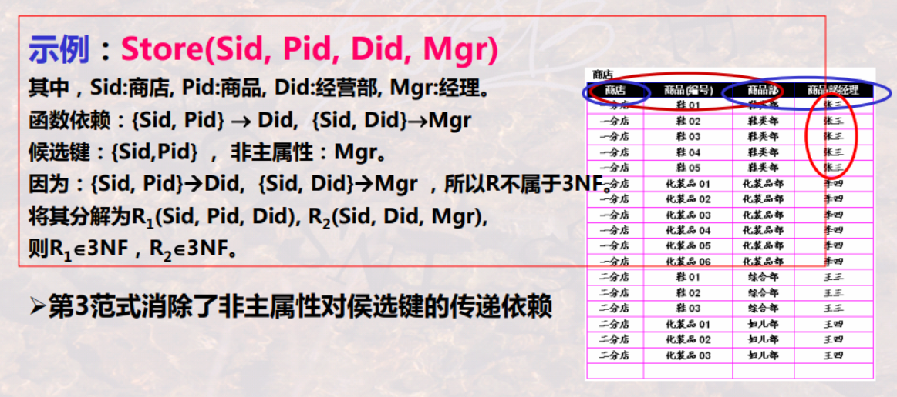
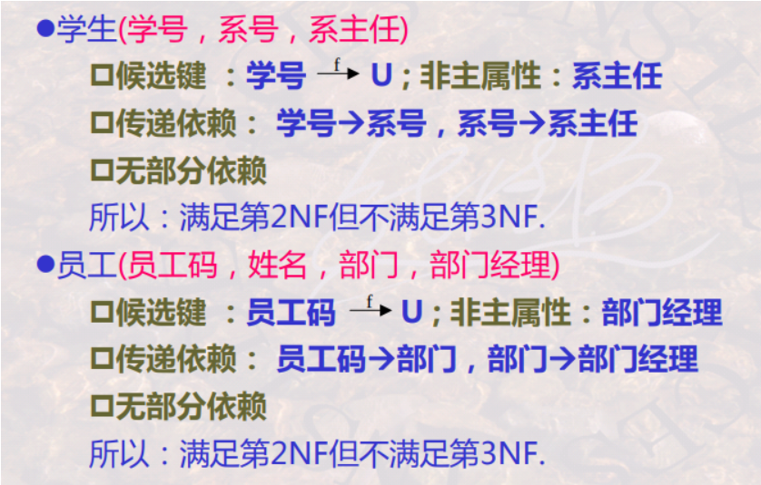

* 关系模式分解成3NF
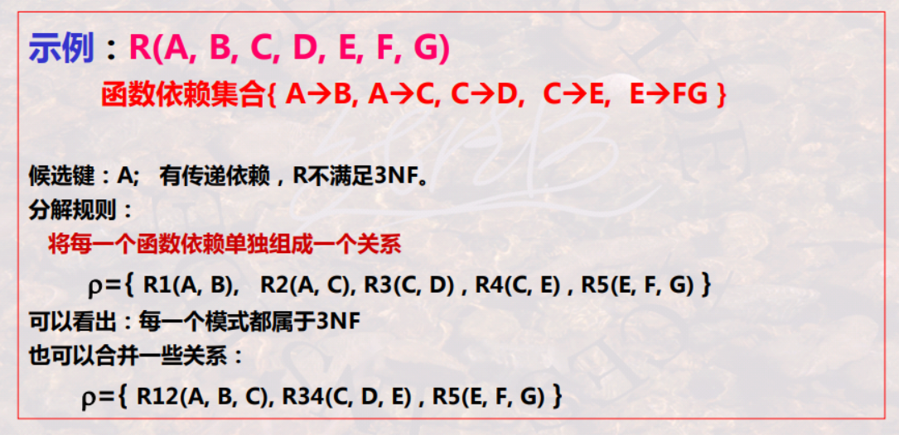

##### (4) Boyce-Codd范式 (BCNF)
满足BCNF，则一定满足3NF
* 若$R(U,F)\in 1NF$
    * 若对于任何 $X\rightarrow Y \in F$，当$Y\nsubseteq X$，则X必含候选键
        * 上述的意思是不存在**依赖于非候选建**的属性
* 则称R(U)属于Boyce-Codd范式，记为$R(U)\in BCNF$

* 举例
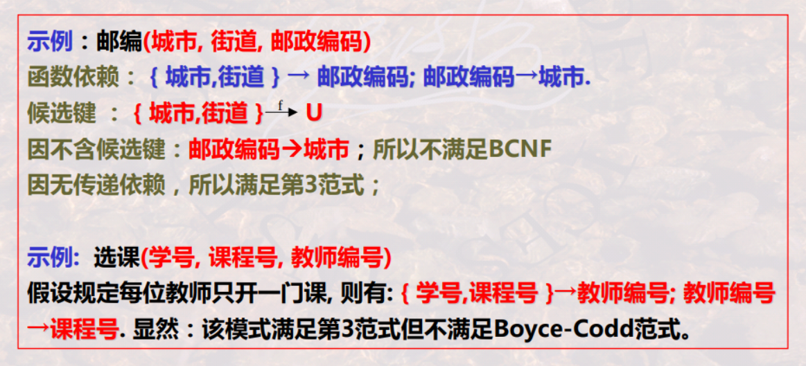

* 关系模式分解成BCNF
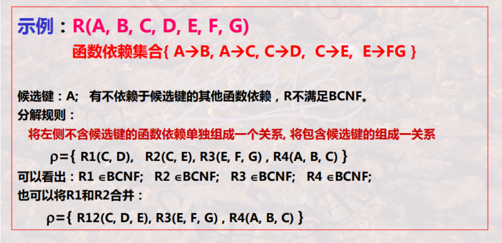

##### (5) 第四范式 (4NF)
满足4NF，则一定满足BCNF
* 若$R(U)\in 1NF$，D是其上的一组多值依赖
    * 对任意$X\rightarrow \rightarrow Y \in D$，若$Y\neq \empty，Y\nsubseteq X，XY\ne U$
    * 则X必为超键
        * 表示如果有多值依赖，一定**依赖于候选键**
* 则称R(U)属于第四范式，记为$R(U)\in 4NF$

#### 6.多值依赖

##### (1) 定义
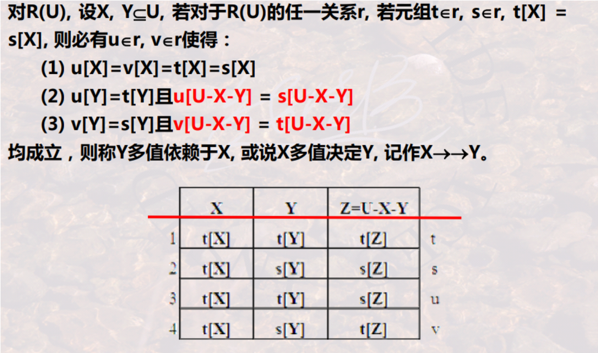
* 简单理解:
    * 存在两个元组，将Y属性组的值交换，其他属性不变，得到的新的两个元组，存在表中
    * 即**一个X**对于**同一 U-X-Y**有**一组Y**的取值，在这组Y的取值中，不同组（即元组）能够相互交换Y的值
    * 函数依赖是多值依赖的特例:
        * 因为当U-X-Y为空，且一组Y改为一个Y，就是函数依赖

* 举例
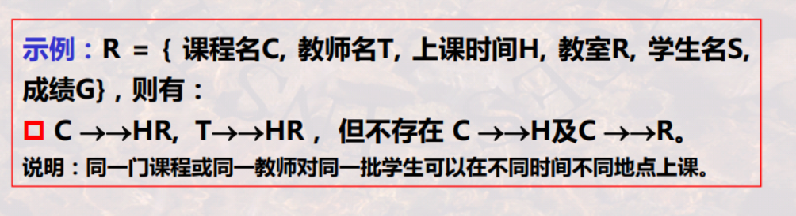

#### 7.模式分解

##### (1) 定义
* 将关系模式R(U)分解为一组子集
    * $\rho=\{R_1(U_1),...,R_k(U_k)\}$
        * 其中$U=U_1\cup U_2\cup...\cup U_k$且$U_i\nsubseteq U_j (i\neq j)$

##### (2) 无损连接性和保持依赖性

* R向$\rho$的投影连接:
    * $m_\rho(R)=\pi_{R_1}(R)\bowtie ... \bowtie \pi_{R_k}(R)$

* 无损连接性
    * R与$\rho$在数据内容方面是否等价
    * 反例
    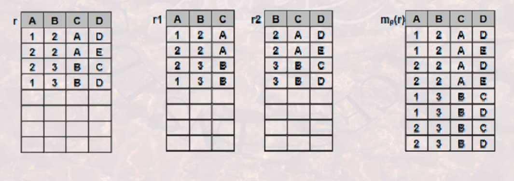

* 保持依赖性
    * R与$\rho$在数据依赖方面是否等价
    * 反例
    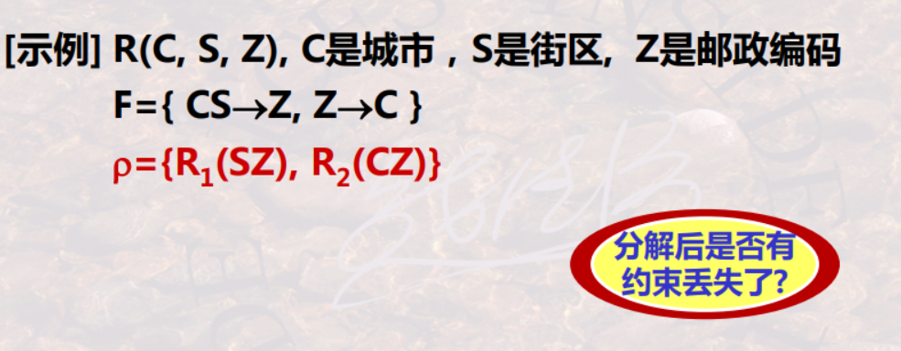

#### 8.连接依赖 (JD)
* R能够分解成n组属性，且这分解满足无损连接性，则称R满足n目连接依赖