# overview

<!-- @import "[TOC]" {cmd="toc" depthFrom=1 depthTo=6 orderedList=false} -->

<!-- code_chunk_output -->

- [overview](#overview)
    - [概述](#概述)
      - [1.数据模型](#1数据模型)
      - [2.E-R模型 (entity-relationship model)](#2e-r模型-entity-relationship-model)
        - [(1) 基本概念](#1-基本概念)
        - [(2) 表示方法](#2-表示方法)
      - [3.IDEL1x](#3idel1x)
        - [(1) 实体](#1-实体)
        - [(2) 属性](#2-属性)
        - [(3) 连接关系](#3-连接关系)
        - [(4) 分类关系](#4-分类关系)
        - [(5) 非确定关系](#5-非确定关系)
        - [(6) 举例](#6-举例)
      - [4.IDEL1x案例](#4idel1x案例)
        - [(1) 仓储系统的数据模型设计](#1-仓储系统的数据模型设计)
        - [(2) 企业物料系统的数据模型设计](#2-企业物料系统的数据模型设计)
        - [(3) 足球联赛管理](#3-足球联赛管理)
      - [5.数据库设计](#5数据库设计)
        - [(1) 过程](#1-过程)
        - [(2) 理论](#2-理论)
        - [(3) 需要折中](#3-需要折中)

<!-- /code_chunk_output -->

### 概述

#### 1.数据模型

* 物理数据模型
    * 依赖于物理系统
* 逻辑数据模型
    * 独立于物理系统，比如：关系模型、层次模型等
* 概念数据模型
    * 独立于计算机系统，表达信息世界的模型

#### 2.E-R模型 (entity-relationship model)

##### (1) 基本概念 
* 实体和实例
    * 实体就是类
    * 每个实体中的实例必须能够相互区分（即每个实体必须有关键字）

* 属性
    * 实体所具有的某一方面特性

* 关键字/码
    * 能够唯一标识一个实例
    * 每个实体必须有关键字

* 联系
    * 指一个实体的实例和其他实体实例之间所可能发生的联系
    * 联系的**度和元**： 发生联系的 实体 的数目
    * 角色：实体在联系中的作用称为实体的角色
    * 联系的基数：一个实例与其他实例的数目
        * 完全参与联系
            * 该端实例至少有一个参与到联系中,最小基数为1(1..m)
                * 即在表中不能为空
        * 部分参与联系
            * 该端实例可以不参与联系，最小基数为0(0..m)
                * 即在表中可以为空

##### (2) 表示方法
* chen方法
* crow's foot方法
* IDEL1x方法

#### 3.IDEL1x

##### (1) 实体
* 独立实体（强实体） 
* 从属实体（弱实体）
    * 一个实体的实例的唯一标识需要依赖于该实体与其他实体的联系

##### (2) 属性
* 属性
* 主键 (primay key)
* 除主键外的候选键 (alternate key)
* 外键 (foreign key)

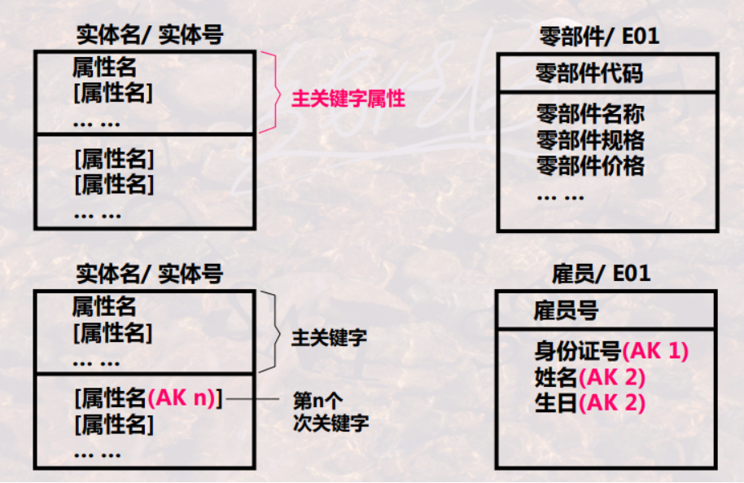
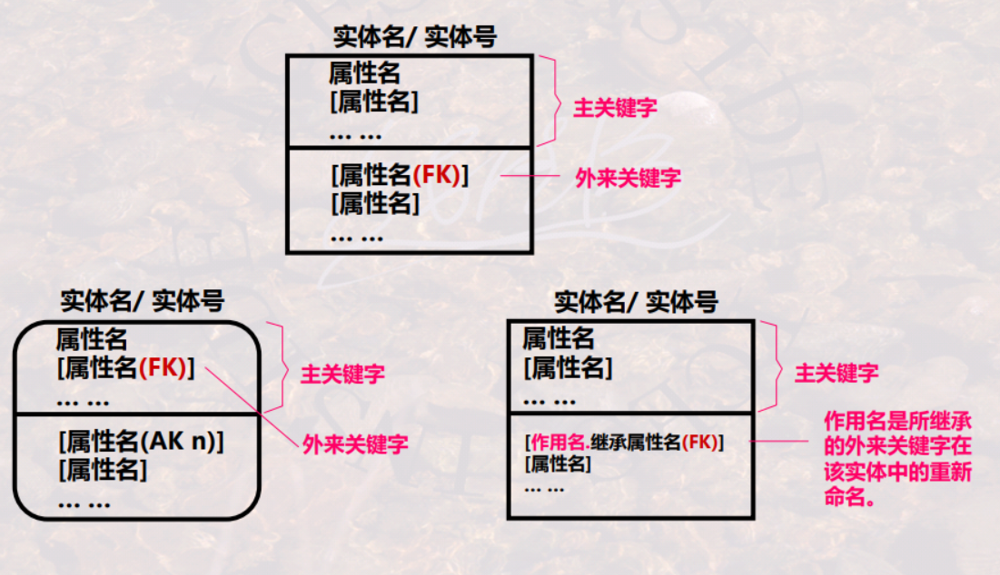

##### (3) 连接关系
* 连接关系，也称父子联系或依存联系
    * 可标定关系 (Identify Relationship)
        * 子实体的实例由它与父实体的联系而唯一标识（即父实体的主关键字是子实体主关键字的一部分）
    * 非标定关系 (Non-Identify RelationShip)
        * 父实体的主关键字不是子实体的主关键字

    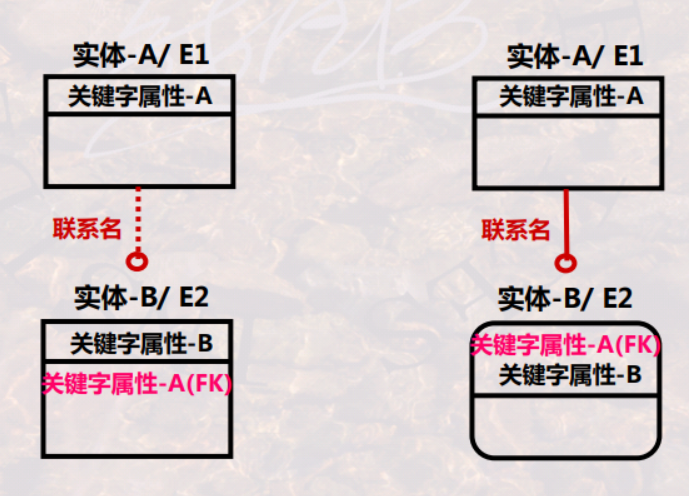
    * 父实体一个实例可与子实体的0个、1个或多个实例相联系
        * 子实体端标注P(1或大于1)/Z(0或1)/n(确定数目)/<省略>(0,1或大于1)

##### (4) 分类关系
* 一个一般实体和多个分类实体构成
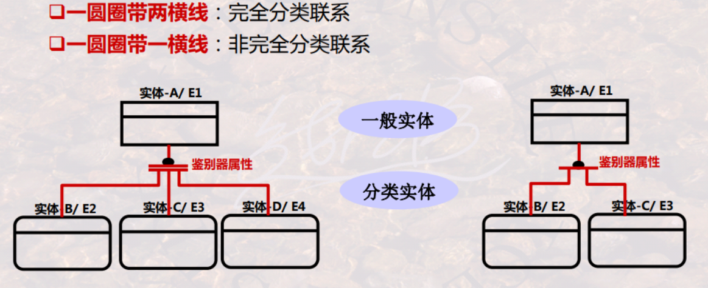
    * 完全分类： 只有下面几种类别
    * 非完全分类：下面几种类别只是部分类别

##### (5) 非确定关系
* 实体之间的多对多的联系
    * 必须分解为若干个一对多的联系来表达

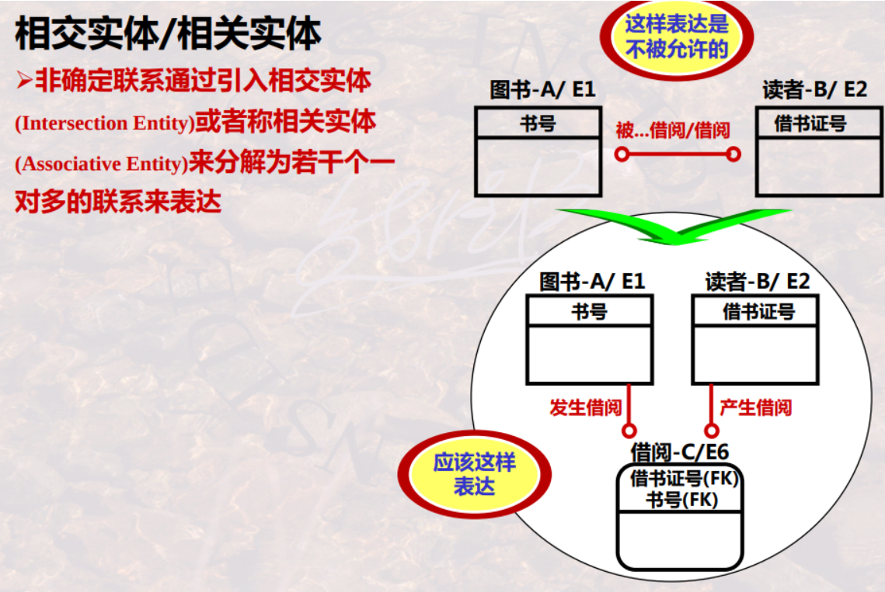

##### (6) 举例
* 产品结构即零件构成关系
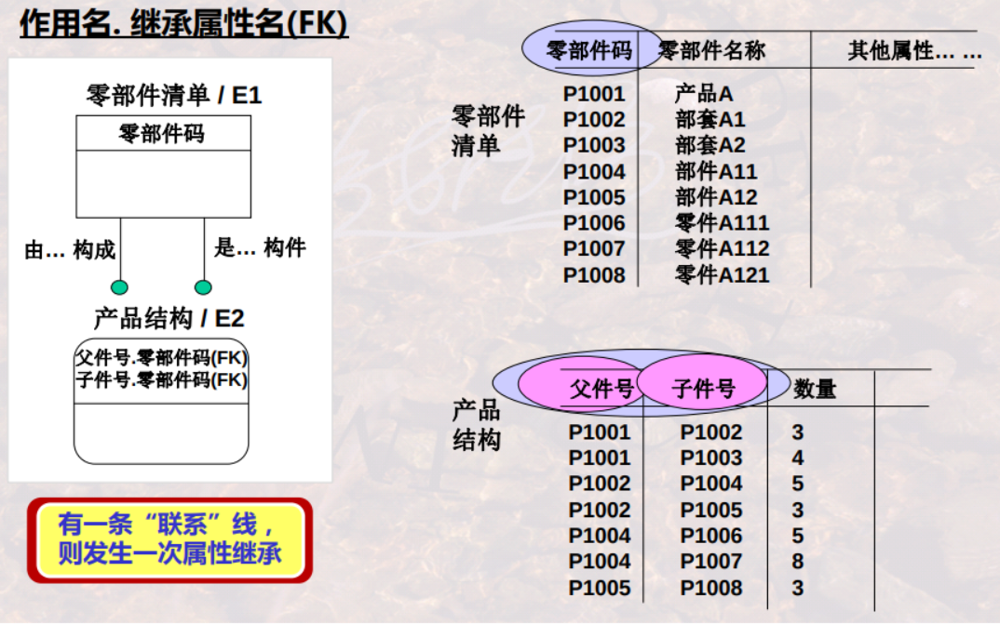

* 客户跟踪信息表
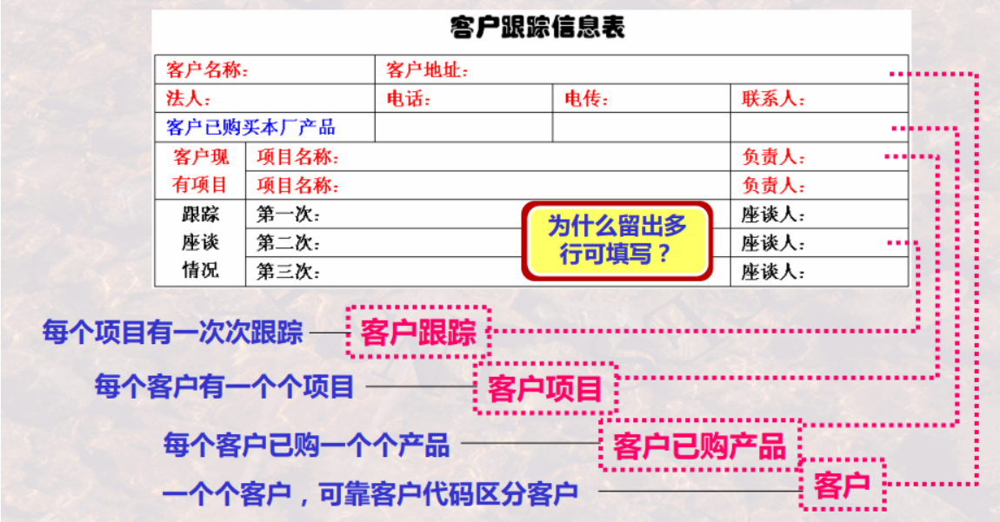
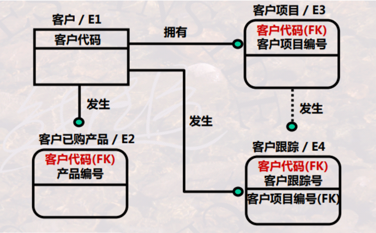

#### 4.IDEL1x案例

##### (1) 仓储系统的数据模型设计

* 需求
    * 某企业要研发一仓储管理系统，要求：管理若干仓库及其物资的出库和入库，并填写入库单和出库单以及记录库存物资账，请针对此一需求，绘制IDEF1X图

* 需求理解
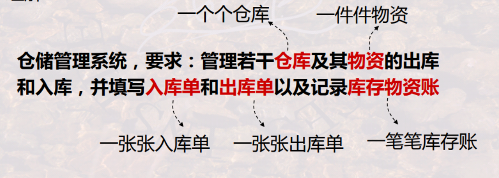

* 数据模型设计

##### (2) 企业物料系统的数据模型设计
* 需求理解
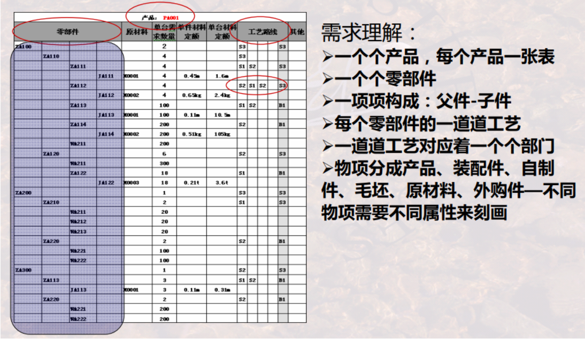

* 模型设计
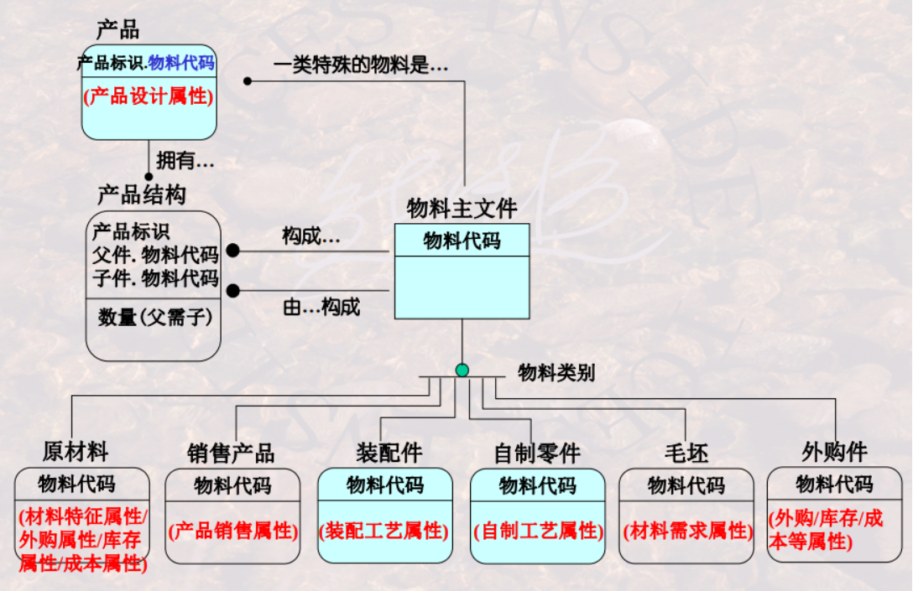

* 需求理解
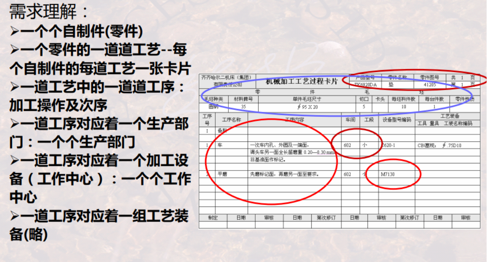

* 模型设计
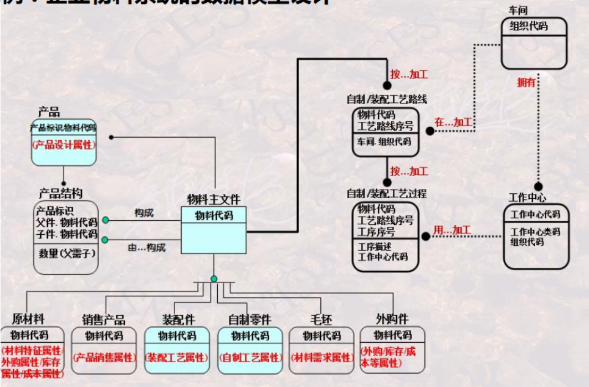

##### (3) 足球联赛管理

* 模型设计
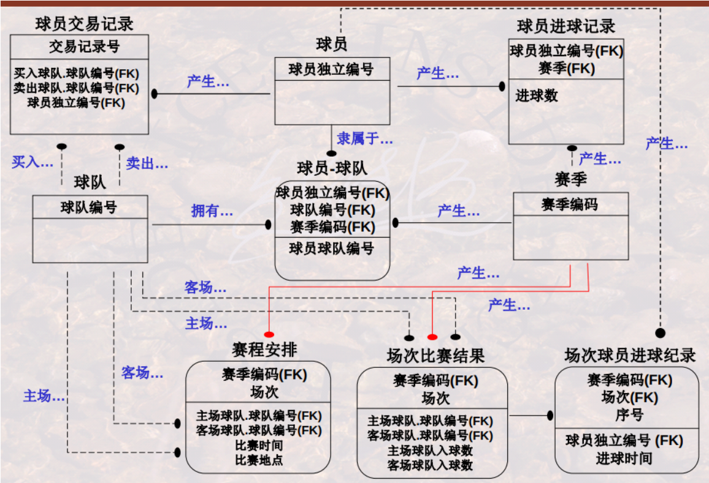

#### 5.数据库设计

##### (1) 过程

* 需求分析
    * 收集和理解需求
    * 成果： 数据源
* 概念数据库设计
    * 建立概念数据模型
    * 成果： E-R图
* 逻辑数据库设计
    * 建立逻辑模型
    * 成果：关系模式（包括全局模式、用户模式）
* 物理数据库设计
    * 建立物理模型
    * 成果：create table（包括物理数据组织等）

##### (2) 理论

* 数据依赖理论（函数依赖）
* 关系范式理论
* 模式分解理论

##### (3) 需要折中
* 遵循关系范式原则，需要将一个大的关系模式 分解为 多个小的关系模式
    * 导致查询时，需要将多个模式进行连接
    * 从而导致查询速度较慢
* 祖训关系范式原则，能够避免冗余、插入异常、删除异常等问题
