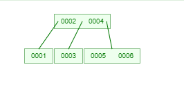
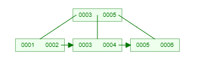

### 概述
#### 1.B树
* 树的degree（度）为n，表示该树**最多**只能有**n个子节点**
* 一个**节点中的元素的数量** 等于 **该节点的子节点的数量 - 1**
这样是为了查找，根节点有2个元素，3个子节点，第一个子节点在第一个元素左边，表示要查找比第一个元素小的内容去第一个子节点中找，以此类推

#### 2.B+树
* **数据**都存储在**叶子节点**中，**分支节点**均为**索引**
* 存索引的好处是，则分支节点存储可以存储**更多的元素（索引）**，则**同样的层数**，B+树要比B树能够存储更多的数据量
比如B+树，有三层，每个节点大小为4K，每个索引的大小为10字节，则能够存储的数据量为 400 * 400 * 4k
而B树，通过三层是无法存储这么大的数据量的
* 叶子节点是一个链表，可以直接遍历

