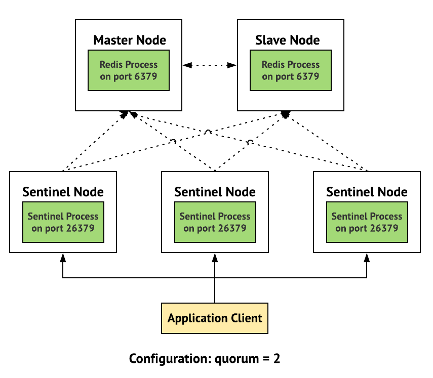

# overview

[toc]

### 概述

#### 1.redis cluster模式架构


* hash slots(0~16383)
  * 计算方式：根据变量名,利用CRC16算法得到一个数值，然后与16384取余，得到的就是slot的值

#### 2.sentinel模式

##### （1）架构



* 监控master，当master宕机，所有sentinel会进行投票，当票数超过设置的值，会将某个slave提升为master
* sentinel之间是通过 `__sentinel__:hello`这个channel自动发现的

##### （2）使用

* 配置sentinel: `sentinel.conf`
```shell
#唯一标识这个sentinel
sentinel myid <uuid>

#对外宣告的地址
sentinel announce-port <port>
sentinel announce-ip <address>

sentinel monitor <master-group-name> <master_ip> <port> <quorum>

# <master-group-name> 随便取
# 当master切换后，<master_ip>会切换为新的master的ip
# port: sentinel服务监听的端口
# quorum: The quorum is the number of Sentinels that need to agree about the fact the master is not reachable, in order to really mark the master as failing, and eventually start a failover procedure if possible.
```

* 使用需要先连接sentinel获取master的地址
```shell
redis-cli -h <sentinel_ip> -p <sentinel_port> -a <password>
>  SENTINEL get-master-addr-by-name <master-group-name>

#然后利用上面返回的地址连接redis
```

#### 3.redis常用功能

##### （1）`pub/sub`功能（数据不会暂存）
实现监听channel的功能，当监听某个channel后，当有数据发到那个channel，会获取到（即监听之间发布的数据都获取不到）

##### （2）监视某一个key
