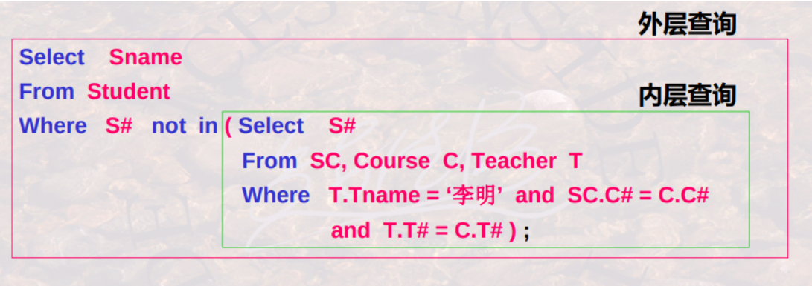
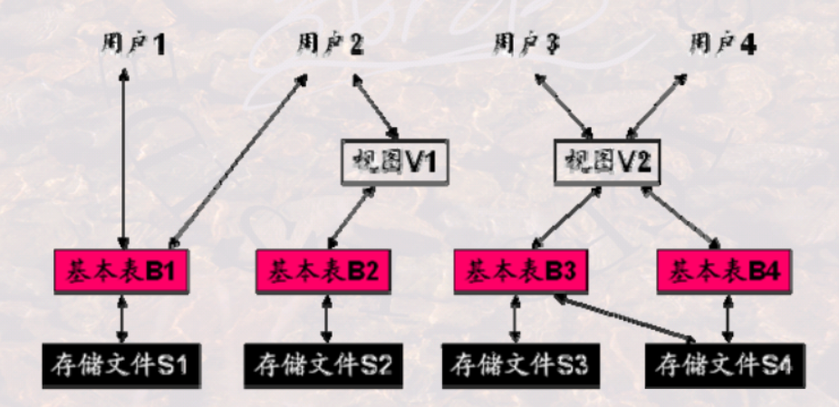

# SQL


<!-- @import "[TOC]" {cmd="toc" depthFrom=1 depthTo=6 orderedList=false} -->

<!-- code_chunk_output -->

- [SQL](#sql)
    - [概述](#概述)
      - [1.SQL(structed query language)](#1sqlstructed-query-language)
        - [(1) DDL (data definition language)](#1-ddl-data-definition-language)
        - [(2) DML (data manipulation language)](#2-dml-data-manipulation-language)
        - [(3) DCL (data control language)](#3-dcl-data-control-language)
      - [2.查询操作](#2查询操作)
        - [(1) 去重](#1-去重)
        - [(2) 排序](#2-排序)
        - [(3) 模糊查询](#3-模糊查询)
        - [(4) null处理](#4-null处理)
      - [3.多表联合查询](#3多表联合查询)
        - [(1) 多表联合查询](#1-多表联合查询)
        - [(2) 连接自身表（重命名）](#2-连接自身表重命名)
        - [(3) 自然连接、内连接和外连接](#3-自然连接-内连接和外连接)
      - [4.子查询](#4子查询)
        - [(1) IN-子查询](#1-in-子查询)
        - [(2) theta-子查询](#2-theta-子查询)
        - [(3) exists-子查询](#3-exists-子查询)
      - [5.查询结果计算和聚集](#5查询结果计算和聚集)
        - [(1) 算术运算](#1-算术运算)
        - [(2) 分组和分组过滤](#2-分组和分组过滤)
      - [6.SQL实现关系代数操作](#6sql实现关系代数操作)
        - [(1) 并、交、差](#1-并-交-差)
      - [7.视图](#7视图)
        - [(1) 定义](#1-定义)
        - [(2) 操作](#2-操作)
      - [8.静态约束](#8静态约束)
        - [(1) 域约束](#1-域约束)
        - [(2) 表约束](#2-表约束)
      - [9.动态约束（触发器）](#9动态约束触发器)
        - [(1) 举例](#1-举例)
    - [函数](#函数)
      - [1.Aggregate Functions (聚合函数)](#1aggregate-functions-聚合函数)
      - [2.window functions (窗口函数)](#2window-functions-窗口函数)

<!-- /code_chunk_output -->

### 概述

#### 1.SQL(structed query language)

##### (1) DDL (data definition language)
* 创建数据库
    ```SQL
    create database <database>;
    ```
* 切换和关闭数据库
    ```SQL
    use <db>;
    close <db>
    ```

* 创建表
    ```SQL
    create table 表名( 列名 数据类型 [Primary key | Unique] [Not null]
        [, 列名 数据类型 [Not null] , … ]);

    #Primary key: 主键约束，每个表只能创建一个主键约束
    #Unique: 唯一性约束（候选键），每个表可以有多个唯一性约束
    #Not null: 非空约束
    ```

* 修改表结构
    ```SQL
    alter table tablename
    [add {colname datatype, …}]
    [drop {完整性约束名}]
    [modify {colname datatype, …}] 
    ```

* 删除表
    ```SQL
    drop table 表名
    ```

##### (2) DML (data manipulation language)

* 插入数据
    * 单一元组新增命令形式
        ```SQL
        insert into insert into 表名[ (列名 [, 列名 ]… ]
            values values (值 [, 值] , …) ;
        ```
    * 批数据新增命令形式
        ```SQL
        insert into 表名 [(列名[，列名]…)]
        子查询;
        ```
        * 举例
            ```SQL
            Insert Into St (Sn, Sname)
            Select Sn, Sname From Student
            Where Sname like ‘%伟 ’ ;
            ```

* 删除操作
    ```SQL
    Delete From Student Where D# in
        ( Select D# From Dept Where Dname = ‘自动控制’);
    ```

* 更新操作
    ```SQL
    Update 表名
    Set 列名 = 表达式 | (子查询)
    [ [ , 列名 = 表达式 | (子查询) ] … ]
    [ Where 条件表达式] ;
    ```

##### (3) DCL (data control language)

* 授权
```SQL
GRANT {ALL PRIVILEGES | privilege {,privilege…}}
    ON [TABLE] tablename | viewname
    TO {public | user-id {, user-id…}}
    [WITH GRANT OPTION];

#public, 允许所有有效用户使用授予的权利
#privilege是下面的权利
#   SELECT | INSERT | UPDATE | DELETE 
#WITH GRANT OPTION选项是允许被授权者传播这些权利
```

* 撤销授权
```SQL
REVOKE {all privilEges | priv {, priv…} } ON tablename | viewname
FROM {public | user {, user…} }; 
```

#### 2.查询操作
* $\pi_{A_{i1},A_{i2},...}(\sigma_{con}(R))$
```SQL
SELECT A1,A2,...
FROM R
WHERE con
```

##### (1) 去重
```SQL
select DISTINCT ...;
```

##### (2) 排序
```SQL
select ... order by 列名 [asc|desc]
```

##### (3) 模糊查询
```SQL
列名 [not] like "字符串"

#% 匹配零个或多个字符
#_ 匹配任意单个字符
#\ 转义字符
```

##### (4) null处理
* 判断是否为空
```SQL
is [not ] null
```

* 举例
    * 找出年龄值为空的学生姓名
    ```SQL
    Select Sname From Student
    Where Sage is null ;
    ```

* 注意
    * 除is [not] null之外，空值不满足任何查找条件
    * 如果null参与算术运算，则该算术表达式的值为null
    * 如果null参与比较运算，则结果可视为false。在SQL-92中可看成unknown
    * 如果null参与聚集运算，则除count(*)之外其它聚集函数都忽略null

#### 3.多表联合查询

##### (1) 多表联合查询

* $\pi_{A_{i1},A_{i2},...}(\sigma_{con}(R_1\times R_2\times,...))$
```SQL
SELECT A1,A2,...
FROM R1,R2,...
WHERE con
```

* 求既学过“001”号课又学过 “002”号课的所有学生的学号
    * 通过学号相等进行连接
```SQL
Select S1.Sn From SC S1, SC S2
Where S1.Sn = S2.Sn and S1.Cn=‘001’
and S2.Cn=‘002 ;
```

##### (2) 连接自身表（重命名）
* 求年龄有差异的任意两位同学的姓名
```SQL
Select S1.Sname as Stud1, S2.Sname as Stud2
From Student S1, Student S2
Where S1.Sage > S2.Sage ;
```

##### (3) 自然连接、内连接和外连接

* 自然连接
```SQL
Select 列名 [ [, 列名] … ]
From 表名1 NATURAL JOIN 表名2
[ Where 检索条件 ] … ;
```

* 内连接（默认）（即theta-连接）
    ```SQL
    Select 列名 [ [, 列名] … ]
    From 表名1 [ INNER ] JOIN 表名2
    { ON 连接条件 | Using (Colname {, Colname …}) }
    [ Where 检索条件 ] … ;
    ```
    * on <连接条件>
        * 满足连接条件进行连接，且公共属性出现两次
    * using (col1,col2,...)
        * (col1,col2,...)是公共属性的子集，(col1,col2,...)属性取值相等进行连接，且(col1,col2,...)只出现一次

* 外连接
    ```SQL
    Select 列名 [ [, 列名] … ]
    From 表名1 { LEFT | RIGHT | FULL} [OUTER] JOIN 表名2
    { ON 连接条件 | Using (Colname {, Colname …}) }
    [ Where 检索条件 ] … ;
    ```
    * on <连接条件>
        * 满足连接条件进行连接，且公共属性出现两次
    * using (col1,col2,...)
        * (col1,col2,...)是公共属性的子集，(col1,col2,...)属性取值相等进行连接，且(col1,col2,...)只出现一次

#### 4.子查询


* 非相关子查询
    * 内层查询独立进行，没有涉及任何外层查询相关信息的子查询
* 相关子查询
    * 内层查询需要依靠外层查询的某些参量作为限定条件才能进行的子查询
    ```SQL
    Select Sname
    From Student Stud
    Where Sn in ( Select Sn
    From SC
    Where Sn = Stud.Sn and Cn = ‘001’ ) ;
    ```

##### (1) IN-子查询
* 判断某一表达式的值是否在子查询的结果中
```SQL
表达式 [not ] in (子查询)
```
* 举例
    * 列出没学过李明老师讲授课程的所有同学的姓名
    ```SQL
    Select Sname From Student
    Where Sn not in ( Select Sn From SC, Course C, Teacher T
    Where T.Tname = ‘李明’ and SC.Cn = C.Cn
    and T.Tn = C.Tn );
    ```

##### (2) theta-子查询

```SQL
#θ为比较运算符

#如果表达式的值至少与子查询结果的某一个值相比较满足 θ 关系，则为真
表达式 θ some (子查询)

#如果表达式的值与子查询结果的所有值相比较都满足 θ 关系，则为真
表达式 θ all (子查询)
```

* 举例
    * 找出工资最低的教师姓名
        ```SQL
        Select Tname From Teacher
        Where Salary <= all ( Select Salary From Teacher ); 
        ```
    * 找出001号课成绩不是最高的所有学生的学号
        ```SQL
        Select Sn From SC
        Where Cn = “001” and
            Score < some ( Select Score From SC Where Cn = “001” );
        ```

##### (3) exists-子查询

* 判断子查询结果中有无元组存在
```SQL
[not] Exists (子查询)
```

* 举例
    * 检索学过001号教师主讲的所有课程的所有同学的姓名
        * 转换: 不存在有一门001号教师主讲的课程该同学没学过
    ```SQL
    Select Sname From Student
    Where not exists //不存在
        ( Select * From Course //有一门001教师主讲课程
        Where Course.Tn = ‘001’ and not exists //该同学没学过
            ( Select * From SC
            Where Sn = Student.Sn and Cn = Course.Cn ) );
    ```

    * 检索没学过001号教师主讲的任何课程的所有同学的姓名
    ```SQL
    Select Sname From Student
    Where not exists //不存在
        ( Select * From Course, SC, Teacher //学过一门课程
        Where Tname=‘李明’ and Course.Tn =Teacher.Tn
            and Course.Cn = SC.Cn and Sn = Student.Sn );
    ```

#### 5.查询结果计算和聚集
```SQL
Select 列名 | expr | agfunc(列名) [[, 列名 | expr | agfunc(列名) ] … ]
From 表名1 [, 表名2 … ]
[ Where Where 检索条件 ] ;

#expr可以是常量、列名、或由常量、列名、特殊函数及算术运算符构成的算术运算式
#agfunc()是一些聚集函数
```

##### (1) 算术运算

* 举例
    * 依据学生年龄求学生的出生年份，当前是2015年
    ```SQL
    Select S.Sn, S.Sname, 2015 – S.Sage+1 as Syear
    From Student S;
    ```

##### (2) 分组和分组过滤

* 具有相同分组条件值的元组划到一个组

```SQL
Select 列名 | expr | agfunc(列名) [[, 列名 | expr | agfunc(列名) ] … ]
From 表名1 [, 表名2 … ]
[ Where Where 检索条件 ]
[ Group by Group by 分组条件 ] ;
```

* Having子句（用于分组过滤，前提需要先分组）
    * 对集合（即分组）进行条件过滤，即满足条件的集合（分组）留下，不满足条件的集合（分组）剔除
```SQL
Select Select 列名 | expr | agfunc(列名) [[, 列名 | expr | agfunc(列名) ] … ]
From 表名1 [, 表名2 … ]
[ Where Where 检索条件 ]
[ Group by Group by 分组条件 [ Having Having 分组过滤条件] ] ;
```

* 举例
    * 求每一个学生的平均成绩
    ```SQL
    Select Sn, AVG(Score) From SC
    Group by Sn; 
    ```
    * 求不及格课程超过两门的同学的学号
    ```SQL
    Select Sn From SC
    Where Score < 60
    Group by Sn Having Count(*)>2; 
    ```
    * 求有两门以上不及格课程同学的学号及其平均成绩
    ```SQL
    Select Sn, Avg(Score) From SC
    Where Sn in
        ( Select Sn From SC
        Where Score < 60
        Group by Sn Having Count(*)>2 )
    Group by Sn ;
    ```

#### 6.SQL实现关系代数操作

##### (1) 并、交、差

* 并运算 UNION, 交运算INTERSECT, 差运算EXCEPT
```SQL
#通常情况下自动删除重复元组：不带ALL。若要保留重复的元组，则要带ALL
子查询 { Union [ALL] | Intersect [ALL] | Except [ALL] 子查询 }
```

* 举例
    * 求客户所在的或者代理商所在的城市
    ```SQL
    Select City From Customers
    UNION
    Select City From Agents ;
    ```
    * 求既学过002号课，又学过003号课的同学学号
    ```SQL
    Select Sn From SC Where Cn = ‘002’
    INTERSECT
    Select Sn From SC Where Cn = ‘003’;
    ```

#### 7.视图

##### (1) 定义

* 概念模式的数据（即概念视图）在SQL中被称为基本表(Base-Table)
* 外模式的数据称为视图(view)



##### (2) 操作
* 创建视图
    ```SQL
    create view view_name [(列名[，列名] …)]
    as 子查询 [with check option]
    ```
    * 定义一个视图 CompStud 为计算机系的学生，通过该视图可以将Student表中其他系的学生屏蔽掉
    ```SQL
    Create View CompStud AS
        ( Select * From Student
        Where D# in ( Select D# From Dept
            Where Dname = ‘计算机’ ) );
    ```

* 使用视图
```SQL
Select * From CompStud
Where Sage < 20 ;
```

* 视图更新
    * 是比较复杂的问题，因视图不保存数据
    * 对视图的更新最终要反映到对基本表的更新上
    * 在某些情况下视图不能被更新，比如
        * 视图的select目标列包含聚集函数，则不能更新
        * 等等

* 撤消视图
```SQL
Drop View <view_name>
```

#### 8.静态约束

```SQL
CREATE TABLE tablename (
    ( colname datatype [ DEFAULT { <default_constant> | NULL} ]
        [ <col_constr> ])
    ...
    ,<table_constr>
)
```

##### (1) 域约束
```SQL
{ NOT NULL | //列值非空
    [ CONSTRAINT constraintname ] //为约束命名，便于以后撤消
        { UNIQUE //列值是唯一
            | PRIMARY KEY //列为主键
            | CHECK (search_cond) //列值满足条件,条件只能使用列当前值
            | REFERENCES tablename [(colname) ]
                [ON DELETE { CASCADE | SET NULL } ] } } //则删除被引用表的某列值v 时，要将本表该列值为v 的记录删除
```

* 举例
```SQL
Create Table Student ( Sn char(8) not null unique, Sname char(10),
    Ssex char(2) constraint ctssex check (Ssex=‘男’ or
    Ssex=‘女’), Sage integer check (Sage>=1 and Sage<150),
    Dn char(2) references Dept(Dn) on delete cascade,
    Sclass char(6) );
```

##### (2) 表约束
```SQL
[ CONSTRAINT constraintname ] //为约束命名，便于以后撤消
    { UNIQUE (colname {, colname. . .}) //几列值组合在一起是唯一
    | PRIMARY KEY (colname {, colname. . .}) //几列联合为主键
    | CHECK (search_condition) //元组多列值共同满足条件
                                //条件中只能使用同一元组的不同列当前值
    | FOREIGN KEY (colname {, colname. . .})
        REFERENCES tablename [(colname {, colname. . .})]
        [ON DELETE CASCADE] }
                                //引用另一表tablename的若干列的值作为外键
```

* 举例
```SQL
Create Table Course ( Cn char(3) , Cname char(12), Chours integer,
    Credit float(1) constraint ctcredit check (Credit >=0.0 and
    Credit<=5.0 ), Tn char(3) references Teacher(Tn) on delete
    cascade, 
    primary key(Cn),        #表约束
    constraint ctcc check(Chours/Credit = 20) );  #表约束
```

#### 9.动态约束（触发器）

```SQL
CREATE TRIGGER trigger_name BEFORE | AFTER      //在事件发生（即写入）的前或后
    { INSERT | DELETE | UPDATE [OF colname {, colname...}] }
    ON tablename [REFERENCING corr_name_def {, corr_name_def...} ]      //REFERENCING定义变量，方便后续使用
    [FOR EACH ROW | FOR EACH STATEMENT]

    [WHEN (search_condition)] //检查条件，如满足执行下述程序
    { statement             //单行程序直接书写，多行程序要用下行方式
    | BEGIN ATOMIC statement; { statement;...} END }
```

* REFERENCING
```SQL
{ OLD [ROW] [AS] old_row_corr_name //设置变量表示更新前的旧元组
| NEW [ROW] [AS] new_row_corr_name //设置变量表示更新后的新元组
| OLD TABLE [AS] old_table_corr_name //设置变量表示更新前的旧Table
| NEW TABLE [AS] new_table_corr_name //设置变量表示更新后的新Table
}
```

##### (1) 举例
* 设计一个触发器当进行Teacher表更新元组时, 使其工资只能升不能降
```SQL
create trigger teacher_chgsal before update of salary
    on teacher
    referencing new x, old y
    for each row when (x.salary < y.salary)
        begin
            raise_application_error(-20003, 'invalid salary on update');
        end;
```

* 假设student(Sn, Sname, Sage, Ssex, Sclass)中某一学生要变更其主码S#的值，如使其原来的98030101变更为99030131, 此时sc表中该同学已选课记录的Sn也需自动随其改变。设计一个触发器完成上述功能
```SQL
create trigger updSn after update of Sn on student
    referencing old oldi, new newi
    for each row
        begin
            update sc set Sn = newi.Sn where Sn = :oldi.Sn ;
        end;
```

* 假设student(Sn, Sname, SumCourse), 当删除某一同学Sn时，该同学的所有选课也都要删除。设计一个触发器完成上述功能
```SQL
create trigger delS# after delete on Student
    referencing old oldi
    for each row
        begin
            delete sc where S# = :oldi.S# ;
        end;
```

***

### 函数

#### 1.Aggregate Functions (聚合函数)

* 聚集函数是不允许用于Where子句中的，因为
    * 聚集函数是对集合（即多个元组）的处理
    * where语句则是对元素（即每个元组）的处理

|函数名|参数类型|
|-|-|
|COUNT|任意|
|SUM|数值类型|
|AVG|数值类型|
|MAX|字符或数值类型|
|MIN|字符或数值类型|

* 举例
    * 求教师的工资总额
    ```SQL
    Select Sum(Salary) From Teacher;
    ```

#### 2.window functions (窗口函数)

* 窗口函数，与聚合函数类似，只不过作用在一部分数据上
    * 所以称之为窗口函数
* 聚合函数，作用在全部数据上

```SQL
<window_function> over(partition by <field1> order by <field_2>)
```

* 聚合窗口函数
    * avg、sum、count、max、min等
* 排序窗口函数
    * rank、dense_rank、row_number
* 偏移窗口函数
    * lag、lead