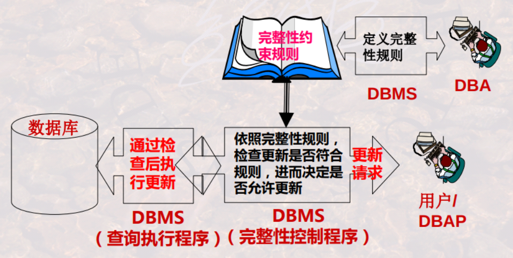
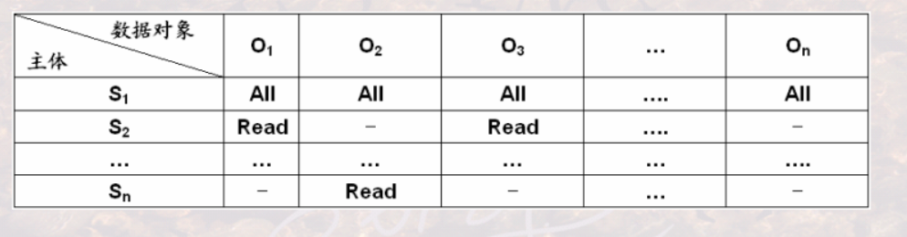

# overview


<!-- @import "[TOC]" {cmd="toc" depthFrom=1 depthTo=6 orderedList=false} -->

<!-- code_chunk_output -->

- [overview](#overview)
    - [概述](#概述)
      - [1.三要素](#1三要素)
        - [(1) 基本结构](#1-基本结构)
        - [(2) 基本操作](#2-基本操作)
        - [(3) 完整性约束](#3-完整性约束)
      - [2.概念](#2概念)
        - [(1) domain (域)](#1-domain-域)
        - [(2) Cartesian Product (笛卡尔积)](#2-cartesian-product-笛卡尔积)
        - [(3) relation (关系)](#3-relation-关系)
        - [(4) 关系的特性](#4-关系的特性)
        - [(5) candidate key (候选键)](#5-candidate-key-候选键)
        - [(6) primary key (主键)](#6-primary-key-主键)
        - [(7) 主属性与非主属性](#7-主属性与非主属性)
        - [(8) foreign key (外键)](#8-foreign-key-外键)
        - [(9) relation 和 table](#9-relation-和-table)
      - [3.完整性约束](#3完整性约束)
        - [(1) 完整性内容](#1-完整性内容)
        - [(2) 完整性分类](#2-完整性分类)
        - [(3) DBMS怎么保证完整性](#3-dbms怎么保证完整性)
        - [(4) 完整性约束条件的一般形式](#4-完整性约束条件的一般形式)
      - [4.DBMS的安全机制](#4dbms的安全机制)
        - [(1) 自主安全性机制](#1-自主安全性机制)
        - [(2) 强制安全性机制](#2-强制安全性机制)
        - [(3) 推断控制机制](#3-推断控制机制)
        - [(4) 数据加密存储机制](#4-数据加密存储机制)

<!-- /code_chunk_output -->

### 概述

#### 1.三要素

##### (1) 基本结构
relation (即table)

##### (2) 基本操作
关系运算，基本的： $\cup 、- 、\cap、\times (广义积)、\div、 \pi(投影)、\sigma(选择)$

##### (3) 完整性约束
* 实体完整性
* 参照完整性
* 用户自定义的完整性

#### 2.概念

##### (1) domain (域)
* domain
    * 一组值的集合，这组值具有相同的数据类型
    * 定义”列“的取值范围

* cardinality (域的基数)
    * 集合中元素的个数

##### (2) Cartesian Product (笛卡尔积)

$D_1\times D_2\times … \times  D_n = \{ (d_1 , d_2 , … , d_n) | d_i\in D_i , i=1,…,n \}$
* 卡尔积是由n个域形成的**所有可能**的n-元组的集合

笛卡尔积的基数 = $m_1\times m_2\times … \times m_n$ (其中$m_i$表示$D_i$的基数)

##### (3) relation (关系)

* 是一组域的笛卡尔积的**子集**，这些子集具有**某一方面意义**
* 关系的不同列可能来自同一个域，需要为每一列起一个名字，该名字即为**属性/字段名/列名/数据项名**
* 描述关系： **关系模式**(Schema)或表标题(head)
    * $R(A_1:D_1 , A_2:D_2 , … , A_n:D_n)$
        * $A_i$表示属性名，$D_i$表示域
        * n是关系的度或目(degree)
        * 关系中元组的数目称为关系的基数(Cardinality)
    
    * 比如: `Student( S# char(8), Sname char(10), Ssex char(2),Sage integer, D# char(2), Sclass char(6) )`

##### (4) 关系的特性
* 列是同质的
    * 即每一列中的值量来自同一域（即同一数据类型）
* 不同的列可来自同一个域，称其中的每一列为一个属性
* 列位置互换性
    * 区分哪一列是靠属性名
* 行位置互换性
    * 区分哪一行是靠某一或某几列的值(关键字/键字/码字)
* **关系**的任意两个元组不能完全相同
    * 现实应用中，**表(Table)** 可能并不完全遵守此特性
* 属性不可再分特性:又被称为**关系第一范式**

##### (5) candidate key (候选键) 
关系中的一个**属性组**，其值能**唯一标识**一个元组

##### (6) primary key (主键)
当有多个候选码时，可以选定一个作为主键
DBMS以主键为主要线索管理关系中的各个元组

##### (7) 主属性与非主属性

* 主属性: 包含在任何一个候选码中的属性
* 非主属性: 除主属性外的其他属性

##### (8) foreign key (外键)

关系R中的一个**属性组**，它不是R的候选码，是另一个关系S的候选码
* 外键用于**连接关系**

##### (9) relation 和 table
关系和表有细微差别，关系是表的严格定义

#### 3.完整性约束

##### (1) 完整性内容

* 实体完整性
    * 关系的主键的属性值不能为空值

* 参照完整性
    * 如果关系R1的外码Fk与关系R2的主码Pk相对应
        * 则Fk的值要等于R2 中某个元组的Pk 值，
        * 或者为空值

* 用户自定义完整性
    * 用户针对具体的应用环境定义的完整性约束条件
        * 比如: 年龄字段只能在[12, 35]之间，性别字段只能是“男”或“女”

##### (2) 完整性分类
* 根据约束对象分类
    * 域完整性约束条件
        * 施加于某一列上，比如: Sage>15 and Sage<=40
    * 关系完整性约束条件
        * 施加于关系/table上，比如：6<=Chours/Credit<=7
* 根据约束来源分类
    * 结构约束
        * 来自于模型的约束，比如：主键约束等
    * 内容约束
        * 来自于用户的约束，比如：属性的取值范围等
* 根据约束状态分类
    * 静态约束
        * 要求DB在任一时候均应满足的约束
    * 动态约束
        * 要求DB从一状态变为另一状态时应满足的约束，比如：工资只能升，不能降

##### (3) DBMS怎么保证完整性


##### (4) 完整性约束条件的一般形式

Integrity Constraint ::= (O，P，A，R)
* O 表示 数据集合：约束的对象
* P 表示 谓词条件：什么样的约束
* A 表示 触发条件：什么时候检查
* R 表示 响应动作：不满足时怎么办

#### 4.DBMS的安全机制

##### (1) 自主安全性机制
* 访问控制(Access Control)
    * 通过权限在用户之间的传递，使用户自主管理数据库安全性
    * 形式
    ```SQL
    AccessRule ::= ( S, O, t, P)
    #S: 请求主体(用户)
    #O: 访问对象
    #t: 访问权利
    #P: 谓词
    ```

* 自主安全性的实现方式
    * 存储矩阵
        * 其中谓词省略了，为了便于展现
    
    * 视图
        * 通过视图可将数据访问对象与谓词结合起来，限制用户对关系中某些元组的访问
        * 用户定义视图后，视图便成为一新的数据对象，参与到存储矩阵与能力表中进行描述

* 权限的传播会存在以下问题
    * 水平传播数量和垂直传播数量，如果不做限制将很难管控
    * 当一个用户的权利被收回时，通过其传播给其他用户的权利也将被收回
    * 如果一个用户从多个用户处获得了授权，则当其中某一个用户收回授权时
，该用户可能仍保有权利

##### (2) 强制安全性机制

* 通过对数据和用户强制分类，使得不同类别用户能够访问不同类
别的数据

##### (3) 推断控制机制
* 防止通过历史信息或公开信息，推断出不该被其知道的信息

##### (4) 数据加密存储机制
* 通过加密、解密保护数据，密钥、加密/解密方法与传输